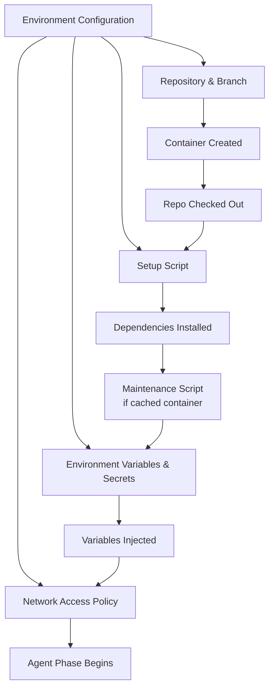
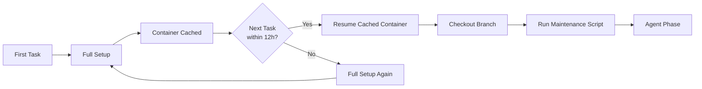

# Codex Cloud Environments: Setup Scripts, Container Caching, Secrets, and the codex-universal Image


---

Codex Cloud runs agent tasks inside ephemeral containers on OpenAI's infrastructure[^1]. Every cloud task — whether launched from the Codex app, the `@codex` GitHub mention, or `codex cloud exec` in the CLI — executes against a **cloud environment** that defines the repository, dependencies, secrets, and network policy the agent operates with[^2]. Getting that environment right is the difference between a task that produces a clean, mergeable diff and one that fails on the first `npm install`.

This article covers the environment configuration layer in depth: the `codex-universal` base image, setup and maintenance scripts, secrets management, container caching, network access controls, and practical patterns for production use.

## The codex-universal Base Image

Every Codex Cloud environment starts from a container image called `universal`[^2]. OpenAI publishes the reference Dockerfile at [openai/codex-universal](https://github.com/openai/codex-universal), and the image is available at `ghcr.io/openai/codex-universal:latest`[^3].

The image is built on Ubuntu 24.04 and ships a polyglot toolchain[^3]:

| Language/Tool | Version | Notes |
|---|---|---|
| Python | 3.14 | With `uv`, `poetry`, `ruff`, `black`, `mypy`, `pyright` |
| Node.js | 22 | With `pnpm`, `yarn` |
| Rust | 1.95.0 | With `cargo` |
| Go | 1.25.1 | With `golangci-lint` |
| Swift | 6.2 | |
| Ruby | 3.4.4 | |
| PHP | 8.5 | |
| C/C++ | clang-tidy, cmake, ninja-build | |
| Build tools | Bazelisk | |

You can pin specific runtime versions through the package versions setting in your environment configuration, or by setting `CODEX_ENV_*` environment variables that the image's entrypoint scripts inspect[^3].

### Local Testing with codex-universal

Because the image is public, you can pull it locally and test your setup scripts before burning cloud task credits:

```bash
docker pull ghcr.io/openai/codex-universal:latest
docker run -it --rm \
  -v $(pwd):/workspace \
  -w /workspace \
  ghcr.io/openai/codex-universal:latest \
  bash -c "./my-setup-script.sh && echo 'Setup OK'"
```

This catches missing system packages, broken install commands, and permission issues before they waste a cloud run[^3].

## Environment Configuration

Cloud environments are configured through the Codex settings UI under the **Environments** section[^2]. Each environment binds to a GitHub repository and defines four configuration surfaces:



### Automatic Dependency Detection

Before your setup script runs, Codex inspects the repository root and automatically runs the appropriate package manager[^2]:

- **npm**, **yarn**, **pnpm** — detected from `package-lock.json`, `yarn.lock`, or `pnpm-lock.yaml`
- **pip**, **pipenv**, **poetry** — detected from `requirements.txt`, `Pipfile`, or `pyproject.toml`

This means many projects need no setup script at all. The automatic detection handles the common case; the setup script handles everything else.

### Custom Setup Scripts

For projects with non-standard build requirements, you provide a Bash script that runs after the automatic dependency step[^2]:

```bash
# Install additional system packages
apt-get update && apt-get install -y libpq-dev

# Install Python dev dependencies
pip install pyright
poetry install --with test

# Install frontend dependencies
pnpm install

# Build shared libraries
cd packages/shared && pnpm build
```

**Critical caveat**: setup scripts run in a separate Bash session from the agent. Commands like `export VAR=value` do not persist into the agent phase[^2]. To make environment variables available to the agent, either:

1. Add them to `~/.bashrc` inside the setup script
2. Configure them in the environment variables settings

```bash
# Wrong — export won't persist
export DATABASE_URL="postgres://localhost/mydb"

# Right — write to .bashrc
echo 'export DATABASE_URL="postgres://localhost/mydb"' >> ~/.bashrc
```

### Maintenance Scripts

When Codex resumes a cached container (see below), the environment may be stale — the default branch has advanced, dependencies have changed. The **maintenance script** runs after cache restoration to bring the container up to date[^2]:

```bash
# Pull latest default branch changes
git fetch origin main

# Reinstall dependencies in case lockfiles changed
pnpm install --frozen-lockfile

# Rebuild shared packages
pnpm -r build
```

The maintenance script is optional. If omitted, Codex checks out your specified branch but does not run any additional setup on cache resume.

## Secrets Management

Codex Cloud distinguishes between **environment variables** and **secrets**[^2]:

| Property | Environment Variables | Secrets |
|---|---|---|
| Encryption | Standard | Additional encryption layer |
| Availability | Entire task lifecycle | Setup scripts only |
| Agent access | Yes | No — removed before agent phase |
| Use case | Runtime configuration | Private registry tokens, API keys for `npm install` |

This design prevents the agent from accidentally leaking credentials in generated code or terminal output. If your setup script needs to authenticate against a private npm registry or pull images from a private Docker registry, configure those credentials as secrets:

```bash
# In the setup script, secrets are available as env vars
npm config set //registry.npmjs.org/:_authToken=${NPM_TOKEN}
pip install --extra-index-url https://${PYPI_TOKEN}@pypi.example.com/simple/ internal-package
```

The agent never sees `NPM_TOKEN` or `PYPI_TOKEN` — they are scrubbed from the environment before the agent phase starts[^2].

**Do not** reference secret files directly; only reference environment variable names. Codex manages the lifecycle of injecting and removing these values[^2].

## Container Caching

Codex caches containers for up to **12 hours**[^2]. The caching model works as follows:



The cache **automatically invalidates** when you change any of[^2]:

- Setup script
- Maintenance script
- Environment variables
- Secrets

This means iterating on your setup script does trigger full rebuilds — another reason to test locally with the `codex-universal` image first.

### Optimising for Cache Hits

To maximise cache reuse across tasks:

1. **Keep setup scripts stable** — avoid version-pinning to `latest` or pulling from HEAD in the setup script, as changes trigger cache invalidation
2. **Use the maintenance script for branch-specific work** — checkout and incremental installs belong here, not in the setup script
3. **Batch environment variable changes** — each change invalidates the cache, so update multiple variables in a single save

For teams running frequent cloud tasks against the same repository, a well-structured environment with stable setup and active maintenance scripts can reduce cold-start overhead from minutes to seconds[^2].

## Network Access Controls

All outbound traffic from Codex Cloud containers passes through an HTTP/HTTPS proxy[^2]. The network policy has three phases:

### During Setup Scripts

Internet access is **enabled by default**[^2]. Your setup script can freely install packages, download tools, and authenticate against external services. The proxy handles TLS termination, which means some tools (like `curl` with custom certificate bundles) may need proxy-aware configuration.

### During the Agent Phase

Internet access is **disabled by default**[^2]. The agent works in an air-gapped environment, operating solely on the repository contents and installed dependencies. This is a deliberate security measure — it prevents the agent from:

- Exfiltrating code or secrets to external endpoints
- Downloading and executing arbitrary binaries
- Making unsanctioned API calls

### Enabling Agent Internet Access

You can configure **limited** or **unrestricted** internet access for the agent phase through the environment settings[^2]. Best practices when enabling it:

- Allow only the domains the agent genuinely needs (e.g., a documentation API, a test fixture endpoint)
- Restrict HTTP methods where possible
- Review the work log after each task to verify what external requests were made

⚠️ Enabling unrestricted internet access during the agent phase significantly expands the attack surface. Only do this when the task requires it and review the results carefully.

## Practical Patterns

### Pattern 1: Monorepo with Multiple Services

For a monorepo containing a frontend, backend, and shared library:

```bash
# setup.sh
apt-get update && apt-get install -y postgresql-client redis-tools

# Install all workspace dependencies
pnpm install

# Build shared packages first (dependency order)
pnpm --filter @myapp/shared build
pnpm --filter @myapp/types build

# Set up test database schema
cd services/backend && pnpm db:migrate
```

```bash
# maintenance.sh
pnpm install --frozen-lockfile
pnpm --filter @myapp/shared build
pnpm --filter @myapp/types build
```

### Pattern 2: Python ML Project with Large Dependencies

```bash
# setup.sh
pip install uv
uv pip install -r requirements.txt -r requirements-dev.txt

# Pre-download model weights during setup (with internet)
python -c "from transformers import AutoTokenizer; AutoTokenizer.from_pretrained('bert-base-uncased')"
```

Pre-downloading model weights in the setup script avoids the need for agent-phase internet access, keeping the security boundary tight.

### Pattern 3: Multi-Language Polyglot Service

```bash
# setup.sh
# Pin Go version
CODEX_ENV_GO_VERSION=1.23.8

# Install Protobuf compiler
apt-get update && apt-get install -y protobuf-compiler

# Go dependencies
cd services/api && go mod download

# Node dependencies
cd ../../web && pnpm install

# Rust dependencies
cd ../processor && cargo fetch
```

### Pattern 4: CI-Style Scripted Dispatch

Combine environment configuration with `codex cloud exec` for scripted workflows[^4]:

```bash
#!/bin/bash
# dispatch-refactor.sh — submit a refactoring task to Codex Cloud

ENV_ID="env_abc123"
TASK="Refactor the authentication middleware to use the new JWT library. \
Run all tests before finalising."

# Submit with 3 attempts for best-of-N selection
codex cloud exec \
  --env "$ENV_ID" \
  --attempts 3 \
  "$TASK"

# Monitor task status
codex cloud list --env "$ENV_ID" --limit 1 --json | jq '.tasks[0].status'
```

The `--attempts 1-4` flag runs N independent executions and selects the best result[^4]. For hard problems — complex refactors, subtle bug fixes — submitting 3 candidates and choosing the best is a meaningful quality lever with no additional orchestration required[^5].

## The Scriptable Environment Gap

As of May 2026, environment management remains a manual process through the Codex UI. There is no CLI command to create, list, or modify environments programmatically[^6]. This means automation scripts must hard-code environment IDs discovered through the web interface.

A [community proposal](https://github.com/openai/codex/issues/24777) requests a full scriptable surface covering environment discovery (`codex cloud env list`), repository-based resolution (`--repo owner/repo` instead of opaque IDs), and environment lifecycle management[^6]. A prototype branch exists but no pull request has been opened.

For now, the workaround is:

1. Create environments manually through the Codex settings UI
2. Note the environment ID from the URL or interactive picker
3. Store the ID in your project's `.env` or CI secrets
4. Reference it in scripts via `codex cloud exec --env $CODEX_CLOUD_ENV_ID`

## Summary

Codex Cloud environments are the infrastructure layer that determines whether your cloud tasks succeed or waste tokens on setup failures. The key principles:

- **Test locally first** — pull `ghcr.io/openai/codex-universal:latest` and verify your setup script before deploying it
- **Separate setup from maintenance** — stable setup scripts maximise the 12-hour container cache; maintenance scripts handle branch-specific updates
- **Use secrets, not environment variables, for credentials** — they are scrubbed before the agent phase starts
- **Default to air-gapped agent execution** — only enable internet access when the task genuinely requires it
- **Use best-of-N attempts for hard problems** — `--attempts 3` costs more but produces measurably better results for complex tasks

As the scriptable environment API matures, expect these patterns to move from manual configuration into declarative, version-controlled environment definitions — closing the last gap between Codex Cloud and fully automated CI/CD agent pipelines.

## Citations

[^1]: [Introducing Codex — OpenAI](https://openai.com/index/introducing-codex/) — "Each task gets its own cloud sandbox"
[^2]: [Cloud environments — Codex web — OpenAI Developers](https://developers.openai.com/codex/cloud/environments) — Official cloud environment configuration documentation
[^3]: [openai/codex-universal — GitHub](https://github.com/openai/codex-universal) — Reference Dockerfile and base image for Codex Cloud environments
[^4]: [Features — Codex CLI — OpenAI Developers](https://developers.openai.com/codex/cli/features) — `codex cloud exec`, `--attempts`, and `--env` flag documentation
[^5]: [Command line options — Codex CLI — OpenAI Developers](https://developers.openai.com/codex/cli/reference) — `codex cloud` subcommand reference including `list`, `exec`, and JSON output format
[^6]: [Issue #24777 — openai/codex — GitHub](https://github.com/openai/codex/issues/24777) — Proposal for scriptable Codex Cloud environment and task lifecycle management
