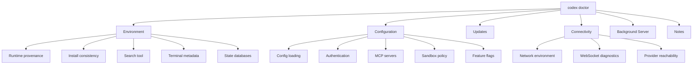

# Codex Doctor: Comprehensive Runtime Diagnostics and Troubleshooting in v0.135


---

The `codex doctor` subcommand has evolved from a basic health check into a full diagnostic suite. With v0.135.0 (released 28 May 2026), it now reports richer environment, Git, terminal, app-server, and thread inventory diagnostics[^1]. This article dissects every diagnostic section, demonstrates practical troubleshooting workflows, and shows how to integrate `codex doctor` into support and CI pipelines.

## Why `codex doctor` Exists

Support cases for AI coding agents are notoriously difficult to reproduce. The failure might stem from a stale PATH entry, a misconfigured multiplexer swallowing escape sequences, an MCP server timing out behind a corporate proxy, or a corrupted SQLite state database. Before `codex doctor`, users had to manually gather environment variables, run connectivity tests, and inspect config files — a process that varied wildly in quality[^2].

The command targets concrete failure modes: package manager mismatches, terminal/multiplexer incompatibilities, provider-specific HTTP/WebSocket connectivity issues, SQLite integrity corruption, and excessive disk usage from rollout logs[^2].

## Invocation Modes

```bash
# Full detailed output (default — designed for humans already troubleshooting)
codex doctor

# Compact grouped summary with pass/warn/fail counts
codex doctor --summary

# Structured JSON with sensitive values redacted (for automation and support)
codex doctor --json

# Show all items in truncated lists (e.g. all threads, all MCP servers)
codex doctor --all
```

The default is deliberately verbose. The design rationale: users only run `codex doctor` when something is already wrong, so presenting full context upfront saves round-trips[^2].

## Diagnostic Sections



### Environment

The environment section validates the runtime foundation:

| Check | What it reports |
|-------|----------------|
| Runtime provenance | Version, install method, commit hash, executable path |
| Install consistency | Package manager detection (npm, bun), PATH verification |
| Search tool | Ripgrep availability and version |
| Terminal metadata | TERM variable, multiplexer state (tmux/zellij), extended-keys support |
| State databases | SQLite integrity for state and log databases, rollout statistics |

A common failure this catches: installing via `npm install -g @openai/codex` but having a stale Homebrew-installed binary earlier in PATH. The install consistency check flags this mismatch immediately[^2].

### Configuration

```bash
# Example output (abbreviated)
Configuration
  ✓ Config loaded         config.toml parsed, model: o3
  ✓ Authentication        API key (sk-...7x2f) via environment variable
  ⚠ MCP servers           3 configured, 1 unreachable (filesystem-server: timeout)
  ✓ Sandbox               workspace-write, network: restricted
  ✓ Feature flags         4 enabled, 1 overridden (goals_v2: true)
```

The MCP server reachability check is particularly valuable. It validates each configured server's transport endpoint — catching misconfigured stdio commands, unreachable SSE URLs, and servers that start but fail their handshake[^3].

### Authentication

The auth section detects mixed authentication signals — for instance, both an API key environment variable and a ChatGPT OAuth token file present simultaneously. This ambiguity causes subtle model availability differences that confuse users[^2].

### Updates

```bash
Updates
  ⚠ Update available      0.135.0 → 0.136.0 (dismissed 2 days ago)
  ✓ Cache consistent      Local manifest matches remote
```

The update cache consistency check verifies that the locally cached version manifest hasn't diverged from the remote source — a state that can occur when corporate proxies cache old responses[^1].

### Connectivity

The connectivity section performs provider-aware validation:

```bash
Connectivity
  ✓ HTTP proxy            HTTPS_PROXY=http://proxy.corp:8080
  ✓ DNS resolution        api.openai.com → 104.18.x.x (23ms)
  ✓ WebSocket handshake   HTTP 101 in 89ms
  ✓ Provider endpoint     POST /v1/chat/completions → 200 (model: o3)
```

The WebSocket diagnostic is particularly important because Codex CLI uses persistent WebSocket connections for streaming. Corporate firewalls and load balancers that terminate idle connections after 60 seconds cause intermittent session drops that are difficult to diagnose without explicit handshake testing[^2].

Provider-specific checks adapt based on your authentication mode — API key users get `/v1/chat/completions` validation while ChatGPT-authenticated users get the appropriate consumer endpoint check[^2].

### Background Server

```bash
Background Server
  ✓ App-server            Running (PID 48291, socket: /tmp/codex-app-server.sock)
  ✓ Thread inventory      12 threads, 3 active, oldest: 4 days
```

The v0.135 enhancement added thread inventory reporting, showing how many conversation threads exist locally, their states, and disk usage. This helps identify when excessive thread accumulation causes performance degradation[^1].

### Notes (Promoted Anomalies)

The Notes section surfaces issues that aren't hard failures but deserve attention:

- Available updates with version deltas
- Large rollout directories (file count and disk usage)
- MCP configuration issues that didn't cause failures but show warnings
- Mixed authentication signals

## JSON Output Schema

The `--json` flag produces machine-readable output for automation:

```json
{
  "schema_version": 3,
  "overall_status": "warn",
  "checks": {
    "env.install_consistency": {
      "id": "env.install_consistency",
      "category": "environment",
      "status": "ok",
      "summary": "npm global install, PATH consistent",
      "details": {
        "install_method": "npm",
        "exe_path": "/usr/local/bin/codex",
        "path_position": 0
      }
    },
    "connectivity.websocket": {
      "id": "connectivity.websocket",
      "category": "connectivity",
      "status": "warn",
      "summary": "Handshake succeeded but latency elevated (450ms)",
      "details": {
        "handshake_ms": 450,
        "endpoint": "wss://api.openai.com/v1/realtime"
      }
    }
  }
}
```

Each check has a stable identifier (`env.install_consistency`, `connectivity.websocket`) enabling programmatic comparison across runs[^2].

## Integration with Support Workflows

### Automatic Feedback Attachment

When you submit feedback via the `/feedback` slash command in the TUI, Codex automatically runs `codex doctor --json` in best-effort mode and attaches the report as `codex-doctor-report.json`. The system also tags Sentry events with the overall status, failing check count, and specific failing check identifiers[^2].

### Bug Report Template

The GitHub issue template prompts reporters to include `codex doctor --json` output, with rendering support for pasted JSON reports[^2].

### CI Health Gates

You can use `codex doctor` as a preflight check in CI environments:

```bash
#!/usr/bin/env bash
# ci-preflight.sh — fail fast if Codex environment is unhealthy

DOCTOR_OUTPUT=$(codex doctor --json 2>/dev/null)
OVERALL=$(echo "$DOCTOR_OUTPUT" | jq -r '.overall_status')

if [ "$OVERALL" = "fail" ]; then
  echo "::error::Codex doctor reports failures:"
  echo "$DOCTOR_OUTPUT" | jq '.checks | to_entries[] | select(.value.status == "fail") | .value.summary'
  exit 1
fi

if [ "$OVERALL" = "warn" ]; then
  echo "::warning::Codex doctor reports warnings"
  echo "$DOCTOR_OUTPUT" | jq '.checks | to_entries[] | select(.value.status == "warn") | .value.summary'
fi
```

This prevents wasted compute on `codex exec` runs that would fail due to auth issues, missing tools, or network problems.

## Practical Troubleshooting Recipes

### MCP Server Connection Failures

```bash
# Quick check: which MCP servers are unreachable?
codex doctor --json | jq '.checks["config.mcp_servers"].details.unreachable[]'

# Common fix: server binary not on PATH in the agent's sandbox
# Verify with:
codex doctor --json | jq '.checks["env.search_tool"]'
```

### Terminal Rendering Issues

When the TUI renders incorrectly in tmux or Zellij:

```bash
codex doctor --json | jq '.checks["env.terminal_metadata"].details'
```

This reveals whether extended-keys mode is negotiated, the effective TERM value inside the multiplexer, and whether Unicode width tables match the terminal emulator's expectations[^4].

### Stale App-Server Socket

If Codex hangs on startup, a stale Unix socket from a crashed app-server process may be blocking:

```bash
codex doctor --json | jq '.checks["server.app_server"].details'
# If status is "stale_socket", the remediation is:
rm /tmp/codex-app-server.sock
```

### SQLite Corruption

Rare but devastating — usually caused by unclean shutdowns or disk-full conditions:

```bash
codex doctor --json | jq '.checks["env.state_databases"].details'
# Reports integrity_check results for both state.db and logs.db
```

## Comparison with the April Diagnostic Toolkit

The earlier diagnostic toolkit article (covering v0.118.0) documented `RUST_LOG` tracing, `/debug-config`, and `codex sandbox` testing[^5]. Those tools remain available but serve different purposes:

| Tool | Purpose | When to use |
|------|---------|-------------|
| `codex doctor` | Environment health snapshot | First step in any troubleshooting |
| `RUST_LOG=debug` | Runtime trace logging | Reproducing specific session failures |
| `/debug-config` | Config resolution inspection | Tracking down config precedence issues |
| `codex sandbox` | Sandbox policy testing | Verifying command approval/denial |

The `codex doctor` command is the recommended starting point for all troubleshooting as of v0.135[^1].

## Status Indicators

The human-readable output uses four status indicators:

- `✓` — Check passed
- `✗` — Check failed (likely causing issues)
- `⚠` — Warning (may cause issues, warrants investigation)
- `○` — Skipped (not applicable to current configuration)

## What's Next

The `codex doctor` infrastructure is designed for extensibility. The stable check identifiers and versioned JSON schema suggest future additions: plugin health validation, model availability pre-checks, and potentially remote diagnostics for Codex App cloud environments. The thread inventory reporting in v0.135 hints at deeper session lifecycle management tooling to come.

---

## Citations

[^1]: OpenAI, "Codex CLI v0.135.0 Release Notes," GitHub Releases, 28 May 2026. [https://github.com/openai/codex/releases/tag/rust-v0.135.0](https://github.com/openai/codex/releases/tag/rust-v0.135.0)

[^2]: fcoury-oai, "feat(cli): add codex doctor diagnostics," Pull Request #22336, openai/codex, GitHub, 2026. [https://github.com/openai/codex/pull/22336](https://github.com/openai/codex/pull/22336)

[^3]: OpenAI, "Changelog – Codex," OpenAI Developers, May 2026. [https://developers.openai.com/codex/changelog](https://developers.openai.com/codex/changelog)

[^4]: Blake Crosley, "Codex CLI v0.135 Reference: history search, doctor, profiles," 2026. [https://blakecrosley.com/guides/codex](https://blakecrosley.com/guides/codex)

[^5]: Daniel Vaughan, "Codex CLI Diagnostic Toolkit: Tracing, Sandbox Testing, and the Built-In Debugging Commands," Codex Knowledge Base, 7 April 2026. [https://codex.danielvaughan.com/2026/04/07/codex-cli-diagnostic-toolkit-tracing-sandbox-testing/](https://codex.danielvaughan.com/2026/04/07/codex-cli-diagnostic-toolkit-tracing-sandbox-testing/)
