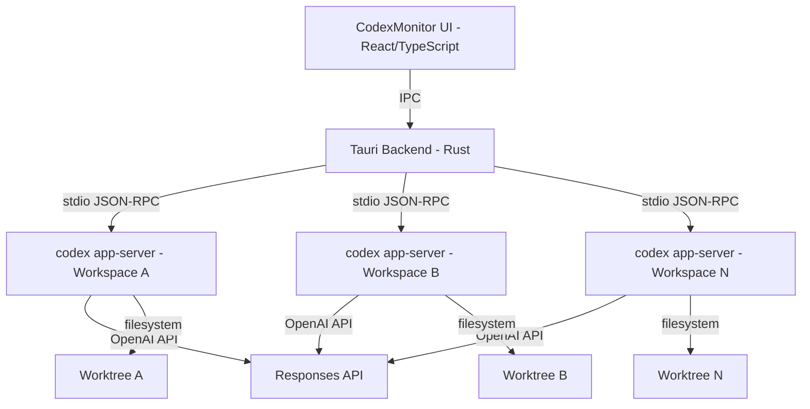
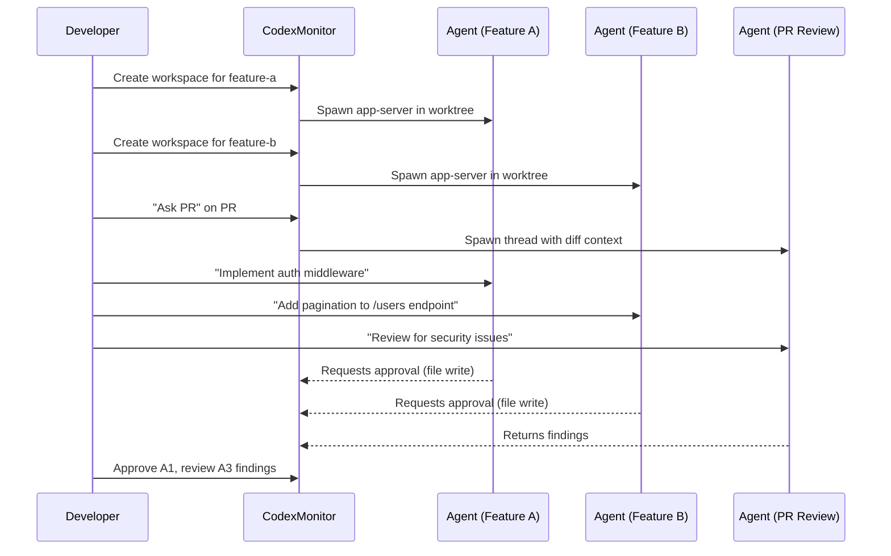

# CodexMonitor: Multi-Workspace Agent Orchestration via the App-Server Protocol


---

## The Multi-Agent Terminal Problem

Once you graduate beyond a single Codex CLI session, the ergonomics degrade rapidly. Juggling `tmux` panes, remembering which worktree maps to which feature branch, and context-switching between three or four concurrent agents becomes a workflow tax that eats into the productivity gains the agent was supposed to deliver[^1]. The official Codex App (cloud) solves this for remote tasks, but developers who prefer local execution—for latency, privacy, or air-gapped compliance—have lacked a proper command centre.

CodexMonitor fills that gap. Built by Thomas Ricouard (the indie developer behind Ice Cubes[^2]), it is a Tauri-based desktop application that orchestrates multiple Codex `app-server` processes across isolated workspaces, providing thread management, Git integration, and a polished GUI without Electron's memory overhead[^3].

---

## Architecture

CodexMonitor's architecture follows a clean separation of concerns:



The frontend is a React application rendered in Tauri's webview. The Rust backend manages process lifecycles, persists workspace state to `workspaces.json`, and communicates with each `codex app-server` instance over the same stdio JSON-RPC v2 protocol that the official Codex App uses[^4]. This means CodexMonitor gets thread resume, fork, and conversation compaction for free—it speaks the same wire protocol as the first-party client.

### Why Tauri, Not Electron

The choice of Tauri gives CodexMonitor a ~15 MB binary versus the typical 150+ MB Electron bundle. The Rust backend also handles subprocess management natively, avoiding Node.js `child_process` quirks around signal handling on Windows[^3].

---

## Core Capabilities

### Workspace Isolation

Each workspace maps to a directory on disk. CodexMonitor spawns a dedicated `codex app-server` process per workspace, ensuring complete isolation of:

- Thread history and conversation state
- Permission profiles and sandbox configuration
- MCP server connections
- Git context (branch, staged changes, worktree)

Workspaces persist across application restarts. The home dashboard shows running state, unread message counts, and recent agent activity at a glance[^5].

### Thread Management

CodexMonitor exposes the full thread lifecycle through its UI:

| Operation | Description |
|-----------|-------------|
| **Resume** | Reopen a prior conversation with full context |
| **Fork** | Branch from a decision point into a new thread |
| **Pin** | Keep important threads accessible |
| **Archive** | Move completed work out of the active view |
| **Copy** | Duplicate thread state for experimentation |

Per-thread drafts survive navigation, so you can compose prompts across multiple workspaces without losing partially-written messages[^5].

### Git and GitHub Integration

CodexMonitor embeds native Git operations:

- **Diff visualisation** with syntax-highlighted staged and unstaged changes
- **Branch management** with upstream tracking (ahead/behind counts)
- **Commit log** for the active workspace
- **GitHub integration** via the `gh` CLI—pull request context, issue lists, and the "Ask PR" feature that injects a full diff into a dedicated review thread[^6]

The "Ask PR" workflow is particularly effective: select a pull request, and CodexMonitor creates a thread pre-loaded with the diff context, letting you ask the agent to review, suggest improvements, or generate test cases for the changed code.

### Worktree Agents

For tasks requiring complete Git isolation, CodexMonitor creates worktree-backed agents:

```bash
# Under the hood, CodexMonitor runs:
git worktree add worktrees/<workspace-id> <branch>
# Then spawns codex app-server rooted in that worktree
```

This means experimental refactoring, spike work, or parallel feature development happens in a fully isolated copy of the repository. The agent cannot accidentally modify your main working tree[^5].

---

## Composer and Developer Experience

The message composer includes features tuned for power users:

- **Autocomplete tokens**: `$skill-name` for skills, `/prompts:template` for saved prompts, `@path/to/file` for file context injection
- **Image attachments** via picker, drag-drop, or clipboard paste
- **Model selection** per message—switch between `gpt-5.5` for complex reasoning and `gpt-5.4-mini` for routine tasks
- **Reasoning effort** slider for fine-grained cost control
- **Collaboration mode** toggle (Plan/Pair/Execute)
- **Context usage ring** showing token economics for the current turn
- **Hold-to-talk dictation** via Whisper with live waveform feedback[^5]

---

## Remote and Daemon Mode

For developers running Codex on a powerful remote machine (a common pattern for teams with GPU-equipped build servers), CodexMonitor provides a headless daemon:

```bash
# Start the daemon on the remote machine
codex_monitor_daemon --data-dir /opt/codex-data \
                     --listen 0.0.0.0:9473 \
                     --token $CODEX_MONITOR_TOKEN

# Control it locally
codex_monitor_daemonctl status
codex_monitor_daemonctl workspace add /home/dev/project-alpha
```

Tailscale integration provides zero-configuration secure networking between the local GUI and the remote daemon[^6]. The iOS client (currently in development) connects exclusively through this remote backend, enabling mobile monitoring of long-running agent sessions.

---

## Configuration and Setup

### Prerequisites

CodexMonitor requires:

- **Codex CLI** (v0.130+) installed and in `$PATH`
- **Git** for workspace and worktree features
- **`gh` CLI** (optional) for GitHub integration
- **Node.js + npm** and **Rust stable** for building from source

### Installation

```bash
# Clone and build
git clone https://github.com/Dimillian/CodexMonitor.git
cd CodexMonitor
npm install
npm run tauri:build

# Or use pre-built binaries from GitHub Releases
# Available for macOS (arm64/x64), Linux (x64), Windows (x64)
```

### Workspace Configuration

Workspaces are configured through the GUI or by editing `workspaces.json` directly:

```json
{
  "workspaces": [
    {
      "id": "abc-123",
      "path": "/home/dev/my-project",
      "name": "My Project",
      "group": "active-features",
      "model": "gpt-5.5",
      "profile": "workspace"
    }
  ]
}
```

---

## Comparison with Alternative Approaches

| Approach | Isolation | GUI | Thread Resume | Cost Visibility | Setup Complexity |
|----------|-----------|-----|---------------|-----------------|------------------|
| **tmux + raw CLI** | Manual worktrees | None | `codex resume` | None | Low |
| **Codex App (cloud)** | Full (remote VM) | Web | Native | Dashboard | Minimal |
| **CodexMonitor** | Worktree per workspace | Native desktop | Via app-server | Context ring | Medium |
| **ccmanager/agent-deck** | Process-level | TUI | Varies | Limited | Low |

CodexMonitor occupies the sweet spot for developers who want local execution with the orchestration features of the cloud app[^7].

---

## Practical Workflow: Feature-Per-Workspace

A typical power-user workflow with CodexMonitor:



The key insight is that each agent runs independently with its own context, permissions, and Git state. The developer acts as coordinator rather than coder—approving changes, routing findings, and merging results.

---

## Current Limitations

- **No official OpenAI affiliation**—CodexMonitor is a third-party tool that could break if the app-server protocol changes without notice[^6]
- **iOS client is incomplete**—lacks terminal and dictation features as of May 2026
- **No multi-machine workspace sync**—workspaces are local to the machine running the daemon
- **Token attribution** is per-workspace but not per-thread within a workspace

---

## Conclusion

CodexMonitor represents the natural evolution of the Codex CLI power-user experience. By building directly atop the `codex app-server` protocol rather than wrapping the CLI in shell scripts, it achieves first-class thread management, proper workspace isolation, and a polished developer experience that scales to the multi-agent workflows that have become standard practice in 2026.

For teams already running multiple concurrent Codex sessions, CodexMonitor eliminates the tmux-juggling tax. For individual developers exploring parallel agent workflows for the first time, it provides a gentler on-ramp than raw process management.

The project is open source under the MIT licence at [github.com/Dimillian/CodexMonitor](https://github.com/Dimillian/CodexMonitor) with 4,000+ stars and active development[^3].

---

## Citations

[^1]: BrightCoding, "Stop Juggling Terminals! CodexMonitor Orchestrates Local AI Agents," 2026-05-30. [https://www.blog.brightcoding.dev/2026/05/30/stop-juggling-terminals-codexmonitor-orchestrates-local-ai-agents](https://www.blog.brightcoding.dev/2026/05/30/stop-juggling-terminals-codexmonitor-orchestrates-local-ai-agents)

[^2]: Thomas Ricouard (@Dimillian), "Codex Monitor is fully open source," X/Twitter, May 2026. [https://x.com/Dimillian/status/2010434528486322532](https://x.com/Dimillian/status/2010434528486322532)

[^3]: GitHub, "Dimillian/CodexMonitor: An app to monitor the (Codex) situation," 2026. [https://github.com/Dimillian/CodexMonitor](https://github.com/Dimillian/CodexMonitor)

[^4]: OpenAI, "CLI — Codex | OpenAI Developers," 2026. [https://developers.openai.com/codex/cli](https://developers.openai.com/codex/cli)

[^5]: CodexMonitor, "Orchestrate Codex agents across your workspaces," 2026. [https://www.codexmonitor.app/](https://www.codexmonitor.app/)

[^6]: Ry Walker Research, "Codex Monitor," 2026. [https://rywalker.com/research/codex-monitor](https://rywalker.com/research/codex-monitor)

[^7]: Nimbalyst, "Best Codex GUI 2026: 4 Codex Desktop Apps Compared," 2026. [https://nimbalyst.com/blog/best-codex-gui-tools-and-desktop-apps-2026/](https://nimbalyst.com/blog/best-codex-gui-tools-and-desktop-apps-2026/)
