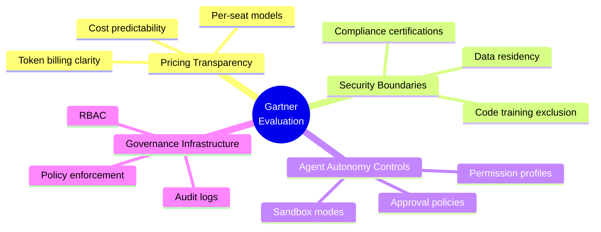
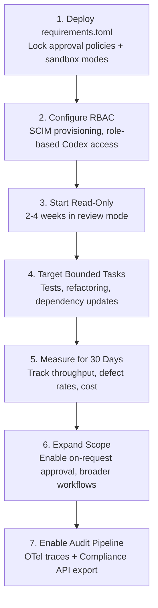

# The 2026 Gartner Magic Quadrant for Enterprise AI Coding Agents: What the Evaluation Criteria Mean for Your Team


On 20 May 2026, Gartner published its *Magic Quadrant for Enterprise AI Coding Agents* (report ID G00841434), evaluating 12 vendors across two axes — Ability to Execute and Completeness of Vision [^1]. This is the latest iteration of a category Gartner has tracked since its 2024 "AI Code Assistants" reports, now renamed to reflect the shift from completion tools to autonomous agents. OpenAI was named a Leader, alongside Anthropic (Claude Code), GitHub (Copilot), and Cursor [^2][^3][^4]. Tabnine landed in the Visionary quadrant [^5]. The report formalises a distinction that matters to every engineering organisation choosing tooling: *coding agents* are no longer code-completion utilities — they are autonomous systems that receive task descriptions, plan work, modify multiple files, run tests, fix failures, and submit pull requests [^6].

**A note on sourcing and limitations:** The full Gartner report is paywalled. Most publicly available analysis comes from vendors celebrating their own positioning — 16 of 22 citations in early coverage traced back to OpenAI or vendor blogs. This means the "Leaders" narrative is shaped largely by the vendors named as Leaders. Independent verification of Gartner's scoring methodology is not possible without report access, and MQ placement correlates with vendor engagement with the analyst process. This category has evolved through several iterations since Gartner's 2024 "AI Code Assistants" reports; the rename to "Enterprise AI Coding Agents" reflects market maturation, not a new evaluation. Readers should weigh the vendor-source concentration accordingly and treat MQ placement as one input among many, not a definitive ranking.

This article unpacks the evaluation criteria, maps them to concrete Codex CLI capabilities, and offers a practical adoption checklist for teams weighing enterprise rollout. It is not an endorsement of the MQ methodology.

## Why This Report Matters

Gartner estimates the enterprise AI coding agent market at roughly \$9.8–11.0 billion annualised as of April 2026 [^6]. That figure reflects a shift from discretionary developer tooling budgets to strategic platform investments. The Magic Quadrant gives procurement, security, and engineering leadership a shared vocabulary for comparing vendors — and it signals that coding agents have crossed the threshold from experimental to enterprise-critical infrastructure.

For Codex CLI users, the report validates capabilities that were already shipping but lacked third-party attestation: sandboxed execution, role-based governance, audit logging, and multi-surface deployment across CLI, IDE, web app, and SDK.

## The Evaluation Framework

Gartner's two-axis model assesses vendors on Ability to Execute (product quality, market responsiveness, customer experience, sales execution) and Completeness of Vision (market understanding, innovation, product strategy, geographic reach) [^1]. Within the coding agent category, the report emphasised four capability dimensions [^6]:



These are not abstract categories — they map directly to configuration surfaces in Codex CLI.

## Codex CLI Capabilities Through the Gartner Lens

### Pricing Transparency

Codex offers three pricing tiers: ChatGPT Plus (\$20/month, limited cloud tasks), Pro (\$200/month, higher limits), and Enterprise (custom pricing with SLA commitments) [^7]. The CLI itself is open-source and free to run locally with an API key, where costs follow standard OpenAI API token pricing [^7]. This dual model — subscription for the managed cloud experience, pay-as-you-go for CLI automation — gives teams predictable budgets for interactive work and flexible scaling for batch workflows.

### Security Boundaries

Codex's enterprise offering documents SOC 2 Type II and ISO 27001 certification, multi-region data residency, and a Compliance API for eligible Enterprise customers [^8]. At the CLI level, the sandbox architecture enforces isolation through platform-native mechanisms: bubblewrap on Linux, Seatbelt on macOS, and an elevated/unelevated sandbox model on Windows [^9]. The `requirements.toml` policy file lets administrators enforce approval policies, sandbox modes, network access constraints, MCP server allowlists, and feature pins across teams [^10].

```toml
# requirements.toml — administrator-enforced policy
[sandbox]
mode = "workspace-write"          # no danger-full-access allowed

[network]
allow_outbound = false            # offline by default

[approval]
allowed_policies = ["on-request"] # no fully autonomous mode

[mcp]
server_allowlist = ["github", "jira", "sentry"]
```

### Agent Autonomy Controls

Codex CLI ships three approval modes — `read-only`, `on-request` (default), and `full-access` — which control whether the agent can execute shell commands without human confirmation [^11]. Permission profiles, stabilised in v0.133, add inheritance and composability: a `base` profile can define conservative defaults whilst a `ci` profile inherits from it and relaxes network access for pipeline automation [^12]. The `--profile` flag, promoted to primary selector in v0.134, makes switching between security postures a single argument [^13].

```bash
# Interactive development — conservative
codex --profile dev "Refactor the auth module"

# CI pipeline — relaxed network, no approval prompts
codex exec --profile ci "Run integration tests and fix failures"
```

### Governance Infrastructure

Enterprise Codex workspaces expose RBAC through ChatGPT admin settings, with SCIM-synced role provisioning that can grant or restrict access to Codex Local and Codex Cloud independently [^8]. Admin-enforced `requirements.toml` policies deploy from the Codex Policies page, applying different constraints to different groups without distributing device-level configuration files [^10]. Audit logs capture every agent action — tool calls, file modifications, shell commands, and approval decisions — exportable via the Compliance API or OpenTelemetry [^14].

## The Competitive Landscape

The four Leaders occupy distinct positions:

| Vendor | Key Strength | CLI/Terminal Story | Enterprise Governance |
|--------|-------------|-------------------|----------------------|
| **OpenAI (Codex)** | Agentic autonomy, GPT-5.5 reasoning, multi-surface deployment [^2] | First-class open-source CLI with local sandboxing | RBAC, SCIM, requirements.toml, Compliance API |
| **Anthropic (Claude Code)** | Extended thinking, strong coding benchmarks, safety-focused design | `claude` CLI with native terminal agent | Organisation policies, SSO, audit controls |
| **GitHub (Copilot)** | Lifecycle integration across issues, PRs, Actions; highest Ability to Execute [^3] | `gh copilot` CLI with GitHub-native integration | GitHub Enterprise policies, audit log streaming |
| **Cursor** | Furthest Completeness of Vision; 70%+ Fortune 500 adoption [^4] | IDE-native with terminal panel | Workspace-level policies, team admin controls |

Tabnine, positioned as a Visionary, emphasises organisational context and on-premises deployment options — relevant for regulated industries where code must never leave the network [^5].

The report's critical distinction between *code completion tools* and *coding agents* reshapes procurement conversations [^6]. A team evaluating Codex CLI against a completion-only tool is no longer comparing like with like. Gartner's framing pushes the evaluation towards autonomy controls, governance depth, and audit infrastructure — areas where Codex's permission profiles, sandbox architecture, and policy enforcement have matured significantly through 2026.

## Realistic Capacity Expectations

Gartner's analysis tempers vendor marketing claims. Whilst some vendors suggest 1:1 agent-to-engineer equivalence, operational data shows more nuanced results [^6]:

- **Bounded tasks** (test generation, refactoring, dependency updates): 2–3x throughput improvement
- **Architecture and cross-system reasoning**: marginal gains
- **Net capacity increase for typical teams**: 15–30%

This aligns with independent research. The METR study found that experienced developers using AI tools showed no statistically significant speedup on real-world tasks, though less experienced developers benefited more [^15]. Codex CLI's value proposition is strongest when combined with structured workflows — ExecPlans for multi-hour sessions [^16], iterative repair loops for test-driven fixes [^17], and `codex exec` pipelines for batch automation [^18].

## Enterprise Adoption Checklist

For teams using the Gartner report to justify or plan Codex CLI adoption, here is a practical checklist mapped to the evaluation criteria:



### Step 1: Establish Policy Guardrails

Before any developer runs `codex` in a corporate environment, deploy a `requirements.toml` that enforces your organisation's minimum security posture. This prevents developers from opting into `danger-full-access` mode or connecting to unapproved MCP servers.

### Step 2: Provision Access via SCIM

For Enterprise workspaces, configure SCIM integration with your identity provider. Assign RBAC roles that separate Codex Local (runs on developer machines) from Codex Cloud (runs in OpenAI's infrastructure) access — some teams may need one but not the other.

### Step 3: Start in Read-Only Mode

Gartner's recommended adoption pattern starts with read-only review mode for two to four weeks [^6]. In Codex CLI terms, this means using `codex --approval-mode read-only` or the `read-only` approval policy in your profile. The agent can read, analyse, and suggest, but cannot modify files or execute commands.

### Step 4: Measure Before Expanding

Select two bounded task categories — test generation and dependency updates are good candidates — and measure throughput over 30 days. Compare against baseline metrics before expanding agent autonomy.

## What the Report Does Not Cover

The Gartner Magic Quadrant evaluates enterprise readiness, not developer experience or model quality in isolation. Several aspects matter for Codex CLI users but fall outside the report's scope:

- **Model routing flexibility**: Codex CLI supports mid-session model switching via `/model`, letting developers use GPT-5.5 for complex reasoning and cheaper models for bulk operations [^19]. The MQ does not assess multi-model strategies.
- **MCP ecosystem breadth**: Codex CLI's MCP integration connects to hundreds of external tools — databases, CI systems, project management platforms — via standardised protocol servers [^20]. The MQ does not evaluate protocol ecosystem depth.
- **Open-source CLI availability**: The CLI is Apache-2.0 licensed and runs without a subscription [^21]. The MQ focuses on commercial enterprise offerings.
- **Subagent orchestration**: Codex's ability to spawn parallel subagents for independent tasks is a differentiator in complex workflows [^22], but falls outside the governance-focused MQ criteria.

## Looking Ahead

The Magic Quadrant for Enterprise AI Coding Agents signals that analyst firms now consider this market mature enough for structured enterprise procurement. That is a useful data point, not gospel. MQ placement rewards vendor engagement with the analyst process, enterprise sales infrastructure, and geographic reach — none of which correlate perfectly with technical quality or developer experience. For Codex CLI users, the practical implication is narrower than the headline suggests: the governance features that enable enterprise adoption — permission profiles, sandbox policies, RBAC, audit logging, and compliance APIs — are already shipping in the CLI. Use the evaluation criteria as a checklist for your own due diligence, but run your own benchmarks on your own codebase before committing.

## Citations

[^1]: Gartner, "Magic Quadrant for Enterprise AI Coding Agents," Report ID G00841434, 20 May 2026. [https://www.gartner.com/en/documents/7879277](https://www.gartner.com/en/documents/7879277)

[^2]: OpenAI, "OpenAI named a Leader in enterprise coding agents by Gartner," 27 May 2026. [https://openai.com/index/gartner-2026-agentic-coding-leader/](https://openai.com/index/gartner-2026-agentic-coding-leader/)

[^3]: GitHub Blog, "GitHub recognized as a Leader in the Gartner Magic Quadrant for Enterprise AI Coding Agents for the third year in a row," May 2026. [https://github.blog/ai-and-ml/github-copilot/github-recognized-as-a-leader-in-the-gartner-magic-quadrant-for-enterprise-ai-coding-agents-for-the-third-year-in-a-row/](https://github.blog/ai-and-ml/github-copilot/github-recognized-as-a-leader-in-the-gartner-magic-quadrant-for-enterprise-ai-coding-agents-for-the-third-year-in-a-row/) *Note: GitHub's "third year" claim counts across the predecessor "AI Code Assistants" MQ category, renamed in 2026.*

[^4]: Cursor, "Cursor named a Leader in the 2026 Gartner Magic Quadrant for Enterprise AI Coding Agents," May 2026. [https://cursor.com/blog/cursor-leads-gartner-mq-2026](https://cursor.com/blog/cursor-leads-gartner-mq-2026)

[^5]: Tabnine, "Tabnine Named a Visionary in the 2026 Gartner Magic Quadrant for Enterprise AI Coding Agents," 27 May 2026. [https://www.tabnine.com/blog/tabnine-named-a-visionary-in-the-2026-gartner-magic-quadrant-for-enterprise-coding-agents/](https://www.tabnine.com/blog/tabnine-named-a-visionary-in-the-2026-gartner-magic-quadrant-for-enterprise-coding-agents/)

[^6]: Swift Headway AI, "Gartner 2026 AI Coding Agents MQ — SMB Takeaways," May 2026. [https://swiftheadway.ai/blog/gartner-2026-ai-coding-agents-smb-takeaways](https://swiftheadway.ai/blog/gartner-2026-ai-coding-agents-smb-takeaways)

[^7]: OpenAI Developers, "Pricing — Codex," accessed May 2026. [https://developers.openai.com/codex/pricing](https://developers.openai.com/codex/pricing)

[^8]: OpenAI Developers, "Admin Setup — Codex," accessed May 2026. [https://developers.openai.com/codex/enterprise/admin-setup](https://developers.openai.com/codex/enterprise/admin-setup)

[^9]: OpenAI, "Building a safe, effective sandbox to enable Codex," May 2026. [https://winbuzzer.com/2026/05/14/building-a-safe-effective-sandbox-to-enable-codex-xcxwbn/](https://winbuzzer.com/2026/05/14/building-a-safe-effective-sandbox-to-enable-codex-xcxwbn/)

[^10]: OpenAI Developers, "Advanced Configuration — Codex," accessed May 2026. [https://developers.openai.com/codex/config-advanced](https://developers.openai.com/codex/config-advanced)

[^11]: OpenAI Developers, "CLI — Codex," accessed May 2026. [https://developers.openai.com/codex/cli](https://developers.openai.com/codex/cli)

[^12]: OpenAI Developers, "Changelog — Codex: v0.133.0," 21 May 2026. [https://developers.openai.com/codex/changelog](https://developers.openai.com/codex/changelog)

[^13]: OpenAI Developers, "Changelog — Codex: v0.134.0," 26 May 2026. [https://developers.openai.com/codex/changelog](https://developers.openai.com/codex/changelog)

[^14]: OpenAI Developers, "Configuration Reference — Codex," accessed May 2026. [https://developers.openai.com/codex/config-reference](https://developers.openai.com/codex/config-reference)

[^15]: METR, "Measuring the Impact of Early AI Assistance on the Speed of Experienced Open-Source Developers," 2025. Referenced via AI productivity research coverage.

[^16]: OpenAI Cookbook, "Using PLANS.md for multi-hour problem solving," October 2025. [https://developers.openai.com/cookbook/examples/codex/code_modernization](https://developers.openai.com/cookbook/examples/codex/code_modernization)

[^17]: OpenAI Cookbook, "Build iterative repair loops with Codex," May 2026. [https://developers.openai.com/cookbook/examples/codex/codex_mcp_agents_sdk/building_consistent_workflows_codex_cli_agents_sdk](https://developers.openai.com/cookbook/examples/codex/codex_mcp_agents_sdk/building_consistent_workflows_codex_cli_agents_sdk)

[^18]: OpenAI Developers, "Non-interactive mode — Codex," accessed May 2026. [https://developers.openai.com/codex/noninteractive](https://developers.openai.com/codex/noninteractive)

[^19]: OpenAI Developers, "Features — Codex CLI," accessed May 2026. [https://developers.openai.com/codex/cli/features](https://developers.openai.com/codex/cli/features)

[^20]: OpenAI Developers, "Codex CLI Reference — MCP," accessed May 2026. [https://developers.openai.com/codex/cli/reference](https://developers.openai.com/codex/cli/reference)

[^21]: GitHub, "openai/codex — Lightweight coding agent that runs in your terminal," accessed May 2026. [https://github.com/openai/codex](https://github.com/openai/codex)

[^22]: OpenAI Developers, "Subagents — Codex," accessed May 2026. [https://developers.openai.com/codex/subagents](https://developers.openai.com/codex/subagents)

[^23]: Anthropic, "Agentic Coding Trends Report," May 2026. Claude Code at 46% developer preference in independent surveys; not included in the Gartner MQ's 12-vendor evaluation.
