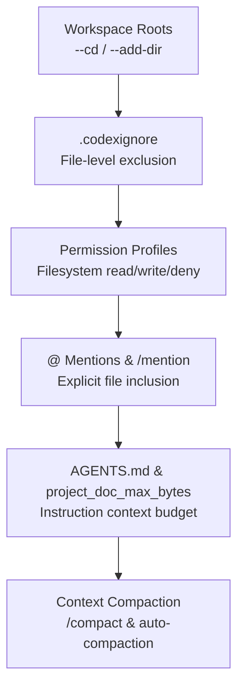
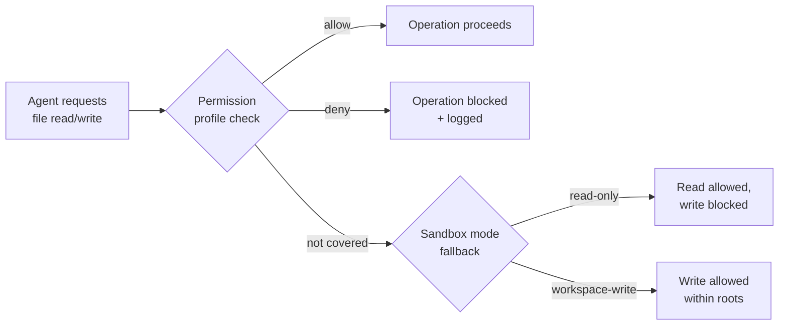

# Codex CLI Context Scoping: .codexignore, File References, Permission Profiles, and Workspace Control


---

Every token your agent reads is a token you pay for — and, more importantly, a token that competes for space with the reasoning the model actually needs to do its job. In large codebases, uncontrolled context ingestion is the single most common cause of degraded agent performance: the model sees too much, focuses on the wrong files, and burns through your context window before it finishes the task [^1]. Codex CLI ships a layered set of mechanisms for controlling exactly what the agent sees, reads, and writes. This article catalogues them all, from coarse workspace roots through fine-grained permission profiles, and offers practical patterns for monorepos and enterprise environments.

## The Context Scoping Stack

Codex CLI's context controls form a hierarchy. Understanding the layers — and where each one applies — prevents the common mistake of relying on a single mechanism and wondering why the agent still reads files you thought were excluded.



Each layer narrows or focuses the agent's view. The outermost layer defines *where* the agent operates; the innermost manages *how much* conversation history survives across long sessions.

## Workspace Roots: --cd and --add-dir

The `--cd` flag sets the primary working directory without requiring a shell `cd` first [^2]. The `--add-dir` flag exposes additional writable roots, which is essential for cross-project changes:

```bash
codex --cd apps/frontend --add-dir ../backend --add-dir ../shared
```

The active path appears in the TUI header. Any directory not listed as a workspace root is invisible to write operations under the default `workspace-write` sandbox mode [^2]. This is the coarsest scoping mechanism: if a directory is not a workspace root, the agent cannot modify it.

## .codexignore: Excluding Files from Agent View

The `.codexignore` file uses `.gitignore`-compatible syntax and sits in your project root. It tells Codex which files to skip when scanning the workspace [^3]:

```bash
# .codexignore
node_modules/
vendor/
.venv/
*.sqlite
*.wasm
dist/
coverage/
__pycache__/
*.pyc
.env
.env.*
secrets/
*.pem
*.key
```

### Current Limitations

The `.codexignore` mechanism has known rough edges that you should understand before relying on it as a security boundary:

1. **Tool-level bypass**: when the model invokes shell tools like `rg`, `cat`, or `find`, those tools operate at the OS level and do not consult `.codexignore` [^4]. The sandbox and permission profiles are the actual enforcement layer.
2. **Rust implementation parity**: early issues reported that the Rust-based CLI did not fully respect `.codexignore` in all code paths [^4]. As of v0.135, the most common file-discovery paths honour it, but edge cases remain under active development.
3. **Not a security boundary**: `.codexignore` is a *context hygiene* tool, not an access control mechanism. For genuine file protection, use permission profiles with explicit `deny` rules (see below).

⚠️ Do not rely solely on `.codexignore` to protect sensitive files. Pair it with permission profile `deny` rules and the sandbox for defence in depth.

### Interaction with .gitignore

Codex CLI already respects `.gitignore` when performing file discovery [^5]. The `.codexignore` file extends this: `.gitignore` keeps files out of version control; `.codexignore` keeps them out of the agent's awareness. In practice, most `.gitignore` entries (build artefacts, dependency directories) are already excluded. `.codexignore` is for files that *are* tracked in Git but should not be read by the agent — think configuration files containing inline credentials, large data fixtures, or generated code that would waste context.

## Permission Profiles: Filesystem Access Control

Named permission profiles, enhanced in v0.135 [^6], provide the enforcement layer that `.codexignore` lacks. Define them in `~/.codex/config.toml` or `.codex/config.toml`:

```toml
[permissions.restricted]
filesystem.":workspace_roots".src = "write"
filesystem.":workspace_roots".tests = "write"
filesystem.":workspace_roots".docs = "read"
filesystem.":workspace_roots".secrets = "deny"
filesystem.":workspace_roots"."*.env" = "deny"

[permissions.restricted.network]
allow = ["api.openai.com"]
```

Activate a profile with `--profile restricted` or set `default_permissions = "restricted"` in your config [^6]. The `/permissions` slash command displays the active profile and its rules during a session [^7].



### Built-in Profiles

Codex ships three built-in profiles that map to the familiar sandbox modes [^6]:

| Profile | Filesystem | Network |
|---------|-----------|---------|
| `:read-only` | Read anywhere, write nowhere | Blocked |
| `:workspace` | Read anywhere, write within workspace roots | Blocked |
| `:danger-full-access` | Unrestricted | Unrestricted |

Custom profiles inherit from one of these and overlay specific path rules. This is where you enforce that `secrets/` is genuinely inaccessible, not merely ignored.

## @ Mentions and /mention: Explicit File Inclusion

While the mechanisms above *exclude* content, the `@` picker and `/mention` command *include* specific files in the conversation context [^8]:

- **`@` picker**: type `@` in the composer to open a fuzzy search across files, directories, plugins, and skills. The unified picker was introduced in v0.131 and searches all workspace roots [^8].
- **`/mention src/lib/api.ts`**: explicitly adds a file to the conversation so subsequent turns reference it directly [^9].

This is the precision instrument. Rather than letting the agent discover files through broad searches, you point it at exactly what matters. For complex refactoring tasks, starting your prompt with two or three `@` references dramatically reduces wasted exploration.

## AGENTS.md and the project_doc_max_bytes Budget

Codex loads `AGENTS.md` files hierarchically — from the repository root down to the current working directory — and concatenates them into the system prompt [^10]. The `project_doc_max_bytes` configuration key caps this at **32 KiB by default** [^10]:

```toml
# ~/.codex/config.toml
project_doc_max_bytes = 65536  # 64 KiB for larger projects
```

Files are loaded root-first, and loading stops once the byte budget is exhausted [^10]. Larger files are silently truncated. This means your root-level `AGENTS.md` should contain the most critical instructions, with subdirectory files adding package-specific guidance.

### Fallback Filenames

If `AGENTS.md` is missing, Codex checks `project_doc_fallback_filenames` — configurable in `config.toml` [^11]. This is useful for gradual adoption: teams can start with an existing `CONTRIBUTING.md` or `DEVELOPMENT.md` as fallback context.

## Context Compaction: Managing Long Sessions

Even with perfect scoping, long agentic sessions accumulate context. Codex CLI's compaction system handles this automatically [^12]:

1. **Auto-compaction**: before sending a new message, Codex checks whether accumulated tokens exceed ~90% of the model's context window. If so, the conversation is summarised into a "handoff summary" and the original history is replaced [^12].
2. **Manual `/compact`**: triggers compaction immediately, useful when you notice the agent losing focus or repeating itself [^12].
3. **`tool_output_token_limit`**: caps the tokens returned by individual tool calls. Verbose test output and large `grep` results are the primary cause of rapid context bloat — setting this aggressively (e.g., 4096 tokens) keeps individual tool responses manageable [^1].

For monorepos, lowering the auto-compaction threshold to 80–85% prevents the agent from entering compaction loops where it compacts, reads a few files, hits the threshold again, and cycles without progress [^13].

## Practical Patterns

### Pattern 1: Monorepo with Sensitive Modules

```bash
# .codexignore
packages/billing/fixtures/
packages/auth/keys/
*.tfstate
*.tfvars
```

```toml
# .codex/config.toml
project_doc_max_bytes = 65536

[permissions.monorepo]
filesystem.":workspace_roots"."packages/billing/keys" = "deny"
filesystem.":workspace_roots"."packages/auth/keys" = "deny"
filesystem.":workspace_roots"."infrastructure/*.tfstate" = "deny"
```

```bash
codex --cd packages/api --add-dir ../shared --profile monorepo
```

### Pattern 2: CI Pipeline with Minimal Context

```toml
# ci.config.toml (profile)
sandbox_mode = "read-only"
web_search = "disabled"
project_doc_max_bytes = 16384
```

```bash
codex exec --profile ci "Review the diff for security issues" \
  --output-schema ./review-schema.json
```

### Pattern 3: Enterprise Compliance

```toml
[permissions.compliance]
filesystem."/etc" = "deny"
filesystem.":workspace_roots".".env" = "deny"
filesystem.":workspace_roots".".env.*" = "deny"
filesystem.":workspace_roots"."**/*.pem" = "deny"

[permissions.compliance.network]
allow = ["api.openai.com", "github.com"]
```

Combine this with the project trust model: set `projects.<path>.trust_level = "untrusted"` for third-party repositories to skip project-scoped `.codex/` layers, hooks, and MCP servers entirely [^11].

## Summary

Context scoping is not a single feature — it is a stack. `.codexignore` keeps irrelevant files out of discovery. Permission profiles enforce filesystem boundaries the agent cannot bypass. Workspace roots define the write perimeter. `@` mentions and `/mention` focus the agent on what matters. And `project_doc_max_bytes` budgets your instruction context. Used together, these mechanisms keep the agent fast, focused, and safe — even in repositories with thousands of files and sensitive assets.

---

## Citations

[^1]: [How to Fix OpenAI Codex CLI Context Window Exceeded Errors — Inventive HQ](https://inventivehq.com/knowledge-base/openai/how-to-fix-context-errors)
[^2]: [Features — Codex CLI — OpenAI Developers](https://developers.openai.com/codex/cli/features)
[^3]: [Ignore files feature, e.g. ".codexignore" — openai/codex Discussion #3456](https://github.com/openai/codex/discussions/3456)
[^4]: [.codexignore Never Respected — openai/codex Issue #6530](https://github.com/openai/codex/issues/6530)
[^5]: [fix(core): scope file search gitignore to repository context — openai/codex PR #13250](https://github.com/openai/codex/pull/13250)
[^6]: [Changelog — Codex — OpenAI Developers (v0.135.0, 28 May 2026)](https://developers.openai.com/codex/changelog)
[^7]: [Slash commands in Codex CLI — OpenAI Developers](https://developers.openai.com/codex/cli/slash-commands)
[^8]: [Codex Updates by OpenAI — May 2026 — Releasebot](https://releasebot.io/updates/openai/codex)
[^9]: [OpenAI Codex CLI Commands List 2026 — Toolsbase](https://toolsbase.dev/en/reference/codex-commands)
[^10]: [Custom instructions with AGENTS.md — Codex — OpenAI Developers](https://developers.openai.com/codex/guides/agents-md)
[^11]: [Configuration Reference — Codex — OpenAI Developers](https://developers.openai.com/codex/config-reference)
[^12]: [Codex CLI Context Compaction: Architecture, Configuration, and Managing Long Sessions — Codex Blog](https://codex.danielvaughan.com/2026/03/31/codex-cli-context-compaction-architecture/)
[^13]: [Codex CLI freezes near auto-compaction threshold — openai/codex Issue #19116](https://github.com/openai/codex/issues/19116)
