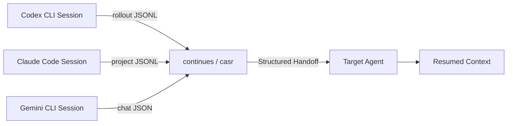

# Cross-Agent Session Portability: Moving Codex CLI Sessions Between Coding Agents


---

The terminal coding agent landscape in mid-2026 has a vendor lock-in problem that nobody designed deliberately. Claude Code stores sessions as JSONL in `~/.claude/projects/`. Codex CLI writes rollout files under `~/.codex/sessions/YYYY/MM/DD/`. Gemini CLI uses its own chat format in `~/.gemini/tmp/`. Each format is undocumented, proprietary, and incompatible with the others. When you hit a rate limit, exhaust a token budget, or simply want a second opinion from a different model, you lose your entire conversational context and start from scratch.

Two open-source tools have emerged to solve this: **continues** (npm) and **casr** (Rust). Both read native session formats, convert them to a portable representation, and inject the context into a target agent — letting you pick up exactly where you left off across 16 different coding agents [^1] [^2].

## Why Session Portability Matters

The practical triggers for switching agents mid-task are more common than most developers admit. A Hacker News discussion on `continues` surfaced the pattern clearly: cost-conscious developers juggling a ChatGPT Plus and Claude Pro subscription regularly hit rate ceilings on one and pivot to the other [^3]. Enterprise teams evaluating multiple vendors run the same refactoring task across agents for comparison. And when an agent gets stuck in a reasoning loop, a fresh model with the same context often breaks through.

Without portability tooling, the workaround is manual: copy the last few messages, paste them into a new session, hope the receiving agent infers enough context. This loses tool call history, file modification records, exit codes, and the reasoning chain that led to the current state.



## How Codex CLI Stores Sessions

Codex CLI persists every session as a rollout file — newline-delimited JSON where each line contains a `RolloutLine` wrapping a `RolloutItem` [^4]. The file path follows a deterministic pattern:

```
~/.codex/sessions/YYYY/MM/DD/rollout-{ISO_TIMESTAMP}-{UUID}.jsonl
```

Each line carries a `type` field identifying the entry kind — `user_message`, `assistant_message`, `tool_call`, `tool_result`, or `session_metadata` — along with timestamps, token counts, and model identifiers [^4]. This format is richer than most competing agents' session stores because it preserves the full tool execution trace, including shell commands, exit codes, file reads, and grep operations.

Since v0.134, Codex CLI also maintains a SQLite metadata layer (`~/.codex/logs_2.sqlite`) for fast session search and indexing [^5]. The JSONL files remain the canonical source of truth; the SQLite database is a read-optimised index built on top of them.

## continues: npm-Based Cross-Agent Handoff

`continues` is a TypeScript CLI that scans session directories for 16 supported agents, reads each tool's native format, and generates a structured handoff document [^1].

### Installation and Quick Start

```bash
# Install globally
npm install -g continues

# Or run without installation
npx continues
```

Running `continues` without arguments opens an interactive session picker. It discovers sessions from all installed agents and presents them sorted by recency, with project-aware prioritisation when run from a repository root [^1].

### Cross-Agent Resume

To hand off a Codex CLI session to Claude Code:

```bash
# List recent Codex sessions
continues list --tool codex

# Resume a specific session in Claude Code
continues resume abc123def --in claude

# Quick-resume your latest Codex session in Gemini
continues codex 1 --in gemini
```

The `--debug-prompt` flag previews the handoff document without launching the target agent — useful for verifying that the right context is being transferred [^1].

### What Gets Transferred

The handoff document includes:

- **Conversation history**: Recent messages (configurable depth, default 10)
- **Tool activity summary**: Aggregated counts — e.g. `Bash (×47): $ npm test → exit 0`
- **File modifications**: Paths read and written during the session
- **Model and token metadata**: Which model was used and how many tokens were consumed
- **Thinking blocks**: Preserved where the source agent exposes them (Claude Code, Codex CLI)

The tool never modifies original session files — all operations are read-only [^1].

### Configuration

A `.continues.yml` in the project root or `~/.continues/config.yml` controls verbosity:

```yaml
# .continues.yml
preset: verbose          # minimal | standard | verbose | full
recentMessages: 20       # messages to include
shell:
  maxSamples: 10         # command history samples
  stdoutLines: 30        # output lines per command
```

The verbosity presets balance context completeness against token cost in the receiving agent. `minimal` ships 3 messages with no tool samples; `full` ships 50 messages with complete tool output [^1].

## casr: Rust-Based Canonical IR Conversion

`casr` (Cross Agent Session Resumer) takes a more structured approach. Rather than generating a prose handoff document, it converts sessions through a canonical intermediate representation (IR) that preserves structured metadata [^2].

### Installation

```bash
# Via installer script (handles platform detection and verification)
curl -fsSL "https://raw.githubusercontent.com/Dicklesworthstone/\
cross_agent_session_resumer/main/install.sh" | bash

# Or build from source
cargo install --path .
```

### The Canonical IR

The IR normalises sessions into a standard model [^2]:

- **Session metadata**: ID, provider slug, workspace path, timestamps
- **Normalised messages**: Role (`User` / `Assistant` / `Tool` / `System`), content, timestamps, author info
- **Structured extras**: Tool calls and results preserved as discrete objects rather than flattened into prose

This means `casr` supports true **bidirectional conversion** — you can write a session *into* a target agent's native format, not just inject a context document. The trade-off is tighter coupling to each agent's storage internals.

### Usage

```bash
# Discover all sessions across installed agents
casr list

# Resume a Codex session in Claude Code
casr claude resume <session-id> --source codex

# Inspect session contents without resuming
casr info <session-id>

# Dry run to preview conversion
casr claude resume <session-id> --dry-run
```

The `--json` flag on most commands enables scripting and pipeline integration [^2].

## Comparing the Two Tools

| Dimension | continues | casr |
|---|---|---|
| Language | TypeScript (Node.js 22.5+) | Rust (nightly) |
| Agents supported | 16 | 14+ |
| Transfer method | Prose handoff document | Canonical IR with native format writes |
| Bidirectional | Inject only | Read and write |
| Session index | JSONL cache, 5-min TTL | In-memory with auto-detection |
| Configuration | YAML presets | CLI flags, JSON output |
| GitHub stars | ~1.2k [^1] | ~82 [^2] |
| Install | `npm install -g` / `npx` | `curl \| bash` / `cargo build` |

For most developers, `continues` is the pragmatic choice — zero-friction installation via `npx`, wider agent coverage, and a handoff approach that works reliably even when native session formats change. `casr` suits teams building automated pipelines that need structured session data and round-trip fidelity.

## Practical Patterns for Codex CLI Users

### Pattern 1: Rate-Limit Failover

When Codex CLI hits a token ceiling mid-refactoring:

```bash
# Switch to Claude Code with full context
npx continues codex 1 --in claude
```

The receiving agent gets the tool activity summary and can immediately see which files were modified, what tests were run, and where the previous agent left off [^3].

### Pattern 2: Model-Specific Strengths

Use Codex CLI (GPT-5.5) for initial scaffolding, then hand off to Claude Code for nuanced code review:

```bash
# After scaffolding completes in Codex
npx continues resume <id> --in claude --preset verbose
```

### Pattern 3: Comparative Evaluation

Run the same task through multiple agents to evaluate output quality:

```bash
# Start in Codex CLI, capture session
codex exec "Refactor auth module to use dependency injection" -o result.json

# Resume the same context in Gemini and Claude
npx continues codex 1 --in gemini --debug-prompt > handoff.md
npx continues codex 1 --in claude --debug-prompt >> handoff.md
```

### Pattern 4: CI Pipeline Agent Rotation

In long-running CI pipelines, rotate agents per stage to balance cost:

```bash
# Stage 1: Codex CLI for code generation
codex exec "Implement feature X per spec.md"

# Stage 2: Hand off to Claude for review
npx continues codex 1 --in claude
```

## Limitations and Caveats

**Context injection, not session migration.** Both tools inject context into the receiving agent's prompt window rather than creating a native session file the target agent can natively resume (with the partial exception of `casr`'s bidirectional writes). The receiving agent treats the handoff as a long first message, which means it counts against the context window [^3].

**Undocumented formats.** Every agent's session format is reverse-engineered. A minor release changing the JSONL schema can break extraction. `continues` mitigates this with per-agent adapters and a test suite, but the maintenance burden is real [^1].

**No automatic rate-limit detection.** You must manually decide when to switch. Neither tool monitors token budgets or triggers handoffs automatically [^3].

**Token cost of handoff context.** A verbose handoff document can consume 10,000–30,000 tokens in the receiving agent. Use the `minimal` preset when context windows are tight.

## The Broader Trend

The emergence of session portability tools reflects a maturing ecosystem where developers treat coding agents as interchangeable execution surfaces rather than walled gardens. The same pattern played out with containers (Docker images run on any orchestrator), infrastructure as code (Terraform modules run on any cloud), and now agent sessions.

The missing piece is a vendor-endorsed standard. OpenAI, Anthropic, and Google each have incentives to keep sessions proprietary. Until an open session format gains traction — perhaps through the Agent Communication Protocol (ACP) or a future MCP extension — tools like `continues` and `casr` will remain the pragmatic bridge [^6].

## Citations

[^1]: yigitkonur, "cli-continues: resume any AI coding session in another tool", GitHub, 2026. [https://github.com/yigitkonur/cli-continues](https://github.com/yigitkonur/cli-continues)

[^2]: Dicklesworthstone, "cross_agent_session_resumer: converts session formats through a canonical IR", GitHub, 2026. [https://github.com/Dicklesworthstone/cross_agent_session_resumer](https://github.com/Dicklesworthstone/cross_agent_session_resumer)

[^3]: "Show HN: npx continues — resume same session Claude, Gemini, Codex when limited", Hacker News, 2026. [https://news.ycombinator.com/item?id=47075089](https://news.ycombinator.com/item?id=47075089)

[^4]: "Session/Rollout Files", openai/codex Discussion #3827, GitHub, 2026. [https://github.com/openai/codex/discussions/3827](https://github.com/openai/codex/discussions/3827)

[^5]: "Codex CLI v0.134 Release — Conversation History Search, MCP Concurrency, Profile Migration", Codex Knowledge Base, 2026. [https://codex.danielvaughan.com/2026/05/27/codex-cli-v0134-release-guide-conversation-history-search-mcp-concurrency-profile-migration/](https://codex.danielvaughan.com/2026/05/27/codex-cli-v0134-release-guide-conversation-history-search-mcp-concurrency-profile-migration/)

[^6]: "Agent Communication Protocol (ACP) and Cross-Agent Interoperability", Codex Knowledge Base, 2026. [https://codex.danielvaughan.com/2026/05/01/codex-cli-agent-interoperability-protocols-mcp-acp-a2a/](https://codex.danielvaughan.com/2026/05/01/codex-cli-agent-interoperability-protocols-mcp-acp-a2a/)
