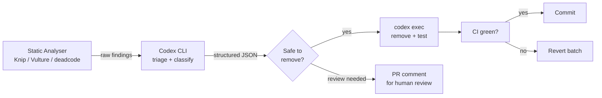

# Codex CLI for Dead Code Detection and Dependency Pruning: Automated Codebase Cleanup Workflows


---

Every production codebase accumulates dead weight: functions nobody calls, exports nothing imports, dependencies that `package.json` lists but no source file references, and CSS classes that style elements removed three sprints ago. The conventional response is a quarterly "cleanup sprint" that nobody looks forward to and few teams finish. Codex CLI offers a better path: agent-assisted detection, structured reporting, and incremental removal — all wired into your existing CI pipeline.

This article walks through a practical dead-code-and-dependency-pruning workflow using Codex CLI v0.135, Knip v5 for TypeScript/JavaScript projects, Vulture for Python, and Go's `deadcode` tool. Every step runs either interactively in the TUI or headlessly via `codex exec`.

## Why Agents Beat Manual Cleanup

Static analysers find unused symbols reliably, but the bottleneck is never detection — it is *triage*. A Knip run on a mid-sized monorepo surfaces hundreds of findings. A human must decide, for each one, whether the export is genuinely dead or merely loaded dynamically, referenced from a config file the analyser cannot parse, or kept as public API surface for downstream consumers.

Codex CLI bridges that gap. The agent reads the analyser's output, cross-references call sites, checks test imports, inspects dynamic `require()` or `importlib` patterns, and classifies each finding as **safe to remove**, **potentially used dynamically**, or **public API — keep**. The result is a structured JSON report your CI job can act on without human intervention for the safe-to-remove category.



## Setting Up the Detection Layer

### TypeScript and JavaScript — Knip v5

Knip is the standard tool for JS/TS dead code detection in 2026, with roughly 300,000 weekly npm downloads [^1]. It finds unused files, exports, dependencies, and devDependencies in a single run across monorepo workspaces. Vercel used Knip to delete nearly 300,000 lines of code from their production codebase [^2].

Install and run:

```bash
npm install -D knip
npx knip --reporter json > knip-report.json
```

Knip ships with around 150 plugins covering Vite, Vitest, Next.js, Astro, ESLint, GitHub Actions, and more — most projects need zero configuration [^1].

### Python — Vulture

Vulture detects unused functions, classes, variables, and unreachable code via AST analysis [^3]. Each finding gets a confidence score between 60% and 100%.

```bash
pip install vulture
vulture src/ --min-confidence 80 --json > vulture-report.json
```

An MCP server bundling Vulture with Ruff linting shipped in April 2026, making it accessible as a tool within agent sessions [^4].

### Go — deadcode

The official Go team's `deadcode` command reports unreachable functions in Go programmes [^5]:

```bash
go install golang.org/x/tools/cmd/deadcode@latest
deadcode -json ./... > deadcode-report.json
```

For monorepos, `deadmono` extends this with workspace-aware analysis [^6].

## Agent-Assisted Triage with codex exec

The raw analyser output is the starting point. The agent's job is classification. Define an output schema so `codex exec` returns structured findings:

```json
{
  "type": "object",
  "properties": {
    "safe_to_remove": {
      "type": "array",
      "items": {
        "type": "object",
        "properties": {
          "file": { "type": "string" },
          "symbol": { "type": "string" },
          "reason": { "type": "string" }
        },
        "required": ["file", "symbol", "reason"]
      }
    },
    "dynamic_usage_suspected": {
      "type": "array",
      "items": {
        "type": "object",
        "properties": {
          "file": { "type": "string" },
          "symbol": { "type": "string" },
          "evidence": { "type": "string" }
        },
        "required": ["file", "symbol", "evidence"]
      }
    },
    "public_api_keep": {
      "type": "array",
      "items": {
        "type": "object",
        "properties": {
          "file": { "type": "string" },
          "symbol": { "type": "string" },
          "consumers": { "type": "string" }
        },
        "required": ["file", "symbol", "consumers"]
      }
    }
  },
  "required": ["safe_to_remove", "dynamic_usage_suspected", "public_api_keep"],
  "additionalProperties": false
}
```

Save this as `cleanup-schema.json`, then run:

```bash
codex exec \
  "Read knip-report.json. For each finding, check whether the symbol is \
   referenced dynamically (e.g. via bracket notation, importlib, require \
   with variables, or config files). Classify every finding into one of \
   three categories: safe_to_remove, dynamic_usage_suspected, or \
   public_api_keep. Explain your reasoning for each." \
  --output-schema cleanup-schema.json \
  -o cleanup-triage.json
```

The `--output-schema` flag constrains the final response to your JSON schema [^7]. The agent reads the codebase, cross-references each reported symbol, and produces a machine-parseable report.

## Automated Removal in Batches

Never remove everything at once. The safe pattern is: remove one batch, run the full test suite, commit if green, revert if red. Codex CLI handles this naturally:

```bash
codex exec \
  "Read cleanup-triage.json. Take only the safe_to_remove items. \
   Remove them from the codebase in batches of 10 files. After each \
   batch, run 'npm test'. If tests fail, revert that batch and move \
   to the next. Report which batches succeeded and which were reverted." \
  --sandbox workspace-write
```

The `workspace-write` sandbox mode permits file modifications within the project directory whilst blocking network access and writes outside the workspace [^8].

### AGENTS.md Constraints for Safety

Add cleanup-specific constraints to your `AGENTS.md`:

```markdown
## Dead Code Removal Rules

- Never remove symbols exported from `src/public-api/` — these are consumed by external packages
- Never modify files in `src/generated/` — these are auto-generated
- Always run the full test suite after each removal batch
- Never remove TypeScript type exports unless zero consumers exist across all workspaces
- Preserve all `@public` or `@api` JSDoc-tagged exports
```

These constraints are loaded automatically at session start and override the agent's own judgement [^9].

## PostToolUse Hook for Removal Validation

Wire a PostToolUse hook to validate that each file edit genuinely removes dead code rather than accidentally breaking live imports. In `.codex/hooks.json`:

```json
{
  "hooks": {
    "PostToolUse": [
      {
        "matcher": "apply_patch",
        "hooks": [
          {
            "type": "command",
            "command": "python3 .codex/scripts/validate-removal.py",
            "statusMessage": "Validating dead code removal",
            "timeout": 30
          }
        ]
      }
    ]
  }
}
```

The validation script receives the patch details on stdin and can check that the removal does not introduce new TypeScript or ESLint errors [^10]. If the hook exits with code 2, Codex replaces the tool result with the hook's stderr feedback, prompting the agent to reconsider.

## CI Pipeline Integration

### GitHub Actions Workflow

```yaml
name: Dead Code Audit
on:
  schedule:
    - cron: '0 6 * * 1'  # Every Monday at 06:00 UTC
  workflow_dispatch:

jobs:
  audit:
    runs-on: ubuntu-latest
    steps:
      - uses: actions/checkout@v4

      - name: Install dependencies
        run: npm ci

      - name: Run Knip
        run: npx knip --reporter json > knip-report.json

      - name: Triage with Codex
        uses: openai/codex-action@v1
        with:
          prompt: |
            Read knip-report.json. Classify each finding as safe_to_remove,
            dynamic_usage_suspected, or public_api_keep. Output structured JSON.
          output_schema: cleanup-schema.json
          output_file: cleanup-triage.json
          sandbox: read-only

      - name: Post summary
        run: |
          SAFE=$(jq '.safe_to_remove | length' cleanup-triage.json)
          DYNAMIC=$(jq '.dynamic_usage_suspected | length' cleanup-triage.json)
          KEEP=$(jq '.public_api_keep | length' cleanup-triage.json)
          echo "### Dead Code Audit" >> $GITHUB_STEP_SUMMARY
          echo "- **Safe to remove:** $SAFE" >> $GITHUB_STEP_SUMMARY
          echo "- **Needs review:** $DYNAMIC" >> $GITHUB_STEP_SUMMARY
          echo "- **Public API (keep):** $KEEP" >> $GITHUB_STEP_SUMMARY

      - name: Upload report
        uses: actions/upload-artifact@v4
        with:
          name: dead-code-report
          path: cleanup-triage.json
```

Run the audit weekly in read-only mode. A separate workflow — triggered manually — takes the `safe_to_remove` findings and creates a PR with the actual removals.

## Unused Dependency Pruning

Knip handles JS/TS dependencies natively. For Python, combine `pip-audit` with Codex:

```bash
codex exec \
  "Run 'pip list --format=json' and compare against all import statements \
   in src/. Identify packages installed but never imported. Exclude known \
   runtime-only dependencies listed in pyproject.toml under \
   [tool.cleanup.runtime-only]. Output the list as JSON with package name, \
   installed version, and confidence level." \
  --output-schema deps-schema.json \
  -o unused-deps.json
```

For Go modules, `go mod tidy` handles most cases, but Codex can verify that `go mod tidy` would not break indirect dependencies before committing the change:

```bash
codex exec \
  "Run 'go mod tidy' in a temporary branch. Run 'go build ./...' and \
   'go test ./...'. Report whether the tidy operation is safe to commit." \
  --sandbox workspace-write
```

## Tracking Cleanup Over Time

Create a cleanup metrics file that the CI job appends to after each audit:

```bash
jq -n \
  --arg date "$(date -I)" \
  --arg safe "$(jq '.safe_to_remove | length' cleanup-triage.json)" \
  --arg dynamic "$(jq '.dynamic_usage_suspected | length' cleanup-triage.json)" \
  '{date: $date, safe_to_remove: ($safe|tonumber), needs_review: ($dynamic|tonumber)}' \
  >> cleanup-metrics.jsonl
```

Plot this over time to demonstrate that your codebase is getting leaner rather than accumulating cruft. A declining `safe_to_remove` count across weeks means the automated pipeline is working.

## Model Routing for Cost Efficiency

Dead code triage is a classification task, not a creative one. Route it to a cheaper, faster model:

```toml
# .codex/config.toml
[profiles.cleanup]
model = "gpt-5.4-mini"
reasoning_effort = "medium"
```

Run with the profile:

```bash
codex exec --profile cleanup "Triage the dead code report..." \
  --output-schema cleanup-schema.json
```

GPT-5.4-mini handles classification reliably at a fraction of GPT-5.5's cost [^11]. Reserve the larger model for the actual removal step where the agent must understand import graphs and test dependencies.

## Limitations and Caveats

- **Dynamic imports**: No static analyser catches `require(variable)` or `importlib.import_module(name)` patterns reliably. The agent improves on pure static analysis but can still miss runtime-constructed paths. Always maintain a whitelist for known dynamic imports.
- **Reflection-heavy languages**: Java and C# reflection defeats both static analysis and agent triage. Consider runtime coverage analysis instead.
- **Generated code**: Exclude auto-generated files (protobuf stubs, GraphQL types, OpenAPI clients) from analysis entirely via Knip's `ignore` configuration or AGENTS.md constraints.
- **Monorepo cross-references**: Knip v5 handles npm/yarn/pnpm workspaces natively [^1]. For polyglot monorepos mixing languages, run each language's analyser separately and merge reports before agent triage.

## Citations

[^1]: [Knip - Declutter your JavaScript & TypeScript projects](https://knip.dev/) — Official Knip documentation, accessed June 2026
[^2]: [Knip: An Automated Tool For Finding Unused Files, Exports, And Dependencies — Smashing Magazine](https://www.smashingmagazine.com/2023/08/knip-automated-tool-find-unused-files-exports-dependencies/) — Vercel case study reference
[^3]: [Vulture - Find dead Python code — GitHub](https://github.com/jendrikseipp/vulture) — Vulture repository and documentation
[^4]: [mcp-server-analyzer — PyPI](https://pypi.org/project/mcp-server-analyzer/) — MCP server bundling Vulture with Ruff, published April 2026
[^5]: [Finding unreachable functions with deadcode — The Go Blog](https://go.dev/blog/deadcode) — Official Go team deadcode tool
[^6]: [Dead code detection in Go monorepos with deadmono — DEV Community](https://dev.to/arxeiss/dead-code-detection-in-go-monorepos-with-deadmono-3043) — deadmono for Go monorepos
[^7]: [Non-interactive mode — Codex CLI | OpenAI Developers](https://developers.openai.com/codex/noninteractive) — `--output-schema` documentation
[^8]: [Features — Codex CLI | OpenAI Developers](https://developers.openai.com/codex/cli/features) — Sandbox modes reference
[^9]: [Custom instructions with AGENTS.md — Codex | OpenAI Developers](https://developers.openai.com/codex/guides/agents-md) — AGENTS.md documentation
[^10]: [Hooks — Codex | OpenAI Developers](https://developers.openai.com/codex/hooks) — Hook events and configuration reference
[^11]: [Codex CLI Model Landscape May 2026](https://codex.danielvaughan.com/2026/05/03/codex-cli-model-landscape-may-2026-gpt-5-5-5-4-5-3-routing-guide/) — Model routing guide for cost-efficient workflows
