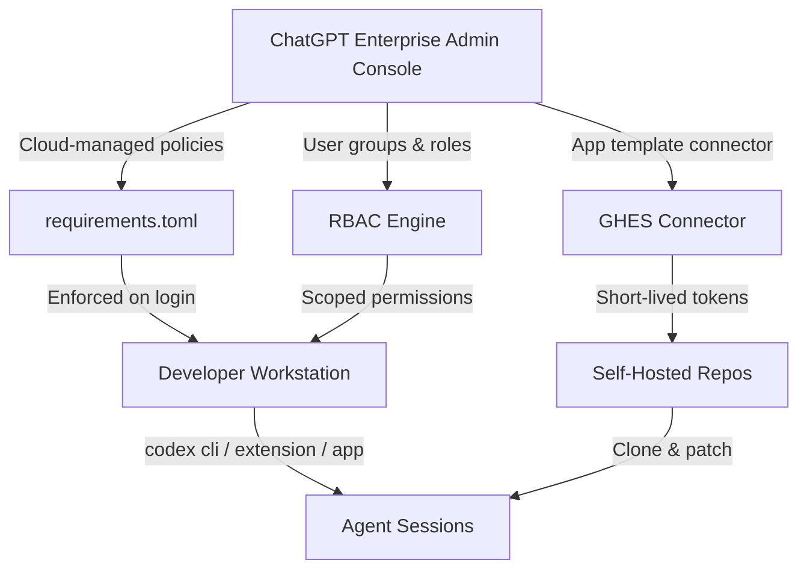
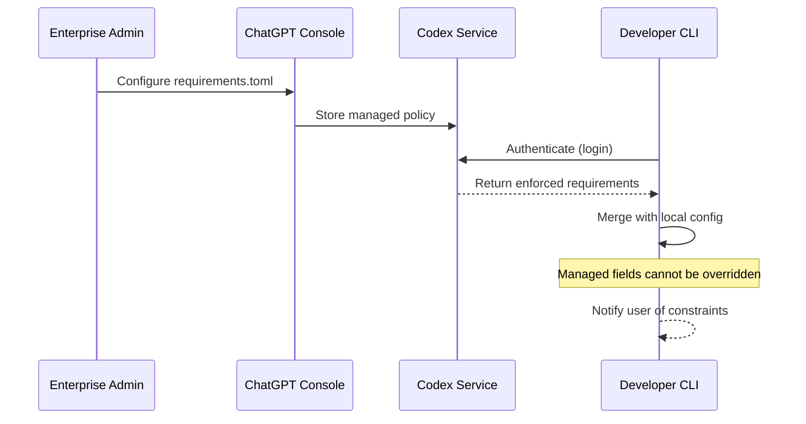
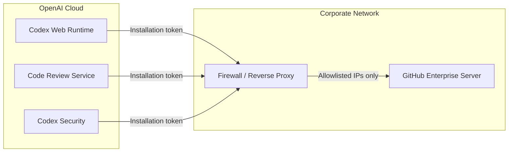
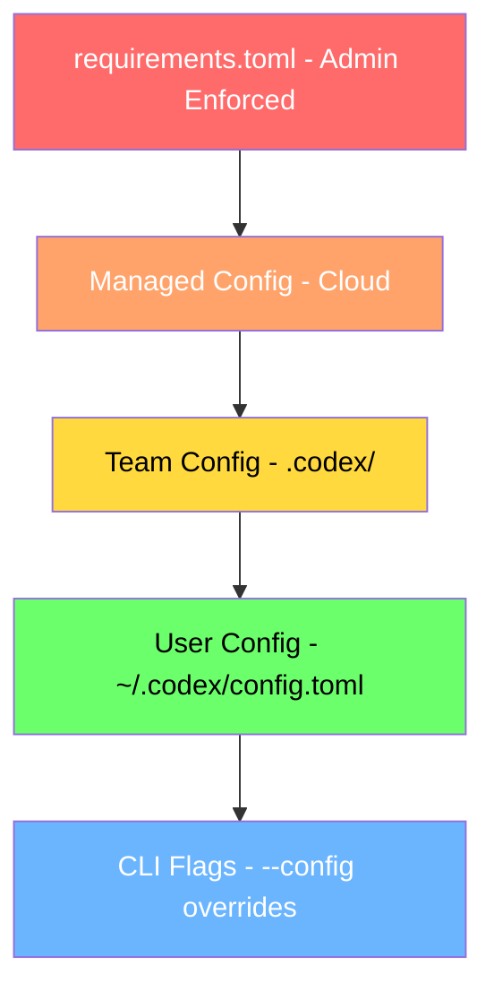

# Codex CLI Enterprise Deployment: Managed Configuration, RBAC, and the GitHub Enterprise Server Connector


---

Running Codex CLI on a single developer's laptop is one thing. Rolling it out across a 500-person engineering organisation — where compliance, data residency, and auditability are non-negotiable — is another entirely. This article walks through the enterprise deployment surface that shipped across Codex CLI v0.131–v0.135 and the ChatGPT Enterprise admin console, focusing on three pillars: **managed configuration via `requirements.toml`**, **role-based access control (RBAC)**, and the **GitHub Enterprise Server (GHES) connector** for self-hosted repositories.

## The Three-Pillar Architecture



The three pillars are complementary: managed configuration constrains *what* the agent can do, RBAC constrains *who* can do it, and the GHES connector determines *where* code lives.[^1]

## Pillar 1: Managed Configuration with requirements.toml

### What It Is

`requirements.toml` is an admin-enforced configuration file that constrains security-sensitive settings users cannot override.[^2] It uses the same TOML syntax as the user-facing `config.toml` but carries enforcement semantics: if a local setting conflicts with a managed requirement, Codex silently falls back to a compliant value and notifies the user.

### Deployment Layers

Admins can deploy requirements through three layered sources (earliest layer wins):[^2]

| Layer | Mechanism | Use Case |
|-------|-----------|----------|
| Cloud-managed | ChatGPT Business/Enterprise console | Default for most organisations |
| macOS MDM | Preference domain `com.openai.codex:requirements_toml_base64` | Fleet management via Jamf, Kandji |
| System file | `/etc/codex/requirements.toml` (Unix) or `%ProgramData%\OpenAI\Codex\requirements.toml` (Windows) | Air-gapped or on-prem deployments |

### Key Fields

```toml
# Restrict approval policies — block full-auto
allowed_approval_policies = ["untrusted", "on-request"]

# Restrict sandbox modes — no danger-full-access
allowed_sandbox_modes = ["read-only", "workspace-write"]

# Web search mode enforcement
allowed_web_search_modes = ["cached", "off"]

# MCP server allowlist — only approved servers
allowed_mcp_servers = [
  "github-mcp",
  "context7",
  "sentry-mcp"
]

# Feature flag pinning
[features]
network_proxy = "stable"
goal_mode = "enabled"

# Command rules — block destructive operations
[[command_rules]]
pattern = "rm -rf /"
action = "deny"

[[command_rules]]
pattern = "git push --force"
action = "require_approval"
```

### Enforcement Flow



The critical insight: cloud-managed policies apply across *all* Codex local surfaces when users sign in with ChatGPT — including the CLI, desktop app, and IDE extension.[^2] This eliminates the configuration drift problem where individual developers weaken security settings.

## Pillar 2: Role-Based Access Control

### Workspace Structure

OpenAI recommends three designated owners for enterprise Codex deployments:[^1]

1. **ChatGPT workspace owner** — overall administration
2. **Security owner** — policy enforcement and audit
3. **Analytics owner** — usage monitoring and compliance reporting

### Custom Roles and Groups

The admin console supports creating a dedicated "Codex Admin" group with a custom role carrying the `Allow members to administer Codex` permission.[^1] This separation of concerns means platform engineers can manage Codex policies without requiring full workspace ownership.

### Policy Assignment Strategy

```toml
# Baseline policy — applied to "All Users" group
# conservative defaults for the majority

# Senior Engineers group — relaxed constraints
allowed_approval_policies = ["untrusted", "on-request", "auto-review"]
allowed_sandbox_modes = ["read-only", "workspace-write", "danger-full-access"]

# CI/CD Service Accounts group — headless execution
allowed_approval_policies = ["auto-review"]
allowed_sandbox_modes = ["workspace-write"]
```

The recommendation is to create a baseline policy for most users, then create stricter or more permissive variants only where needed, assigning each managed policy to a specific user group with a default fallback policy for everyone else.[^2]

### Scoped API Keys

For compliance and analytics integrations, Codex provides dedicated API keys with scoped permissions:[^1]

- `codex.enterprise.analytics.read` — read-only access to usage telemetry
- Full Compliance API access — audit logs, session transcripts, policy enforcement events

## Pillar 3: The GitHub Enterprise Server Connector

### The Problem

Many enterprises run self-hosted GitHub Enterprise Server instances behind corporate firewalls. Until the GHES connector shipped in May 2026, Codex cloud features (web tasks, code review, security scanning) only worked with GitHub.com repositories.[^3]

### How It Works

For customer-hosted GitHub Enterprise Server repositories, workspace admins set up and publish a GitHub Enterprise app from the ChatGPT app template.[^3] This creates a workspace-specific connector that Codex uses for:

- **Codex Web** — cloud-based task execution against GHES repos
- **Code Review** — automated PR review triggered by `@codex` mentions
- **Security Review** — vulnerability scanning with Codex Security

### Security Model

The connector implements a least-privilege security model:[^4]

- **Short-lived tokens** — GitHub App installation tokens scoped per operation
- **Permission inheritance** — respects the user's existing GitHub repository permissions
- **Branch protection** — honours branch protection rules configured on GHES
- **IP allowlisting** — the `chatgpt-agents.json` file provides IP ranges for firewall configuration

### Setup Steps

1. Navigate to **Workspace Settings → Codex → Cloud Connectors**
2. Select **GitHub Enterprise Server** and provide the GHES instance URL
3. Follow the guided setup to generate a GitHub App manifest
4. Install the generated app on your GHES instance (requires org admin)
5. Complete the OAuth handshake to verify connectivity
6. Configure IP allowlist rules for Codex cloud egress ranges

⚠️ The exact UI flow may vary as this feature is in active development. Consult the [Admin Setup guide](https://developers.openai.com/codex/enterprise/admin-setup) for the latest steps.

### Network Architecture



## Putting It Together: A Deployment Checklist

For organisations preparing to roll out Codex CLI at scale, here is a condensed checklist drawn from the official admin setup guide:[^1]

1. **Enable Codex** in workspace settings (local enabled by default; cloud requires explicit activation)
2. **Configure RBAC** — create Codex Admin group, assign custom roles, establish user groups
3. **Deploy requirements.toml** — push baseline policy via Codex Policies page, create group-specific variants
4. **Standardise team configuration** — commit `.codex/config.toml`, rules, and skills to repositories
5. **Connect GitHub** — for cloud repos (GitHub.com) or GHES connector for self-hosted
6. **Establish governance** — configure Analytics and Compliance API integrations
7. **Verify** — test authentication flows, RBAC enforcement, and policy propagation

## Security Defaults Worth Noting

OpenAI explicitly states that "defaults across both Local and Cloud are tuned for utility, not security"[^1] — meaning enterprises *must* configure explicit constraints. Key defaults to override:

| Setting | Default | Recommended Enterprise Setting |
|---------|---------|-------------------------------|
| Approval policy | `on-request` | `untrusted` for new users |
| Sandbox mode | `workspace-write` | `read-only` for sensitive repos |
| Web search | `live` | `cached` or `off` for regulated industries |
| Internet access (cloud) | enabled | restrict to domain allowlist |

Data handling provides enterprise-grade guarantees: zero data retention for the app, CLI, and IDE; AES-256 encryption at rest; and TLS 1.2+ in transit.[^1]

## Operational Patterns

### Configuration Precedence

Understanding the configuration merge order is critical for debugging policy conflicts:



Requirements always win. Team config in `.codex/` directories provides shared defaults without requiring per-device setup.[^1]

### Monitoring Rollout

Use the Compliance API to track policy adoption:

```bash
# Query policy enforcement events for the last 24 hours
curl -H "Authorization: Bearer $CODEX_COMPLIANCE_KEY" \
  "https://api.openai.com/v1/codex/compliance/events?since=$(date -u -d '24 hours ago' +%Y-%m-%dT%H:%M:%SZ)&type=policy_enforcement"
```

### Gradual Rollout Strategy

1. **Week 1** — Deploy permissive requirements.toml to a pilot group; monitor usage patterns
2. **Week 2** — Tighten sandbox and approval constraints based on observed behaviour
3. **Week 3** — Extend to broader engineering population with group-specific policies
4. **Week 4** — Enable Codex cloud with GHES connector for selected repositories
5. **Ongoing** — Review compliance events weekly; adjust policies as new Codex versions ship

## Citations

[^1]: OpenAI, "Admin Setup – Codex," OpenAI Developers, 2026. [https://developers.openai.com/codex/enterprise/admin-setup](https://developers.openai.com/codex/enterprise/admin-setup)

[^2]: OpenAI, "Managed Configuration – Codex," OpenAI Developers, 2026. [https://developers.openai.com/codex/enterprise/managed-configuration](https://developers.openai.com/codex/enterprise/managed-configuration)

[^3]: OpenAI, "Codex Changelog – May 2026," OpenAI Developers, 2026. [https://developers.openai.com/codex/changelog](https://developers.openai.com/codex/changelog)

[^4]: OpenAI, "Agent Approvals & Security – Codex," OpenAI Developers, 2026. [https://developers.openai.com/codex/agent-approvals-security](https://developers.openai.com/codex/agent-approvals-security)

[^5]: OpenAI, "Web – Codex," OpenAI Developers, 2026. [https://developers.openai.com/codex/cloud](https://developers.openai.com/codex/cloud)

[^6]: OpenAI, "Configuration Reference – Codex," OpenAI Developers, 2026. [https://developers.openai.com/codex/config-reference](https://developers.openai.com/codex/config-reference)
