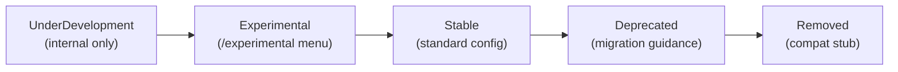
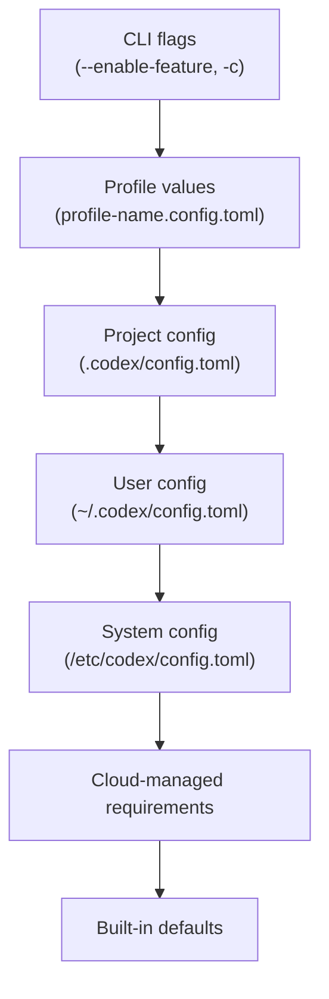

# Codex CLI Feature Flags in v0.135: Maturity Stages, the `codex features` Subcommand, and Every Flag That Matters


---

Codex CLI v0.135 ships with seventeen documented feature flags spanning five maturity stages. Most developers never look beyond the default settings, yet these flags control everything from shell execution strategy and network proxying to multi-agent orchestration and operation-level undo. This article provides the definitive reference for the feature flag system as of the May 2026 stable release: the management subcommand, the lifecycle model, every current flag, and the configuration patterns that matter for production use.

## The `codex features` Subcommand

Three subcommands manage feature flags from the terminal[^1]:

```bash
# List every known flag with its maturity stage and current state
codex features list

# Persistently enable a flag in ~/.codex/config.toml
codex features enable undo

# Persistently disable a flag
codex features disable shell_snapshot
```

When launched with `--profile`, the enable and disable commands write to the profile-specific configuration file (`$CODEX_HOME/<profile-name>.config.toml`) rather than the base user config[^1]. This makes profile-scoped feature toggles straightforward — enable `prevent_idle_sleep` in your `long-running` profile without affecting interactive sessions.

### Session-Scoped Overrides

For one-off testing, pass flags inline without touching any configuration file[^2]:

```bash
codex --enable-feature undo --disable-feature shell_snapshot "Refactor the auth module"
```

Or use the generic config override syntax:

```bash
codex -c features.undo=true -c features.shell_snapshot=false "Refactor the auth module"
```

### The `/experimental` Menu

Inside the TUI, typing `/experimental` and pressing Enter opens an interactive toggle menu for flags at the `Experimental` stage[^3]. Each entry shows a display name and a one-line description. Some flags display an announcement message on first toggle. This is the quickest way to discover and trial new capabilities without leaving a session.

## Feature Lifecycle Stages

Every flag progresses through a defined lifecycle[^4]. Understanding the stages prevents surprises when a flag you relied on disappears or changes defaults.



| Stage | Visible To | Default | Behaviour |
|---|---|---|---|
| **UnderDevelopment** | Internal only | `false` | Emits an `unstable_features_warning_event` if enabled[^4] |
| **Experimental** | `/experimental` menu | `false` | Surfaced for opt-in testing; may change between releases |
| **Stable** | Standard `[features]` config | Varies | Production-ready; flag kept for ad-hoc toggling |
| **Deprecated** | Standard config | `false` | Scheduled for removal; migration guidance provided |
| **Removed** | Config compatibility only | `false` | Stub kept so existing `config.toml` files do not error on parse |

The distinction matters: an `Experimental` flag can change semantics or be withdrawn between point releases. A `Stable` flag has a committed API surface — OpenAI will not remove it without a deprecation cycle.

## The Complete Flag Registry (v0.135)

The following table reflects the official configuration reference as of v0.135.0[^5][^6].

### Stable Flags (Production-Ready)

| Flag | Default | Description |
|---|---|---|
| `shell_tool` | `true` | Enables the default `shell` tool for running commands. Disabling it removes command execution entirely[^5]. |
| `unified_exec` | `true` (macOS/Linux), `false` (Windows) | Routes all shell commands through a PTY session rather than a plain subprocess. Captures richer output including colour codes and interactive prompts[^5][^7]. |
| `shell_snapshot` | `true` | Snapshots the shell environment to speed up repeated commands. Saves roughly 200ms per invocation on warm sessions[^5]. |
| `multi_agent` | `true` | Enables multi-agent collaboration tools: `spawn_agent`, `send_input`, `resume_agent`, `wait_agent`, and `close_agent`[^5]. |
| `personality` | `true` | Enables personality selection controls. Accepts values `none`, `friendly`, or `pragmatic` via the top-level `personality` key[^5][^8]. |
| `fast_mode` | `true` | Enables model-catalogue service tier selection in the TUI, including Fast-tier commands when available[^5]. |
| `enable_request_compression` | `true` | Compresses streaming request bodies with zstd when the server supports it. Reduces upload bandwidth on verbose sessions[^5]. |
| `skill_mcp_dependency_install` | `true` | Allows prompting and installing missing MCP dependencies for skills automatically[^5]. |
| `undo` | `false` | Enables the `/undo` slash command for operation-level rollback of file changes[^5][^9]. Off by default because rollback interacts with conversation context in ways that can confuse the agent. |
| `codex_git_commit` | `false` | Enables automatic Git commits with co-author attribution via the `commit_attribution` setting[^5]. |
| `hooks` | `false` | Enables lifecycle hooks loaded from `hooks.json` or inline `[hooks]` config. Legacy alias: `codex_hooks`[^5]. |
| `memories` | `false` | Enables the built-in two-phase memory extraction pipeline. Requires a separate `[memories]` configuration block[^5][^10]. |

### Experimental Flags (Opt-In Testing)

| Flag | Default | Description |
|---|---|---|
| `apps` | `false` | Enables ChatGPT Apps/connectors support. Allows `$` mentions of registered apps in the composer[^5]. |
| `prevent_idle_sleep` | `false` | Prevents the machine from sleeping while a turn is actively running. Useful for long-horizon goal-mode sessions on laptops[^5]. |
| `network_proxy` | `false` | Configures domain permissions and proxy modes. Accepts a boolean or a structured table with `domains`, `proxy_url`, `socks_url`, and access policies[^5][^11]. |

### Deprecated and Removed Flags

| Flag | Status | Migration |
|---|---|---|
| `web_search` (feature) | Deprecated | Use the top-level `web_search` setting instead (`"cached"`, `"live"`, or `"disabled"`)[^5]. |
| `apply_patch_freeform` | Removed | Stub kept for config compatibility[^4]. |
| `use_legacy_landlock` | Deprecated | Linux sandbox fallback; superseded by the current Landlock implementation[^4]. |

## Network Proxy: The Structured Feature Flag

Most flags are simple booleans. `network_proxy` is the exception — it accepts a full TOML table when granular control is needed[^11]:

```toml
[features.network_proxy]
enabled = true
proxy_url = "http://127.0.0.1:3128"
socks_url = "http://127.0.0.1:8081"
enable_socks5 = true
allow_local_binding = false

[features.network_proxy.domains]
allow = ["api.openai.com", "*.github.com", "registry.npmjs.org"]
deny = ["*"]
```

This configuration creates a sandboxed network layer where only explicitly allowed domains are reachable. The deny-all-then-allow pattern is the recommended starting point for sensitive environments[^11]. Per-domain rules support exact hosts, subdomain wildcards (`*.example.com`), and broad wildcards.

## Cloud-Managed Feature Requirements

Enterprise deployments can enforce feature states regardless of user preference using `FeatureRequirementsToml`[^4][^12]. When an organisation distributes a managed `requirements.toml`, it pins specific flags:

```toml
# Organisation-managed requirements
[features]
hooks = true           # Enforce lifecycle hooks for audit trails
memories = false       # Disable local memory extraction for data residency
unified_exec = true    # Standardise execution model across the fleet
```

Managed requirements take precedence over both user configuration and command-line overrides. The `Constrained<T>` wrapper type tracks which settings are pinned versus overridable, ensuring compliance without disabling individual configuration entirely[^4].

## Configuration Precedence

Feature flags follow the same precedence chain as all Codex configuration[^13]:



One subtlety: cloud-managed requirements sit *below* the user config in the merge order but *above* it in enforcement. A pinned requirement cannot be overridden by any layer above it[^4]. This means CLI flags override user config for normal settings, but cannot override managed requirements.

## Practical Recommendations

### Three Flags Worth Reviewing

Based on the current stable set, three flags deserve explicit consideration in any production setup[^7]:

1. **`unified_exec`** — already on by default on macOS and Linux. If you encounter edge cases with PTY-based execution (some CI environments strip TTY allocation), disable it per profile rather than globally.

2. **`undo`** — stable but off by default. Enable it in interactive profiles where you are experimenting with large refactors. The operation-level rollback reverses all file changes from the most recent turn as a single unit[^9]. Keep it disabled in `codex exec` automation where undo semantics add complexity without benefit.

3. **`memories`** — off by default. Enable it once you have been using Codex CLI for at least a week. The two-phase extraction pipeline converts session transcripts into persistent local recall, reducing repetitive instructions across sessions[^10]. Requires a `[memories]` block in your config.

### Profile-Scoped Feature Configuration

Use profiles to maintain different feature sets for different workflows:

```toml
# ~/.codex/config.toml — base config
[features]
unified_exec = true
shell_snapshot = true

# ~/.codex/long-running.config.toml — goal-mode sessions
[features]
prevent_idle_sleep = true
memories = true
undo = true

# ~/.codex/ci.config.toml — non-interactive automation
[features]
unified_exec = false
hooks = true
memories = false
```

Switch profiles at launch:

```bash
codex --profile long-running "Implement the payment gateway"
codex exec --profile ci "Run the full test suite and report failures"
```

### Discovering New Flags

Feature flags evolve between releases. After updating Codex CLI, run `codex features list` to check for new entries. Flags that have moved from `Experimental` to `Stable` may have changed defaults. The `/experimental` menu in the TUI only shows `Experimental` stage flags — stable flags must be configured directly[^3].

## Dependency Resolution Between Flags

Some flags have implicit dependencies. The normalisation step during configuration loading resolves these automatically[^4]. For example, enabling certain code execution modes automatically requires `shell_tool`. If you disable `shell_tool` while depending on a flag that requires it, the dependent flag is silently disabled at runtime.

The practical implication: if a feature you enabled does not appear active, check `codex features list` for the resolved state. The effective value may differ from what you wrote in `config.toml` due to dependency resolution or managed requirements.

## Looking Ahead

The feature flag system is Codex CLI's mechanism for shipping capabilities incrementally without destabilising production workflows. Three patterns are visible in the current registry:

- **Stable-but-off flags** (undo, memories, hooks, codex_git_commit) represent capabilities that are production-ready but change workflow assumptions enough to warrant opt-in.
- **Experimental flags** (apps, prevent_idle_sleep, network_proxy) are testing surface area for upcoming features.
- **Deprecated flags** signal migration paths — check `codex features list` after each update to catch deprecation warnings early.

The `codex features` subcommand, combined with profile-scoped configuration and cloud-managed requirements, gives teams precise control over which capabilities are active in which context — from exploratory interactive sessions to locked-down CI pipelines.

## Citations

[^1]: [Command line options – Codex CLI | OpenAI Developers](https://developers.openai.com/codex/cli/reference) — `codex features` subcommand documentation.
[^2]: [Codex CLI Feature Flags and TUI Tuning | Codex Knowledge Base](https://codex.danielvaughan.com/2026/03/28/codex-cli-feature-flags-tui-tuning/) — Session-scoped feature flag overrides.
[^3]: [Features – Codex CLI | OpenAI Developers](https://developers.openai.com/codex/cli/features) — Feature flags and `/experimental` menu.
[^4]: [Feature Flags and Stages | openai/codex | DeepWiki](https://deepwiki.com/openai/codex/2.3-feature-flags-and-stages) — Internal architecture: `Feature` enum, `Stage` lifecycle, dependency resolution, `FeatureRequirementsToml`, `Constrained<T>`.
[^5]: [Configuration Reference – Codex | OpenAI Developers](https://developers.openai.com/codex/config-reference) — Official `[features]` key reference for v0.135.
[^6]: [Releases – openai/codex | GitHub](https://github.com/openai/codex/releases) — v0.135.0 release notes (May 28, 2026).
[^7]: [Codex CLI exec mode experiments | GitHub Gist](https://gist.github.com/alexfazio/359c17d84cb6a5af12bac88fa1db9770) — Community testing of 81 flag/feature combinations.
[^8]: [Sample Configuration – Codex | OpenAI Developers](https://developers.openai.com/codex/config-sample) — Personality values: `none`, `friendly`, `pragmatic`.
[^9]: [Feature request: bring back Undo/Redo for Codex-applied file changes · Issue #16784 · openai/codex](https://github.com/openai/codex/issues/16784) — Undo system discussion and operation-level rollback semantics.
[^10]: [Codex Built-In Memory Deep Dive | Codex Knowledge Base](https://codex.danielvaughan.com/2026/04/18/codex-built-in-memory-system-deep-dive/) — Two-phase memory extraction pipeline architecture.
[^11]: [Config basics – Codex | OpenAI Developers](https://developers.openai.com/codex/config-basic) — Network proxy structured configuration.
[^12]: [Codex CLI Enterprise Admin Setup | Codex Knowledge Base](https://codex.danielvaughan.com/2026/05/19/codex-cli-enterprise-admin-setup-rbac-managed-configuration-compliance-apis/) — Managed configuration and requirements enforcement.
[^13]: [Codex CLI Configuration Complete Guide | Codex Knowledge Base](https://codex.danielvaughan.com/2026/04/16/codex-cli-configuration-complete-guide-hierarchy-profiles-trust/) — Configuration precedence chain.
