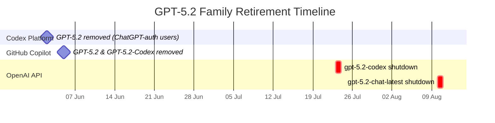
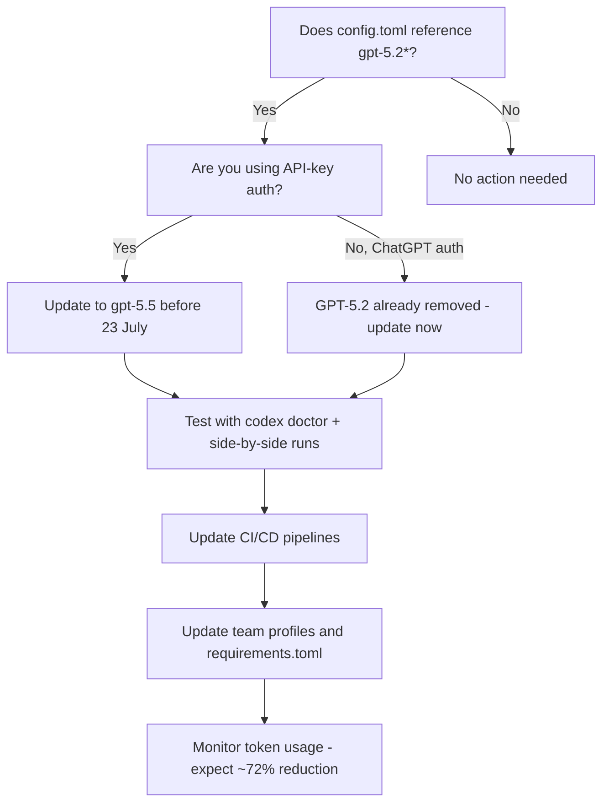

# The June–July 2026 Model Sunset: Migrating from GPT-5.2 and GPT-5.2-Codex in Your Codex CLI Workflows


---

OpenAI's fleet simplification continues. GPT-5.2 was retired from the Codex web platform on 2 June 2026[^1], GitHub Copilot drops it on 5 June[^2], and the API shutdown follows on 23 July for `gpt-5.2-codex` and 10 August for `gpt-5.2-chat-latest`[^3]. If your `config.toml`, CI pipelines, or team profiles still reference these model identifiers, you have weeks — not months — to migrate.

This article is a practical checklist for Codex CLI users who need to audit, test, and cut over before the shutdowns bite.

## What Is Being Retired and When

The retirement rolls out across three surfaces on different dates:



| Model ID | Deprecated | API Shutdown | Replacement |
|---|---|---|---|
| `gpt-5.2` | 8 May 2026 | 10 Aug 2026 | `gpt-5.5` |
| `gpt-5.2-chat-latest` | 8 May 2026 | 10 Aug 2026 | `gpt-5.5` |
| `gpt-5.2-codex` | 8 May 2026 | 23 Jul 2026 | `gpt-5.5` |
| `gpt-5.3-chat-latest` | 8 May 2026 | 10 Aug 2026 | `gpt-5.5` |

*Sources: OpenAI API deprecations page[^3], GitHub Changelog[^2], OpenAI Codex platform announcement[^1].*

Three important caveats:

1. **ChatGPT-auth CLI users** lost access to GPT-5.2 in the TUI model selector on 2 June. If you authenticate via `codex login` with a ChatGPT account, the model is already gone[^1].
2. **API-key users** retain access until the API shutdown dates above. Pipelines using `OPENAI_API_KEY` will keep working — but the clock is ticking[^3].
3. **GPT-5.3-Codex-Spark is not affected** — it remains available and is not part of this retirement phase[^1].

## Why GPT-5.2 Is Going Away

OpenAI cited fleet simplification: GPT-5.2 accounts for less than 1% of production usage, and maintaining older models in the active compute fleet carries overhead[^1]. With GPT-5.5 scoring 73.1% on Expert-SWE versus GPT-5.2's lower baseline, and using 72% fewer output tokens on equivalent tasks[^4], the case for keeping the older model no longer holds.

## Step 1: Audit Your Configuration

### Find Hardcoded Model References

Every Codex CLI configuration surface can pin a model. Check them all:

```bash
# User-level config
grep -n 'gpt-5\.[23]' ~/.codex/config.toml 2>/dev/null

# Project-level config (trusted repos)
find . -path '*/.codex/config.toml' -exec grep -ln 'gpt-5\.[23]' {} +

# Named profiles
find "${CODEX_HOME:-$HOME/.codex}" -name '*.config.toml' \
  -exec grep -ln 'gpt-5\.[23]' {} +

# AGENTS.md files (some teams embed model hints)
grep -rn 'gpt-5\.[23]' . --include='AGENTS.md' --include='AGENTS.override.md'
```

### Check CI/CD Pipelines

If your pipelines use `codex exec` with an explicit `--model` flag, those invocations will break after the API shutdown:

```bash
# GitHub Actions workflows
grep -rn 'gpt-5\.[23]' .github/workflows/ 2>/dev/null

# GitLab CI
grep -n 'gpt-5\.[23]' .gitlab-ci.yml 2>/dev/null

# Makefiles and shell scripts
grep -rn 'gpt-5\.[23]' scripts/ Makefile 2>/dev/null
```

### Check Environment Variables

Some teams set `CODEX_MODEL` or pass model IDs through environment variables:

```bash
env | grep -i 'model.*gpt-5\.[23]'
grep -rn 'CODEX_MODEL.*gpt-5\.[23]' .env* docker-compose*.yml 2>/dev/null
```

## Step 2: Choose Your Replacement

The model landscape as of June 2026 offers several migration paths[^5]:

| Use Case | Recommended Model | Rationale |
|---|---|---|
| General development | `gpt-5.5` | Default; best Expert-SWE score (73.1%); 72% fewer output tokens[^4] |
| Budget-conscious teams | `gpt-5.4-mini` | Optimised for responsive coding and subagents[^5] |
| Deep reasoning tasks | `gpt-5.4` | Strong reasoning + tool use; absorbed GPT-5.3-Codex capabilities[^6] |
| Near-instant iteration | `gpt-5.3-codex-spark` | Text-only; fastest latency; ChatGPT Pro only[^5] |

For most teams, `gpt-5.5` is the straightforward replacement. It is the current default for new Codex CLI installations[^5] and handles the broadest range of tasks.

## Step 3: Update config.toml

### Simple Migration

Replace the model identifier in your user-level configuration:

```toml
# ~/.codex/config.toml

# Before
model = "gpt-5.2"

# After
model = "gpt-5.5"
```

### Profile-Based Migration

If your team uses named profiles, update each one. This is the recommended approach for gradual rollout — you can migrate one profile at a time and compare results[^7]:

```toml
# ~/.codex/config.toml

[profiles.fast]
model = "gpt-5.4-mini"
model_reasoning_effort = "medium"

[profiles.deep]
model = "gpt-5.5"
model_reasoning_effort = "xhigh"

[profiles.ci]
model = "gpt-5.5"
model_reasoning_effort = "medium"
```

Switch profiles with `--profile`:

```bash
codex --profile ci exec "Run the test suite and fix failures"
```

### Avoid Pinning chat-latest Pointers

The `-chat-latest` model pointers (`gpt-5.2-chat-latest`, `gpt-5.3-chat-latest`) are snapshot aliases that do not auto-advance to newer models[^3]. They are being retired alongside the base models. Prefer unversioned model names like `gpt-5.5` which will receive updates:

```toml
# Avoid
model = "gpt-5.2-chat-latest"

# Prefer
model = "gpt-5.5"
```

## Step 4: Test Before Cutting Over

### Verify Model Availability

Check which models your account can access:

```bash
codex models
```

If you are authenticated via a ChatGPT account, GPT-5.2 will no longer appear in the list as of 2 June[^1].

### Run a Side-by-Side Comparison

Use profiles to run the same task with both old and new models, then compare:

```bash
# Run with the old model (API-key users only, until shutdown)
codex --profile old exec "Refactor the authentication module" \
  --json -o /tmp/result-old.jsonl

# Run with the new model
codex --profile new exec "Refactor the authentication module" \
  --json -o /tmp/result-new.jsonl
```

### Check Reasoning Effort Tuning

GPT-5.5 supports the full range of reasoning effort levels[^5]. If you were using GPT-5.2 at high reasoning effort, you may find that `medium` on GPT-5.5 delivers comparable quality at lower cost and latency:

```toml
model = "gpt-5.5"
model_reasoning_effort = "medium"  # often sufficient for interactive work
```

Reserve `xhigh` for tasks that would "eat an afternoon of senior developer time"[^8].

## Step 5: Update CI/CD Pipelines

### GitHub Actions with codex-action

Update the model parameter in your workflow files:


```yaml
# .github/workflows/codex-review.yml
- uses: openai/codex-action@v1
  with:
    model: "gpt-5.5"
    codex_args: "--approval-mode auto-edit"
  env:
    OPENAI_API_KEY: ${{ secrets.OPENAI_API_KEY }}
```


### Non-Interactive Scripts

For `codex exec` invocations, update the `--model` flag or remove it to inherit the default:

```bash
# Before
codex exec --model gpt-5.2-codex "Generate the changelog" -o changelog.md

# After (explicit)
codex exec --model gpt-5.5 "Generate the changelog" -o changelog.md

# After (inherit default from config.toml)
codex exec "Generate the changelog" -o changelog.md
```

### Validate with codex doctor

After updating configuration, run diagnostics to confirm the setup is coherent:

```bash
codex doctor --summary
```

The output should show your new model in the configuration section without warnings about deprecated model identifiers[^9].

## Step 6: Enterprise Considerations

### Managed Configuration (requirements.toml)

Enterprise administrators using cloud-managed `FeatureRequirementsToml` should update the enforced model list to exclude GPT-5.2 variants. Teams inheriting configuration from the organisation layer will automatically pick up the change[^7].

### Azure OpenAI and Amazon Bedrock Users

If your `model_providers` table routes through Azure OpenAI or Amazon Bedrock, check the provider's own deprecation schedule. Azure follows a separate timeline managed through the Foundry lifecycle policy[^10]. Bedrock availability depends on the Mantle Responses API model catalogue and may not mirror OpenAI's direct schedule.

### GitHub Copilot Overlap

Teams using both Codex CLI and GitHub Copilot should note that GPT-5.3-Codex became the default for Copilot Business and Enterprise on 17 May 2026[^11]. Copilot Enterprise administrators need to enable alternative models through their Copilot settings before 5 June[^2].

## Migration Decision Flowchart



## Key Dates to Remember

- **2 June 2026**: GPT-5.2 removed from Codex platform (ChatGPT-auth users)[^1]
- **5 June 2026**: GPT-5.2 and GPT-5.2-Codex removed from GitHub Copilot[^2]
- **23 July 2026**: `gpt-5.2-codex` API shutdown[^3]
- **10 August 2026**: `gpt-5.2-chat-latest` and `gpt-5.3-chat-latest` API shutdown[^3]

The migration is straightforward for most teams: replace `gpt-5.2` with `gpt-5.5` in your `config.toml` and CI scripts, verify with `codex doctor`, and enjoy the 72% output token reduction. The only real risk is doing nothing and discovering your pipelines have broken on a Monday morning.

---

## Citations

[^1]: OpenAI, "Retiring GPT-5.2 and GPT-5.3-Codex from Codex," OpenAI Platform Announcement, June 2026. [https://www.kucoin.com/news/flash/openai-to-discontinue-gpt-5-2-and-gpt-5-3-codex-in-codex-on-june-2](https://www.kucoin.com/news/flash/openai-to-discontinue-gpt-5-2-and-gpt-5-3-codex-in-codex-on-june-2)

[^2]: GitHub, "Upcoming deprecation of GPT-5.2 and GPT-5.2-Codex," GitHub Changelog, 1 May 2026 (updated 29 May 2026). [https://github.blog/changelog/2026-05-01-upcoming-deprecation-of-gpt-5-2-and-gpt-5-2-codex/](https://github.blog/changelog/2026-05-01-upcoming-deprecation-of-gpt-5-2-and-gpt-5-2-codex/)

[^3]: OpenAI, "API Deprecations," OpenAI Developers Documentation, accessed 1 June 2026. [https://developers.openai.com/api/docs/deprecations](https://developers.openai.com/api/docs/deprecations)

[^4]: OpenAI, "Introducing GPT-5.5," OpenAI Blog, 23 April 2026. [https://openai.com/index/introducing-gpt-5-5/](https://openai.com/index/introducing-gpt-5-5/)

[^5]: OpenAI, "Models — Codex," OpenAI Developers Documentation, accessed 1 June 2026. [https://developers.openai.com/codex/models](https://developers.openai.com/codex/models)

[^6]: NxCode, "GPT 5.4 Complete Guide 2026: Features, Pricing, Benchmarks & How to Use," NxCode, 2026. [https://www.nxcode.io/resources/news/gpt-5-4-complete-guide-features-pricing-models-2026](https://www.nxcode.io/resources/news/gpt-5-4-complete-guide-features-pricing-models-2026)

[^7]: OpenAI, "Advanced Configuration — Codex," OpenAI Developers Documentation, accessed 1 June 2026. [https://developers.openai.com/codex/config-advanced](https://developers.openai.com/codex/config-advanced)

[^8]: OpenAI, "Codex Prompting Guide," OpenAI Cookbook, 2026. [https://developers.openai.com/cookbook/examples/gpt-5/codex_prompting_guide](https://developers.openai.com/cookbook/examples/gpt-5/codex_prompting_guide)

[^9]: OpenAI, "Codex CLI Changelog — v0.135.0," OpenAI Developers, 28 May 2026. [https://developers.openai.com/codex/changelog](https://developers.openai.com/codex/changelog)

[^10]: Microsoft, "Azure OpenAI in Microsoft Foundry Model Retirements," Microsoft Learn, 2026. [https://learn.microsoft.com/en-us/azure/foundry/openai/concepts/model-retirements](https://learn.microsoft.com/en-us/azure/foundry/openai/concepts/model-retirements)

[^11]: GitHub, "GPT-5.3-Codex is now the base model for Copilot Business and Enterprise," GitHub Changelog, 17 May 2026. [https://github.blog/changelog/2026-05-17-gpt-5-3-codex-is-now-the-base-model-for-copilot-business-and-enterprise/](https://github.blog/changelog/2026-05-17-gpt-5-3-codex-is-now-the-base-model-for-copilot-business-and-enterprise/)
