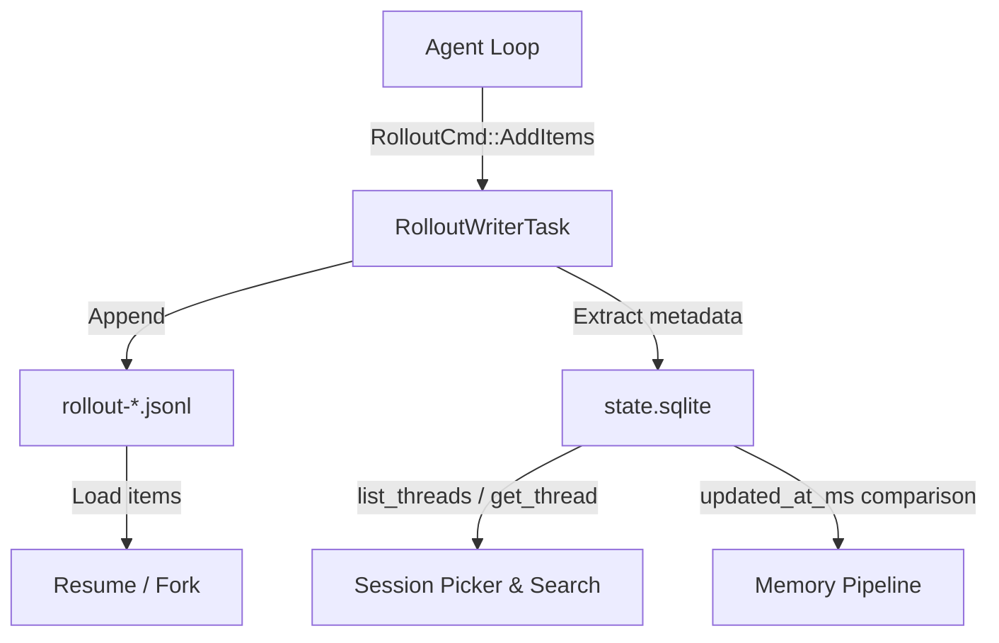

# Codex CLI Session History: Local Search, Rollout Format, and Knowledge Mining


---

Every prompt you send and every tool call Codex executes is persisted locally. Since v0.134, that archive is searchable. This article dissects the session storage architecture, the rollout JSONL format, the new content-matching search, and practical patterns for mining months of agent interactions into reusable knowledge.

## Session Storage Architecture

Codex CLI persists sessions in two complementary layers: append-only JSONL rollout files for durability and a SQLite metadata index for fast queries[^1][^2].

### The Filesystem Layer

Rollout files live under a date-partitioned hierarchy:

```
~/.codex/sessions/
└── 2026/
    └── 06/
        └── 01/
            ├── rollout-2026-06-01T09-15-22-a1b2c3d4.jsonl
            └── rollout-2026-06-01T14-30-00-e5f6g7h8.jsonl
```

Each file is a complete, self-contained transcript: your prompts, model responses, tool invocations, tool outputs, and token counts, one JSON object per line[^1]. Files are named with an ISO 8601 timestamp and a UUID fragment, making them trivially sortable.

### The SQLite Layer

A `state.sqlite` database sits alongside the rollout files as the query layer. The `apply_rollout_item` function extracts searchable attributes into a `ThreadMetadata` record[^2]:

- **Title** — derived from the first user message
- **Token usage** — updated from `TokenCount` events
- **Git context** — SHA, branch, and origin URL captured from `SessionMeta`
- **Timestamps** — `created_at_ms` and `updated_at_ms` for recency filtering

On startup, a backfill operation scans rollout files to reconcile any drift between filesystem and index[^2].



## The Rollout JSONL Format

Each line in a rollout file follows a consistent envelope[^3]:

```json
{"timestamp":"2026-06-01T09:15:22.431Z","type":"session_meta","payload":{"session_id":"a1b2c3d4","cwd":"/home/dev/project","model_provider":"openai","cli_version":"0.135.0"}}
```

Three fields are always present: `timestamp` (ISO 8601 UTC), `type` (the event category), and `payload` (event-specific data)[^3].

### Event Types

| Type | Purpose |
|------|---------|
| `session_meta` | Session ID, working directory, model provider, CLI version |
| `turn_context` | Model selection, approval policy, sandbox configuration per turn |
| `response_item` | Model responses: messages, function calls, function call outputs |
| `event_msg` | Protocol events: `user_message`, `agent_message`, `token_count`, `task_started`, `task_complete`, `turn_complete` |
| `compacted` | Summary items produced by `/compact` |

Tool invocations use **call-ID pairing** rather than nesting — a `function_call` line and its matching `function_call_output` share a `call_id` value across separate lines[^3]:

```json
{"timestamp":"...","type":"response_item","payload":{"type":"function_call","name":"exec_command","arguments":"{\"command\":\"cargo test\"}","call_id":"call_9x8y7z"}}
{"timestamp":"...","type":"response_item","payload":{"type":"function_call_output","call_id":"call_9x8y7z","output":"test result: ok. 42 passed; 0 failed"}}
```

### Persistence Filtering

Not everything reaches disk. An `EventPersistenceMode` controls what is recorded[^2]:

- **Limited** (default) — essential conversation markers: `UserMessage`, `AgentMessage`, `TokenCount`, `TurnComplete`
- **Extended** — adds diagnostic data: command execution endpoints, error events, MCP tool completion signals

Execution outputs in `ExecCommandEnd` events are truncated to 10,000 bytes to prevent runaway log growth[^2].

### Background Recording

The `RolloutRecorder` manages asynchronous writes via a background `RolloutWriterTask`, ensuring the agent loop is never blocked by I/O. Communication flows through a `RolloutCmd` channel supporting `AddItems`, `Persist` (forced flush with acknowledgement), `Flush`, and `Shutdown`[^2].

## Searching Session History

### Built-in Search (v0.134+)

CLI v0.134 introduced search across local conversation history with case-insensitive content matching and result previews[^4]. The search queries the SQLite index, returning matching threads with snippets of the relevant content. Within the TUI, `Ctrl+R` triggers reverse prompt history search from the composer[^5].

The `StateRuntime` exposes `list_threads` with filtering and pagination, making programmatic access straightforward for scripts and extensions[^2].

### Resume and Fork

Two commands turn search results into action[^6]:

```bash
# Interactive picker of recent sessions
codex resume

# Skip the picker; jump to the most recent session in this directory
codex resume --last

# Include sessions from other directories
codex resume --all

# Fork a session into a new thread, preserving the original
codex fork --last
```

`codex fork` is particularly useful when you want to branch an investigation without contaminating the original transcript — the forked thread inherits the full history but diverges from that point[^6].

When resuming, the system loads rollout items, restores `SessionMeta` and `TurnContext` to recover the agent's prior working directory, model, and sandbox policy, and emits warnings if the current model configuration differs from the stored one[^2].

### The /resume Slash Command

Within an active session, `/resume` opens the session picker without exiting Codex. This allows mid-session context switches — select a previous thread to continue, and the current session's state is preserved for later[^5].

## Third-Party Search: cass

For developers who use multiple coding agents, **cass** (coding-agent-session-search) aggregates session histories from 11+ providers — including Codex, Claude Code, Gemini CLI, Cursor, Aider, and Copilot — into a single searchable index[^7].

Key capabilities:

- **Sub-60ms full-text search** via edge n-gram indexing with correct handling of `snake_case` and code symbols
- **Three search modes**: lexical (BM25), semantic (local vector embeddings via MiniLM or Snowflake Arctic), and hybrid (Reciprocal Rank Fusion)
- **Interactive TUI** with three-pane layout, filter pills, and syntax-highlighted previews
- **Agent-friendly output** via `--robot` and `--json` flags for integration into automated workflows

```bash
# Install via Homebrew (macOS/Linux)
brew install dicklesworthstone/tap/cass

# Or via shell installer
curl -fsSL https://raw.githubusercontent.com/Dicklesworthstone/coding_agent_session_search/main/install.sh | bash

# Index all local sessions
cass index

# Search across all providers
cass search "database migration rollback strategy"

# Codex-only search with JSON output for scripting
cass search --provider codex --json "terraform state lock"
```

All processing remains local — no network dependency at query time[^7].

## Knowledge Mining Patterns

### Pattern 1: Extracting Reusable Commands

Rollout files contain every command Codex executed. A simple `jq` pipeline extracts a deduplicated command history:

```bash
cat ~/.codex/sessions/2026/06/01/rollout-*.jsonl \
  | jq -r 'select(.type == "response_item" and .payload.type == "function_call" and .payload.name == "exec_command") | .payload.arguments' \
  | jq -r '.command' \
  | sort -u
```

### Pattern 2: Building a Project Decision Log

Agent reasoning captured in `agent_message` events often contains architectural decisions and trade-off analysis. Extract these into a decision log:

```bash
cat ~/.codex/sessions/2026/05/*/rollout-*.jsonl \
  | jq -r 'select(.type == "event_msg" and .payload.type == "agent_message") | "\(.timestamp) | \(.payload.message)"' \
  > decisions-may-2026.txt
```

### Pattern 3: Token Usage Auditing

Track token consumption across sessions for cost management:

```bash
cat ~/.codex/sessions/2026/06/*/rollout-*.jsonl \
  | jq -s '[.[] | select(.type == "event_msg" and .payload.type == "token_count") | .payload] | {total_input: (map(.input // 0) | add), total_output: (map(.output // 0) | add)}'
```

### Pattern 4: The Memory Pipeline

Codex's own memory system builds on the rollout archive. The `StateRuntime` identifies threads needing memory extraction by comparing `updated_at_ms` against existing stage-1 outputs, enabling selective reprocessing for semantic indexing[^2]. This means your session history is not merely an archive — it feeds back into the agent's contextual awareness across future sessions.

## Session Hygiene

A few practices keep session history useful rather than overwhelming:

1. **One task per session** — use `/new` when switching contexts rather than mixing unrelated work in a single thread[^5]
2. **Use `/compact` proactively** — when a conversation exceeds 50–60 turns, compact the history to free tokens while preserving a summary. Codex can run for up to seven hours by automatically compacting when hitting context limits[^5]
3. **Prune aggressively** — rollout files are plain text; archive or delete old sessions with standard Unix tools. Compressed `.jsonl.zst` files reduce storage for long-term retention
4. **Leverage `codex fork`** — when a promising investigation emerges mid-session, fork rather than continuing in the same thread. This preserves a clean decision boundary in your history

## Conclusion

Session history in Codex CLI is not an afterthought — it is a structured, queryable, machine-readable archive of every interaction. The v0.134 search feature makes finding past work trivial, the rollout format makes programmatic extraction straightforward, and tools like `cass` extend searchability across your entire agent toolchain. Treat your `~/.codex/sessions/` directory as institutional memory, not disposable logs.

## Citations

[^1]: [Codex CLI Resume, Continue, and Save Chat Explained — Verdent Guides](https://www.verdent.ai/guides/codex-cli-resume-continue-save-chat)
[^2]: [Rollout Persistence and Replay — DeepWiki openai/codex](https://deepwiki.com/openai/codex/3.5.2-rollout-persistence-and-replay)
[^3]: [Reverse Engineering Codex CLI Rollout Traces — DEV Community](https://dev.to/milkoor/reverse-engineering-codex-cli-rollout-traces-3b9b)
[^4]: [OpenAI Codex Release Notes: Codex CLI 0.134.0 — The Forge](https://hammerautomation.ai/en/forge/openai-codex-release-notes-2026-05-27)
[^5]: [Features — Codex CLI | OpenAI Developers](https://developers.openai.com/codex/cli/features)
[^6]: [Command Line Options — Codex CLI | OpenAI Developers](https://developers.openai.com/codex/cli/reference)
[^7]: [coding_agent_session_search (cass) — GitHub](https://github.com/Dicklesworthstone/coding_agent_session_search)
