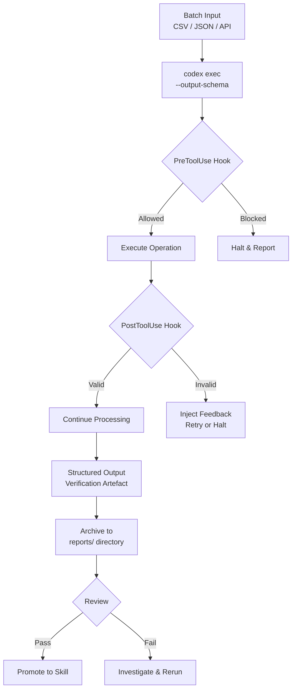

# Codex CLI for Verified Operations: Building Repeatable, Auditable Batch Workflows


---

Most writing about Codex CLI focuses on code generation and refactoring. But a growing number of teams are using `codex exec` for something quite different: **operational workflows** — batch user provisioning, quota changes, migration follow-ups, and infrastructure runbooks where the output must be verifiable and auditable. OpenAI now documents this pattern officially as "verified operations"[^1].

This article covers how to build verified operation workflows with Codex CLI v0.135, combining `codex exec`, `--output-schema`, PostToolUse hooks, and skills into a pipeline where every run produces structured evidence of what happened.

## What Are Verified Operations?

A verified operation is a repeatable workflow where Codex:

1. **Normalises inputs** — inspects a batch (CSV, JSON, API response), requests only missing required fields, and standardises dates, identifiers, and amounts before execution[^1].
2. **Executes with controlled scope** — runs dry runs where supported, records success or failure per item, retries transient failures once, and pauses before irreversible actions[^1].
3. **Produces verification artefacts** — generates a structured report (CSV, JSON, log file) that proves what was done, what succeeded, and what failed[^1].

The key distinction from ad-hoc prompting is that **the output is the proof**. A human reviewer (or a downstream automation) can inspect the artefact without re-running the operation.

## The Execution Surface: `codex exec`

The `codex exec` subcommand is purpose-built for this pattern. It runs without the interactive TUI, streams progress to stderr, and delivers the final agent message to stdout[^2]. Critical flags for verified operations:

```bash
# Basic verified operation
codex exec \
  --sandbox workspace-write \
  --output-schema ./schemas/batch-result.json \
  -o ./reports/run-$(date +%Y%m%d-%H%M%S).json \
  "Process the user provisioning batch in ./batches/2026-06-01.csv"
```

| Flag | Purpose |
|------|---------|
| `--sandbox workspace-write` | Permits file edits within the working directory[^2] |
| `--output-schema <path>` | Enforces structured JSON output conforming to a schema[^2] |
| `-o, --output-last-message <path>` | Writes the final message to a file for archival[^2] |
| `--json` | Emits JSONL event stream for full execution tracing[^2] |
| `--ephemeral` | Prevents session persistence — suitable for stateless CI runs[^2] |

### Piping Context In

The prompt-plus-stdin pattern feeds operational data directly into Codex:

```bash
cat ./batches/pending-quota-changes.csv | \
  codex exec \
    --sandbox workspace-write \
    --output-schema ./schemas/quota-result.json \
    "Apply each quota change in the piped CSV. Record one row per change with status and timestamp."
```

When both a prompt argument and stdin are present, the argument becomes the instruction and the piped content serves as context[^2].

## Structured Output Schemas

The `--output-schema` flag is what makes verified operations machine-parseable. Define a JSON Schema that captures the shape of your verification artefact:

```json
{
  "$schema": "https://json-schema.org/draft/2020-12/schema",
  "type": "object",
  "properties": {
    "operation": { "type": "string" },
    "timestamp": { "type": "string", "format": "date-time" },
    "total_items": { "type": "integer" },
    "succeeded": { "type": "integer" },
    "failed": { "type": "integer" },
    "skipped": { "type": "integer" },
    "results": {
      "type": "array",
      "items": {
        "type": "object",
        "properties": {
          "item_id": { "type": "string" },
          "status": { "enum": ["success", "failure", "skipped"] },
          "message": { "type": "string" },
          "retried": { "type": "boolean" }
        },
        "required": ["item_id", "status"]
      }
    },
    "dry_run": { "type": "boolean" }
  },
  "required": ["operation", "total_items", "succeeded", "failed", "results"]
}
```

Codex constrains its final response to match this schema, making downstream parsing deterministic[^2]. ⚠️ Note: there is a known issue where `--output-schema` can degrade when MCP tools are active during the final generation step[^3]. For critical operations, consider disabling non-essential MCP servers in your exec profile.

## Verification Gates with PostToolUse Hooks

Hooks let you inject verification logic into the agent loop without modifying Codex itself[^4]. For verified operations, PostToolUse hooks are the primary enforcement mechanism — they inspect tool output after execution and can halt the agent if results are invalid.

### Hook Configuration

```toml
# .codex/config.toml or project-level configuration

[[hooks.PostToolUse]]
matcher = "^Bash$"

[[hooks.PostToolUse.hooks]]
type = "command"
command = './.codex/hooks/verify-operation-output.sh'
timeout = 30
statusMessage = "Verifying operation output..."
```

### Verification Script

```bash
#!/usr/bin/env bash
# .codex/hooks/verify-operation-output.sh
# Reads PostToolUse payload from stdin, checks for failure patterns

set -euo pipefail

PAYLOAD=$(cat)
TOOL_RESPONSE=$(echo "$PAYLOAD" | jq -r '.tool_response // empty')

# Check for destructive operations without dry-run
if echo "$TOOL_RESPONSE" | grep -qi "deleted\|dropped\|truncated"; then
  echo '{"continue": false, "reason": "Destructive operation detected. Require explicit dry-run confirmation."}'
  exit 0
fi

# Check for unhandled errors in batch output
ERROR_COUNT=$(echo "$TOOL_RESPONSE" | grep -ci "error\|failed\|exception" || true)
if [ "$ERROR_COUNT" -gt 10 ]; then
  echo '{"continue": false, "reason": "Excessive errors detected ('$ERROR_COUNT'). Halting for review."}'
  exit 0
fi

echo '{"continue": true}'
```

The hook receives `tool_name`, `tool_input`, and `tool_response` in the JSON payload[^4]. Returning `"continue": false` halts the agent and injects feedback, giving the operator a chance to inspect before resuming.

### PreToolUse for Irreversible Action Gates

For operations that should never proceed without confirmation, PreToolUse hooks act as a pre-flight check:

```toml
[[hooks.PreToolUse]]
matcher = "^Bash$"

[[hooks.PreToolUse.hooks]]
type = "command"
command = './.codex/hooks/gate-irreversible.sh'
timeout = 10
statusMessage = "Checking for irreversible operations..."
```

A PreToolUse hook returning exit code 2 blocks the tool call entirely[^4]. This enforces the "pause before irreversible actions" principle from the verified operations pattern[^1].

## The Workflow in Practice



## Packaging as a Skill

Once a verified operation workflow is stable, package it as a skill so the team can invoke it consistently[^5]. Skills load automatically from the `.codex/skills/` directory:

```markdown
<!-- .codex/skills/batch-user-provisioning.md -->
# Batch User Provisioning

## When to use
Invoke this skill when provisioning user accounts from a CSV batch file.

## Instructions
1. Read the CSV from the path provided
2. Validate each row: require `email`, `role`, and `team` fields
3. Flag rows with missing required fields — do NOT guess values
4. Execute a dry run first, reporting expected changes
5. If the operator confirms, execute the real provisioning
6. Record one result row per user: item_id, status, message, retried
7. Write the structured report to `./reports/`

## Constraints
- Never create accounts without a valid email format
- Retry transient API failures once with exponential backoff
- Pause and report if more than 5% of rows fail
```

The skill encodes the verified operations principles — input validation, dry-run-first execution, per-item tracking, and failure thresholds — so every team member gets the same workflow[^5].

## AGENTS.md for Operational Guardrails

Encode operation-wide constraints in your repository's `AGENTS.md` so they apply to every Codex session, not just skill invocations[^6]:

```markdown
## Operational Constraints

- All batch operations MUST produce a structured JSON report
- Dry-run mode is REQUIRED before any write operation
- Maximum batch size: 500 items per run
- Retry transient failures once; flag persistent failures
- Never delete production resources without explicit operator confirmation
- All reports MUST include: operation name, timestamp, total/succeeded/failed counts
```

## JSONL Event Stream for Audit Trails

For compliance-sensitive environments, the `--json` flag captures every agent event as a JSONL stream[^2]:

```bash
codex exec --json \
  --sandbox workspace-write \
  --output-schema ./schemas/migration-result.json \
  "Run the database migration follow-up checks" \
  2>./logs/stderr.log \
  1>./logs/events-$(date +%Y%m%d-%H%M%S).jsonl
```

Each line in the JSONL stream is a structured event:

```json
{"type":"thread.started","thread_id":"thread_abc123"}
{"type":"turn.started"}
{"type":"item.completed","item":{"type":"tool_use","tool_name":"Bash","tool_input":"psql -c 'SELECT count(*) FROM migrations WHERE status = \\'pending\\''"}}
{"type":"item.completed","item":{"type":"agent_message","text":"{\"operation\":\"migration-followup\",\"total_items\":12,\"succeeded\":11,\"failed\":1,...}"}}
{"type":"turn.completed","usage":{"input_tokens":8431,"output_tokens":892}}
```

Event types include `thread.started`, `turn.started`, `turn.completed`, `turn.failed`, and various `item.*` events covering agent messages, tool use, reasoning traces, and MCP calls[^2]. This provides a complete audit trail of every action the agent took.

For enterprise deployments, Codex also supports optional OpenTelemetry export for structured audit logs covering conversations, API requests, tool approval decisions, and tool results[^7].

## Cost Management

Verified operations tend to be token-efficient because they follow a narrow, well-defined execution path. Further optimisations:

- **Model routing**: Use `gpt-5.4-mini` for straightforward batch processing; reserve `gpt-5.5` for complex validation logic[^8].
- **Profile separation**: Create a dedicated `ops.config.toml` profile with `model = "gpt-5.4-mini"` and `model_reasoning_effort = "medium"`, then invoke with `codex --profile ops exec ...`[^9].
- **Early exits**: Include guards in your prompt — "If the input file has zero valid rows, report immediately and exit without processing."

## When to Use Verified Operations

| Good fit | Poor fit |
|----------|----------|
| Batch user provisioning | Exploratory code refactoring |
| Quota or configuration changes | Creative feature design |
| Migration follow-up checks | Open-ended debugging |
| Infrastructure runbook steps | Research tasks |
| Compliance report generation | Conversational pair programming |

The pattern works best when inputs are structured, the operation is bounded, and the output must survive scrutiny.

## Conclusion

Verified operations turn Codex CLI from a coding assistant into an operational tool. The combination of `codex exec` for headless execution, `--output-schema` for structured proof, PostToolUse hooks for runtime verification gates, and skills for workflow encapsulation creates a pipeline where every batch run produces auditable evidence. For teams already using Codex for code, extending it to operational workflows is a natural next step — the trust model, sandboxing, and structured output machinery are already there.

---

## Citations

[^1]: OpenAI, "Run verified operations," *Codex Use Cases*, 2026. <https://developers.openai.com/codex/use-cases/verified-operations-workflows>
[^2]: OpenAI, "Non-interactive mode," *Codex Developer Documentation*, 2026. <https://developers.openai.com/codex/noninteractive>
[^3]: GitHub Issue #15451, "--json and --output-schema are silently ignored when tools/MCP servers are active," *openai/codex*, 2026. <https://github.com/openai/codex/issues/15451>
[^4]: OpenAI, "Hooks," *Codex Developer Documentation*, 2026. <https://developers.openai.com/codex/hooks>
[^5]: OpenAI, "Best practices," *Codex Developer Documentation*, 2026. <https://developers.openai.com/codex/learn/best-practices>
[^6]: OpenAI, "AGENTS.md — Custom instructions," *Codex Developer Documentation*, 2026. <https://developers.openai.com/codex/custom-prompts>
[^7]: OpenAI, "Agent approvals & security," *Codex Developer Documentation*, 2026. <https://developers.openai.com/codex/agent-approvals-security>
[^8]: OpenAI, "Models and reasoning," *Codex CLI Features*, 2026. <https://developers.openai.com/codex/cli/features>
[^9]: OpenAI, "Advanced Configuration," *Codex Developer Documentation*, 2026. <https://developers.openai.com/codex/config-advanced>
