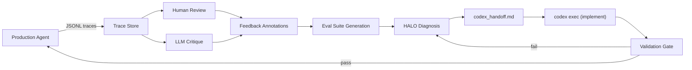
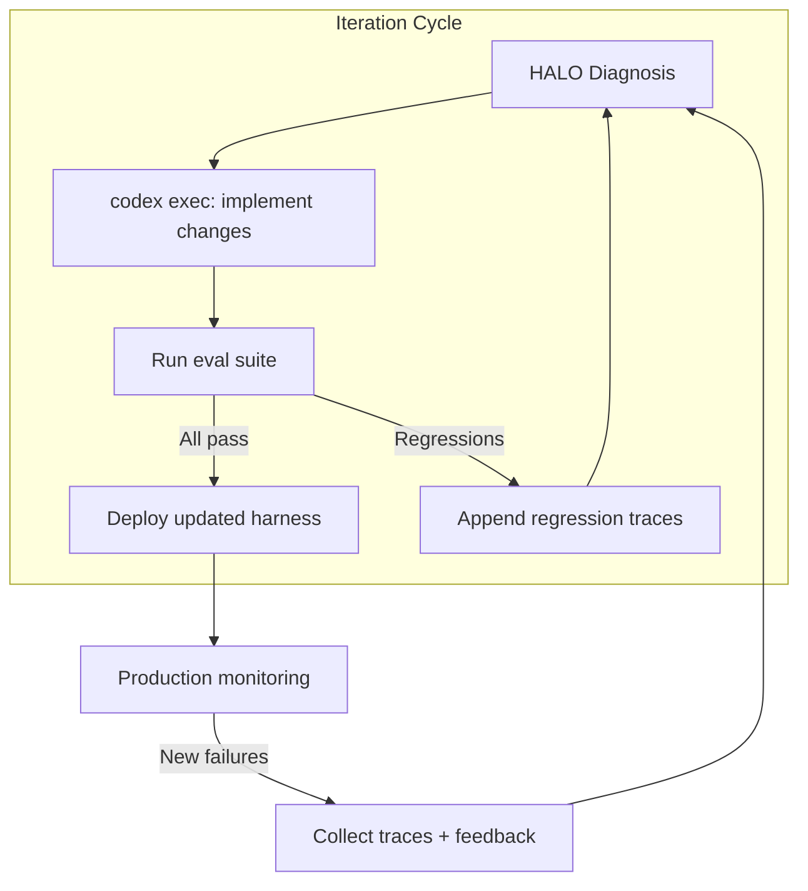

# Vertical AI Agents with Codex CLI: The Self-Improving Feedback Loop Pattern


---

On 27 May 2026, OpenAI published a case study showing how Codex-powered tax agents built with Thrive Holdings improved drafted return accuracy from 25 % to 97 % within six weeks — not by swapping models, but by wiring a production feedback loop that turned practitioner corrections into eval targets and let Codex iterate on its own harness [^1]. The pattern is not tax-specific. Any team building domain agents — compliance checkers, underwriting bots, clinical-note summarisers — can replicate it with Codex CLI, HALO, and a disciplined eval pipeline.

This article breaks down the architecture, shows how to implement each stage with Codex CLI tooling, and highlights the operational pitfalls that surface only at production scale.

## Why Vertical Agents Need a Different Loop

Horizontal coding agents improve through better models and broader training data. Vertical agents operate under tighter constraints: domain-specific validation rules, regulatory formatting requirements, and expert-defined correctness thresholds that generic benchmarks cannot capture [^2].

The core insight from the Tax AI project is that **the moat is the feedback loop, not the model** [^3]. Three pillars support this:

1. **Expert practitioner feedback** — domain specialists correct agent outputs, surfacing errors that automated checks miss.
2. **Production traces** — structured end-to-end records from input through reasoning to final output, including every tool call and intermediate decision.
3. **Codex-driven iteration** — a coding agent that reads the diagnosis, implements harness changes, and validates them against an eval suite before deployment.



## The Agent Harness Contract

The "harness" is the full contract around the model: system prompt, tool definitions, routing logic, output requirements, and validation checks [^4]. Every component in this contract is a lever the improvement loop can adjust. OpenAI's cookbook defines the harness explicitly so that optimisation can target specific components rather than blindly rewriting prompts [^4].

For Codex CLI teams, the harness maps to familiar artefacts:

| Harness Component | Codex CLI Artefact |
|---|---|
| System prompt | `AGENTS.md` + profile instructions |
| Tool definitions | MCP server schemas |
| Output requirements | `--output-schema` JSON Schema |
| Validation checks | PostToolUse hooks |
| Routing logic | Subagent delegation rules |

## Stage 1: Capturing Production Traces

Codex CLI emits JSONL events when run with `--json` [^5]. Each event includes the turn identifier, tool invocations, model reasoning, and token counts. For vertical agents running via `codex exec`, pipe this stream to a trace store:

```bash
codex exec "Process filing $CLIENT_ID" \
  --json \
  --output-schema ./filing-schema.json \
  -o ./output/$CLIENT_ID.json \
  2> ./traces/$CLIENT_ID.jsonl
```

Event types worth capturing include `turn.started`, `turn.completed`, `item.tool_call`, and `item.message` [^5]. These form the raw material for diagnosis.

For higher-volume pipelines, forward traces to an OpenTelemetry collector. Codex CLI supports OTLP export natively, and the traces integrate with Grafana, Signoz, or any OTLP-compatible backend [^6].

## Stage 2: Practitioner Feedback and LLM Critique

Raw traces alone are insufficient. The Tax AI team found that corrections only escalate to automation after repeated issues are identified and consolidated — ambiguous one-off cases route back to domain teams [^1].

Structure feedback in two channels:

### Human Review

Domain experts annotate traces with structured corrections:

```json
{
  "trace_id": "tr_abc123",
  "finding": "Agent mapped K-1 Box 14 Code A to Schedule E Line 28 instead of Line 25",
  "severity": "P0",
  "category": "field_mapping",
  "correction": "K-1 Box 14 Code A → Schedule E Line 25 (self-employment earnings)"
}
```

### LLM Critique

A separate model reviews agent outputs against domain rules. This mirrors Codex CLI's auto-review architecture, where a distinct reviewer agent analyses actions without modifying the working tree [^7]:

```bash
codex exec "Review this filing output against IRS Form 1040 field mapping rules. \
  Flag any field placed on the wrong line or schedule." \
  --sandbox=read-only \
  --output-schema ./critique-schema.json \
  -o ./feedback/$CLIENT_ID-critique.json
```

## Stage 3: Generating Eval Suites

Feedback transforms into reusable evaluations. The OpenAI cookbook demonstrates using Promptfoo to convert annotated traces into test cases that can be run against any future version of the agent [^4].

A minimal eval case for a vertical agent:

```yaml
# evals/field-mapping-k1.yaml
description: "K-1 Box 14 Code A maps to Schedule E Line 25"
vars:
  input_document: "fixtures/k1-sample-box14-code-a.pdf"
  expected_field: "schedule_e_line_25"
assert:
  - type: javascript
    value: "output.field_mappings.some(m => m.target === 'schedule_e_line_25' && m.source === 'k1_box14_code_a')"
  - type: llm-rubric
    value: "The agent correctly identified Box 14 Code A as self-employment earnings"
```

Build the eval suite incrementally. Each production failure that repeats at least twice becomes a new eval case. Over time, the suite becomes the authoritative specification for domain correctness — more reliable than any prompt or AGENTS.md file alone.

## Stage 4: HALO Diagnosis

HALO (Hierarchical Agent Loop Optimiser) analyses traces and feedback to produce ranked recommendations for harness changes [^8]. Unlike general-purpose coding agents that tend to overfit to individual trace failures, HALO uses a Reinforcement Learning Model (RLM) approach designed to identify systemic behavioural patterns across multiple traces [^8].

Install and run:

```bash
pip install halo-engine
```

```bash
halo ./traces/*.jsonl \
  -p "Diagnose field-mapping failures in tax filing agent. \
      Focus on K-1, 1099, and W-2 document types." \
  --model gpt-5.5 \
  --max-depth 3
```

HALO outputs a structured diagnosis covering:

- **Root cause clustering** — grouping failures by underlying pattern rather than surface symptom.
- **Ranked recommendations** — ordered by expected impact, with evidence citations back to specific traces.
- **Harness change proposals** — concrete modifications to system prompts, tool policies, output schemas, or validation rules.

Benchmark results on the AppWorld suite showed HALO-driven improvements of +15.8 percentage points for both Gemini 3 Flash (36.8 % → 52.6 %) and Claude Sonnet (73.7 % → 89.5 %) [^8].

## Stage 5: Codex Handoff and Implementation

The HALO diagnosis writes to a `codex_handoff.md` file containing the full diagnosis, ranked recommendations, supporting evidence, and implementation guidance [^4]. This file becomes the prompt for `codex exec`:

```bash
codex exec "Implement the harness changes described in codex_handoff.md. \
  Update AGENTS.md, tool schemas, and PostToolUse hooks as specified. \
  Run the eval suite after each change and report results." \
  --profile deep-review
```

For high-stakes domains, use a dedicated profile with elevated reasoning:

```toml
# ~/.codex/profiles/harness-iteration.toml
[model]
model = "gpt-5.5"
model_reasoning_effort = "xhigh"

[sandbox]
sandbox = "workspace-write"

[approval]
approval_policy = "on-request"
```

The `xhigh` reasoning effort instructs the model to spend substantially more compute per query — appropriate for systemic harness changes but too slow for routine corrections [^9].

## Stage 6: Validation Gate

Before deploying updated harness artefacts, run the accumulated eval suite as a gate:

```bash
promptfoo eval \
  --config evals/config.yaml \
  --output results/iteration-$(date +%Y%m%d).json
```

If any eval regresses, the loop returns to Stage 4 with the regression trace appended to the input corpus. The validation gate ensures that fixing one failure pattern does not introduce regressions in previously resolved patterns.



## Production Results: The Tax AI Benchmark

The Thrive/OpenAI Tax AI deployment processed 7,000 returns across millions of documents during its pilot [^1]. Key metrics:

| Metric | Before | After 6 Weeks |
|---|---|---|
| Field completion rate (≥75 % correct) | 25 % | 86 % |
| Draft accuracy (top returns) | — | 97 % |
| Practitioner prep time | Baseline | −33 % |
| Throughput | Baseline | +50 % |

The system progressively expanded from simple documents (W-2s, 1099s) to complex filings (K-1s, rental property schedules), with each domain expansion yielding greater efficiency gains as the eval suite grew [^1].

## Applying the Pattern to Your Domain

The self-improving loop generalises to any domain where:

1. **Expert corrections are available** — practitioners review and fix agent outputs.
2. **Correctness is measurable** — outputs can be validated against structured rules or reference data.
3. **Failures cluster** — repeated errors in the same category justify systematic harness changes rather than one-off prompt tweaks.

### Example: Compliance Document Review

```bash
# Stage 1: Run agent on compliance documents
codex exec "Review SOC 2 evidence package against control CC6.1. \
  Flag gaps and map evidence to sub-requirements." \
  --json \
  --output-schema ./compliance-schema.json \
  -o ./output/soc2-cc61.json \
  2> ./traces/soc2-cc61.jsonl

# Stage 4: Diagnose after collecting feedback
halo ./traces/soc2-*.jsonl \
  -p "Diagnose compliance mapping failures. \
      Focus on evidence-to-control mapping accuracy."

# Stage 5: Implement improvements
codex exec "$(cat codex_handoff.md)" --profile harness-iteration
```

## Operational Pitfalls

**Overfitting to recent failures.** HALO mitigates this by analysing traces across runs, but teams should maintain a "golden set" of historical eval cases that never get removed, even when the underlying pattern seems resolved.

**Feedback latency.** The Tax AI team found that corrections only escalate to automation after repeated issues are consolidated [^1]. Avoid the temptation to feed every single practitioner correction directly into the loop — batch them, identify patterns, then generate eval cases.

**Eval suite bloat.** As the suite grows, execution time increases linearly. Partition evals by domain (document type, regulation, workflow) and run targeted subsets during development, with full suites only in CI gates.

**Model version sensitivity.** ⚠️ Harness changes optimised for one model version may not transfer cleanly when the underlying model is updated. Re-run the full eval suite after any model change, including minor version bumps.

## Citations

[^1]: OpenAI, "Building self-improving tax agents with Codex", 27 May 2026. [https://openai.com/index/building-self-improving-tax-agents-with-codex/](https://openai.com/index/building-self-improving-tax-agents-with-codex/)

[^2]: ACTGSYS, "Vertical AI Agents 2026: Why Industry-Specific Agents Are Eating SaaS", 2026. [https://actgsys.com/en/blog/vertical-ai-agents-industry-specific-2026](https://actgsys.com/en/blog/vertical-ai-agents-industry-specific-2026)

[^3]: AI Enabled PM, "OpenAI tax agents and vertical AI feedback loops", May 2026. [https://aienabledpm.com/ai-news/self-improving-tax-agents-codex-ai-news/](https://aienabledpm.com/ai-news/self-improving-tax-agents-codex-ai-news/)

[^4]: OpenAI Cookbook, "Build an Agent Improvement Loop with Traces, Evals, and Codex", 2026. [https://developers.openai.com/cookbook/examples/agents_sdk/agent_improvement_loop](https://developers.openai.com/cookbook/examples/agents_sdk/agent_improvement_loop)

[^5]: OpenAI, "Non-interactive mode – Codex", 2026. [https://developers.openai.com/codex/noninteractive](https://developers.openai.com/codex/noninteractive)

[^6]: OpenAI, "Codex CLI Features", 2026. [https://developers.openai.com/codex/cli/features](https://developers.openai.com/codex/cli/features)

[^7]: OpenAI, "Auto-review – Codex", 2026. [https://developers.openai.com/codex/concepts/sandboxing/auto-review](https://developers.openai.com/codex/concepts/sandboxing/auto-review)

[^8]: Context Labs, "HALO: Hierarchical Agent Loop Optimizer", GitHub, 2026. [https://github.com/context-labs/halo](https://github.com/context-labs/halo)

[^9]: OpenAI, "Sample Configuration – Codex", 2026. [https://developers.openai.com/codex/config-sample](https://developers.openai.com/codex/config-sample)
