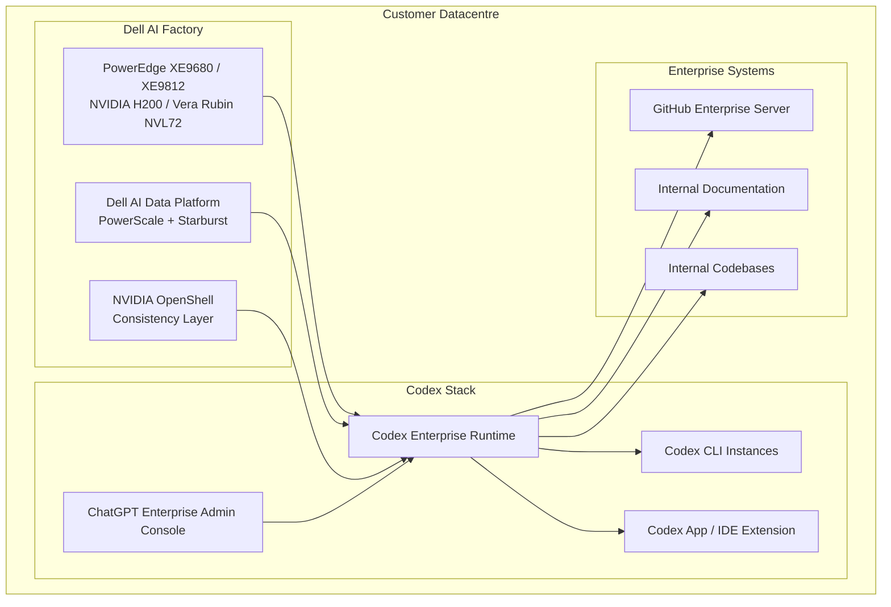
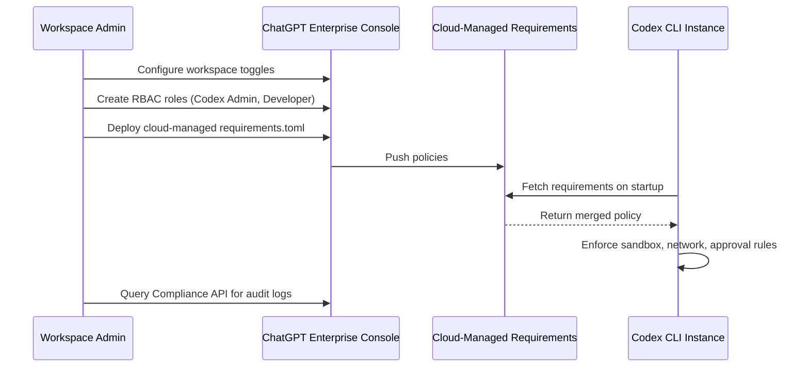

# Codex On-Premises: The Dell AI Factory Partnership and What It Means for Regulated Enterprise Teams


---

On 18 May 2026, OpenAI and Dell Technologies announced a partnership at Dell Technologies World to bring Codex into hybrid and on-premises enterprise environments [^1]. For the 67 per cent of enterprise AI workloads that already operate outside the public cloud [^2], and for sectors where sending proprietary code to any hyperscaler is a non-starter — defence, central banking, healthcare — this is the first time OpenAI has offered a viable on-premises path for Codex specifically.

This article examines the architecture, the practical deployment stack, what Codex CLI configuration looks like in these environments, and the gaps that remain.

## Why On-Premises Matters Now

Codex surpassed four million weekly active developers in May 2026 [^1]. Yet adoption in regulated industries has been constrained by a fundamental tension: the agent needs access to internal codebases, documentation, and business systems, but those assets cannot leave the physical perimeter.

Previous workarounds — Azure OpenAI Service with private endpoints, or local model providers via Ollama — each had trade-offs. Azure still routes through a third-party datacentre. Local models lack the reasoning capability of GPT-5.5 [^3]. The Dell partnership attempts to resolve this by keeping the full Codex stack within customer-owned infrastructure.

## Architecture: Dell AI Factory + Codex

The deployment sits on Dell AI Factory, the branded hardware-and-software stack that has shipped to over 5,000 enterprise customers since 2024 [^2]. The integration connects Codex to the Dell AI Data Platform for data preparation, governance, and federated SQL via Starburst [^4].



### Hardware Options

Three PowerEdge configurations anchor the compute layer:

| Server | Form Factor | GPUs | Key Metric |
|--------|------------|------|------------|
| PowerEdge XE9680 | 8U air-cooled | 8× NVIDIA H200 141 GB | Baseline enterprise inference |
| PowerEdge XE9680L | 4U liquid-cooled | 8× NVIDIA H200 141 GB | 2.5× energy efficiency [^4] |
| PowerEdge XE9812 | Announced DTW 2026 | NVIDIA Vera Rubin NVL72 | 10× lower cost-per-token vs Blackwell [^5] |

AMD MI300X and Intel Gaudi3 OAM are listed as alternative GPU options [^4], though OpenAI model compatibility with non-NVIDIA silicon is unconfirmed at time of writing. ⚠️

### NVIDIA OpenShell

OpenShell provides a consistency layer that lets teams build and test agents locally, then promote them to datacentre-scale infrastructure [^2]. This is significant for Codex workflows: a developer can prototype a skill or automation on a workstation with a smaller model, then deploy the same configuration against on-premises GPT-5.5 without rewriting the harness.

## Codex CLI Configuration for On-Premises

Whether your organisation deploys on Dell infrastructure or any other self-hosted environment, Codex CLI's enterprise configuration stack provides the policy enforcement layer. Configuration follows a strict precedence hierarchy [^6]:

1. **Cloud-managed requirements** — pushed from the ChatGPT Enterprise admin console
2. **macOS MDM** — via `com.openai.codex:requirements_toml_base64`
3. **System `requirements.toml`** — `/etc/codex/requirements.toml` (Unix) or `%ProgramData%\OpenAI\Codex\requirements.toml` (Windows)

Earlier layers override later ones, and users cannot weaken admin-set constraints [^6].

### Sample On-Premises requirements.toml

```toml
# /etc/codex/requirements.toml — deployed via MDM or system image

[approval]
# Require explicit approval for all tool calls
policy = "on-request"

[sandbox]
# Restrict to workspace-write; no full access on regulated machines
mode = "workspace-write"

[web_search]
# Disable web search entirely on air-gapped nodes
mode = "disabled"

[network]
# Lock network to internal endpoints only
access = true
allowed_domains = [
  "github.internal.corp.example",
  "artifactory.internal.corp.example",
  "codex-runtime.internal.corp.example",
]

[features]
# Disable browser and computer use in regulated environments
browser_use = false
computer_use = false

[filesystem]
# Prevent the agent from reading secrets directories
deny_read = [
  "/etc/ssl/private",
  "/var/secrets",
  "~/.ssh",
]

[mcp]
# Allowlist only approved MCP servers
allowed_servers = [
  { command = "ghes-mcp", args = ["--host", "github.internal.corp.example"] },
]
```

### Managed Defaults vs Requirements

A subtlety that catches teams out: `requirements.toml` locks values that users **cannot** change. For settings you want as defaults but allow developers to override during a session, use `managed_config.toml` instead. Codex reapplies managed defaults on restart [^6].

```toml
# /etc/codex/managed_config.toml — soft defaults, user can override

[model]
default = "gpt-5.5"

[sandbox]
mode = "workspace-write"
```

## Enterprise Admin Workflow

The ChatGPT Enterprise admin console provides the control plane [^7]:



Key admin steps for an on-premises rollout [^7]:

1. **Enable surfaces** — toggle "Allow members to use Codex Local" in workspace settings
2. **Set up RBAC** — create a dedicated "Codex Admin" role with limited membership; assign developer groups separately
3. **Deploy managed policies** — push `requirements.toml` controlling sandbox behaviour, web search, approval workflows, and feature flags
4. **Connect internal repositories** — link GitHub Enterprise Server, configure IP allowlists
5. **Enable audit logging** — create API keys for the Compliance API; query `CODEX_LOG` and `CODEX_SECURITY_LOG` event types

### Compliance API Integration

For regulated environments, audit visibility is non-negotiable. The Compliance API exposes endpoints for usage tracking and code review monitoring [^7]:

```bash
# Query Codex usage for the workspace
curl -s -H "Authorization: Bearer $ADMIN_API_KEY" \
  "https://api.openai.com/v1/workspaces/${WORKSPACE_ID}/usage?surface=codex" \
  | jq '.data[] | {user: .user_email, tokens: .total_tokens, date: .date}'

# Retrieve code review audit logs
curl -s -H "Authorization: Bearer $ADMIN_API_KEY" \
  "https://api.openai.com/v1/workspaces/${WORKSPACE_ID}/code_reviews?status=completed" \
  | jq '.reviews[] | {repo: .repository, reviewer: .codex_model, findings: .finding_count}'
```

## What This Changes for Development Teams

### Before: The Workaround Stack

Teams in regulated industries previously cobbled together partial solutions:

- **Azure OpenAI Service** with private endpoints — works, but data still traverses Microsoft infrastructure
- **Ollama + local models** — fully air-gapped, but reasoning quality drops sharply below GPT-5.5 [^3]
- **Codex CLI with `network_access = false`** — prevents data exfiltration but cripples web search and MCP server connectivity

### After: Full Codex Within the Perimeter

The Dell partnership promises the full Codex experience — including Goal Mode, MCP servers, code review automation, and Codex Security scanning — running entirely within the customer's physical infrastructure [^1]. Task durations range from 1 to 30 minutes depending on complexity [^2].

This unlocks use cases that were previously impossible in these environments:

- **Automated code review** across internal repositories with access to internal style guides and architecture documentation
- **Test coverage analysis** that can reason about proprietary frameworks and internal libraries
- **Incident response workflows** with access to internal runbooks and production telemetry

## Critical Gaps and Open Questions

The partnership announcement left significant implementation details unspecified. Teams evaluating this path should be aware of what remains unclear:

**General availability date** — not disclosed. Dell AI Data Platform upgrades are scheduled for Q2 2026, but a firm ship date for the Codex integration has not been published. ⚠️

**Compliance certifications** — FedRAMP, HIPAA, IL5, and SOC 2 status for the on-premises Codex deployment are pending [^4]. Regulated buyers will need these before procurement can proceed. ⚠️

**Pricing** — on-premises pricing has not been disclosed. Cloud Codex runs approximately \$100–\$200 per developer per month [^8]. On-premises will likely combine hardware capex with per-seat or per-token Codex licensing. ⚠️

**Air-gapped support** — the announcement describes "hybrid and on-premises environments" but does not address fully disconnected scenarios [^4]. Current documentation suggests external connectivity remains necessary for baseline model operations. ⚠️

**Infrastructure prerequisite** — this is not a "deploy Codex on your existing servers" announcement. Organisations must already operate Dell AI Factory systems or be prepared to procure them [^2].

## Competitive Context

The Dell partnership positions OpenAI against an increasingly crowded on-premises coding agent market:

| Vendor | On-Premises Option | Model | Data Residency |
|--------|-------------------|-------|----------------|
| OpenAI + Dell | Dell AI Factory (Q2 2026) | GPT-5.5 | Customer datacentre |
| GitHub Copilot | GHES + Azure Private | GPT-5.5 / Claude | Azure tenant |
| Amazon CodeWhisperer | AWS Outposts | Amazon Nova | Customer rack (AWS hardware) |
| Tabnine | Self-hosted (Docker) | Tabnine models | Customer infrastructure |
| Sourcegraph Cody | Self-hosted | Multiple (BYO key) | Customer infrastructure |

The differentiator for the Dell path is access to the full Codex runtime — Goal Mode, the app-server protocol, Codex Security — rather than just a code completion endpoint. Whether that advantage holds depends on the unresolved gaps above.

## Practical Recommendations

For teams evaluating on-premises Codex today:

1. **Start with the configuration stack now** — `requirements.toml` and managed configuration work identically whether you're on cloud Codex or preparing for on-premises. Deploy your policies, test enforcement, and iterate before the hardware arrives.

2. **Audit your MCP server dependencies** — catalogue which MCP servers your teams use and whether they can run within the perimeter. Streamable HTTP servers that point to external SaaS endpoints will need on-premises alternatives or allowlisting.

3. **Map your compliance requirements** — document exactly which certifications you need. When OpenAI publishes compliance attestations for the Dell deployment, you will need to match them against your requirements immediately.

4. **Budget for infrastructure** — the PowerEdge XE9680 with H200 GPUs is not a trivial procurement. Work with Dell to size the cluster for your developer count and expected concurrent Codex sessions.

5. **Watch the changelog** — Codex CLI v0.136.0 already introduced Windows sandbox provisioning and remote execution setup with `CODEX_API_KEY` registration for approved hosts [^9]. These enterprise primitives are shipping faster than the marketing announcements.

## Citations

[^1]: OpenAI. "OpenAI and Dell Technologies partner to bring Codex to hybrid and on-premises enterprise environments." 18 May 2026. [https://openai.com/index/dell-codex-enterprise-partnership/](https://openai.com/index/dell-codex-enterprise-partnership/)

[^2]: ByteIota. "OpenAI Codex On-Premises: What Enterprise Devs Must Know." May 2026. [https://byteiota.com/openai-codex-dell-on-premises-enterprise/](https://byteiota.com/openai-codex-dell-on-premises-enterprise/)

[^3]: OpenAI. "Introducing GPT-5.5." 2026. [https://openai.com/index/introducing-gpt-5-5/](https://openai.com/index/introducing-gpt-5-5/)

[^4]: Digital Applied. "OpenAI + Dell Codex: On-Premises Enterprise Agents." May 2026. [https://www.digitalapplied.com/blog/openai-dell-codex-on-premises-enterprise](https://www.digitalapplied.com/blog/openai-dell-codex-on-premises-enterprise)

[^5]: Dell Technologies. "Dell Technologies Delivers Production-Ready Agentic AI from Deskside to Data Center." 18 May 2026. [https://www.dell.com/en-us/dt/corporate/newsroom/announcements/detailpage.press-releases~usa~2026~05~dell-technologies-delivers-production-ready-agentic-ai-from-deskside-to-data-center.htm](https://www.dell.com/en-us/dt/corporate/newsroom/announcements/detailpage.press-releases~usa~2026~05~dell-technologies-delivers-production-ready-agentic-ai-from-deskside-to-data-center.htm)

[^6]: OpenAI Developers. "Managed configuration — Codex." [https://developers.openai.com/codex/enterprise/managed-configuration](https://developers.openai.com/codex/enterprise/managed-configuration)

[^7]: OpenAI Developers. "Admin Setup — Codex." [https://developers.openai.com/codex/enterprise/](https://developers.openai.com/codex/enterprise/)

[^8]: eesel AI. "A clear guide to OpenAI Codex pricing in 2026." [https://www.eesel.ai/blog/codex-pricing](https://www.eesel.ai/blog/codex-pricing)

[^9]: OpenAI Developers. "Changelog — Codex." [https://developers.openai.com/codex/changelog](https://developers.openai.com/codex/changelog)
