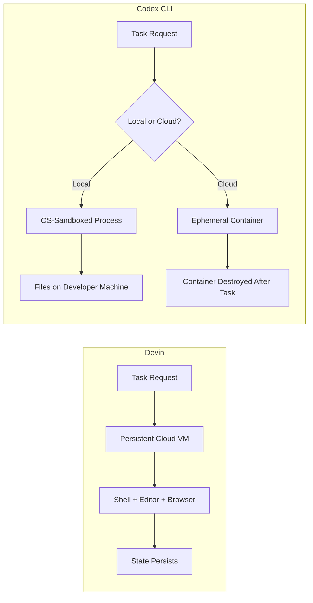

# Devin vs Codex CLI: Cloud Sandbox vs Local-First Architecture for Enterprise Engineering Teams


---

Every engineering organisation evaluating AI coding agents in mid-2026 faces a fundamental architectural choice before any feature comparison begins: does your source code leave the building? Devin, from Cognition, runs entirely inside a cloud-hosted virtual machine. Codex CLI, from OpenAI, defaults to local execution with optional cloud delegation. That single design decision cascades through security posture, billing model, feedback-loop latency, and team workflow in ways that matter far more than benchmark scores on SWE-bench [^1][^2].

This article dissects both architectures, maps their trade-offs to concrete enterprise scenarios, and provides configuration patterns for teams adopting either tool — or both.

---

## Execution Architecture

### Devin: Cloud-Native Sandbox

Devin provisions a persistent virtual machine for every session. That VM bundles a shell, a code editor, a browser, and a planner — a complete development environment in Cognition's infrastructure [^3]. Source code is cloned into the VM at session start. The agent retains state across turns: installed packages, running servers, and modified files all persist until the session ends or is explicitly torn down.

This model optimises for **autonomy**. Devin can clone a repository, install dependencies, run the application, open a browser to verify behaviour, debug failures, and push a commit — without a single human approval step if the team configures it that way [^4].

### Codex CLI: Local-First Hybrid

Codex CLI runs on the developer's machine. OS-level sandboxing — Seatbelt on macOS, Landlock plus seccomp on Linux, restricted tokens on Windows — constrains file-system and network access by default [^5]. The `workspace-write` sandbox mode grants write access only within the project directory; network access remains off unless explicitly enabled.

For heavier tasks, developers can delegate to Codex Cloud, where each task runs in an **ephemeral** container. The cloud sandbox uses a two-phase model: a setup phase (network-enabled, for dependency installation) followed by an agent phase (network-disabled by default, secrets removed) [^6]. Unlike Devin's persistent VM, nothing survives between cloud tasks.



---

## Data Residency and Security

For regulated industries — finance, healthcare, defence — the architectural distinction is often the only question that matters [^7].

| Criterion | Devin | Codex CLI (Local) | Codex CLI (Cloud) |
|---|---|---|---|
| Source code leaves premises | Yes — cloned into Cognition VM | No | Yes — ephemeral container |
| Network access during agent work | Full (VM has internet) | Off by default | Off by default (agent phase) |
| Secrets exposure | Available in VM | `shell_environment_policy` controls | Removed before agent phase [^6] |
| Audit trail | Devin session logs | JSONL transcripts in `~/.codex/sessions/` | JSONL + cloud logs |
| SOC 2 | Type II certified [^8] | Inherited from OpenAI platform | Inherited from OpenAI platform |
| Self-hosted option | Enterprise VPC deployment | Always local (open-source CLI) | Not applicable |

Devin's Enterprise plan offers VPC deployment with SAML/OIDC SSO and teamspace isolation [^9], which addresses the data-residency concern but adds procurement complexity. Codex CLI's local mode requires no such arrangement — the code never leaves the machine unless the developer explicitly delegates to cloud.

---

## Billing Model

The billing models reflect the architectural differences.

**Devin** charges per ACU (Agentic Computing Unit). One ACU represents roughly 15 minutes of active autonomous work — VM time, model inference, and network bandwidth bundled together [^9]. The Core plan starts at \$20/month with ACUs at \$2.25 each; the Team plan is \$500/month with 250 ACUs at \$2.00 each. A typical bug fix consumes 2-3 ACUs (\$4.50-\$6.75) [^1].

**Codex CLI** uses token-based billing through ChatGPT subscriptions. The Plus plan (\$20/month) includes Codex usage with rate limits. The Pro plan (\$200/month) provides higher throughput. API-key usage via `codex exec` is billed per token at standard OpenAI Responses API rates [^10]. A comparable bug fix typically costs \$0.20-\$1.00 in tokens [^1].

```toml
# Codex CLI: config.toml — control costs with model routing
model = "gpt-5.5"                    # default for interactive work
model_reasoning_effort = "medium"    # reduce token spend

[profiles.quick]
model = "gpt-5.4-mini"              # cheaper model for routine tasks
model_reasoning_effort = "low"
```

The practical difference: Devin's ACU model is predictable for time-bounded tasks but expensive for exploratory work. Codex's token model is cheaper per task but harder to predict when reasoning effort varies [^1].

---

## Feedback Loop and Developer Experience

The most consequential difference for day-to-day use is the **feedback loop**.

Codex CLI runs locally. The edit-test cycle is sub-second: the agent modifies a file, the developer's local test runner executes, results stream back immediately. For tight iteration — fixing a failing test, adjusting a component, tuning a query — local execution wins on pure latency [^7].

Devin's strength is **delegation**. You describe a task in natural language (or via a Playbook), hand it off, and come back later. The VM runs independently — installing dependencies, running the full test suite, even browsing documentation — without occupying the developer's terminal [^4]. Cognition reports that their own engineering team delegates roughly 25% of engineering work to Devin sessions running in parallel [^11].

### Playbooks vs AGENTS.md

Both tools support persistent instructions, but the abstractions differ:

**Devin Playbooks** are step-by-step procedures attached to recurring tasks. They support macros (keyboard shortcuts that load a Playbook into a session), and they integrate with Devin's Knowledge wiki — an auto-generated knowledge base the agent reads from and writes to during work [^12].

**Codex CLI AGENTS.md** files are layered instruction files discovered at startup. They cascade from global (`~/.codex/AGENTS.md`) through repository root to subdirectory overrides. The AGENTS.md standard has been adopted by over 60,000 open-source repositories and is supported by 20+ tools including Cursor, Gemini CLI, and GitHub Copilot [^13].

```markdown
<!-- .codex/AGENTS.md — repository-level instructions -->
# Project Rules

- Use `Result<T, E>` instead of throwing exceptions
- Run `cargo clippy --all-targets` before committing
- Never modify files in `vendor/`

## Testing
- All new functions require property-based tests using `proptest`
- Integration tests go in `tests/integration/`, not alongside source
```

The key difference: Playbooks are Devin-specific and optimised for delegation workflows. AGENTS.md is a cross-tool standard that works regardless of which agent reads it.

---

## Integration Surface

| Integration | Devin | Codex CLI |
|---|---|---|
| Slack | Native — tag @Devin with a task [^12] | Via MCP server or webhook |
| Jira/Linear | Native connectors | MCP servers (Linear, Jira) |
| GitHub PRs | Creates PRs from sessions | `codex-action` GitHub Action [^14] |
| IDE | Web-based editor in VM | VS Code, JetBrains, Cursor extensions [^15] |
| CI/CD | Webhook triggers | `codex exec` in any CI runner |
| MCP protocol | Not supported | Full MCP client with OAuth [^16] |
| Custom tools | Knowledge wiki + Playbooks | Skills, plugins, hooks, subagents |

Codex CLI's MCP support is a significant differentiator for teams with existing tool ecosystems. Any MCP-compatible server — databases, observability platforms, cloud providers — plugs directly into the agent's tool palette [^16]. Devin's integrations are first-party and curated, which means less configuration but less flexibility.

---

## When to Choose Which

### Choose Devin when:

- **Delegation is the primary workflow**: tasks are well-defined, acceptance criteria are clear, and developers want to hand off and context-switch.
- **Browser-dependent tasks**: Devin's built-in browser handles authenticated web interactions, visual verification, and documentation research without additional MCP configuration.
- **Non-engineering stakeholders** need to trigger tasks — Devin's Slack integration and natural-language interface lower the barrier.

### Choose Codex CLI when:

- **Data residency is non-negotiable**: source code must remain on developer machines or within your own infrastructure.
- **Tight edit-test cycles dominate**: local execution provides sub-second feedback for TDD, debugging, and exploratory coding.
- **Tool ecosystem integration matters**: MCP servers, custom hooks, and the open-source plugin system support arbitrary tool connections.
- **Cost sensitivity at scale**: token-based billing is significantly cheaper per task than ACU billing for high-volume workflows.

### Use both when:

Many teams run Codex CLI for interactive development and delegate well-scoped background tasks to Devin. The AGENTS.md standard ensures both agents receive the same project context. A practical pattern:

```bash
# Interactive development with Codex CLI
codex "Fix the failing auth middleware tests"

# Delegate a large migration to Devin via Slack
# @Devin Migrate all API endpoints from Express to Hono.
# Follow the playbook in !express-to-hono.
```

---

## Performance Benchmarks

Benchmark scores should be interpreted with caution — they measure narrow capabilities, not end-to-end engineering value [^17].

| Benchmark | Codex (GPT-5.3-Codex) | Devin |
|---|---|---|
| Terminal-Bench 2.0 | 77.3% [^1] | Not independently verified |
| SWE-bench Verified | ~77-80% [^1] | Self-reported "strong on Junior-SWE" |
| Throughput | ~240 tokens/sec [^1] | Not disclosed |
| Tokens per task | ~4x fewer than Claude Code [^18] | Not comparable (ACU model) |

Codex's token efficiency matters for cost: fewer tokens per task means lower bills. Devin's ACU model abstracts this away, which simplifies budgeting but obscures per-task efficiency.

---

## Configuration Quick-Start

### Codex CLI for Enterprise

```toml
# ~/.codex/config.toml
model = "gpt-5.5"
sandbox_permissions = "workspace-write"

[shell_environment_policy]
inherit = "trimmed"
exclude = ["AWS_SECRET_ACCESS_KEY", "DATABASE_URL"]

[history]
max_bytes = 52428800  # 50 MB transcript retention

[otel]
exporter = "otlp-http"
endpoint = "https://otel.internal.example.com:4318"
```

### Devin for Team Delegation

```yaml
# Devin Playbook: Database Migration
name: !db-migrate
steps:
  - Clone the repository and checkout the feature branch
  - Run `pnpm install` to install dependencies
  - Execute `pnpm db:migrate:generate` to create the migration
  - Run `pnpm db:migrate:up` and verify with `pnpm test:integration`
  - Create a PR with the migration files and test results
acceptance_criteria:
  - All integration tests pass
  - No type errors in `pnpm typecheck`
  - Migration is reversible (`db:migrate:down` succeeds)
```

---

## The Bottom Line

Devin and Codex CLI are not interchangeable tools competing for the same slot. They represent fundamentally different theories of how AI agents should integrate into engineering workflows. Devin bets on **autonomous delegation** — fire and forget, with the agent owning the full execution environment. Codex CLI bets on **augmented local development** — the developer stays in the loop, the agent stays on the developer's machine, and cloud delegation is opt-in.

The right choice depends on your team's trust model, data-residency requirements, and whether your bottleneck is task throughput (favour Devin) or iteration speed (favour Codex CLI). Increasingly, the answer is both.

---

## Citations

[^1]: [Devin vs Claude Code vs Codex 2026: 8 Agents Tested — TECHSY](https://techsy.io/en/blog/background-coding-agents-compared)
[^2]: [Best AI Coding Agents in 2026 — Blink Blog](https://blink.new/blog/best-ai-coding-agents-2026)
[^3]: [Devin vs Codex Desktop App (2026): Cloud Agent or Local-Hybrid Planner? — Augment Code](https://www.augmentcode.com/tools/devin-vs-codex-desktop-app)
[^4]: [How Cognition Uses Devin to Build Devin — Cognition Blog](https://cognition.ai/blog/how-cognition-uses-devin-to-build-devin)
[^5]: [Sandbox — Codex | OpenAI Developers](https://developers.openai.com/codex/concepts/sandboxing)
[^6]: [Security — Codex | OpenAI Developers](https://developers.openai.com/codex/security)
[^7]: [Devin vs OpenAI Codex CLI (2026): Closer Than You Think — Vibecoding](https://vibecoding.app/compare/devin-vs-openai-codex-cli)
[^8]: [Devin AI Review 2026 — AI Agent Square](https://aiagentsquare.com/agents/devin.html)
[^9]: [Pricing | Devin](https://devin.ai/pricing/)
[^10]: [CLI — Codex | OpenAI Developers](https://developers.openai.com/codex/cli)
[^11]: [How Cognition Uses Devin to Build Devin — Nader Dabit / Substack](https://nader.substack.com/p/how-cognition-uses-devin-to-build)
[^12]: [Creating Playbooks — Devin Docs](https://docs.devin.ai/product-guides/creating-playbooks)
[^13]: [Agent Instruction Files: AGENTS.md, CLAUDE.md, and Cross-Tool Portability — Codex Knowledge Base](https://codex.danielvaughan.com/2026/05/27/agent-instruction-files-agents-md-claude-md-cross-tool-portability-codex-cli/)
[^14]: [GitHub Action — Codex | OpenAI Developers](https://developers.openai.com/codex/github-action)
[^15]: [IDE Extension — Codex | OpenAI Developers](https://developers.openai.com/codex/ide)
[^16]: [Model Context Protocol — Codex | OpenAI Developers](https://developers.openai.com/codex/mcp)
[^17]: [Beyond SWE-bench: Broken Benchmarks — Codex Knowledge Base](https://codex.danielvaughan.com/2026/04/19/beyond-swe-bench-broken-benchmarks-codex-cli-workflows/)
[^18]: [Codex CLI v0.135 Reference — Blake Crosley](https://blakecrosley.com/guides/codex)
