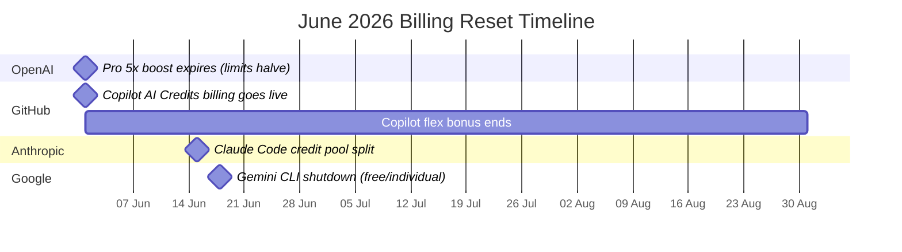

# The June 2026 Coding Agent Billing Reset: What Four Simultaneous Pricing Changes Mean for Your Codex CLI Budget


---

Four major coding agent platforms are resetting their billing models within eighteen days of each other. If you run Codex CLI in a team of any size, the numbers in your planning spreadsheets are already wrong. This article maps every change, quantifies the impact, and provides concrete strategies for keeping your agent spend under control through June 2026.

## The Four Billing Events



### 1. OpenAI Codex: Pro 5x Temporary Boost Expires (1 June)

Since April 2026, Pro 5x subscribers have enjoyed a temporary 2x multiplier on top of their standard 5x allowance, effectively granting 10x Plus usage [^1]. That promotion ended at midnight on 31 May. As of today, limits revert to their base Pro 5x rates.

The practical impact for GPT-5.5 specifically: your 5-hour message window drops from the promoted range of roughly 160–800 messages back to the standard 80–400 [^1]. If your team sized its workflow parallelism around the boosted figures, tasks that previously fit within a single window may now spill into the next.

**What to do:**

```toml
# ~/.codex/config.toml — route high-volume subtasks to the cheaper model
[profile.bulk]
model = "gpt-5.4-mini"
```

GPT-5.4-mini consumes roughly 3–4 credits per local message compared to GPT-5.5's 10–14 [^1]. Routing subagent fan-out, lint passes, and test-generation tasks through a `bulk` profile stretches your post-boost allowance significantly further.

### 2. GitHub Copilot: AI Credits Replace Premium Requests (1 June)

Also effective today, GitHub Copilot replaces its premium-request model with token-based AI Credits [^2]. Every plan receives a monthly credit pool matched 1:1 with subscription price — Pro (\$10/month) gets \$10 in credits, Pro+ (\$39) gets \$39, Business (\$19/user) gets \$19/user [^2].

Code completions and Next Edit Suggestions remain free and do not consume credits [^2]. But agentic features — Copilot coding agent issue assignment, chat with Opus 4.7 or GPT-5.5, and workspace-level tasks — now draw from the credit pool at published API rates [^2].

A promotional flex allotment runs through August 2026: Business customers receive \$30/user/month instead of \$19, and Enterprise receives \$70/user/month instead of \$39 [^2]. These flex credits will reduce over time.

**Why Codex CLI teams should care:** If your organisation runs both Copilot (for completions in the IDE) and Codex CLI (for agentic terminal workflows), the new credit-based Copilot pricing makes it easier to compare cost per task directly against Codex CLI's token rates. The arbitrage opportunity is real: a GPT-5.4-mini message in Codex CLI costs approximately 3 credits, whilst the same model through Copilot's agentic mode consumes credits at full API rates [^1][^2].

### 3. Anthropic Claude Code: Programmatic Credit Pool Split (15 June)

Anthropic announced on 13 May that effective 15 June, programmatic Claude usage — including Claude Code sessions driven via the Agent SDK or CI pipelines — moves off the shared subscription pool and onto a separate monthly credit pool billed at full API rates [^3]. Pro subscribers get \$20 of credit, Max 5x gets \$100, and Max 20x gets \$200 [^3].

This is a significant change for teams running Claude Code alongside Codex CLI in a multi-agent setup. Previously, a Max 20x subscription's generous token allowance could absorb heavy programmatic usage. After 15 June, that same workload costs real dollars at Opus 4.7 rates of \$5/\$25 per million input/output tokens [^3].

**Cross-agent budget impact:** Teams using Claude Code as a secondary review agent (a common pattern documented in the Codex CLI knowledge base) should audit their Claude Code programmatic spend before 15 June. A single Opus 4.7 review pass on a 500-line PR can consume 50,000–100,000 tokens, costing \$0.25–\$2.75 depending on output length [^3].

### 4. Google Gemini CLI: Complete Shutdown for Free and Individual Users (18 June)

Google shuts down Gemini CLI and Gemini Code Assist IDE extensions for all non-enterprise users on 18 June [^4]. Only organisations with Gemini Code Assist Standard or Enterprise licences retain access [^4]. The replacement — Antigravity CLI — is not open source, uses a compute-based quota system that refreshes every five hours until hitting a weekly ceiling, and does not offer 1:1 feature parity at launch [^5].

For teams that were supplementing Codex CLI with Gemini CLI for zero-cost secondary verification or Gemini-specific MCP server testing, that workflow disappears in seventeen days.

## The June 2026 Pricing Landscape at a Glance

| Agent | Plan | Monthly Cost | Billing Model | Key Limit |
|-------|------|-------------|---------------|-----------|
| **Codex CLI** | Plus | \$20 | Token-based credits | 15–80 GPT-5.5 msgs / 5 hrs [^1] |
| **Codex CLI** | Pro 5x | \$100 | Token-based credits | 80–400 GPT-5.5 msgs / 5 hrs [^1] |
| **Codex CLI** | Business | \$30/user | Pay-as-you-go credits | Same as Plus base [^1] |
| **Claude Code** | Max 5x | \$100 | Subscription + credit pool (from 15 June) | ~88k tokens / 5 hrs [^3] |
| **Claude Code** | Max 20x | \$200 | Subscription + credit pool (from 15 June) | ~220k tokens / 5 hrs [^3] |
| **Copilot** | Pro+ | \$39 | AI Credits (from 1 June) | \$39 credit pool + flex [^2] |
| **Copilot** | Business | \$19/user | AI Credits (from 1 June) | \$30/user flex through Aug [^2] |
| **Cursor** | Pro | \$20 | Subscription + Composer 2.5 tokens | \$0.50/\$2.50 per M in/out [^6] |
| **Antigravity** | AI Pro | \$19.99 | Compute-based quota | 5-hour refresh, weekly ceiling [^5] |

## Cost Optimisation Strategies for Codex CLI Teams

### Route by Model, Not by Habit

The credit rates between Codex CLI models vary by an order of magnitude [^1]:

| Model | Input Credits/M | Cached Credits/M | Output Credits/M |
|-------|----------------|-------------------|------------------|
| GPT-5.5 | 125 | 12.50 | 750 |
| GPT-5.4 | 62.50 | 6.25 | 375 |
| GPT-5.4-mini | 18.75 | 1.875 | 113 |
| GPT-5.3-Codex | 43.75 | 4.375 | 350 |

GPT-5.5 output tokens cost 6.6x more than GPT-5.4-mini. For subagent tasks (test generation, lint fixes, documentation updates), the quality difference rarely justifies the cost premium.

```toml
# ~/.codex/config.toml — profile-based model routing
[profile.default]
model = "gpt-5.5"

[profile.subagent]
model = "gpt-5.4-mini"

[profile.review]
model = "gpt-5.3-codex"
```

### Maximise Cache Hits

Cached input tokens cost approximately 10% of regular input [^1]. In sustained sessions where AGENTS.md, tool definitions, and project context reload every turn, caching can reduce effective input costs by 80–90% [^7]. The key is keeping static content (system instructions, skill definitions) at the front of the prompt and variable content at the end.


Breaking the cache — through compaction, context window rotation, or mid-session model switches — resets you to full input pricing. Treat compaction as a last resort, not a routine maintenance step.

### Audit Cross-Agent Spend Before 15 June

If your workflow uses Claude Code for secondary review alongside Codex CLI for primary development, the 15 June credit pool split changes the economics:

```bash
# Estimate current Claude Code programmatic usage
# Check your Anthropic dashboard before the split
codex exec "Analyse our CI pipeline configs in .github/workflows/ \
  and estimate how many Claude Code API calls we make per week. \
  Count review triggers, automated refactors, and any \
  anthropic SDK calls. Return structured JSON." \
  --output-schema /tmp/claude-usage-schema.json
```

For teams spending more than \$100/month on Claude Code programmatic calls, the credit pool split may push the total cost above a dedicated Codex CLI Business plan with equivalent throughput.

### Use `codex exec` for Budget-Bounded CI Jobs

The `codex exec` command accepts token budget constraints that prevent runaway spend in automated pipelines:

```bash
# CI job with explicit budget control
codex exec \
  --profile review \
  --approval-mode read-only \
  "Review the staged changes for security issues. \
   Flag any hardcoded credentials, SQL injection vectors, \
   or unvalidated inputs."
```

Pair this with `--output-schema` to get structured, parseable results that integrate cleanly with existing CI reporting.

## What About Cursor's Composer 2.5?

Cursor's Composer 2.5 model, launched 18 May 2026, scores 79.8% on SWE-Bench Multilingual at \$0.50/\$2.50 per million input/output tokens [^6] — roughly 10x cheaper than Opus 4.7 and GPT-5.5 on raw per-token cost. However, Composer 2.5 operates exclusively within Cursor's IDE. It cannot be called from CI pipelines, terminal scripts, or the `codex exec` non-interactive workflow that many teams rely on for automated quality gates.

For teams evaluating cost per merged PR rather than cost per million tokens, the comparison is more nuanced. Codex CLI's advantage lies in its scriptability: a single `codex exec` call in a GitHub Action can review, fix, and verify changes without a human opening an IDE. Cursor's advantage lies in interactive development speed within the editor.

The practical answer for most teams is not either/or: use Cursor (with Composer 2.5 or GPT-5.5) for interactive development, and Codex CLI for automated pipelines and terminal-native workflows. The billing models are different enough that they rarely compete for the same budget line.

## The Gemini CLI Migration Window

With seventeen days until shutdown, teams still running Gemini CLI workflows have three options:

1. **Migrate to Codex CLI** — configuration mapping is well-documented [^8], and the `GEMINI.md` to `AGENTS.md` translation is largely mechanical
2. **Move to Antigravity CLI** — Google's recommended path, but closed-source with a new compute quota model [^5]
3. **Switch to OpenCode** — the provider-agnostic open-source option with 165k+ GitHub stars, supporting local models via Ollama [^9]

The minimum-disruption path for existing Codex CLI users who were supplementing with Gemini CLI is to consolidate on Codex CLI with a secondary OpenCode installation for provider-agnostic fallback.

## Action Checklist

- [ ] Verify your Codex CLI Pro 5x limits have reverted — run `/status` and check the reported message allowance
- [ ] Update any CI pipeline token budgets that assumed the 2x promotional rate
- [ ] Review your GitHub Copilot credit consumption in the new billing dashboard
- [ ] Audit Claude Code programmatic usage before the 15 June credit pool split
- [ ] Migrate any remaining Gemini CLI workflows before 18 June
- [ ] Set up profile-based model routing in `config.toml` to route by cost tier
- [ ] Confirm your AGENTS.md and skills keep static content at the prompt prefix for cache optimisation

## Citations

[^1]: OpenAI, "Pricing – Codex," [developers.openai.com/codex/pricing](https://developers.openai.com/codex/pricing), accessed 1 June 2026.
[^2]: GitHub Blog, "GitHub Copilot is moving to usage-based billing," [github.blog/news-insights/company-news/github-copilot-is-moving-to-usage-based-billing/](https://github.blog/news-insights/company-news/github-copilot-is-moving-to-usage-based-billing/), accessed 1 June 2026.
[^3]: FindSkill.ai, "Claude Code Pricing After June 15: The Decision Table," [findskill.ai/blog/claude-code-pricing-after-june-15-decision-table/](https://findskill.ai/blog/claude-code-pricing-after-june-15-decision-table/), accessed 1 June 2026.
[^4]: Hacker News, "Gemini CLI will stop working from June 18, 2026," [news.ycombinator.com/item?id=48196867](https://news.ycombinator.com/item?id=48196867), accessed 1 June 2026.
[^5]: The Register, "Bye-bye, Gemini CLI; Google's gone and swapped you for a closed-source AI," [theregister.com](https://www.theregister.com/ai-ml/2026/05/20/bye-bye-gemini-cli-google-nudges-devs-toward-antigravity/5243605), accessed 1 June 2026.
[^6]: Cursor Blog, "Introducing Composer 2.5," [cursor.com/blog/composer-2-5](https://cursor.com/blog/composer-2-5), accessed 1 June 2026.
[^7]: OpenAI, "Prompt Caching 201," [developers.openai.com/cookbook/examples/prompt_caching_201](https://developers.openai.com/cookbook/examples/prompt_caching_201), accessed 1 June 2026.
[^8]: Daniel Vaughan, "Migrating from Gemini CLI to Codex CLI," [codex.danielvaughan.com/2026/05/19/migrating-gemini-cli-to-codex-cli-antigravity-transition-configuration-mapping/](https://codex.danielvaughan.com/2026/05/19/migrating-gemini-cli-to-codex-cli-antigravity-transition-configuration-mapping/), accessed 1 June 2026.
[^9]: Morphllm, "Claude Code Alternatives (2026)," [morphllm.com/comparisons/claude-code-alternatives](https://www.morphllm.com/comparisons/claude-code-alternatives), accessed 1 June 2026.
