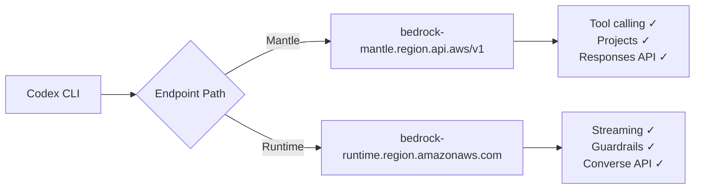
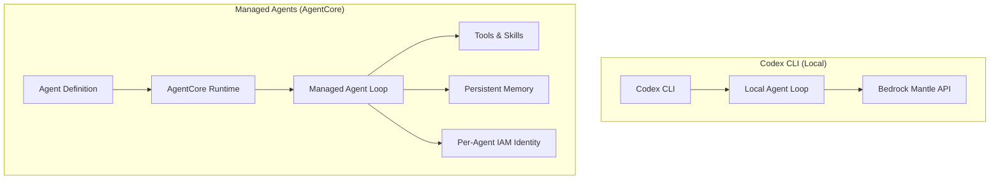

# Codex on Amazon Bedrock Goes GA: Configuration, Managed Agents, and the Enterprise Multi-Cloud Pivot


---

On 1 June 2026, OpenAI and AWS moved Codex on Amazon Bedrock from limited preview to general availability [^1]. The announcement — barely five weeks after the initial preview on 28 April [^2] — marks a significant shift: enterprise teams with existing AWS commitments can now run Codex through Bedrock's infrastructure with IAM governance, CloudTrail auditing, and PrivateLink connectivity, all billed against their existing AWS spend [^3].

This article covers what changed between preview and GA, the concrete `config.toml` setup, the Managed Agents layer built on Bedrock AgentCore, and the practical trade-offs teams should evaluate before migrating from direct OpenAI access.

## What Changed at GA

The limited preview shipped with gated access, a single region, and a narrow model selection [^2]. The GA release expands the surface considerably:

| Dimension | Limited Preview (28 Apr) | GA (1 Jun) |
|-----------|-------------------------|------------|
| Access | Application-based gating | Open to all Bedrock-enabled accounts |
| Models | `openai.gpt-oss-120b`, `openai.gpt-oss-20b` | GPT-5.5, GPT-5.4, `openai.gpt-oss-120b`, `openai.gpt-oss-20b` [^4] |
| Regions | US East (Ohio) only | US East (Ohio), US West (Oregon) for GPT-5.4; US East (Ohio) for GPT-5.5 [^4] |
| Interfaces | CLI only | CLI, Desktop App, VS Code extension [^3] |
| Pricing | Undisclosed | Per-token, matching OpenAI first-party rates, counting toward AWS commitments [^3] |

The pricing model deserves emphasis: there are no seat licences or per-developer commitments [^4]. Token consumption rolls into your existing AWS cloud spend, which means procurement teams that have already negotiated enterprise discount programmes or reserved capacity do not need a separate OpenAI contract.

## Configuration: From Direct OpenAI to Bedrock

Switching a Codex CLI installation from direct OpenAI to Bedrock requires three changes in `~/.codex/config.toml`:

```toml
model = "openai.gpt-5.5"
model_provider = "amazon-bedrock"

[model_providers.amazon-bedrock.aws]
region = "us-east-2"
```

### Authentication Pathways

Codex checks credentials in priority order [^5]:

1. **Bedrock API key** — set `AWS_BEARER_TOKEN_BEDROCK` in your environment or in `~/.codex/.env` for desktop and IDE surfaces
2. **AWS SDK credential chain** — shared config files, environment variables, SSO profiles, or federated identity via `credential_process`

For teams using AWS IAM Identity Center (the SSO path most enterprises prefer), the setup is straightforward:

```bash
aws configure sso --profile codex-bedrock
aws sso login --profile codex-bedrock
aws sts get-caller-identity --profile codex-bedrock
```

Then reference the profile in your Codex config:

```toml
[model_providers.amazon-bedrock.aws]
profile = "codex-bedrock"
```

Use temporary credentials refreshed through SSO rather than permanent access keys on developer laptops [^6]. Expired sessions are the most common cause of Codex failing to connect to Bedrock — the `codex doctor` command now surfaces authentication issues explicitly [^7].

### IAM Policy: Least Privilege

A minimal IAM policy for developers needs only two actions against the foundation model ARN [^6]:

```json
{
  "Version": "2012-10-17",
  "Statement": [
    {
      "Effect": "Allow",
      "Action": "bedrock:ListFoundationModels",
      "Resource": "*"
    },
    {
      "Effect": "Allow",
      "Action": [
        "bedrock:InvokeModel",
        "bedrock:InvokeModelWithResponseStream"
      ],
      "Resource": [
        "arn:aws:bedrock:*::foundation-model/openai.gpt-5.5"
      ]
    }
  ]
}
```

For pilots, AWS provides the managed policy `AmazonBedrockMantleInferenceAccess`; production deployments should scope by project, region, model, and owner [^6].

## The Two Endpoint Paths: Mantle vs Runtime

Bedrock exposes OpenAI models through two distinct API surfaces, and the choice matters for Codex [^6]:



**Mantle** is the path Codex CLI uses — it supports tool calling, the Responses API, and the Projects abstraction for cost isolation [^6]. The model ID on this path is `openai.gpt-oss-120b` (without the version suffix).

**Runtime** uses the standard Bedrock API with model ID `openai.gpt-oss-120b-1:0` and supports Bedrock Guardrails and the Converse API, but is not the path Codex CLI connects through [^6].

A common misconfiguration is using the Runtime model ID in `config.toml` — Codex expects the Mantle ID [^6].

### Feature Availability on Bedrock

Not every Codex feature works through Bedrock. The official documentation is explicit about what is and is not supported [^5]:

| Feature | Bedrock Status |
|---------|---------------|
| Local CLI, Desktop, IDE workflows | Supported |
| MCP servers and connectors | Supported |
| Fast Mode | Not available (on-demand inference only) |
| Hosted plugin directory | Not available |
| Cloud agents and review tools | Not available |
| Image generation / voice transcription | Not available |
| Web search tools | Disabled — Mantle supports `function` and `mcp` tool types only [^8] |

The web search limitation catches teams off guard. If your workflows depend on Codex's built-in web search, add `web_search = "disabled"` to your `config.toml` to avoid runtime errors [^8].

## Managed Agents: The AgentCore Layer

Beyond running Codex against Bedrock-hosted models, the GA announcement introduced **Bedrock Managed Agents powered by OpenAI** — currently still in limited preview [^9]. This is a fundamentally different proposition: instead of running Codex locally and routing inference to Bedrock, Managed Agents run the entire agent loop as a service on Bedrock AgentCore [^10].



The key differentiators of Managed Agents [^10]:

- **Persistent memory** that survives session boundaries — the agent retains context across days, not just within a single conversation
- **Skills** that encode procedures the agent can invoke, similar to Codex CLI's skills system but managed by the platform
- **Per-agent IAM identities** with individual roles and least-privilege enforcement
- **CloudTrail logging** for every reasoning step and tool invocation

For enterprise teams building long-running operational workflows — procurement processing, onboarding automation, or cross-system orchestration — Managed Agents provide the runtime without requiring teams to manage the agent loop infrastructure themselves [^10].

## Enterprise Security Architecture

Running Codex through Bedrock changes the security posture significantly compared to direct OpenAI access [^3]:

### Network Isolation

Configure PrivateLink interface endpoints for `bedrock`, `bedrock-runtime`, and `bedrock-mantle` services. Apply endpoint policies to restrict traffic to approved models and actions [^6]. With PrivateLink, no Codex inference traffic traverses the public internet.

### Audit and Compliance

CloudTrail captures every Bedrock API call, providing per-developer audit trails when combined with SSO-based authentication [^3]. For teams in regulated industries, this addresses the common objection that AI coding agent usage is unauditable.

### Guardrails

Service Control Policies (SCPs) can block disallowed regions and models at the organisational level [^6]. Bedrock Guardrails — available through the Runtime path — provide content safety filtering and PII redaction, though these are not directly applicable to the Mantle path that Codex CLI uses [^6].

## Migration Decision Framework

Not every team should switch to Bedrock. The trade-off matrix:

| Factor | Direct OpenAI | Bedrock |
|--------|--------------|---------|
| Feature completeness | Full (Fast Mode, cloud agents, web search, image gen) | Partial (local workflows, MCP only) |
| Authentication | API key | IAM, SSO, federated identity |
| Billing | Separate OpenAI contract | Consolidated AWS spend |
| Network isolation | Internet-facing | PrivateLink available |
| Audit trail | OpenAI dashboard | CloudTrail |
| Model freshness | Immediate access to new models | Availability lags behind direct access |

The strongest case for Bedrock is an enterprise that already has AWS commitments, needs CloudTrail-grade auditing, and primarily uses Codex for local coding workflows. Teams that depend on cloud agents, Fast Mode, or web search should stay on direct OpenAI access until Bedrock parity improves.

## Verification and Troubleshooting

After configuration, verify the setup:

```bash
# Confirm available OpenAI models in your account
aws bedrock list-foundation-models \
  --profile codex-bedrock \
  --region us-east-1 \
  --query "modelSummaries[?providerName=='OpenAI'].[modelId,modelName,modelLifecycle.status]" \
  --output table

# Check Codex provider status
codex doctor
# Or in the TUI:
# /status should show amazon-bedrock as the active provider
```

Common failure modes [^6]:

| Symptom | Cause | Fix |
|---------|-------|-----|
| Model not found | Wrong model ID for endpoint path | Use Mantle ID (`openai.gpt-5.5`), not Runtime ID |
| `AccessDeniedException` | IAM, SCP, or region restriction | Review IAM policy, SCPs, and regional model availability |
| Codex ignores Bedrock config | Outdated CLI version | Upgrade to v0.124.0+ and confirm `model_provider = "amazon-bedrock"` |
| SSO works in terminal, fails in Codex | Different profile or expired session | Re-login and verify profile matches config.toml |
| Web search errors | Mantle does not support web search tools | Set `web_search = "disabled"` in config.toml |

## What This Means for the Multi-Cloud Story

The Bedrock GA follows the end of Azure exclusivity announced in late April 2026 [^11]. OpenAI models are now available through Azure OpenAI Service, Amazon Bedrock, and directly — three distinct consumption paths with different governance, billing, and feature profiles.

For Codex CLI teams, this creates a practical multi-cloud deployment pattern: different developers or CI/CD environments can point at different providers through profile-based `config.toml` configurations, while the agent behaviour remains identical. The `--profile` flag introduced in v0.134.0 makes this operationally clean — a developer can switch between `bedrock-prod` and `openai-direct` profiles without reconfiguring their entire environment [^12].

⚠️ Regional availability remains limited. GPT-5.5 is currently available only in US East (Ohio), which may not satisfy data residency requirements for teams operating in the EU or Asia-Pacific.

## Citations

[^1]: [AWS and OpenAI announce expanded partnership to bring OpenAI models, Codex, and Managed Agents to Amazon Bedrock](https://www.aboutamazon.com/news/aws/bedrock-openai-models) — Amazon, June 2026
[^2]: [Amazon Bedrock now offers OpenAI models, Codex, and Managed Agents (Limited Preview)](https://aws.amazon.com/about-aws/whats-new/2026/04/bedrock-openai-models-codex-managed-agents/) — AWS What's New, April 2026
[^3]: [OpenAI models, Codex, and Managed Agents come to AWS](https://openai.com/index/openai-on-aws/) — OpenAI, 2026
[^4]: [Get started with OpenAI GPT-5.5, GPT-5.4 models, and Codex on Amazon Bedrock](https://aws.amazon.com/blogs/aws/get-started-with-openai-gpt-5-5-gpt-5-4-models-and-codex-on-amazon-bedrock/) — AWS Blog, June 2026
[^5]: [Use Codex with Amazon Bedrock](https://developers.openai.com/codex/amazon-bedrock) — OpenAI Developer Documentation, 2026
[^6]: [OpenAI on Amazon Bedrock: Codex, GPT-5.5, Managed Agents — Setup Guide](https://elevata.io/en/codex-openai-agents-on-amazon-bedrock-aws-setup-guide) — Elevata, 2026
[^7]: [Codex CLI v0.135 release guide](https://codex.danielvaughan.com/2026/05/29/codex-cli-v0135-release-guide-enhanced-doctor-vim-text-objects-memory-sqlite-python-sdk-sandbox/) — Codex Knowledge Base, May 2026
[^8]: [Amazon Bedrock + OpenAI Models, Codex & Managed Agents (2026 Guide)](https://www.factualminds.com/blog/amazon-bedrock-openai-models-codex-managed-agents/) — FactualMinds, 2026
[^9]: [Amazon Bedrock now offers OpenAI models, Codex, and Managed Agents (Limited Preview)](https://aws.amazon.com/about-aws/whats-new/2026/04/bedrock-openai-models-codex-managed-agents/) — AWS What's New, April 2026
[^10]: [Get to your first working agent in minutes: Announcing new features in Amazon Bedrock AgentCore](https://aws.amazon.com/blogs/machine-learning/get-to-your-first-working-agent-in-minutes-announcing-new-features-in-amazon-bedrock-agentcore/) — AWS Machine Learning Blog, 2026
[^11]: [End of Azure Exclusivity: Multi-Cloud Codex and Enterprise Deployment](https://codex.danielvaughan.com/2026/04/29/end-of-azure-exclusivity-multi-cloud-codex-enterprise-deployment/) — Codex Knowledge Base, April 2026
[^12]: [Codex CLI Changelog](https://developers.openai.com/codex/changelog) — OpenAI Developer Documentation, 2026
