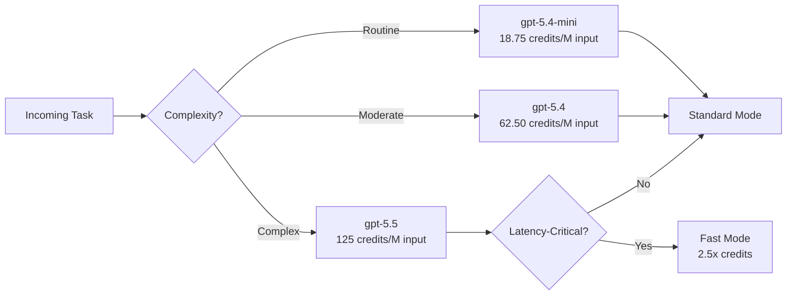
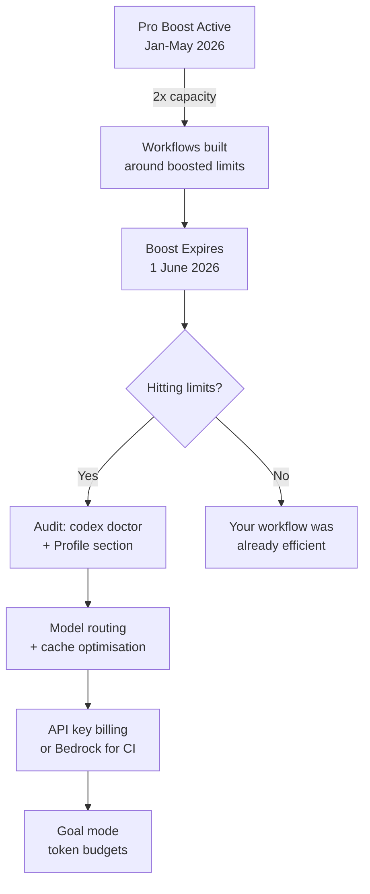

# Codex CLI After the Pro Boost: Rate Limit Reality, Token Economics, and Cost Optimisation for June 2026


## The Promotion Is Over

On 31 May 2026, the Pro 2x capacity boost quietly expired [^1]. For three months, Pro \$100 subscribers enjoyed double the standard Codex capacity — a promotional multiplier that made the tier feel like a bargain. As of 1 June, that multiplier is gone: same price, half the effective headroom [^2]. Developers who built their workflows around the promotional ceiling are now bumping into limits they have never seen before.

This article breaks down what actually changed, explains the token economics behind the rate card, and walks through concrete strategies for keeping your velocity up without doubling your spend.

## What the Rate Card Looks Like Now

Codex bills on a **credit-per-token** model, introduced on 2 April 2026 to replace per-message pricing [^3]. Credits are consumed from a rolling five-hour window, with limits varying by plan tier and model.

### Post-Promotion Five-Hour Limits (Local Messages)

| Model | Plus (\$20) | Pro 5x (\$100) | Pro 20x (\$200) |
|-------|-----------|---------------|----------------|
| GPT-5.5 | 15–80 | 80–400 | 300–1,600 |
| GPT-5.4 | 20–100 | 100–500 | 400–2,000 |
| GPT-5.4-mini | 60–350 | 300–1,750 | 1,200–7,000 |
| GPT-5.3-Codex | 10–50 | 50–250 | 200–1,000 |

The ranges reflect variable message sizes — short prompts consume fewer credits than multi-file refactors [^3]. During the promotion, Pro 5x subscribers effectively operated at the Pro 20x band. That cushion is gone.

### Credit Rates Per Million Tokens

| Model | Input | Cached Input | Output |
|-------|-------|-------------|--------|
| GPT-5.5 | 125 | 12.50 | 750 |
| GPT-5.4 | 62.50 | 6.25 | 375 |
| GPT-5.4-mini | 18.75 | 1.875 | 113 |
| GPT-5.3-Codex | 43.75 | 4.375 | 350 |

The critical ratio: **output tokens cost 6–10x more than input tokens** across every model [^3] [^4]. A session that generates verbose code explanations or large diffs burns credits far faster than one that reads context and returns targeted patches.

## The Fast Mode Tax

Fast mode reduces latency by 1.5x but increases credit consumption substantially: **2.5x for GPT-5.5** and **2x for GPT-5.4** [^5]. During the promotional period, this penalty was masked by the 2x capacity buffer. Post-promotion, Fast mode on GPT-5.5 effectively gives you 40% of the messages you had a week ago.

```toml
# ~/.codex/config.toml — disable fast mode to conserve credits
[model]
fast_mode = false
```

Reserve Fast mode for genuinely latency-sensitive interactive work. For background tasks, goal mode runs, and CI pipelines, Standard mode delivers identical output quality at half the credit cost [^5].

## Five Strategies for June 2026

### 1. Route Cheap Tasks to GPT-5.4-mini

GPT-5.4-mini input tokens cost 3.3x less than GPT-5.4 and 6.7x less than GPT-5.5 [^3]. For boilerplate generation, test scaffolding, commit message drafting, and documentation updates, the smaller model is more than adequate. Use the `/model` slash command or configure a profile:

```toml
# ~/.codex/lightweight.config.toml
[model]
model = "gpt-5.4-mini"
reasoning_effort = "medium"
fast_mode = false
```

Activate with `codex --profile lightweight` for routine tasks, saving the frontier model for architectural decisions and complex refactors [^6].



### 2. Maximise Prompt Cache Hits

Cached input tokens cost **10% of uncached input** [^3]. In a long agentic session where the same codebase context loads every turn, caching can reduce effective input costs by 80–90% [^7]. Three rules to keep the cache warm:

- **Pin your system prompt.** Do not interpolate timestamps or dynamic values into `AGENTS.md` — a single changed character before the cache breakpoint busts the prefix and you pay a full write [^7].
- **Use `--resume` instead of starting fresh.** Continuing a session preserves the cached prefix; a new session forces a cold start [^7].
- **Cap tool output size.** Setting `tool_output_token_limit = 12000` in `config.toml` forces Codex to work with summaries, keeping each turn's new tokens within the cacheable prefix window [^8].

```toml
# ~/.codex/config.toml — cache-friendly settings
[model]
tool_output_token_limit = 12000

[context]
project_doc_max_bytes = 32768
```

### 3. Switch to API Key Billing for Heavy Workloads

If your team regularly exhausts the five-hour window, API key billing offers a different economic model: pure pay-per-token with no rolling cap [^3] [^9]. Set `OPENAI_API_KEY` as an environment variable and Codex switches from subscription credits to direct API billing.

This is particularly relevant for CI/CD pipelines running `codex exec` non-interactively, where predictable per-token costs are easier to budget than opaque five-hour windows [^9].

### 4. Consider Bedrock as an Alternative Billing Path

Codex on Amazon Bedrock went GA on 1 June 2026 [^10]. For teams already operating within AWS, Bedrock offers:

- **AWS-managed billing** consolidated with existing cloud spend
- **Reserved capacity** pricing for predictable workloads
- **No five-hour rolling windows** — consumption-based billing through your AWS account

The trade-off: Bedrock currently lacks Fast mode, cloud agents, and web search [^10]. For local CLI usage and CI pipelines, those gaps may not matter.

```toml
# ~/.codex/config.toml — Bedrock provider
[model_providers.bedrock]
name = "Amazon Bedrock"
base_url = "https://bedrock-runtime.us-east-1.amazonaws.com"
auth_method = "aws-iam"
```

### 5. Use Goal Mode Token Budgets

Goal mode's `token_budget` parameter caps total token consumption for long-running autonomous tasks [^11]. Post-promotion, this is no longer optional — it is your safety valve:

```bash
codex goal "Refactor the auth module to use the new OAuth library" \
  --token-budget 500000
```

Without a budget, a goal mode run on GPT-5.5 can consume your entire five-hour allocation in a single session. Set budgets based on your remaining capacity, not the task's perceived complexity.

## Auditing Your Current Position

The `codex doctor` command (enhanced in v0.135.0) now reports environment diagnostics that include authentication method and provider configuration [^12]. Use it to verify your billing path:

```bash
codex doctor --json | jq '.auth, .provider, .model'
```

The Profile section in the Codex app displays usage statistics and token activity, giving visibility into where credits are going [^2]. Check this before and after workflow changes to measure the impact of your optimisations.

## The Model Sunset Compounds the Problem

June 2026 also brings the first wave of the Codex model deprecation [^13]. GPT-5.1-Codex variants are being retired from the CLI model picker, and the API shutdown for legacy models follows in July. If your `config.toml` still references a deprecated model, Codex will fall back to the default — which may be a more expensive model than you intended.

Audit your configuration now:

```bash
grep -r "model" ~/.codex/config.toml ~/.codex/*.config.toml .codex/config.toml 2>/dev/null
```

Replace any deprecated model strings with explicit current choices. Letting the CLI pick for you means ceding control over your credit consumption rate.

## The Bigger Picture

The Pro boost expiry follows a pattern common across AI tool launches: introductory multipliers make the tool appear cheaper than it will be at steady state [^2]. Developers who set up their workflows during the promotional window are now recalibrating.

The productive response is not to complain but to architect for cost efficiency from the start: route by complexity, cache aggressively, cap outputs, and budget goal runs. The developers who treated the promotional period as normal were always spending more tokens than they needed — the boost just hid it.



## Citations

[^1]: OpenAI, "Using Codex with your ChatGPT plan," OpenAI Help Center, 2026. [https://help.openai.com/en/articles/11369540-using-codex-with-your-chatgpt-plan](https://help.openai.com/en/articles/11369540-using-codex-with-your-chatgpt-plan)

[^2]: "OpenAI Codex Pro Pricing 2026: What Changes After the 2x Promo Ends June 1," AI Tools Recap, June 2026. [https://aitoolsrecap.com/Blog/openai-codex-pro-pricing-promo-ends-june-2026](https://aitoolsrecap.com/Blog/openai-codex-pro-pricing-promo-ends-june-2026)

[^3]: OpenAI, "Pricing – Codex," OpenAI Developers, 2026. [https://developers.openai.com/codex/pricing](https://developers.openai.com/codex/pricing)

[^4]: "Codex Pricing in 2026: Credits, Token Rates, and Limits," Verdent Guides, 2026. [https://www.verdent.ai/guides/codex-pricing-2026](https://www.verdent.ai/guides/codex-pricing-2026)

[^5]: OpenAI, "Speed – Codex," OpenAI Developers, 2026. [https://developers.openai.com/codex/speed](https://developers.openai.com/codex/speed)

[^6]: OpenAI, "Advanced Configuration – Codex," OpenAI Developers, 2026. [https://developers.openai.com/codex/config-advanced](https://developers.openai.com/codex/config-advanced)

[^7]: "Codex CLI Performance Optimisation: Token Overhead, Hidden Costs and Tuning Tactics," Codex Knowledge Base, April 2026. [https://codex.danielvaughan.com/2026/04/08/codex-cli-performance-optimization/](https://codex.danielvaughan.com/2026/04/08/codex-cli-performance-optimization/)

[^8]: OpenAI, "Configuration Reference – Codex," OpenAI Developers, 2026. [https://developers.openai.com/codex/config-reference](https://developers.openai.com/codex/config-reference)

[^9]: OpenAI, "Non-interactive mode – Codex," OpenAI Developers, 2026. [https://developers.openai.com/codex/noninteractive](https://developers.openai.com/codex/noninteractive)

[^10]: OpenAI and Amazon, "OpenAI models GPT-5.5 and GPT-5.4 — and Codex — now available on Amazon Bedrock," About Amazon, June 2026. [https://www.aboutamazon.com/news/aws/bedrock-openai-models](https://www.aboutamazon.com/news/aws/bedrock-openai-models)

[^11]: OpenAI, "Follow a goal," Codex Use Cases, 2026. [https://developers.openai.com/codex/use-cases/follow-goals](https://developers.openai.com/codex/use-cases/follow-goals)

[^12]: OpenAI, "Changelog – Codex," OpenAI Developers, 2026. [https://developers.openai.com/codex/changelog](https://developers.openai.com/codex/changelog)

[^13]: OpenAI, "Codex Model Sunset: June-July 2026," OpenAI Developers, 2026. [https://developers.openai.com/codex/changelog](https://developers.openai.com/codex/changelog)
