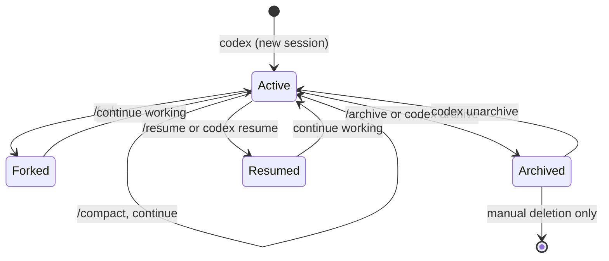

# Codex CLI Session Archiving: Lifecycle Management, Storage Architecture, and Housekeeping Workflows in v0.136


Codex CLI v0.136.0, released on 1 June 2026, introduced session archiving — a first-class mechanism for moving completed sessions out of the active working set while preserving them for future reference [^1]. For teams that have accumulated months of rollout JSONL files, this is the missing piece that turns session storage from a write-only log into a manageable knowledge archive.

This article covers the new archiving commands, the underlying storage architecture, performance implications for large session histories, and practical housekeeping workflows for solo developers and enterprise teams alike.

## Why Session Archiving Matters

Before v0.136, Codex CLI's session lifecycle had three states: active, resumable, and deleted. The `/resume` and `/fork` pickers listed every session stored under `~/.codex/sessions/`, which became unwieldy once session counts reached the hundreds [^2]. Developers working on multiple projects across months found their session pickers cluttered with irrelevant historical sessions, making it harder to locate recent work.

Session archiving introduces a fourth state — **archived** — which removes sessions from the active picker whilst preserving their rollout JSONL files intact. Archived sessions are explicitly protected from accidental `resume` or `fork` operations until restored [^1].



## The Archive Commands

### TUI: `/archive`

Within an interactive session, the `/archive` slash command archives the current conversation immediately. The session transcript is moved to the archived storage directory, and the TUI starts a fresh conversation [^1].

### CLI: `codex archive` and `codex unarchive`

For batch operations and scripting, the CLI subcommands provide direct control:

```bash
# Archive a specific session by ID
codex archive 2026-06-01T14-30-00Z-abc123

# Archive the most recent session from the current directory
codex archive --last

# Restore an archived session to active status
codex unarchive 2026-06-01T14-30-00Z-abc123
```

Once archived, a session no longer appears in `codex resume` or `codex fork` pickers. Attempting to resume an archived session produces an error directing you to `codex unarchive` first [^1].

## Storage Architecture

Understanding where archived sessions live is essential for backup strategies, compliance workflows, and debugging startup performance.

### Directory Layout

Active sessions are stored under the familiar date-partitioned path:

```
~/.codex/sessions/
└── YYYY/MM/DD/
    └── rollout-<session-id>.jsonl
```

Archived sessions move to a parallel directory structure:

```
~/.codex/archived_sessions/
└── YYYY/MM/DD/
    └── rollout-<session-id>.jsonl
```

The rollout JSONL files themselves are unchanged — archiving is a move operation, not a transformation [^3]. This means archived sessions retain their full transcript, tool call records, and token usage metadata.

### The Session Index

Codex maintains a `session_index.jsonl` file at `~/.codex/session_index.jsonl` that serves as a metadata cache for both active and archived sessions [^3]. This index stores lightweight session summaries (ID, timestamp, working directory, model, status) without duplicating the full rollout content.

When Codex starts, it loads this index to populate the session picker. Since v0.136, both active and archived directories are considered during index reconciliation [^4].

### Performance Considerations

A known issue affects developers with large archived histories: Codex Desktop rebuilds `session_index.jsonl` by scanning all files under `archived_sessions/` during startup, which can introduce noticeable latency on machines with thousands of archived sessions [^3]. The recommended mitigation is incremental index updates — treating the index as a persistent cache rather than rebuilding it from scratch — which is tracked as an improvement in the Codex issue tracker.

For CLI users, the impact is smaller because the CLI only loads the index when you explicitly invoke `codex resume`, `codex fork`, or `codex archive` operations, rather than on every startup.

## Practical Housekeeping Workflows

### Solo Developer: Weekly Archival

A straightforward approach for individual developers is a weekly archival of completed work:

```bash
#!/usr/bin/env bash
# archive-completed-sessions.sh
# Archive all sessions older than 7 days from the current project

CODEX_HOME="${CODEX_HOME:-$HOME/.codex}"
SESSIONS_DIR="$CODEX_HOME/sessions"
CUTOFF=$(date -d '7 days ago' +%Y/%m/%d 2>/dev/null || date -v-7d +%Y/%m/%d)

find "$SESSIONS_DIR" -name 'rollout-*.jsonl' -not -newermt "$CUTOFF" \
  -exec basename {} .jsonl \; | sed 's/rollout-//' | while read -r sid; do
    codex archive "$sid" 2>/dev/null && echo "Archived: $sid"
done
```

### Team: CI-Integrated Archival

For teams using Codex CLI in CI/CD pipelines via `codex exec`, sessions accumulate rapidly. A post-pipeline step can archive completed execution sessions:

```bash
# In your CI pipeline's cleanup stage
codex archive --last
```

This keeps the CI runner's session store lean without losing audit trails. The archived sessions remain available for compliance review or post-incident analysis.

### Enterprise: Retention Policies

Enterprise teams subject to data retention requirements can combine archiving with the `history` configuration in `config.toml`:

```toml
[history]
persistence = "save-all"
max_bytes = 0              # Unlimited — rely on archiving for lifecycle management
```

Archived sessions can then be backed up to object storage on a schedule, with the `archived_sessions/` directory serving as the staging area:

```bash
# Sync archived sessions to S3 for long-term retention
aws s3 sync ~/.codex/archived_sessions/ \
  s3://codex-session-archive/$(hostname)/ \
  --storage-class GLACIER_IR
```

## Integration with Session Lifecycle Commands

Session archiving complements the existing session lifecycle commands rather than replacing them. Here is how they compose:

| Command | Purpose | Works on Archived? |
|---------|---------|-------------------|
| `/resume` or `codex resume` | Continue a previous session | No — must unarchive first |
| `/fork` or `codex fork` | Branch a session into a new thread | No — must unarchive first |
| `/compact` | Summarise history to free context | Active sessions only |
| `/search` | Search conversation history (v0.134+) | ⚠️ Depends on index inclusion |
| `codex archive` | Move session to archived storage | N/A — this is the archive action |
| `codex unarchive` | Restore archived session to active | Yes — this is the restore action |

The `/search` command, introduced in v0.134 [^5], searches across the session index. Whether archived sessions appear in search results depends on whether the index includes them — by default, Codex loads both active and archived sessions into the index [^4], so archived sessions should be searchable even when they cannot be resumed directly.

## Security and File Permissions

Rollout JSONL files may contain sensitive information: API keys passed in prompts, file contents read during sessions, and tool call outputs. A related concern raised in the Codex issue tracker notes that session files are created with world-readable permissions (mode 0644) on Unix systems [^6]. When archiving sessions for long-term retention, consider tightening permissions:

```bash
# Lock down archived session permissions
chmod -R 600 ~/.codex/archived_sessions/
```

For enterprise deployments using managed configuration via `requirements.toml`, session storage paths and permissions can be enforced centrally [^7].

## Third-Party Tooling

The archiving feature has already prompted updates in the broader ecosystem:

- **ccusage** (by ryoppippi): A usage-tracking tool that now includes archived sessions in default token counting, ensuring cost reports remain accurate even after sessions are moved out of active storage [^4].
- **Codex History Viewer** (VS Code extension): Provides visual browsing of session transcripts with support for both active and archived session directories [^8].

## What is Not Yet Covered

Several aspects of session archiving remain in active development as of v0.136:

- **Bulk archive by project or date range**: Currently, archiving requires per-session IDs or `--last`. A `--before <date>` or `--project <dir>` flag would simplify batch operations. ⚠️
- **Incremental index updates**: The startup performance issue with large archives is acknowledged but not yet resolved [^3]. ⚠️
- **Archive-aware automation threads**: Codex Desktop automation threads that end with an archive directive may remain visible in the sidebar despite being archived [^9]. ⚠️

## Conclusion

Session archiving in v0.136 transforms Codex CLI's session management from a flat, ever-growing log into a structured lifecycle. For teams generating hundreds of sessions weekly — whether through interactive development, CI/CD pipelines, or Goal mode runs — archiving provides the housekeeping primitive needed to keep the tooling responsive and the session picker useful.

The combination of `/archive` in the TUI, `codex archive`/`codex unarchive` on the command line, and the parallel `archived_sessions/` directory gives developers a clean separation between active work and historical reference, without sacrificing the ability to restore and resume past sessions when needed.

## Citations

[^1]: [Codex CLI Changelog — June 2026 (v0.136.0)](https://developers.openai.com/codex/changelog), OpenAI Developers, accessed 2 June 2026.
[^2]: [Codex CLI Session Resume and History Management](https://developers.openai.com/codex/cli/features), OpenAI Developers, accessed 2 June 2026.
[^3]: [Issue #22583: Codex Desktop startup rescans archived_sessions instead of incrementally updating session_index.jsonl](https://github.com/openai/codex/issues/22583), GitHub, accessed 2 June 2026.
[^4]: [PR #849: feat(codex): include archived sessions in default usage counting](https://github.com/ryoppippi/ccusage/pull/849), ccusage project, GitHub, accessed 2 June 2026.
[^5]: [Codex CLI v0.134.0 Release — Local Conversation Search](https://developers.openai.com/codex/changelog), OpenAI Developers, accessed 2 June 2026.
[^6]: [Issue #21660: rollout session JSONL files are created world-readable (mode 0644) on Unix](https://github.com/openai/codex/issues/21660), GitHub, accessed 2 June 2026.
[^7]: [Codex CLI Enterprise Deployment — Managed Configuration](https://developers.openai.com/codex/cli/reference), OpenAI Developers, accessed 2 June 2026.
[^8]: [Codex History Viewer — VS Code Extension](https://marketplace.visualstudio.com/items?itemName=hiztam.codex-history-viewer), Visual Studio Marketplace, accessed 2 June 2026.
[^9]: [Issue #23246: Codex Desktop archived automation threads remain visible in sidebar](https://github.com/openai/codex/issues/23246), GitHub, accessed 2 June 2026.
