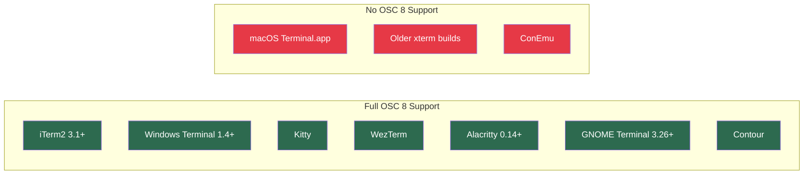

# Codex CLI Terminal Ergonomics: File Openers, OSC 8 Hyperlinks, Notifications, and Shell Integration for a Friction-Free Environment


---

Codex CLI ships with sensible defaults, but the developers who get the most from it are the ones who tune the boundary layer between the agent and the terminal. File references that open in your IDE with a click. Hyperlinks you can follow without copy-pasting. Desktop notifications that fire when a goal completes while you are reviewing another PR. Shell completions that save keystrokes on every invocation.

These are not headline features. They are the ergonomic details that determine whether Codex CLI feels like a seamless extension of your terminal or a tool you have to work around. This article covers every terminal-integration surface in the current release (v0.136.0, 1 June 2026), with configuration recipes and compatibility notes.

## File Openers: Click-to-Navigate from Agent Output

When Codex references a file in its output — a citation, a diff header, or a code block attribution — the `file_opener` setting determines how that reference becomes actionable [^1].

```toml
# ~/.codex/config.toml
file_opener = "vscode"
```

Supported values are `vscode`, `vscode-insiders`, `cursor`, `windsurf`, and `none` [^1]. The setting controls the URI scheme Codex uses when rendering file citations. With `vscode`, a file reference becomes a `vscode://file/...` URI; with `cursor`, it becomes `cursor://file/...`. Setting `none` disables clickable file references entirely.

### Choosing the Right Opener

| Editor | Config Value | URI Scheme | Notes |
|--------|-------------|------------|-------|
| VS Code | `vscode` | `vscode://file/...` | Default. Works on macOS, Linux, Windows [^1] |
| VS Code Insiders | `vscode-insiders` | `vscode-insiders://file/...` | For developers on the Insiders channel |
| Cursor | `cursor` | `cursor://file/...` | Cursor registers its own URI handler |
| Windsurf | `windsurf` | `windsurf://file/...` | Codeium's fork of VS Code |
| None | `none` | Plain text | Use when your terminal or editor lacks URI handler support |

If you use JetBrains IDEs, `file_opener` does not yet support IntelliJ-family URI schemes. The workaround is to set `file_opener = "none"` and rely on your terminal emulator's path-detection feature instead [^1].

### WSL Considerations

On Windows Subsystem for Linux, file paths need translating from `/mnt/c/...` to `C:\...` for VS Code's URI handler to resolve correctly. Codex handles this automatically when `file_opener = "vscode"` is set and the CLI detects a WSL environment [^2]. If you encounter issues, verify that the `code` command is available on your WSL `$PATH` — the VS Code Remote WSL extension installs it automatically.

## OSC 8 Hyperlinks: Clickable Web Links in the TUI

Version 0.136.0 (1 June 2026) introduced OSC 8 terminal hyperlinks in the TUI's markdown renderer [^3]. Prior to this release, URLs in agent output were rendered as plain text — visible but not clickable. Now, in terminals that support the OSC 8 escape sequence, web links are directly clickable.

### What Changed

Three pull requests landed the feature: #24472 added OSC 8 web link metadata to rich content rendering, #24636 switched cramped markdown tables to a key-value record format that preserves link targets, and #24825 fixed hyperlink-aware rendering in the key-value layout [^3].

The practical result: when Codex cites a Stack Overflow answer, links to documentation, or references a GitHub issue, you click the link rather than selecting text and pasting into a browser.

### Terminal Compatibility

OSC 8 support varies across terminal emulators [^4]:



If your terminal does not support OSC 8, the links degrade gracefully — they render as plain text with no broken escape sequences. No configuration is required; Codex emits the OSC 8 metadata unconditionally and lets the terminal decide what to do with it [^3].

## Notification Configuration: Never Miss a Completed Turn

Codex supports two independent notification channels: built-in TUI notifications (terminal bell or OSC 9) and an external `notify` command for webhooks, desktop alerts, and CI integration [^5].

### TUI Notifications

```toml
# ~/.codex/config.toml
[tui]
notification_method = "auto"       # "auto" | "osc9" | "bel"
notification_condition = "unfocused"  # "unfocused" | "always"
notifications = true                # true | false | ["event-type", ...]
```

The `notification_method` setting controls the escape sequence used [^1]:

- **`auto`** — Codex detects your terminal and picks the best method. iTerm2 and compatible terminals get OSC 9; others fall back to BEL (`\a`).
- **`osc9`** — Force OSC 9, which produces a native macOS notification banner in iTerm2. This is the richest option on macOS.
- **`bel`** — The traditional terminal bell. Works everywhere, including inside tmux and screen.

The `notification_condition` setting prevents notification spam when you are actively watching the TUI. Set it to `"always"` if you run Codex in a background tmux pane and want alerts regardless of focus state [^1].

### External Notify Command

For anything beyond terminal bells, the `notify` key accepts an array of strings forming a command that Codex invokes on supported events (currently `agent-turn-complete`) [^5]:

```toml
# ~/.codex/config.toml
notify = ["python3", "/home/dev/scripts/codex-notify.py"]
```

Codex passes a JSON payload as a command-line argument containing the notification title, message, thread ID, and last assistant message [^5]. This unlocks integrations with desktop notification daemons, Slack webhooks, Discord bots, and monitoring systems.

A minimal macOS notification script using `terminal-notifier`:

```bash
#!/usr/bin/env bash
# ~/scripts/codex-notify.sh
TITLE=$(echo "$1" | jq -r '.title // "Codex"')
MSG=$(echo "$1" | jq -r '.message // "Turn complete"')
terminal-notifier -title "$TITLE" -message "$MSG" -sound default
```

```toml
notify = ["bash", "/home/dev/scripts/codex-notify.sh"]
```

Community projects like `codex-notify` and `agent-notify` provide richer macOS integrations with VS Code activation and sound customisation [^6][^7].

## Shell Completions: Tab-Complete Every Subcommand

Codex CLI generates completion scripts for bash, zsh, fish, elvish, and PowerShell via the `codex completion` subcommand [^8]:

```bash
# Bash — persist to user completions directory
codex completion bash > ~/.local/share/bash-completion/completions/codex

# Zsh — write to first fpath entry
codex completion zsh > "${fpath[1]}/_codex"

# Fish — drop into Fish's completions directory
codex completion fish > ~/.config/fish/completions/codex.fish
```

The generated script reflects the version of Codex that produced it. After upgrading Codex, regenerate completions to pick up new subcommands and flags [^8]. For zsh, ensure `autoload -Uz compinit && compinit` appears in `~/.zshrc` before completion-related configuration [^8].

### What Gets Completed

Completions cover top-level subcommands (`exec`, `resume`, `archive`, `mcp`, `doctor`, `cloud`, `completion`), global flags (`--model`, `--profile`, `--approval-mode`, `--sandbox-mode`), and context-sensitive values where applicable (e.g., `--profile` completes against discovered profile names in `~/.codex/`) [^8].

## Display Settings: Controlling the Visual Environment

Three `tui.*` settings adjust the visual behaviour of the TUI itself [^1]:

```toml
[tui]
alternate_screen = "auto"   # "auto" | "always" | "never"
animations = true            # welcome shimmer, spinners
show_tooltips = true         # onboarding hints on first run
```

### Alternate Screen and Scrollback

The `alternate_screen` setting determines whether Codex uses the terminal's alternate screen buffer (the same mechanism `vim` and `less` use). When set to `"never"`, Codex output remains in your terminal's scrollback after exiting — useful for reviewing what Codex did without resuming the session [^1].

The `"auto"` default detects Zellij (which handles alternate screen poorly) and skips it automatically. In tmux, alternate screen works as expected [^1].

### Animations

Setting `animations = false` disables the welcome screen shimmer, loading spinners, and transition effects. This is worth doing on slower SSH connections or when piping terminal output through a session recorder [^1].

## Putting It All Together: A Complete Ergonomic Configuration

```toml
# ~/.codex/config.toml — terminal ergonomics section

# Open file citations in VS Code
file_opener = "vscode"

# Desktop notification on turn completion (macOS)
notify = ["bash", "/home/dev/scripts/codex-notify.sh"]

[tui]
# OSC 9 notifications when terminal loses focus
notification_method = "osc9"
notification_condition = "unfocused"
notifications = true

# Preserve scrollback for post-session review
alternate_screen = "never"

# Disable animations on remote connections
animations = true

# Hide tooltips after onboarding
show_tooltips = false
```

Combined with shell completions and a terminal emulator that supports OSC 8 (iTerm2, Kitty, WezTerm, or Windows Terminal), this configuration eliminates the most common friction points between Codex CLI and the terminal environment. Every URL is clickable, every file reference opens in your editor, and every completed turn sends a notification — without any manual intervention.

## Citations

[^1]: OpenAI, "Configuration Reference — Codex," OpenAI Developers, 2026. [https://developers.openai.com/codex/config-reference](https://developers.openai.com/codex/config-reference)

[^2]: GitHub, "Terminal hyperlink support for file references, with optional WSL-aware VS Code URL handling," openai/codex#13213. [https://github.com/openai/codex/issues/13213](https://github.com/openai/codex/issues/13213)

[^3]: OpenAI, "Release 0.136.0," openai/codex, 1 June 2026. [https://github.com/openai/codex/releases/tag/rust-v0.136.0](https://github.com/openai/codex/releases/tag/rust-v0.136.0)

[^4]: Egmont Koblinger, "Hyperlinks in Terminal Emulators," GitHub Gist, maintained 2017–2026. [https://gist.github.com/egmontkob/eb114294efbcd5adb1944c9f3cb5feda](https://gist.github.com/egmontkob/eb114294efbcd5adb1944c9f3cb5feda)

[^5]: OpenAI, "Advanced Configuration — Codex," OpenAI Developers, 2026. [https://developers.openai.com/codex/config-advanced](https://developers.openai.com/codex/config-advanced)

[^6]: heydong1, "codex-notify: macOS desktop notification helper for Codex CLI's notify hook," GitHub, 2026. [https://github.com/heydong1/codex-notify](https://github.com/heydong1/codex-notify)

[^7]: paultendo, "agent-notify: macOS notifications for Codex with VSCode activation," GitHub, 2026. [https://github.com/paultendo/agent-notify](https://github.com/paultendo/agent-notify)

[^8]: OpenAI, "Command line options — Codex CLI," OpenAI Developers, 2026. [https://developers.openai.com/codex/cli/reference](https://developers.openai.com/codex/cli/reference)
