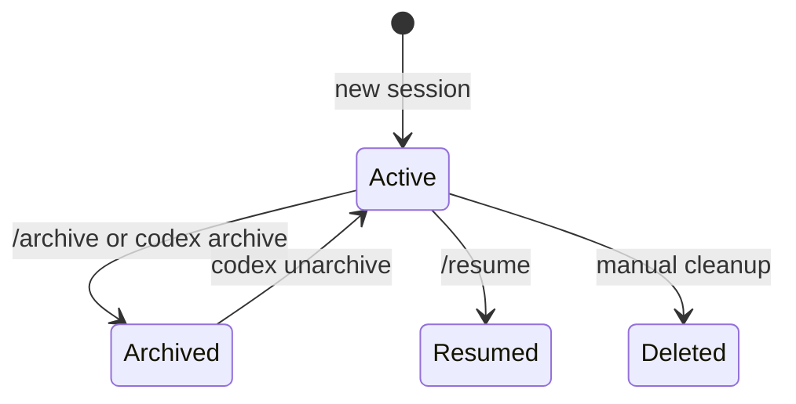
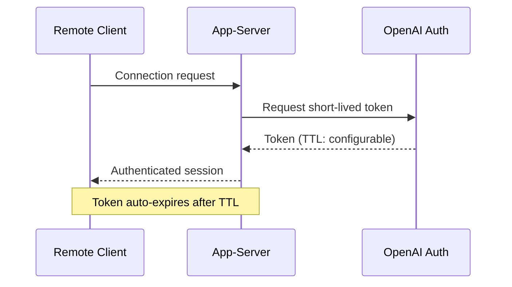

# Codex CLI v0.136 Release Guide: OSC 8 Hyperlinks, Session Archiving, App-Server Stdio, and the Elevated Windows Sandbox


---

Codex CLI v0.136.0 shipped on 1 June 2026, closing out a rapid six-release sprint from v0.130 that transformed the tool from a capable terminal agent into an enterprise-grade platform [^1]. Where previous releases in this sprint focused on headline features — conversation history search in v0.134 [^2], richer `codex doctor` diagnostics in v0.135 [^3] — v0.136 is a polish-and-hardening release that touches the TUI rendering pipeline, session lifecycle, app-server integration surface, remote execution security, and Windows sandbox provisioning. This article breaks down every significant change and its practical implications.

## TUI Markdown: OSC 8 Clickable Hyperlinks

The most visible improvement for daily users is native clickable links inside the TUI. Before v0.136, Codex rendered Markdown links as plain text — the URL appeared in parentheses, but clicking did nothing. The agent would generate helpful references to documentation, Stack Overflow threads, and GitHub issues, yet developers had to copy-paste URLs manually [^4].

v0.136 emits OSC 8 escape sequences around web links, the same protocol supported by iTerm2, WezTerm, Windows Terminal, Ghostty, GNOME Terminal, and most modern terminal emulators [^5]. A Markdown link like `[Codex docs](https://developers.openai.com/codex/cli)` now renders as a single clickable phrase. Cmd+click (macOS) or Ctrl+click (Linux/Windows) opens the URL in the default browser.

### Table Rendering Improvements

Alongside OSC 8, v0.136 changes how the TUI renders Markdown tables that exceed terminal width. Rather than clipping columns, cramped tables now switch to a key/value record layout — one row per field — whilst preserving hyperlink targets [^1]. For agent responses that include API reference tables or feature comparison matrices, this eliminates the truncation that previously made wide tables unreadable in narrow terminals.

```toml
# No configuration needed — OSC 8 is enabled automatically.
# Verify your terminal supports it:
# printf '\e]8;;https://example.com\e\\Click me\e]8;;\e\\\n'
```

## Session Archiving: The Fourth Lifecycle State

Session archiving is the headline feature of v0.136, covered in detail in a [companion article](2026-06-02-codex-cli-session-archiving-lifecycle-management-v0136.md). In brief: sessions now move through four states — **active**, **archived**, **resumed**, and **deleted** — with the `/archive` TUI command and `codex archive` / `codex unarchive` CLI subcommands controlling the transition [^1].

The practical benefit is immediate for anyone with more than a few dozen sessions: the `/resume` picker no longer lists every session ever created. Archived sessions move to `~/.codex/archived_sessions/` and are excluded from search and resume until explicitly restored [^1].



## App-Server: Stdio Mode and Thread Resume

The Codex app-server — the JSON-RPC 2.0 daemon that powers the Python SDK, IDE extension, and remote connections — received three improvements in v0.136 [^1]:

### `--stdio` Launch Mode

A new `codex app-server --stdio` flag starts the server with JSON-RPC messages flowing over stdin/stdout instead of a Unix socket or TCP port [^1]. This simplifies integration with editors and orchestrators that already speak stdio JSON-RPC (notably the Language Server Protocol family). Where previously you needed to manage a socket path or port allocation, stdio mode lets you spawn the app-server as a subprocess and communicate directly through piped streams.

```bash
# Launch app-server in stdio mode for embedding
codex app-server --stdio

# Python SDK can now use this as a subprocess transport
# instead of connecting to a socket
```

### Thread Resume with Initial Turns Page

App-server integrations can now resume a thread and receive its initial turns page in the same response [^1]. Before v0.136, resuming a thread via JSON-RPC returned an empty acknowledgement; the client then had to issue a separate `thread.turns.list` call to populate the conversation history. The combined response eliminates this round-trip, which matters for IDE extensions that need to display the conversation state immediately on tab switch.

### Richer MCP Server Status

The app-server now exposes detailed MCP server status through its status endpoints [^1]. Integrations can inspect which MCP servers are connected, their health state, and which tools each server provides — information previously only visible through `codex doctor` or the TUI `/status` command. This is particularly useful for monitoring dashboards and orchestrators that need to verify tool availability before dispatching work.

## Remote Execution Security Hardening

v0.136 tightens the security model for remote execution in two ways [^1]:

### CODEX_API_KEY Registration

Remote execution setups can now register a `CODEX_API_KEY` for approved OpenAI hosts, creating a persistent credential binding between the machine and the API account [^1]. This replaces ad-hoc environment variable management for headless deployments, CI runners, and persistent daemon processes.

### Short-Lived Server Tokens

Remote-control WebSocket connections now authenticate using short-lived server tokens instead of long-lived ChatGPT access tokens [^1]. The tokens are generated on connection initiation and expire after a configurable interval, reducing the blast radius if a token is intercepted. This change aligns with the broader security principle that tokens should have the minimum lifetime necessary for their purpose.



## Command Safety Hardening

v0.136 closes several subtle attack vectors in the command execution pipeline [^1]:

- **`/diff` Git helper isolation**: The `/diff` command now prevents repository-provided Git helpers (configured via `.gitconfig` or `.gitattributes`) from executing. This blocks a class of attacks where a malicious repository configures a custom diff driver that runs arbitrary code when Codex invokes `git diff` [^1].

- **PowerShell parser blocking**: PowerShell command parsing is now blocked on non-Windows platforms, preventing cross-platform confusion attacks where a crafted command intended for PowerShell execution is injected on a Unix host [^1].

- **WebSocket origin validation**: Browser-origin WebSocket handshakes are rejected, preventing a website from connecting to a locally running app-server instance [^1]. This is a defence-in-depth measure against cross-origin WebSocket hijacking.

## Windows Sandbox: Elevated Provisioning (Alpha)

The Windows sandbox gains an alpha `codex sandbox setup --elevated` provisioning path [^1]. This addresses the gap between the existing unelevated sandbox (which has limited isolation capabilities) and the full macOS/Linux sandbox experience.

The elevated sandbox provisions four defence layers [^6]:

1. **Dedicated sandbox user** — a `CodexSandboxUsers` group member with minimum logon rights
2. **Filesystem ACLs** — write access restricted to the project working directory
3. **Windows Firewall rules** — outbound network access blocked unless explicitly approved
4. **Private desktop** — UI isolation prevents the agent from interacting with the user's desktop session

```toml
# config.toml — enable elevated sandbox on Windows
[windows]
sandbox = "elevated"
```

The elevated setup requires administrator approval on first run. Subsequent sessions reuse the provisioned configuration. Note that this remains alpha and may require `codex features enable windows_elevated_sandbox` depending on your feature flag state [^1].

## Bedrock and Provider Updates

Amazon Bedrock integration receives two fixes: AWS region fallback support ensures connections succeed when the primary region is unavailable, and unsupported service tiers are no longer advertised in model selection, preventing users from selecting configurations that would fail at runtime [^1]. The Bedrock model catalogue has been refreshed to include GPT-5.5 and remove deprecated open-source model entries [^1].

MCP dependencies have been updated to rmcp 1.7.0, and several edge cases around stdio server cleanup, plugin MCP approval persistence, and custom MCP metadata isolation have been resolved [^1].

## Python SDK: Independent Release Process

Starting with v0.136, the Python SDK follows an independent release cadence using `python-v*` tags, decoupled from the CLI binary releases [^1]. The public configuration type has been standardised as `CodexConfig`, and the beta documentation now references `pip install openai-codex` as the canonical installation path [^1].

This decoupling means SDK improvements can ship without waiting for a CLI release cycle, and vice versa — a significant operational improvement for teams building programmatic integrations.

## Bug Fixes Worth Knowing

Several fixes address issues that affected daily workflows [^1]:

| Fix | Impact |
|-----|--------|
| ChatGPT token refresh with reused tokens now prompts explicit relogin | Eliminates silent authentication failures mid-session |
| Prompt history seeds from session transcripts | Previous session prompts appear in Ctrl+R history |
| Multiline hook output renders as separate rows | Hook output no longer collapses into unreadable single lines |
| Vim normal-mode editing corrections | `dw`, `cw`, and word-motion commands behave correctly |
| Filesystem watcher debounce batching | File change notifications no longer fire redundantly |
| Web search calls show/restore completed activity | Search results no longer disappear from the TUI |

## Upgrading

```bash
# Update via npm (if installed via npm)
npm update -g @openai/codex

# Update via the standalone installer
curl -fsSL https://codex.openai.com/install.sh | sh

# Verify
codex --version
# Expected: 0.136.0

# Check configuration compatibility
codex doctor
```

After upgrading, run `codex doctor` to verify that existing MCP servers, permission profiles, and feature flags are compatible with the new release. The v0.136 doctor output includes the richer diagnostics introduced in v0.135 [^3], making it the single best command for validating your installation.

## What This Release Signals

v0.136 is not a flashy feature release. It is a hardening release — the kind that signals a platform nearing production maturity. OSC 8 hyperlinks remove a daily friction point. Session archiving addresses a scalability problem that only affects serious users. The elevated Windows sandbox closes the last major platform parity gap. Short-lived server tokens and Git helper isolation close attack vectors that security teams flag in enterprise reviews.

For teams evaluating Codex CLI for enterprise adoption, v0.136 is the release to benchmark against: it represents the cumulative maturity of the v0.130–v0.136 sprint, with the security and operational improvements that procurement teams need to see before signing off [^7].

## Citations

[^1]: OpenAI, "Release 0.136.0", GitHub, 1 June 2026. [https://github.com/openai/codex/releases/tag/rust-v0.136.0](https://github.com/openai/codex/releases/tag/rust-v0.136.0)

[^2]: OpenAI, "Release 0.134.0", GitHub, 26 May 2026. [https://github.com/openai/codex/releases/tag/rust-v0.134.0](https://github.com/openai/codex/releases/tag/rust-v0.134.0)

[^3]: OpenAI, "Release 0.135.0", GitHub, 28 May 2026. [https://github.com/openai/codex/releases/tag/rust-v0.135.0](https://github.com/openai/codex/releases/tag/rust-v0.135.0)

[^4]: GitHub Issue #17922, "Feature request: native OSC 8 clickable terminal links in interactive TUI", openai/codex. [https://github.com/openai/codex/issues/17922](https://github.com/openai/codex/issues/17922)

[^5]: "Hyperlinks (a.k.a. HTML-like anchors) in terminal emulators", GitHub Gist. [https://gist.github.com/egmontkob/eb114294efbcd5adb1944c9f3cb5feda](https://gist.github.com/egmontkob/eb114294efbcd5adb1944c9f3cb5feda)

[^6]: OpenAI, "Building a safe, effective sandbox to enable Codex on Windows", OpenAI Blog, 15 May 2026. [https://openai.com/index/building-codex-windows-sandbox/](https://openai.com/index/building-codex-windows-sandbox/)

[^7]: OpenAI, "Codex Changelog", OpenAI Developers. [https://developers.openai.com/codex/changelog](https://developers.openai.com/codex/changelog)
