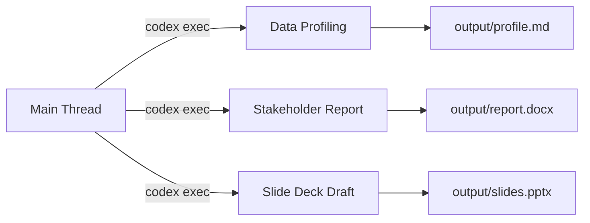

# Codex at Five Million: What the Knowledge-Work Explosion Means for CLI Power Users


---

On 2 June 2026 OpenAI published *The Next Era of Knowledge Work*, confirming that Codex has crossed five million weekly active users — a six-fold increase since the desktop app launched in February[^1]. The headline-grabbing number matters less than what it conceals: knowledge workers now represent roughly twenty per cent of the user base and are adopting Codex three times faster than developers[^2]. Data analysis alone grew 110 per cent week over week, with research up 37 per cent and report-plus-spreadsheet creation up 36 per cent[^3].

For CLI practitioners, these numbers are not abstract. They reshape rate-limit headroom, model-routing economics, roadmap priorities, and the kinds of tasks Codex is being optimised for. This article unpacks the implications and provides concrete `codex exec` recipes so CLI users can ride the wave rather than be swamped by it.

## The Growth Anatomy

OpenAI breaks usage into five task categories. The percentage of weekly active users performing each one is revealing[^4]:

| Task Category | % of Weekly Users | WoW Growth |
|---|---|---|
| Artefact production (reports, memos, PDFs, spreadsheets) | 72 % | 36 % |
| Engineering operations | 47 % | — |
| Code implementation | 46 % | — |
| Application management | 42 % | — |
| Research | 41 % | 37 % |

The dominance of artefact production — now the single most common task category, outstripping pure coding — signals a platform-level shift. Half of all users now run multiple parallel Codex tasks daily, up from below a third in mid-April[^5].

## Why CLI Developers Should Care

### Rate-Limit Pressure

Five million users competing for the same inference fleet means capacity planning matters more than ever. The five-hour rolling token window already causes throttling for Pro subscribers running heavy agentic loops[^6]. With knowledge workers now consuming substantial capacity on artefact-generation tasks — which tend to produce large outputs — CLI developers relying on sustained throughput for CI pipelines and multi-file refactors face increased contention.

Practical mitigations:

1. **Prefer cached input tokens.** Cached tokens cost roughly ten per cent of fresh input tokens[^7]. Structure your `AGENTS.md` and system prompts so they remain stable across turns, maximising cache hits.
2. **Route cold analytical work to off-peak hours.** Knowledge workers tend to concentrate usage during business hours (UTC−5 to UTC+1). Scheduling `codex exec` batch jobs via cron for early morning or late evening reduces contention.
3. **Use API-key billing for deterministic budgets.** CLI users who authenticate via `CODEX_API_KEY` pay per-token rather than drawing from a subscription pool, giving predictable cost isolation from the subscription crowd[^8].

### Model-Routing Recalibration

The knowledge-work expansion means OpenAI is optimising models for broader task profiles. GPT-5.5 already outperforms GPT-5.3-Codex on agentic benchmarks (81.5 vs 71.5 average)[^9], partly because agentic tasks now include data wrangling and document assembly alongside code generation. For CLI users the practical implication is straightforward:

```toml
# config.toml — model routing for mixed workloads
[profiles.code]
model = "gpt-5.3-codex"
model_reasoning_effort = "high"

[profiles.analysis]
model = "gpt-5.5"
model_reasoning_effort = "medium"
```

Switch profiles at invocation time:

```bash
# Code refactoring — use the Codex-optimised model
codex -p code "Refactor the auth module to use dependency injection"

# Data analysis — use the broader model
codex exec -p analysis "Analyse @data/sales-q2.csv and produce a summary report"
```

GPT-5.3-Codex still edges ahead on pure coding benchmarks (63.1 vs 58.6)[^9], so maintaining separate profiles avoids paying the GPT-5.5 token premium (\$5.00/\$30.00 per 1M input/output) for tasks where the cheaper model (\$1.75/\$14.00) performs better[^10].

### Roadmap Signal

When seventy-two per cent of your users produce non-code artefacts, product investment follows. The official data-analysis use-case guide already recommends a full folder structure (`data/raw/`, `data/processed/`, `analysis/`, `output/`) and skills like `$spreadsheet`, `$doc`, and `$pdf` for output formatting[^11]. Expect the CLI to gain first-class support for:

- Richer structured-output schemas for tabular data
- Native `--output-format` flags beyond JSON (CSV, XLSX)
- Tighter integration with the `$jupyter` skill for reproducible analysis notebooks

## Practical CLI Recipes for Knowledge Work

The following recipes work today with Codex CLI v0.136.0.

### Recipe 1: CSV Analysis Pipeline

```bash
# Ingest, profile, and summarise a dataset in one shot
codex exec -p analysis \
  --output-last-message /tmp/report.md \
  "Read @data/transactions.csv. \
   Profile every column: type, nulls, unique count, range. \
   Flag data-quality issues. \
   Answer: what is the month-over-month revenue trend? \
   Output a markdown report with an embedded Mermaid bar chart."
```

The `--output-last-message` flag captures the final response to a file, making it composable with downstream tools[^12].

### Recipe 2: Multi-Source Join and Report

```bash
codex exec -p analysis \
  --sandbox workspace-write \
  "Join @data/customers.csv and @data/orders.csv on customer_id. \
   Report match rate and null coverage before proceeding. \
   Compute top-10 customers by lifetime value. \
   Write results to output/ltv-report.md and output/ltv-top10.csv."
```

The `AGENTS.md` directive "raw files should never be overwritten"[^11] is worth adopting for any data-analysis project to prevent accidental data mutation.

### Recipe 3: Piped Stdin for Ad-Hoc Queries

```bash
# Pipe API response directly into Codex for analysis
curl -s https://api.example.com/metrics/weekly \
  | codex exec -p analysis \
    "Parse this JSON. Identify any metrics that deviated more than 2σ \
     from the trailing 4-week average. Format as a markdown table."
```

The prompt-plus-stdin pattern treats the positional argument as the instruction and piped content as structured context[^13].

### Recipe 4: Scheduled Report Generation

```bash
# crontab entry — daily sales summary at 06:00
0 6 * * * cd /srv/analytics && \
  codex exec -p analysis \
    --skip-git-repo-check \
    --ephemeral \
    --output-last-message /srv/reports/daily-$(date +\%F).md \
    "Read data/daily-export.csv. Produce a morning sales briefing \
     with yesterday's headline figures, week-on-week delta, \
     and three bullet-point insights."
```

The `--ephemeral` flag prevents session files from accumulating on disk, and `--skip-git-repo-check` allows execution outside a Git repository[^12].

## The Parallel-Task Pattern

OpenAI's report notes that fifty per cent of users now run multiple Codex tasks concurrently[^5]. For CLI users, this maps directly onto worktree-based parallelism:



Each task runs in its own `codex exec` invocation with `--ephemeral`, avoiding session-state interference. For heavier workflows, spawn each in a separate Git worktree so file writes never collide:

```bash
git worktree add /tmp/wt-profiling -b analysis/profiling
git worktree add /tmp/wt-report -b analysis/report

codex exec -C /tmp/wt-profiling -p analysis "Profile @data/q2.csv" &
codex exec -C /tmp/wt-report -p analysis "Write Q2 board report from @data/q2.csv" &
wait
```

## Enterprise Implications

The knowledge-work expansion is not merely a consumer phenomenon. OpenAI's report highlights that US knowledge workers spend twenty-eight per cent of their workweek on email and twenty per cent searching for internal information[^14]. Enterprise teams deploying Codex CLI for CI/CD and code review now face internal demand from non-engineering functions — product managers wanting automated competitive analyses, finance teams requesting reconciliation scripts, and compliance officers needing audit-trail generators.

For platform engineering teams, this means:

1. **Extend `requirements.toml` to non-engineering groups.** Define separate managed-configuration policies for data analysts and report authors with appropriate sandbox constraints (typically `workspace-write` with no network access)[^15].
2. **Monitor token consumption by profile.** Use OpenTelemetry telemetry exports to track usage across `code` and `analysis` profiles, preventing knowledge-work tasks from exhausting engineering budgets.
3. **Curate analysis-specific skills.** Package organisation-specific data schemas, report templates, and compliance checklists as Codex skills so knowledge workers get guardrails without requiring CLI expertise.

## What This Does Not Change

The knowledge-work pivot is real, but the CLI remains a developer-first surface. The data-analysis and report-generation patterns above work precisely because `codex exec` treats every task as a code-generation problem — it writes Python scripts, runs them in the sandbox, and captures output[^16]. The agent has not gained native spreadsheet or word-processor capabilities; it composes them from code. That architectural reality means:

- **Reproducibility is built in.** Every analysis produces a script that can be re-run, version-controlled, and reviewed.
- **The sandbox still enforces boundaries.** Knowledge-work tasks inherit the same Seatbelt/Landlock/DACL enforcement as code tasks[^17].
- **AGENTS.md governs behaviour.** The same instruction hierarchy that prevents your agent from rewriting production configs also prevents it from silently inventing merge keys in a data join[^11].

## Looking Ahead

The five-million-user milestone is a leading indicator, not a destination. With personal (non-developer) users growing four times faster than developers[^2], the Codex platform is under sustained pressure to broaden beyond its code-centric roots. CLI users who build fluency with `codex exec` for structured data and report generation now will be well positioned as the tooling matures — and will have the prompt-engineering patterns already committed to their `AGENTS.md` files when the next wave of users arrives.

---

## Citations

[^1]: OpenAI, "Codex is becoming a productivity tool for everyone," openai.com, 2 June 2026. [https://openai.com/index/codex-for-knowledge-work/](https://openai.com/index/codex-for-knowledge-work/)

[^2]: Help Net Security, "Codex knowledge work expands into research, reports, and spreadsheets," 2 June 2026. [https://www.helpnetsecurity.com/2026/06/02/openai-codex-knowledge-work/](https://www.helpnetsecurity.com/2026/06/02/openai-codex-knowledge-work/)

[^3]: Let's Data Science, "OpenAI Codex Expands Into Research, Reports, Spreadsheets," 2 June 2026. [https://letsdatascience.com/news/openai-codex-expands-into-research-reports-spreadsheets-559051be](https://letsdatascience.com/news/openai-codex-expands-into-research-reports-spreadsheets-559051be)

[^4]: Ibid.

[^5]: OpenAI, "Codex is becoming a productivity tool for everyone," op. cit.

[^6]: OpenAI Help Center, "Codex rate card," 2026. [https://help.openai.com/en/articles/20001106-codex-rate-card](https://help.openai.com/en/articles/20001106-codex-rate-card)

[^7]: OpenAI Developers, "Codex Pricing," 2026. [https://developers.openai.com/codex/pricing](https://developers.openai.com/codex/pricing)

[^8]: OpenAI Developers, "Codex CLI Reference — Command Line Options," 2026. [https://developers.openai.com/codex/cli/reference](https://developers.openai.com/codex/cli/reference)

[^9]: BenchLM.ai, "GPT-5.3 Codex vs GPT-5.5: AI Benchmark Comparison 2026." [https://benchlm.ai/compare/gpt-5-3-codex-vs-gpt-5-5](https://benchlm.ai/compare/gpt-5-3-codex-vs-gpt-5-5)

[^10]: OpenAI, "Introducing GPT-5.5," April 2026. [https://openai.com/index/introducing-gpt-5-5/](https://openai.com/index/introducing-gpt-5-5/)

[^11]: OpenAI Developers, "Analyze datasets and ship reports — Codex use cases," 2026. [https://developers.openai.com/codex/use-cases/datasets-and-reports](https://developers.openai.com/codex/use-cases/datasets-and-reports)

[^12]: OpenAI Developers, "Non-interactive mode — Codex," 2026. [https://developers.openai.com/codex/noninteractive](https://developers.openai.com/codex/noninteractive)

[^13]: OpenAI, Codex CLI source — stdin piping for `codex exec`, PR #15917. [https://github.com/openai/codex/pull/15917/files](https://github.com/openai/codex/pull/15917/files)

[^14]: OpenAI, "Codex is becoming a productivity tool for everyone," op. cit.

[^15]: OpenAI Developers, "Managed configuration — Codex Enterprise," 2026. [https://developers.openai.com/codex/enterprise/managed-configuration](https://developers.openai.com/codex/enterprise/managed-configuration)

[^16]: DataCamp, "Codex CLI For Data Workflow Automation: A Complete Guide," 2026. [https://www.datacamp.com/tutorial/codex-cli-for-data-workflow-automation](https://www.datacamp.com/tutorial/codex-cli-for-data-workflow-automation)

[^17]: OpenAI Developers, "Security — Codex," 2026. [https://developers.openai.com/codex/security](https://developers.openai.com/codex/security)
