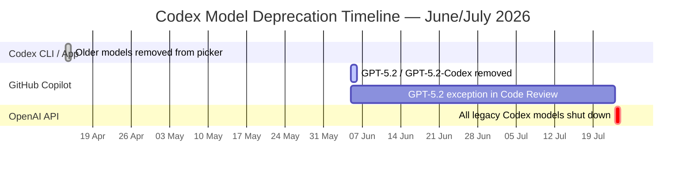

# The Codex Model Sunset: June–July 2026 Deprecation Timeline, Migration Paths, and Config Recipes


---

Three deprecation waves are converging between now and late July 2026, collectively retiring every Codex-lineage API model older than GPT-5.3-Codex. If your team references any legacy model string in `config.toml`, CI pipelines, or Agents SDK orchestrators, those calls will begin failing within days — or at latest, by 23 July. This article maps the exact timeline, explains which surfaces are affected, and provides drop-in configuration recipes for a clean migration.

## The Three-Wave Timeline

The deprecation is not a single event but a phased rollout across three distinct surfaces.



### Wave 1 — Codex CLI and App Picker (14 April 2026, complete)

On 14 April 2026, OpenAI removed six models from the Codex model picker for ChatGPT-authenticated sessions: `gpt-5.2-codex`, `gpt-5.1-codex-mini`, `gpt-5.1-codex-max`, `gpt-5.1-codex`, `gpt-5.1`, and `gpt-5` [^1]. After that date, ChatGPT-authenticated Codex sessions could only select `gpt-5.4`, `gpt-5.4-mini`, `gpt-5.3-codex`, `gpt-5.3-codex-spark` (Pro only), and `gpt-5.2` [^1].

Teams using their own API key could still reach the deprecated models directly, but that window closes in Wave 3.

### Wave 2 — GitHub Copilot (5 June 2026, imminent)

GPT-5.2 and GPT-5.2-Codex are being removed from all GitHub Copilot experiences on 5 June 2026 — covering Copilot Chat, inline edits, ask and agent modes, and code completions [^2]. The deprecation date was originally 1 June but was pushed back to 5 June in a 29 May amendment [^2].

One exception: GPT-5.2 (not GPT-5.2-Codex) remains available in Copilot Code Review after the cut-off [^2].

The recommended replacements are `gpt-5.5` for GPT-5.2 and `gpt-5.3-codex` for GPT-5.2-Codex [^2]. GPT-5.3-Codex became the default base model for Copilot Business and Enterprise on 17 May 2026 [^3], with long-term support committed through 4 February 2027 [^4].

### Wave 3 — OpenAI API (23 July 2026)

On 23 July 2026, every remaining legacy Codex API model shuts down permanently [^5]. After this date, API calls specifying these model strings will fail:

| Deprecated Model | Replacement |
|---|---|
| `gpt-5-codex` | `gpt-5.5` |
| `gpt-5.1-codex` | `gpt-5.5` |
| `gpt-5.1-codex-max` | `gpt-5.5` |
| `gpt-5.1-codex-mini` | `gpt-5.4-mini` |
| `gpt-5.2-codex` | `gpt-5.5` |

The earlier `codex-mini-latest` alias was already removed on 12 February 2026 [^6].

## Who Is Affected?

The impact depends on how you authenticate and where you reference model strings.

### ChatGPT-authenticated CLI users

If you sign in via `codex login` and use whatever model the picker offers, Wave 1 already migrated you. No action needed — the picker only shows current models.

### API-key authenticated CLI users

If your `config.toml` or `--model` flag specifies a legacy model string like `gpt-5.1-codex` or `gpt-5.2-codex`, your sessions will break on 23 July. Audit every config file now.

### CI/CD pipelines and `codex exec`

Non-interactive pipelines that hard-code `--model gpt-5.2-codex` in shell scripts or GitHub Actions workflows are the highest-risk surface. These typically run unattended, so failures will manifest as silent pipeline breaks.

### Agents SDK orchestrators

Any `Agent()` or `CodexTool` configuration that passes a deprecated model string to the Codex MCP server will fail after 23 July. Search your codebase for the five deprecated model IDs listed above.

### GitHub Copilot users

If you have explicit model overrides set to `gpt-5.2-codex` in VS Code or JetBrains settings, those will stop working on 5 June [^2]. Enterprise administrators should verify model policies in their Copilot settings [^2].

## The Current Model Landscape

After all three waves complete, the supported model set for Codex is [^7]:

| Model | Role | Best For |
|---|---|---|
| `gpt-5.5` | Frontier default | Complex coding, computer use, research workflows |
| `gpt-5.4` | Flagship | Professional work combining reasoning with tool use |
| `gpt-5.4-mini` | Fast/efficient | Responsive coding, subagents, light tasks |
| `gpt-5.3-codex` | Coding specialist | Deep software engineering, Copilot backbone |
| `gpt-5.3-codex-spark` | Real-time (Pro only) | Near-instant iteration, text-only |
| `gpt-5.2` | Legacy general-purpose | Still available but superseded |

## Migration Recipes

### Recipe 1: Update the global default

If your `~/.codex/config.toml` pins a deprecated model, update the `model` key:

```toml
# Before (breaks 23 July)
model = "gpt-5.2-codex"

# After — use the frontier default
model = "gpt-5.5"
```

### Recipe 2: Profile-based model selection

If you use named profiles for different workloads, create or update the profile overlay file. Since v0.134, profiles live in separate files rather than inline `[profiles.*]` tables [^8].

```toml
# ~/.codex/deep-review.config.toml
model = "gpt-5.5"
model_reasoning_effort = "xhigh"
```

```toml
# ~/.codex/fast-iteration.config.toml
model = "gpt-5.4-mini"
model_reasoning_effort = "low"
```

Invoke with `codex --profile deep-review` or `codex --profile fast-iteration`.

### Recipe 3: CI pipeline migration

For `codex exec` in GitHub Actions or shell scripts, update the model parameter:

```bash
# Before
codex exec --model gpt-5.2-codex --approval-mode full-auto \
  "Run the test suite and fix any failures"

# After
codex exec --model gpt-5.5 --approval-mode full-auto \
  "Run the test suite and fix any failures"
```

For subagent-heavy workloads, consider routing the orchestrator to `gpt-5.5` and subagents to `gpt-5.4-mini` for cost efficiency:

```bash
codex exec --model gpt-5.5 \
  -c 'model_providers.openai.subagent_model="gpt-5.4-mini"' \
  "Refactor the auth module and update tests"
```

### Recipe 4: Agents SDK model update

If you embed Codex as an MCP server in an Agents SDK workflow:

```python
from agents import Agent, MCPServerStdio

codex_server = MCPServerStdio(
    command="codex",
    args=["mcp", "--model", "gpt-5.5"],  # was gpt-5.2-codex
)

agent = Agent(
    name="engineering-lead",
    model="gpt-5.5",
    mcp_servers=[codex_server],
)
```

### Recipe 5: Audit and validate

Run `codex doctor` to check your current configuration and verify model availability [^9]:

```bash
codex doctor
```

Then grep your workspace for any remaining legacy model references:

```bash
grep -rn "gpt-5\.\(1\|2\)-codex\|gpt-5-codex\|gpt-5\.1-codex" \
  ~/.codex/ .codex/ .github/ agents/ --include="*.toml" --include="*.yml" --include="*.yaml" --include="*.py" --include="*.ts"
```

## Reasoning Effort Considerations

When migrating from `gpt-5.2-codex` to `gpt-5.5`, be aware that reasoning behaviour may differ. The `model_reasoning_effort` parameter accepts values from `minimal` to `xhigh` [^10], and you may need to tune this for your workloads:

- **`gpt-5.5` at `medium`** (default) covers most use cases that previously ran on `gpt-5.2-codex` without explicit effort tuning.
- For cost-sensitive batch pipelines, `low` on `gpt-5.5` often matches the output quality of `gpt-5.2-codex` at `medium`, at lower token cost.
- For complex multi-file refactors that previously required `gpt-5.1-codex-max`, use `gpt-5.5` at `high` or `xhigh`.

## Key Dates Summary

| Date | Event |
|---|---|
| 14 Apr 2026 | Six models removed from Codex CLI/App picker |
| 17 May 2026 | GPT-5.3-Codex becomes Copilot Business/Enterprise default |
| **5 Jun 2026** | **GPT-5.2/GPT-5.2-Codex removed from GitHub Copilot** |
| **23 Jul 2026** | **All legacy Codex API models permanently shut down** |
| 4 Feb 2027 | GPT-5.3-Codex long-term support expires in Copilot |

## What to Do This Week

1. **Audit** — Run the grep command above across all repositories, CI configs, and agent definitions.
2. **Update** — Change every deprecated model string to `gpt-5.5` (or `gpt-5.4-mini` for lightweight tasks).
3. **Test** — Run your CI pipelines and agent workflows with the new model to catch any behavioural regressions.
4. **Profile** — If different workloads need different models, set up named profiles rather than scattering model strings across scripts.
5. **Monitor** — After 5 June, check that GitHub Copilot is functioning correctly with the new defaults, particularly if you had explicit model overrides.

The 23 July deadline leaves roughly seven weeks from today. For teams running `codex exec` in production pipelines, the safe move is to migrate now — not on 22 July.

## Citations

[^1]: OpenAI, "Codex model deprecations," GitHub Discussion #17038, 7 April 2026. [https://github.com/openai/codex/discussions/17038](https://github.com/openai/codex/discussions/17038)

[^2]: GitHub, "Upcoming deprecation of GPT-5.2 and GPT-5.2-Codex," GitHub Changelog, 1 May 2026. [https://github.blog/changelog/2026-05-01-upcoming-deprecation-of-gpt-5-2-and-gpt-5-2-codex/](https://github.blog/changelog/2026-05-01-upcoming-deprecation-of-gpt-5-2-and-gpt-5-2-codex/)

[^3]: GitHub, "GPT-5.3-Codex is now the base model for Copilot Business and Enterprise," GitHub Changelog, 17 May 2026. [https://github.blog/changelog/2026-05-17-gpt-5-3-codex-is-now-the-base-model-for-copilot-business-and-enterprise/](https://github.blog/changelog/2026-05-17-gpt-5-3-codex-is-now-the-base-model-for-copilot-business-and-enterprise/)

[^4]: GitHub, "GPT-5.3-Codex long-term support in GitHub Copilot," GitHub Changelog, 18 March 2026. [https://github.blog/changelog/2026-03-18-gpt-5-3-codex-long-term-support-in-github-copilot/](https://github.blog/changelog/2026-03-18-gpt-5-3-codex-long-term-support-in-github-copilot/)

[^5]: OpenAI, "Deprecations," OpenAI API Documentation, accessed 2 June 2026. [https://developers.openai.com/api/docs/deprecations](https://developers.openai.com/api/docs/deprecations)

[^6]: ChatForest, "GPT-5.3-Codex Is Now the Copilot Default — and Every Older Codex Model Retires July 23," 2 June 2026. [https://chatforest.com/builders-log/gpt-5-3-codex-default-copilot-july-23-deprecations-builder-guide/](https://chatforest.com/builders-log/gpt-5-3-codex-default-copilot-july-23-deprecations-builder-guide/)

[^7]: OpenAI, "Models — Codex," OpenAI Developers, accessed 2 June 2026. [https://developers.openai.com/codex/models](https://developers.openai.com/codex/models)

[^8]: OpenAI, "Configuration Reference — Codex," OpenAI Developers, accessed 2 June 2026. [https://developers.openai.com/codex/config-reference](https://developers.openai.com/codex/config-reference)

[^9]: OpenAI, "Codex CLI v0.135.0 Release Notes," GitHub Releases, 28 May 2026. [https://github.com/openai/codex/releases](https://github.com/openai/codex/releases)

[^10]: OpenAI, "Advanced Configuration — Codex," OpenAI Developers, accessed 2 June 2026. [https://developers.openai.com/codex/config-advanced](https://developers.openai.com/codex/config-advanced)
