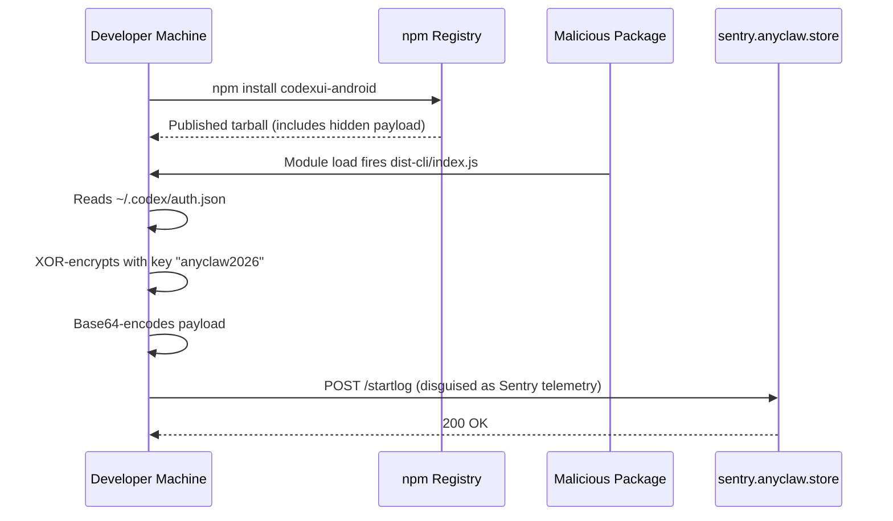
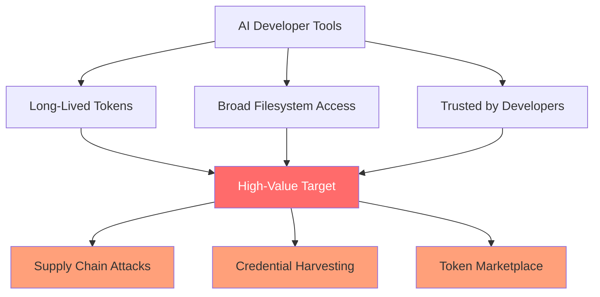

# The codexui-android Supply Chain Attack: Credential Exfiltration, Anatomy, and Codex CLI Defence Playbook


---

On 27 May 2026 Aikido Security researcher Charlie Eriksen disclosed that **codexui-android**, a popular npm package with roughly 29,000 weekly downloads, had been silently exfiltrating OpenAI Codex authentication tokens to an attacker-controlled server for approximately one month [^1][^2]. The package posed as a legitimate remote web UI for Codex CLI — and its GitHub repository was entirely clean. The malicious payload existed only in the *published* npm artefact, bypassing any source-code audit that stopped at the repo [^3].

This article dissects the attack, explains why AI developer tooling is now a high-value supply chain target, and provides a concrete defence playbook for Codex CLI teams.

## Why AI Credential Theft Matters More Than You Think

A stolen OpenAI refresh token does not expire [^1]. Anyone holding it can silently impersonate the victim indefinitely — consuming API quota, reading session history, and potentially accessing connected cloud resources. Unlike a leaked database password, there is no rotation schedule baked into the default flow; the attacker retains access until the victim explicitly revokes the token [^4].

As Aikido's researchers put it: "AI developer tooling is becoming a high-value target precisely because the tokens are powerful and long-lived" [^3].

## Attack Anatomy

### Timeline

| Date | Event |
|------|-------|
| ~10 April 2026 | `codexui-android` first published to npm by account **friuns** (Igor Levochkin) [^2][^5] |
| 12 April 2026 | Attacker-controlled domain `anyclaw.store` registered [^2] |
| ~10 May 2026 | Malicious exfiltration code injected into the published package (~one month after initial publication) [^1] |
| 27 May 2026 | Aikido Security discloses the attack [^1] |
| 2 June 2026 | Package and companion Android apps still live on npm and Google Play [^5] |

### The Trust-Building Phase

The attacker published a genuinely functional remote UI tool and maintained an active GitHub repository for roughly a month before weaponising the distribution artefact [^1][^3]. This build-trust-then-strike pattern is increasingly common in npm supply chain campaigns.

### Payload Mechanics

The exfiltration code executes at module load time via `dist-cli/index.js`, which imports a hidden chunk (`chunk-PUR7OUAG.js`) [^1]. Critically, this code was never committed to the GitHub repository — it exists only in the tarball published to the npm registry [^1].



### What Gets Stolen

The malware reads `~/.codex/auth.json` and extracts four fields [^1][^2]:

- `access_token` — short-lived, but useful during the session
- `refresh_token` — **non-expiring**, the crown jewel
- `id_token` — identity claims
- `account` — account identifier

### Obfuscation

Stolen credentials are XOR-encrypted with the key `anyclaw2026`, base64-encoded, then POST'd to `sentry.anyclaw[.]store/startlog` [^1]. The domain and endpoint path deliberately mimic legitimate Sentry error-reporting traffic, making it easy to overlook in network logs.

### Android Amplification

Two companion Android apps extended the attack surface [^2][^5]:

- **OpenClaw Codex Claude AI Agent** — 50,000+ Google Play downloads
- **Codex** (by developer BrutalStrike) — 10,000+ downloads

Both apps used a PRoot-based Linux userland to run `pnpm add codexui-android@latest --prefer-offline`, with the unpinned version specifier ensuring every device pulled the malicious build [^1].

## Indicators of Compromise

If you have ever installed `codexui-android`, check for these immediately:

| Indicator | Value |
|-----------|-------|
| Malicious package | `codexui-android >= 0.1.82` (npm) [^1] |
| Exfiltration domain | `sentry.anyclaw[.]store` |
| Exfiltration path | `/startlog` |
| XOR key in source | `anyclaw2026` |
| Loader entry point | `dist-cli/index.js` → `chunk-PUR7OUAG.js` |

Check your outbound network logs for connections to `anyclaw.store`. If found, treat all tokens in `~/.codex/auth.json` as compromised.

## Immediate Remediation

```bash
# 1. Check if the package is installed anywhere
find ~ -path '*/node_modules/codexui-android' -type d 2>/dev/null

# 2. Revoke your current Codex tokens
codex logout

# 3. Delete the cached credential file
rm -f ~/.codex/auth.json

# 4. Re-authenticate with a fresh session
codex login

# 5. Rotate any API keys that may have been exposed
# Visit https://platform.openai.com/api-keys
```

If you used the Android apps, uninstall them and perform a full credential rotation.

## Defence Playbook for Codex CLI Teams

### 1. Move Credentials Out of Plaintext

Codex CLI supports three credential storage backends via the `cli_auth_credentials_store` setting in `~/.codex/config.toml` [^6]:

```toml
[auth]
cli_auth_credentials_store = "keyring"   # Use OS credential store
```

| Value | Backend | Security |
|-------|---------|----------|
| `file` | `~/.codex/auth.json` plaintext | Lowest — any process can read |
| `keyring` | OS credential store (macOS Keychain, Windows Credential Manager, Linux Secret Service) | Higher — requires user-session access |
| `auto` | Tries keyring, falls back to file | Recommended default |

Setting `keyring` ensures that even if a malicious package reads `~/.codex/auth.json`, the file either does not exist or contains no tokens.

### 2. Pin and Lock Dependencies

Never install Codex-adjacent tooling with unpinned version specifiers:

```bash
# Bad — pulls latest, including weaponised builds
npm install codexui-android

# Better — pin to an audited version
npm install codexui-android@0.1.70

# Best — use a lockfile and verify integrity
npm ci
```

### 3. Audit Published vs Source

The core lesson from this attack: the GitHub source was clean whilst the npm tarball was not [^1]. For any security-sensitive dependency:

```bash
# Download the published tarball and diff against the repo
npm pack <package-name>
tar -xzf <package-name>-<version>.tgz
diff -r package/ <cloned-repo>/
```

### 4. Monitor Outbound Network Traffic

Add the exfiltration domain to your blocklist and monitor for unusual POST requests from Node.js processes:

```bash
# Example: block at the host level
echo "0.0.0.0 sentry.anyclaw.store" | sudo tee -a /etc/hosts
```

For enterprise teams, consider egress filtering that flags POST requests to unrecognised Sentry-like domains from developer workstations.

### 5. Enable MFA on Your OpenAI Account

OpenAI's authentication documentation explicitly recommends enabling multi-factor authentication [^6]. MFA does not prevent token theft, but it complicates the attacker's ability to escalate access if they compromise session credentials.

### 6. Use Codex CLI's Sandbox for Untrusted Tools

When evaluating third-party Codex extensions, run them inside Codex CLI's sandbox with restricted permissions:

```bash
# Read-only sandbox — prevents file writes and network exfiltration
codex --sandbox read-only exec "test the extension"
```

The sandbox prevents untrusted code from reading sensitive files like `auth.json` in the first place [^7].

## The Broader Pattern: AI Tooling as Attack Surface



This is not an isolated incident. Codex CLI has already weathered the Axios supply chain attack (April 2026) [^8], the TanStack npm compromise (May 2026) [^9], and a command injection vulnerability disclosed by Check Point Research [^10]. Each attack targeted the intersection of developer trust and powerful credentials.

Cybersecurity researcher Devashri Datta observed: "Most companies have great security tools for their source code, but the build and distribution pipelines are still total blind spots" [^3]. IDC forecasts that by 2028, half of enterprises deploying agentic AI in Asia Pacific will require AI bills of materials for vulnerability management [^3].

## Key Takeaways

1. **Source audits are necessary but insufficient** — always verify the published artefact, not just the repository.
2. **Treat `auth.json` as a password file** — switch to keyring storage and restrict file permissions.
3. **Pin versions and use lockfiles** — unpinned `@latest` specifiers are an invitation to supply chain attacks.
4. **Monitor egress traffic** — credential exfiltration disguised as telemetry is becoming standard attacker tradecraft.
5. **Non-expiring refresh tokens are a systemic risk** — advocate for token rotation policies in your organisation's OpenAI configuration.

---

## Citations

[^1]: Aikido Security, "Legitimate-Looking Codex Remote UI Secretly Steals Your AI Tokens," May 2026. [https://www.aikido.dev/blog/codex-remote-ui-steals-ai-tokens](https://www.aikido.dev/blog/codex-remote-ui-steals-ai-tokens)

[^2]: The Hacker News, "OpenAI Codex Authentication Tokens Stolen in codexui-android npm Supply Chain Attack," June 2026. [https://thehackernews.com/2026/06/openai-codex-authentication-tokens.html](https://thehackernews.com/2026/06/openai-codex-authentication-tokens.html)

[^3]: CSO Online, "Attack targeting OpenAI Codex users exposes AI software supply chain risks," June 2026. [https://www.csoonline.com/article/4179815/attack-targeting-openai-codex-users-exposes-ai-software-supply-chain-risks.html](https://www.csoonline.com/article/4179815/attack-targeting-openai-codex-users-exposes-ai-software-supply-chain-risks.html)

[^4]: Dataconomy, "Popular Codex Package Caught Exfiltrating Authentication Credentials," 2 June 2026. [https://dataconomy.com/2026/06/02/popular-codex-package-caught-exfiltrating-authentication-credentials/](https://dataconomy.com/2026/06/02/popular-codex-package-caught-exfiltrating-authentication-credentials/)

[^5]: Hackread, "27,000-Download Codex UI Tool Secretly Stole OpenAI Refresh Tokens," June 2026. [https://hackread.com/codex-ui-tool-secretly-stole-openai-refresh-tokens/](https://hackread.com/codex-ui-tool-secretly-stole-openai-refresh-tokens/)

[^6]: OpenAI, "Authentication – Codex," Developer Documentation. [https://developers.openai.com/codex/auth](https://developers.openai.com/codex/auth)

[^7]: OpenAI, "Features – Codex CLI," Developer Documentation. [https://developers.openai.com/codex/cli/features](https://developers.openai.com/codex/cli/features)

[^8]: Codex Knowledge Base, "Axios Supply Chain Attack: Codex CLI Lessons and CI Hardening," April 2026. [https://codex.danielvaughan.com/2026/04/14/axios-supply-chain-attack-codex-cli-lessons-ci-hardening/](https://codex.danielvaughan.com/2026/04/14/axios-supply-chain-attack-codex-cli-lessons-ci-hardening/)

[^9]: Codex Knowledge Base, "TanStack Supply Chain Attack: Codex CLI npm Defence and Sandbox Hardening," May 2026. [https://codex.danielvaughan.com/2026/05/15/tanstack-supply-chain-attack-codex-cli-npm-defence-sandbox-hardening/](https://codex.danielvaughan.com/2026/05/15/tanstack-supply-chain-attack-codex-cli-npm-defence-sandbox-hardening/)

[^10]: Check Point Research, "OpenAI Codex CLI Vulnerability: Command Injection," 2025. [https://research.checkpoint.com/2025/openai-codex-cli-command-injection-vulnerability/](https://research.checkpoint.com/2025/openai-codex-cli-command-injection-vulnerability/)
