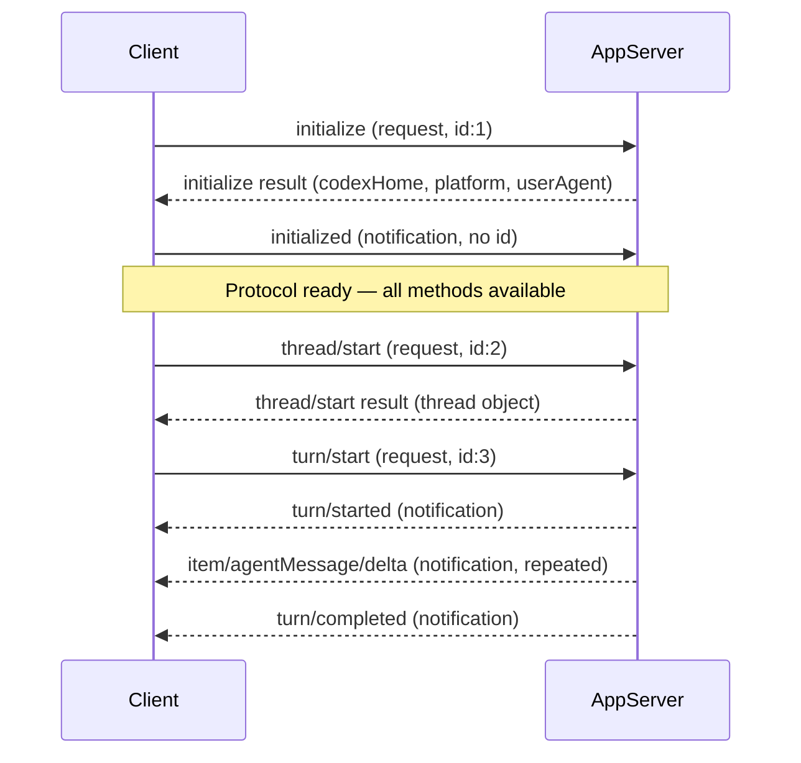

# Codex App-Server `--stdio` Mode: Subprocess Embedding, Custom Clients, and the JSON-RPC 2.0 Protocol


---

Codex CLI v0.136 (released 1 June 2026) added a `--stdio` flag to `codex app-server` that makes subprocess embedding the first-class integration path.[^1] Where the April 2026 guide used `--listen stdio://` with WebSocket fallback, the new flag spins up a clean newline-delimited JSON-RPC 2.0 channel over stdin/stdout — no Unix socket, no port allocation, no firewall rules.

This matters for teams building IDE plugins, terminal dashboards, CI orchestrators, or any tool that needs to drive a full Codex agent session without adopting the Python or TypeScript SDK. This article walks through the full protocol surface available from v0.136 onwards.

---

## Transport Options in 2026

The app-server supports four transport modes:[^2]

| Flag | Transport | Use case |
|---|---|---|
| `codex app-server --stdio` | stdin/stdout JSONL | subprocess embedding (v0.136+) |
| `codex app-server --listen ws://127.0.0.1:PORT` | WebSocket | remote dashboard, multiple clients |
| `codex app-server` (no flags) | Unix socket | TUI and internal CLI processes |
| `codex app-server --listen off` | none | headless daemon, SDK-only |

**stdio is ideal when:**
- Your tool spawns Codex as a child process
- You need a single client connection per process
- You cannot or do not want to manage socket paths or port numbers
- Backpressure handling matters — a slow stdio consumer blocks the writer rather than being dropped[^2]

The Python SDK (`openai-codex`) and TypeScript SDK (`@openai/codex-sdk`) both use this transport internally, spawning `codex app-server --stdio` as a subprocess and piping JSON-RPC over stdin/stdout.[^3] If you need an abstraction layer, use the SDK; if you need full protocol access or a language without an SDK, read on.

---

## Initialization Handshake

Every stdio client must complete the handshake before calling any API method.[^2] The sequence is strict: the server rejects out-of-order requests with `"Not initialized"`.



The `initialize` request carries client metadata and optional capability opt-ins:[^2]

```json
{
  "jsonrpc": "2.0",
  "id": 1,
  "method": "initialize",
  "params": {
    "clientInfo": {
      "name": "my_tool",
      "title": "My Custom Tool"
    },
    "capabilities": {
      "experimentalApi": true,
      "optOutNotificationMethods": ["turn/plan/updated"]
    }
  }
}
```

The response provides `codexHome`, `platformOs`, `platformFamily`, and `userAgent` for upstream service identification. The follow-up `initialized` notification (no `id` field) unlocks the full API.

---

## Core Protocol — Threads, Turns, and Items

The protocol models sessions as a hierarchy of three entities:[^2]

- **Thread** — a persistent conversation (stored in `~/.codex/sessions`)
- **Turn** — one user request → agent response round
- **Item** — a discrete unit of output: agent message, command execution, file change, MCP tool call, or review-mode transition

### Starting a Thread and Turn

```json
{
  "jsonrpc": "2.0",
  "id": 2,
  "method": "thread/start",
  "params": {
    "model": "gpt-5.4",
    "cwd": "/workspace/myproject",
    "approvalPolicy": { "type": "never" },
    "sandbox": "workspaceWrite"
  }
}
```

Response includes `id` (a UUID), `status`, `createdAt`. Pass the thread ID to subsequent calls.

```json
{
  "jsonrpc": "2.0",
  "id": 3,
  "method": "turn/start",
  "params": {
    "threadId": "THREAD_UUID",
    "input": [{ "type": "text", "text": "Add a /healthz endpoint to main.go" }]
  }
}
```

### Event Stream

After `turn/start`, the server streams notifications with no `id` field until `turn/completed`:[^2]

```
{"jsonrpc":"2.0","method":"turn/started","params":{"threadId":"...","turnId":"..."}}
{"jsonrpc":"2.0","method":"item/started","params":{"type":"agentMessage","id":"..."}}
{"jsonrpc":"2.0","method":"item/agentMessage/delta","params":{"id":"...","delta":"I'll add "}}
{"jsonrpc":"2.0","method":"item/agentMessage/delta","params":{"id":"...","delta":"a /healthz handler.\n"}}
{"jsonrpc":"2.0","method":"item/completed","params":{"type":"agentMessage","id":"..."}}
{"jsonrpc":"2.0","method":"item/started","params":{"type":"commandExecution","id":"..."}}
{"jsonrpc":"2.0","method":"item/commandExecution/outputDelta","params":{"id":"...","delta":"ok\n"}}
{"jsonrpc":"2.0","method":"item/completed","params":{"type":"commandExecution","id":"...","exitCode":0}}
{"jsonrpc":"2.0","method":"turn/completed","params":{"turnId":"...","usage":{"inputTokens":840,"outputTokens":312}}}
```

Token usage is always reported in `turn/completed`.[^2]

---

## Session Archiving (v0.136)

v0.136 added thread archiving APIs, protecting sessions from accidental resume or fork until explicitly restored.[^1] Over the JSON-RPC protocol:

```json
{ "id": 10, "method": "thread/archive", "params": { "threadId": "THREAD_UUID" } }
{ "id": 11, "method": "thread/unarchive", "params": { "threadId": "THREAD_UUID" } }
```

When listing threads, pass `includeArchived: true` to see archived threads alongside active ones:[^1]

```json
{
  "id": 12,
  "method": "thread/list",
  "params": { "limit": 50, "includeArchived": true }
}
```

---

## Minimal Python Client

The following shows the full lifecycle — spawn, handshake, thread, turn, collect output — without the `openai-codex` SDK:

```python
import subprocess
import json
import threading
import sys

def send(proc, payload: dict):
    line = json.dumps(payload) + "\n"
    proc.stdin.write(line.encode())
    proc.stdin.flush()

def recv_line(proc) -> dict:
    return json.loads(proc.stdout.readline())

proc = subprocess.Popen(
    ["codex", "app-server", "--stdio"],
    stdin=subprocess.PIPE,
    stdout=subprocess.PIPE,
    stderr=subprocess.DEVNULL,
)

# Handshake
send(proc, {"jsonrpc":"2.0","id":1,"method":"initialize",
            "params":{"clientInfo":{"name":"demo","title":"Demo"}}})
recv_line(proc)  # initialize result
send(proc, {"jsonrpc":"2.0","method":"initialized","params":{}})

# Start thread
send(proc, {"jsonrpc":"2.0","id":2,"method":"thread/start",
            "params":{"model":"gpt-5.4","approvalPolicy":{"type":"never"},
                      "sandbox":"workspaceWrite"}})
thread_id = recv_line(proc)["result"]["id"]

# Start turn
send(proc, {"jsonrpc":"2.0","id":3,"method":"turn/start",
            "params":{"threadId":thread_id,
                      "input":[{"type":"text","text":"List files in this directory"}]}})

# Drain notifications until turn/completed
output = []
while True:
    msg = recv_line(proc)
    method = msg.get("method","")
    if method == "item/agentMessage/delta":
        output.append(msg["params"]["delta"])
    if method == "turn/completed":
        break

print("".join(output))
proc.terminate()
```

Production clients should multiplex responses by `id` in a background reader thread and use non-blocking I/O.[^3]

---

## Minimal TypeScript Client

```typescript
import { spawn } from "node:child_process";
import * as readline from "node:readline";

const proc = spawn("codex", ["app-server", "--stdio"]);
const rl = readline.createInterface({ input: proc.stdout! });
let idCounter = 0;
const pending = new Map<number, (v: unknown) => void>();

rl.on("line", (line) => {
  const msg = JSON.parse(line);
  if (msg.id !== undefined && pending.has(msg.id)) {
    pending.get(msg.id)!(msg);
    pending.delete(msg.id);
  } else if (msg.method === "item/agentMessage/delta") {
    process.stdout.write(msg.params.delta);
  }
});

function rpc(method: string, params: object): Promise<unknown> {
  return new Promise((resolve) => {
    const id = ++idCounter;
    pending.set(id, resolve);
    proc.stdin!.write(JSON.stringify({ jsonrpc: "2.0", id, method, params }) + "\n");
  });
}

async function main() {
  await rpc("initialize", { clientInfo: { name: "ts-demo", title: "TS Demo" } });
  proc.stdin!.write(JSON.stringify({ jsonrpc: "2.0", method: "initialized", params: {} }) + "\n");

  const { result } = await rpc("thread/start", {
    model: "gpt-5.4",
    approvalPolicy: { type: "never" },
    sandbox: "workspaceWrite",
  }) as { result: { id: string } };

  await rpc("turn/start", {
    threadId: result.id,
    input: [{ type: "text", text: "Write a hello-world HTTP server in TypeScript" }],
  });

  // Wait for turn/completed via the readline event loop
  await new Promise<void>((res) => {
    rl.on("line", (line) => {
      if (JSON.parse(line).method === "turn/completed") res();
    });
  });
  proc.kill();
}

main();
```

---

## When to Use the SDK vs Raw Protocol

| Criterion | Raw JSON-RPC (`--stdio`) | `openai-codex` / `@openai/codex-sdk` |
|---|---|---|
| Language without SDK | ✅ Any language | ❌ Python ≥3.10, Node ≥18 |
| Full protocol access | ✅ Every method | ⚠️ SDK surface may lag |
| Experimental APIs | ✅ via `experimentalApi:true` | ⚠️ Some not exposed |
| Auth management | ❌ Manual | ✅ Automatic |
| Subprocess lifecycle | ❌ Manual | ✅ Managed |
| Reconnection | ❌ Manual | ✅ Handled |

For Python and TypeScript work, the SDKs eliminate the boilerplate shown above.[^3] For Go, Rust, or any JVM language, the raw protocol is the only option short of shelling out to the SDK.

---

## Backpressure and Error Handling

stdio connections block rather than disconnect when the consumer is slow.[^2] This is a double-edged property:

- **Advantage:** no data loss from a lagging client — the server naturally pauses
- **Disadvantage:** a blocked write in the server will stall the entire agent turn

In practice, read from stdout on a dedicated thread or coroutine and never hold the read loop while processing. The server's bounded internal queue returns JSON-RPC error `-32001` (`"Server overloaded; retry later"`) if a WebSocket client saturates it, but stdio clients see backpressure instead.[^2]

Initialisation errors follow standard JSON-RPC error codes. A second `initialize` call on an already-initialised connection returns `"Already initialized"`. Pre-`initialized` API calls return `"Not initialized"`.

---

## Experimental Features

Pass `"experimentalApi": true` in `initialize.params.capabilities` to unlock:[^2]

- `process/spawn` — run a subprocess with streaming output outside a thread
- `thread/realtime/start` — WebRTC/realtime session initiation
- `environment/add` — register custom execution environments
- `tool/requestUserInput` — prompt the user mid-turn
- `thread/turns/list` — paginate individual turns within a thread

Calling experimental methods without the opt-in returns `"requires experimentalApi capability"`.

---

## Summary

| Feature | Since |
|---|---|
| `--stdio` flag | v0.136 (1 June 2026) |
| `thread/archive` / `thread/unarchive` | v0.136 |
| `thread/list` with `includeArchived` | v0.136 |
| Remote control client management RPCs | v0.137 alpha |
| Short-lived WebSocket tokens | v0.136 |

The `--stdio` flag makes custom client integration significantly simpler than managing a local WebSocket or Unix socket. The full JSON-RPC 2.0 surface — threads, turns, event streaming, session archiving, MCP management, and experimental process APIs — is accessible from any language that can spawn a subprocess and read newline-delimited JSON. For teams that need the flexibility, it is the most direct path to a fully programmable Codex agent.

---

## Citations

[^1]: OpenAI, "Codex CLI v0.136.0 Release Notes", GitHub openai/codex releases, 1 June 2026. <https://github.com/openai/codex/releases/tag/rust-v0.136.0>

[^2]: OpenAI, "App Server — Codex", OpenAI Developers documentation. <https://developers.openai.com/codex/app-server> — also `codex-rs/app-server/README.md` in the openai/codex repository.

[^3]: OpenAI, "SDK — Codex", OpenAI Developers documentation. <https://developers.openai.com/codex/sdk> — covers both `openai-codex` (Python) and `@openai/codex-sdk` (TypeScript), both of which use `codex app-server --stdio` as the underlying transport.
