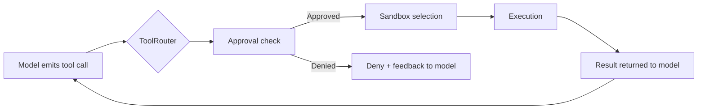
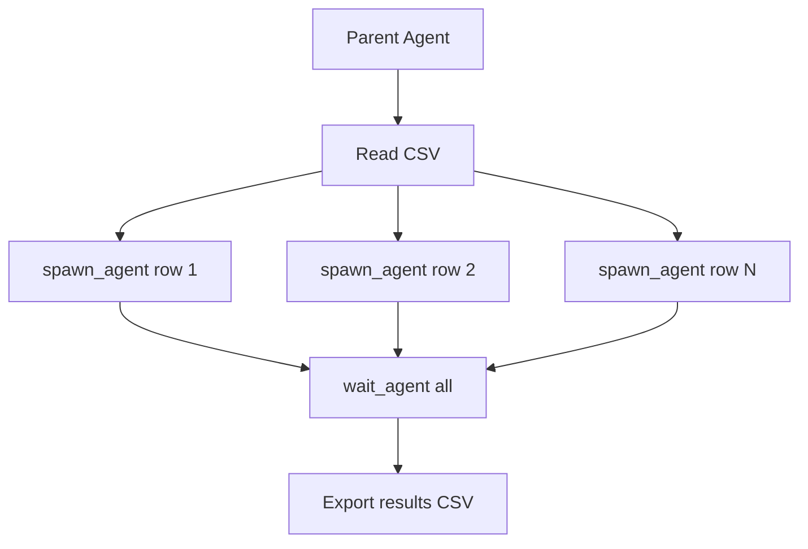

# Codex CLI Built-In Tool Surface: The Complete Reference for v0.136


Every interaction between Codex CLI and the underlying model is mediated by **tools** — structured function calls that the model emits and the harness executes. Understanding what tools the model has access to, how they behave, and how to configure them is essential for writing effective AGENTS.md instructions and debugging unexpected agent behaviour. Yet no single reference documents the complete tool surface. This article fills that gap for v0.136 [^1].

## Architecture: How Tools Reach the Model

Codex CLI's Rust core (`codex-rs`) maintains a `ToolRegistry` and `ToolRouter` that dispatch every tool call through a consistent pipeline [^2]:



The approval check evaluates against your `approval_policy` — `suggest` (ask every time), `auto-edit` (auto-approve file edits, ask for shell), or `full-auto` (approve everything) [^3]. The sandbox selection consults `sandbox_mode` to determine filesystem and network constraints [^3].

## Core File and Directory Tools

These tools give the model structured access to your codebase without requiring shell commands. The Codex prompting guide explicitly states: "if a tool exists for an action, prefer to use the tool instead of shell commands" [^4].

### `read_file`

Reads file contents from disk and returns them to the model. Preferred over `cat` because it avoids shell overhead, respects sandbox boundaries natively, and produces cleaner tool-call transcripts.

### `list_dir`

Lists directory contents. Equivalent to `ls` but routed through the tool pipeline rather than spawning a shell process, meaning it works consistently across platforms including Windows where shell semantics differ.

### `glob_file_search`

Pattern-based file searching using glob syntax. More efficient than `find` for locating files by name pattern, and cross-platform by default.

### `rg` (ripgrep)

Fast text search across the codebase. Codex bundles ripgrep as a first-class tool rather than relying on `grep`, giving the model access to regex-powered content search with type filtering and context lines [^4].

### `git`

All Git operations — status, diff, log, commit, branch, checkout — are available as tool calls. The model can inspect history, stage changes, and create commits without dropping to a raw shell [^4].

## File Editing: `apply_patch`

The `apply_patch` tool is Codex CLI's signature editing mechanism. Rather than rewriting entire files, the model emits diffs in the **V4A patch format** — a purpose-built grammar that OpenAI's models have been specifically trained to produce [^5].

### V4A Format Structure

Each patch contains one or more file operations:

```
*** Begin Patch
*** Add File: path/to/new_file.rs
+line one
+line two

*** Update File: path/to/existing.rs
@@ context line @@
-old line
+new line

*** Delete File: path/to/obsolete.rs
*** End Patch
```

The three operation types are:

| Header | Purpose |
|--------|---------|
| `Add File` | Create a new file |
| `Update File` | Patch an existing file in place |
| `Delete File` | Remove a file entirely |

### Processing Pipeline

Unlike shell commands, `apply_patch` is intercepted before execution. The harness calls `execApplyPatch`, which parses the patch using a Lark grammar parser and applies changes via direct filesystem operations — not through `sed` or shell redirects [^5]. In interactive mode, the TUI displays colourised diffs (red for deletions, green for additions) for review before application [^2].

Both **freeform** (text diff) and **JSON** (structured schema) modes are supported, though freeform is the default for interactive sessions [^6].

## Shell Execution: `shell_command`

The general-purpose escape hatch. When no dedicated tool exists, the model falls back to shell execution.

### Parameters

```toml
# Schema (simplified)
command   = "string | argv array"  # The command to execute
workdir   = "string"               # Working directory (optional)
timeout_ms = 120000                # Timeout in milliseconds (default: 120s)
```

The shell tool now accepts both legacy string commands and structured `argv` arrays [^7]. The `timeout_ms` parameter prevents runaway processes — commands exceeding the timeout are terminated and an error is returned to the model.

### Configuration

```toml
# config.toml
[features]
shell_tool = true          # Enabled by default
unified_exec = true        # PTY-backed exec (default on macOS/Linux)
allow_login_shell = true   # Use login-shell semantics
```

The `shell_environment_policy` controls which environment variables are passed to subprocesses, allowing you to restrict sensitive variables from agent-spawned commands [^3].

## Search and Information Tools

### `web_search`

Codex can search the web for up-to-date information during tasks. Results appear in the transcript and `codex exec --json` output [^8].

```toml
# config.toml
web_search = "cached"  # Options: "disabled", "cached", "live"

# Or with fine-grained control:
[tools.web_search]
context_size = "medium"
allowed_domains = ["docs.rs", "developer.mozilla.org"]
```

The `cached` mode (default) uses pre-indexed search results for lower latency; `live` performs real-time searches at the cost of additional API calls [^8].

### `tool_search`

A BM25-powered semantic search over the agent's available tool catalogue. When the model is unsure which tool to use, it can query `tool_search` to find the most relevant tool by description match [^2]. This becomes increasingly important as MCP servers add dozens of external tools to the surface.

## Image Tools

### `view_image`

Attaches a local image to the conversation context by filesystem path, enabling the model to inspect screenshots, design mocks, or visual assets [^9].

```toml
# config.toml
[tools]
view_image = true  # Enabled by default
```

### `image_gen`

Generates images using `gpt-image-2` through the native Codex image artifact completion pipeline. In v0.136, the image generation exposure changed from `DirectModelOnly` to `Direct`, enabling nested code-mode access [^1].

Image generation uses included usage limits but consumes credits 3-5x faster than comparable text turns [^10]. You can also invoke it explicitly via the `$imagegen` skill:

```bash
codex "Create an SVG icon for a settings gear" --skill imagegen
```

## Planning and Goal Tools

### `update_plan`

Manages task planning with structured step tracking:

```json
{
  "items": [
    {"step": "Read existing tests", "status": "completed"},
    {"step": "Write new integration test", "status": "in_progress"},
    {"step": "Run test suite", "status": "pending"}
  ]
}
```

Each item has a `step` description and `status` field (`pending`, `in_progress`, or `completed`). The plan is visible in the TUI and persists across compaction cycles [^4].

### Goal Mode Tools

When `/goal` is active, additional tool capabilities track progress toward the objective. Goal mode graduated to GA in May 2026 and is available across CLI, IDE, and app surfaces [^11]. The goal progress accounting was further refined with a serialisation fix in v0.137.0-alpha [^1].

## Multi-Agent Tools

Codex's multi-agent system (Multi-Agents v2) exposes five orchestration tools to the model [^12]:

### `spawn_agent`

Creates a child agent with an initial prompt. The child runs as an independent thread with its own conversation context, tool access, and sandbox, but inherits core configuration from the parent.

### `send_input`

Sends follow-up instructions or corrections to a running child agent. Messages are queued unless the agent is interrupted.

### `wait_agent`

Blocks the parent until one or more child agents reach a terminal status. Returns consolidated results from all awaited children.

### `close_agent`

Terminates a child agent. In v0.137.0-alpha, a fix was added to reject self-targeting — an agent cannot close itself [^1].

### `resume_agent`

Resumes a paused or suspended child agent.

### Batch Mode: `spawn_agents_on_csv`

For fan-out processing, the model reads a CSV file, spawns one worker agent per row with a templated instruction, waits for all workers, and exports results to a new CSV. Up to 64 concurrent workers are supported [^12].



Multi-agent tools are enabled by default:

```toml
[features]
multi_agent = true
```

## Parallel Execution: `multi_tool_use.parallel`

When the model needs to perform multiple independent operations simultaneously, it wraps them in `multi_tool_use.parallel`. This is the **only** sanctioned mechanism for parallel tool calls — the prompting guide explicitly states: "Use `multi_tool_use.parallel` to parallelise tool calls and only this" [^4].

## Configuring the Tool Surface

The complete tool surface is controlled through `config.toml`:

```toml
# ~/.codex/config.toml

[features]
shell_tool = true              # Shell command execution
unified_exec = true            # PTY-backed exec (Linux/macOS)
multi_agent = true             # Multi-agent orchestration tools
memories = false               # Memory persistence (opt-in)
undo = false                   # Undo support (opt-in)

[tools]
view_image = true              # Image attachment tool

# Web search configuration
web_search = "cached"          # "disabled" | "cached" | "live"

# Sandbox controls what tools can access
sandbox_mode = "workspace-write"

# Shell environment filtering
shell_environment_policy = "inherit"
```

MCP servers extend this surface further. Tools from MCP servers are registered alongside built-ins and appear in the model's tool catalogue with the `mcp__<server>__<tool>` naming convention [^3].

## Tool Preference in AGENTS.md

Because the model can accomplish many tasks through either dedicated tools or raw shell commands, your AGENTS.md should encode preferences explicitly:

```markdown
## Tool Usage Rules

- Use `read_file` instead of `cat` for reading files
- Use `rg` instead of `grep` for searching
- Use `list_dir` instead of `ls` for directory listing
- Use `glob_file_search` instead of `find` for file discovery
- Use `apply_patch` for all file modifications — never `sed` or `echo >>`
- Use `git` tool calls for version control, not shell git commands
```

This reduces token overhead (tool calls are cheaper than shell round-trips), improves cross-platform consistency, and produces cleaner session transcripts for review [^4].

## What Changed in v0.136

The v0.136 release made several tool-related improvements [^1]:

- **Tool schema documentation**: Built-in tool schema descriptions now clarify defaults, optional fields, bounds, and enums across all tool categories
- **Image generation exposure**: Changed from `DirectModelOnly` to `Direct`, enabling nested code-mode image generation
- **Browser-origin rejection**: The exec-server now rejects browser-origin WebSocket handshakes, hardening the shell tool against CSWSH attacks
- **`/diff` safety**: The `/diff` command is now prevented from running repository-provided Git helpers or hooks, closing a hook-injection vector
- **Sandbox cleanup**: Shell commands clean up reliably after interruptions or denied network attempts

## Citations

[^1]: [Codex CLI v0.136.0 Release Notes](https://github.com/openai/codex/releases/tag/rust-v0.136.0) — GitHub, 1 June 2026
[^2]: [How OpenAI Codex Works Behind-the-Scenes](https://blog.promptlayer.com/how-openai-codex-works-behind-the-scenes-and-how-it-compares-to-claude-code/) — PromptLayer Blog, 2026
[^3]: [Advanced Configuration — Codex](https://developers.openai.com/codex/config-advanced) — OpenAI Developer Documentation, 2026
[^4]: [Codex Prompting Guide](https://developers.openai.com/cookbook/examples/gpt-5/codex_prompting_guide) — OpenAI Cookbook, 2026
[^5]: [The V4A Diff Format: How Codex CLI's apply_patch Actually Edits Your Code](https://codex.danielvaughan.com/2026/03/31/codex-cli-apply-patch-v4a-diff-format/) — Codex Knowledge Base, 31 March 2026
[^6]: [Codex CLI apply_patch Freeform-Only and Function-Style Deletion](https://codex.danielvaughan.com/2026/05/08/codex-cli-apply-patch-freeform-only-function-style-deletion/) — Codex Knowledge Base, 8 May 2026
[^7]: [Configuration Reference — Codex](https://developers.openai.com/codex/config-reference) — OpenAI Developer Documentation, 2026
[^8]: [Features — Codex CLI](https://developers.openai.com/codex/cli/features) — OpenAI Developer Documentation, 2026
[^9]: [Working with Images in Codex CLI](https://codex.danielvaughan.com/2026/03/28/codex-cli-image-workflows/) — Codex Knowledge Base, 28 March 2026
[^10]: [Image Generation in Codex CLI: gpt-image-2 and Visual Development Workflows](https://codex.danielvaughan.com/2026/04/27/codex-cli-image-generation-gpt-image-2-visual-development-workflows/) — Codex Knowledge Base, 27 April 2026
[^11]: [Codex v0.133 Goal Mode GA](https://codex.danielvaughan.com/2026/05/22/codex-v133-goal-mode-ga/) — Codex Knowledge Base, 22 May 2026
[^12]: [Codex Multi-Agent System Architecture](https://gist.github.com/serialx/f842f7b41d0f74ff5f64845e4afbc260) — GitHub Gist, 2026; [Elliot Arledge on X](https://x.com/elliotarledge/status/2033890783569580201) — codex-rs subagent architecture, 2026
