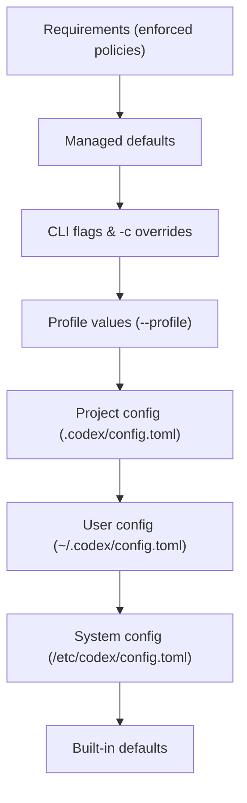

# Codex CLI Environment Variables: The Complete Reference for CODEX_HOME, CODEX_API_KEY, and Headless Deployment


---

Codex CLI's behaviour is shaped by a layered configuration system — `config.toml` files, CLI flags, named profiles, and environment variables. Most articles focus on `config.toml` and profiles. This one focuses on the environment variables: the knobs you reach for when scripting `codex exec` in CI runners, deploying inside containers, or managing fleet-wide agent infrastructure. As of v0.136.0 (June 2026), OpenAI documents a compact but powerful set of stable public environment variables [^1]. Knowing when to use each — and when *not* to — is the difference between a secure pipeline and a credential leak.

## The Configuration Precedence Stack

Before examining individual variables, it helps to understand where environment variables sit in the resolution hierarchy. Codex resolves values in this order, highest precedence first [^2]:



Environment variables like `CODEX_HOME` and `CODEX_API_KEY` operate *outside* this TOML hierarchy. They control where Codex looks for state, how it authenticates, and how the installer behaves — concerns that sit beneath the configuration layer itself [^1].

## Core Location Variables

### CODEX_HOME

```bash
export CODEX_HOME=/opt/codex-state
```

Sets the root directory for all Codex persistent state: `config.toml`, credentials (`auth.json`), logs, session transcripts, skills, installed plugins, and standalone package metadata [^1]. Default: `~/.codex`.

Every path Codex writes to — `$CODEX_HOME/config.toml`, `$CODEX_HOME/auth.json`, `$CODEX_HOME/history.jsonl`, the SQLite state database — is relative to this root [^1]. Override it when:

- **Running multiple isolated agent instances** on the same host, each needing separate credentials and session history.
- **Mounting a shared volume** in Kubernetes pods so agents share a config but write session data to ephemeral storage.
- **Relocating state to encrypted storage** in regulated environments where `~/.codex` sits on an unencrypted home directory.

```bash
# Ephemeral CI runner: state lives and dies with the job
export CODEX_HOME=/tmp/codex-ephemeral-$$
CODEX_API_KEY="$CI_CODEX_KEY" codex exec --ephemeral "run security audit"
```

### CODEX_SQLITE_HOME

```bash
export CODEX_SQLITE_HOME=/fast-ssd/codex-db
```

Specifies an alternative location for SQLite-backed state (session index, goal progress, memory store) [^1]. Defaults to `$CODEX_HOME`. A `config.toml` key of the same name takes precedence over the environment variable.

This is useful when `$CODEX_HOME` sits on a network filesystem (NFS, EFS) where SQLite's file locking semantics cause contention. Point `CODEX_SQLITE_HOME` at local SSD storage while keeping configs and credentials on the shared mount.

## Authentication Variables

### CODEX_API_KEY

```bash
CODEX_API_KEY=sk-proj-… codex exec --json "triage open bug reports"
```

Provides an OpenAI API key for non-interactive `codex exec` runs [^3]. Billed at standard API rates through your OpenAI Platform account [^4]. This is the recommended authentication method for CI/CD pipelines [^4].

**Critical security guidance:** Never set `CODEX_API_KEY` (or `OPENAI_API_KEY`) as a job-level environment variable in workflows that check out or run repository-controlled code [^3]. A malicious `AGENTS.md` or hook could exfiltrate the key via a network call or log statement. The `codexui-android` supply-chain attack of May 2026 demonstrated this exact vector — stealing `auth.json` refresh tokens via a Sentry-disguised endpoint [^5].

For GitHub Actions, prefer the official `openai/codex-action@v1`, which injects the key through a secure proxy rather than exposing it in the environment [^6]:


```yaml
- uses: openai/codex-action@v1
  with:
    api-key: ${{ secrets.CODEX_API_KEY }}
    prompt: "Fix the failing tests"
    sandbox: workspace-write
```


### CODEX_ACCESS_TOKEN

```bash
printenv CODEX_ACCESS_TOKEN | codex login --with-access-token
```

Provides a ChatGPT or Codex access token for trusted automation within enterprise workspaces [^4]. Only available in ChatGPT Enterprise — workspace admins authorise permitted members to create access tokens [^4]. Use this when your pipeline needs ChatGPT-managed entitlements (model access, workspace policies, spend caps) rather than raw API billing.

**When to use which:**

| Scenario | Variable | Why |
|----------|----------|-----|
| Open-source CI | `CODEX_API_KEY` | API billing, no workspace needed |
| Enterprise pipeline | `CODEX_ACCESS_TOKEN` | Workspace policies, managed entitlements |
| Local development | Neither | Use `codex login` interactively |

## Network and TLS Variables

### CODEX_CA_CERTIFICATE

```bash
export CODEX_CA_CERTIFICATE=/etc/ssl/corporate-ca-bundle.pem
```

Points to a PEM CA bundle for environments with corporate TLS inspection (MITM proxies) [^1]. Without this, Codex's HTTPS calls fail with certificate validation errors behind enterprise firewalls.

### SSL_CERT_FILE

Fallback PEM CA bundle path when `CODEX_CA_CERTIFICATE` is unset [^1]. Standard OpenSSL convention — if your organisation already sets `SSL_CERT_FILE` for other tools, Codex respects it automatically.

```bash
# Corporate proxy setup — one variable for all tools
export SSL_CERT_FILE=/etc/pki/tls/certs/corporate-bundle.pem
# CODEX_CA_CERTIFICATE not needed — Codex falls back to SSL_CERT_FILE
```

## Installer Variables

### CODEX_NON_INTERACTIVE

```bash
CODEX_NON_INTERACTIVE=1 curl -fsSL https://codex.openai.com/install.sh | sh
```

Set to `1`, `true`, or `yes` to skip installer prompts [^1]. Essential for automated provisioning in Docker images, cloud-init scripts, and fleet management tools like Ansible or Puppet.

### CODEX_INSTALL_DIR

```bash
export CODEX_INSTALL_DIR=/usr/local/bin
CODEX_NON_INTERACTIVE=1 curl -fsSL https://codex.openai.com/install.sh | sh
```

Changes where the `codex` binary is installed [^1]. Defaults to `~/.local/bin` on macOS/Linux and `%LOCALAPPDATA%\Programs\OpenAI\Codex\bin` on Windows. Override it to place the binary on a system-wide `$PATH` in container images.

## Diagnostics

### RUST_LOG

```bash
RUST_LOG=debug codex exec "explain this function"
```

Controls Rust log filtering and verbosity [^1]. Accepts standard `tracing` filter directives: `error`, `warn`, `info`, `debug`, `trace`, or module-level targets like `codex_exec=debug,rmcp=warn`. The output goes to stderr, so it does not pollute `--json` event streams on stdout.

Use `RUST_LOG=trace` when filing bug reports — `codex doctor` includes log-level guidance in its diagnostic output [^7].

## Practical Patterns

### Docker Image for CI

```dockerfile
FROM openai/codex-universal:latest

ENV CODEX_HOME=/opt/codex
ENV CODEX_NON_INTERACTIVE=1
ENV CODEX_SQLITE_HOME=/tmp/codex-db

# Pre-configure sandbox for container isolation
RUN mkdir -p $CODEX_HOME && \
    printf '[features]\nshell_tool = true\n\n[default]\nsandbox_mode = "danger-full-access"\napproval_policy = "never"\n' \
    > $CODEX_HOME/config.toml
```

Inside a container, `danger-full-access` combined with `approval_policy = "never"` is standard practice — the container walls are your security boundary [^8].

### GitLab CI with Corporate Proxy

```yaml
codex-audit:
  image: openai/codex-universal:latest
  variables:
    CODEX_API_KEY: $CI_CODEX_API_KEY
    CODEX_CA_CERTIFICATE: /etc/ssl/corporate-ca.pem
    CODEX_HOME: /tmp/codex-$CI_JOB_ID
    RUST_LOG: warn
  script:
    - codex exec --sandbox read-only --json "audit this repository for security issues" > audit.json
  artifacts:
    paths:
      - audit.json
```

### Multi-Instance Fleet on a Single Host

```bash
#!/usr/bin/env bash
# Run three isolated agents against different repos
for repo in api-service web-frontend data-pipeline; do
  CODEX_HOME="/var/codex/$repo" \
  CODEX_SQLITE_HOME="/var/codex/$repo/db" \
  CODEX_API_KEY="$SHARED_API_KEY" \
  codex exec --cd "/repos/$repo" --ephemeral \
    "run the test suite and report failures" &
done
wait
```

## Variables Codex Does *Not* Document

The official environment variables page explicitly notes it "does not list internal development variables, test variables, or provider-specific secret names you choose yourself with `env_key`" [^1]. Several variables appear in community guides but are not part of the stable public API:

- `OPENAI_API_KEY` — Codex reads it as a fallback for `CODEX_API_KEY` in some contexts, but official documentation recommends `CODEX_API_KEY` for clarity [^3].
- `CODEX_PROFILE` — Some community tutorials reference this, but the official mechanism is the `--profile` CLI flag or `CODEX_PROFILE` in recent alpha builds [^2]. ⚠️ Verify against your installed version before relying on this in production.
- `CODEX_SANDBOX` — Not a documented environment variable. Use `--sandbox` or `config.toml`'s `sandbox_mode` key instead [^2].

## Security Checklist

1. **Never export `CODEX_API_KEY` globally** in shell profiles. Scope it to individual commands or use secret managers.
2. **Rotate `CODEX_ACCESS_TOKEN`** tokens on a schedule — they represent long-lived session credentials [^4].
3. **Set `CODEX_HOME` to ephemeral storage** in CI to avoid credential persistence between jobs.
4. **Use `--ephemeral`** with `codex exec` to prevent session transcripts (which may contain secrets) from being written to disc [^3].
5. **Prefer `codex-action`** over raw `CODEX_API_KEY` in GitHub Actions to prevent exfiltration by repository-controlled code [^6].

## Citations

[^1]: OpenAI, "Environment variables – Codex," OpenAI Developers, June 2026. [https://developers.openai.com/codex/environment-variables](https://developers.openai.com/codex/environment-variables)

[^2]: OpenAI, "Config basics – Codex," OpenAI Developers, June 2026. [https://developers.openai.com/codex/config-basic](https://developers.openai.com/codex/config-basic)

[^3]: OpenAI, "Non-interactive mode – Codex," OpenAI Developers, June 2026. [https://developers.openai.com/codex/noninteractive](https://developers.openai.com/codex/noninteractive)

[^4]: OpenAI, "Authentication – Codex," OpenAI Developers, June 2026. [https://developers.openai.com/codex/auth](https://developers.openai.com/codex/auth)

[^5]: Aikido Security, "codexui-android npm supply chain attack," May 2026. Referenced in Codex Knowledge Base article `2026-06-02-codexui-android-npm-supply-chain-attack-credential-exfiltration-codex-cli-defence.md`.

[^6]: OpenAI, "GitHub Action – Codex," OpenAI Developers, June 2026. [https://developers.openai.com/codex/github-action](https://developers.openai.com/codex/github-action)

[^7]: OpenAI, "Command line options – Codex CLI," OpenAI Developers, June 2026. [https://developers.openai.com/codex/cli/reference](https://developers.openai.com/codex/cli/reference)

[^8]: OpenAI, "codex-universal Docker image," referenced in Codex CLI documentation. [https://developers.openai.com/codex/cli](https://developers.openai.com/codex/cli)
