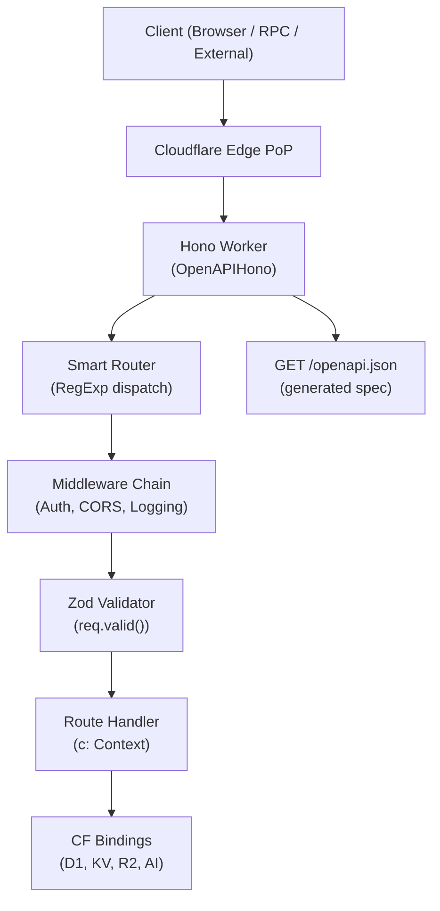

# Codex CLI for Hono.js: Building Type-Safe Edge APIs with Zod OpenAPI, RPC, and Cloudflare Workers


---

Hono has graduated from a niche Cloudflare Workers curiosity to one of the most-downloaded TypeScript web frameworks in 2026.[^1] Shipping at v4.12.16 (April 2026), it is roughly 14 KB minified, benchmarks at over 400,000 requests per second, and runs unchanged on Cloudflare Workers, Bun, Deno, Node.js, AWS Lambda, Vercel, and Fastly Compute — all through a single Web Standards-based API.[^2] For teams using Codex CLI, Hono's composable primitives, first-class TypeScript inference, and official MCP server integration make it an unusually well-suited target for agent-assisted development.

This article covers the full workflow: project scaffolding, AGENTS.md design, the Cloudflare plugin and MCP stack, `@hono/zod-openapi` for schema-first routing, the Hono RPC client for type-safe consumption, and multi-runtime testing patterns.

---

## Why Hono and Codex Make a Good Pair

Codex works best when it has clear, typed boundaries to work within. Hono provides exactly that: every route is an explicitly typed handler with validated request shapes and inferred response types. Combined with `@hono/zod-openapi`, your schema definitions become the contract that Codex uses both to generate implementation and to verify correctness — closing the loop between spec and code.

Three specific properties make Hono a high-leverage target for agentic development:

- **Collocated types.** Request params, query, JSON body, and headers are defined at the route level using standard Zod schemas. Codex reads these types directly from source rather than inferring them from a distant interface file.
- **Portable runtime code.** The same `app` object deploys to every runtime — Codex can generate Cloudflare Workers–compatible code that also works in a local Bun test harness without adapter gymnastics.
- **First-class testClient().** Hono exports a `testClient()` helper that mirrors the RPC client API in tests. Codex can write and verify handler logic against the same typed surface used in production.[^3]

---

## Scaffolding a Hono Project

Create a new Hono project via `create-hono`. For Cloudflare Workers as the primary target:

```bash
npm create hono@latest my-api -- --template cloudflare-workers
cd my-api
npm install
```

The generated project includes `wrangler.toml` (or `wrangler.jsonc`), a `src/index.ts` entry point, and TypeScript configuration aligned to the Workers runtime.[^4] Start Codex from the project root so it discovers these files automatically:

```bash
codex
```

---

## AGENTS.md for Hono Projects

A well-written `AGENTS.md` prevents the most common Codex mistakes in a Hono codebase: using Node-only APIs in Workers, generating Express-style middleware, and missing Zod schema requirements for OpenAPI routes.

```markdown
# AGENTS.md — Hono API Project

## Runtime targets
Primary: Cloudflare Workers (no Node.js built-ins, no `fs`, no `crypto` from Node)
Secondary: Bun (for local dev and tests)
DO NOT use `require()`, `process.env` directly, or Node built-ins — use `c.env` for bindings.

## Framework conventions
- All routes use `@hono/zod-openapi` — every route must define `createRoute()` with Zod schemas
- Use `OpenAPIHono` (not `Hono`) as the app class
- Responses must match the schema defined in `createRoute()` — mismatches are TypeScript errors
- Use `c.req.valid('json')` / `c.req.valid('param')` — never `c.req.json()` in OpenAPI routes

## Testing
- Tests use Hono's `testClient()` — import from `hono/testing`
- Test runner: `bun test` — no Jest, no Vitest
- Each route file has a co-located `.test.ts` file

## Deployment
- `wrangler deploy` for production — do not use `npm run build && node`
- `wrangler dev` for local development (port 8787)
- Secrets: `wrangler secret put SECRET_NAME` — do not hardcode in source

## Forbidden patterns
- No `express`, `fastify`, or other web frameworks
- No `@types/node` imports in Worker-targeted files
- No `console.log` in production code — use `c.env.LOGGER?.log()` if available
```

This level of specificity ensures Codex does not drift into Node-first patterns when writing Workers code.

---

## Cloudflare Plugin and MCP Stack

Cloudflare publishes an official Codex agent setup guide[^5] and maintains an `AGENTS.md` in the `workers-sdk` monorepo[^6] covering Wrangler, Miniflare, and Create Cloudflare. After launching Codex from your project root, install the Cloudflare plugin:

```
/plugins → search "Cloudflare" → install
```

This registers five MCP servers and several skills in a single step:

| MCP Server | What Codex gains |
|---|---|
| Code Mode API | 2,500+ Cloudflare REST endpoints (D1, KV, R2, Workers, etc.) |
| Documentation | Live Cloudflare docs queried at agent time |
| Observability | Workers logs and analytics for debugging |
| Workers Bindings | Storage and compute primitive operations |
| Browser Rendering | Web page fetching and screenshots from edge |

Installed skills include `wrangler`, `cloudflare`, `durable-objects`, `agents-sdk`, and `workers-best-practices`.[^7] With these in place, Codex can scaffold D1 migrations, create KV namespaces, read Tail Worker logs, and deploy — all without leaving the TUI.

---

## Schema-First Routing with @hono/zod-openapi

The standard Hono pattern uses `app.get()` with ad-hoc validation. For any project where external consumers or OpenAPI documentation matter, `@hono/zod-openapi` is the preferred alternative: you define schemas once and derive both runtime validation and a complete OpenAPI 3.0 spec from them.[^8]

```bash
npm install @hono/zod-openapi
```

A complete route definition follows this pattern:

```typescript
import { z } from '@hono/zod-openapi'
import { createRoute, OpenAPIHono } from '@hono/zod-openapi'

// 1. Define schemas
const ItemParamSchema = z.object({
  id: z.string().min(1).openapi({ param: { name: 'id', in: 'path' }, example: 'item_abc123' }),
})

const ItemResponseSchema = z
  .object({
    id: z.string(),
    name: z.string(),
    price: z.number(),
    stock: z.number().int().nonnegative(),
  })
  .openapi('Item')

// 2. Declare the route contract
const getItemRoute = createRoute({
  method: 'get',
  path: '/items/{id}',
  request: { params: ItemParamSchema },
  responses: {
    200: {
      content: { 'application/json': { schema: ItemResponseSchema } },
      description: 'Returns the requested item',
    },
    404: {
      content: { 'application/json': { schema: z.object({ error: z.string() }) } },
      description: 'Item not found',
    },
  },
})

// 3. Attach handler (TypeScript enforces response shape)
const app = new OpenAPIHono()

app.openapi(getItemRoute, async (c) => {
  const { id } = c.req.valid('param')
  const item = await c.env.DB.prepare('SELECT * FROM items WHERE id = ?').bind(id).first()
  if (!item) return c.json({ error: 'Not found' }, 404)
  return c.json(item as z.infer<typeof ItemResponseSchema>)
})

// 4. Serve the OpenAPI spec
app.doc('/openapi.json', {
  openapi: '3.0.0',
  info: { version: '1.0.0', title: 'Inventory API' },
})

export default app
```

When Codex generates handlers for this project, it reads the `createRoute()` definition and enforces the response contract at the type level. Mismatched response shapes become TypeScript errors, not runtime surprises.[^9]

---

## Architecture: Request Flow



---

## Hono RPC Client for Type-Safe API Consumption

Hono's `hc` (Hono Client) function exports the same route types to the client side without any code generation step.[^10] The server exports its app type; the client imports it:

```typescript
// server/index.ts
const routes = app
  .openapi(getItemRoute, handler)
  .openapi(createItemRoute, createHandler)

export type AppType = typeof routes
```

```typescript
// client/api.ts (browser, Bun, Node, or another Worker)
import { hc } from 'hono/client'
import type { AppType } from '../server/index'

const client = hc<AppType>('https://api.example.com')

// Fully typed — TypeScript knows the response shape
const res = await client.items[':id'].$get({ param: { id: 'item_abc123' } })
const item = await res.json()
// item is typed as { id: string; name: string; price: number; stock: number }
```

This is where Codex's type-awareness pays dividends: when generating client code, it reads the server-side `AppType` and generates correctly typed API calls without consulting external documentation. The client SDK literally derives from the route definitions.

---

## Testing with testClient()

Hono ships `testClient()` from `hono/testing` for unit and integration testing of handlers without a running HTTP server.[^11] Combined with Bun's built-in test runner, you get sub-millisecond test cycles:

```typescript
// src/items.test.ts
import { describe, it, expect } from 'bun:test'
import { testClient } from 'hono/testing'
import app from './index'

describe('GET /items/:id', () => {
  it('returns item for valid id', async () => {
    const client = testClient(app)
    const res = await client.items[':id'].$get({ param: { id: 'item_abc123' } })
    expect(res.status).toBe(200)
    const body = await res.json()
    expect(body).toMatchObject({ id: 'item_abc123' })
  })

  it('returns 404 for unknown id', async () => {
    const client = testClient(app)
    const res = await client.items[':id'].$get({ param: { id: 'nonexistent' } })
    expect(res.status).toBe(404)
  })
})
```

Run tests via:

```bash
bun test
```

The Codex `AGENTS.md` instruction `Tests use Hono's testClient()` means generated test files will use this pattern rather than reaching for `supertest` or `node-fetch` — both of which would fail in a Bun environment without extra configuration.

---

## Multi-Runtime AGENTS.md for the Monorepo Case

Many teams use Hono across multiple targets in a single monorepo: a Cloudflare Worker for the public API, a Bun process for internal tooling, and a Node.js adapter for a legacy integration. Directory-scoped `AGENTS.md` files handle this cleanly:

```
/
├── AGENTS.md                     # monorepo-level: shared TypeScript rules, Zod schemas
├── packages/
│   ├── api-worker/
│   │   ├── AGENTS.md             # CF Workers runtime: no Node built-ins
│   │   └── src/
│   ├── internal-service/
│   │   ├── AGENTS.md             # Bun runtime: bun:sqlite, bun:test allowed
│   │   └── src/
│   └── legacy-adapter/
│       ├── AGENTS.md             # Node.js: @types/node OK, uses hono/node-server
│       └── src/
```

Codex reads the nearest `AGENTS.md` in the directory hierarchy, so per-package runtime rules are respected automatically without manual context-switching in prompts.[^12]

---

## config.toml Tuning for Hono Workflows

A typical Codex configuration for a Hono project:

```toml
[model]
name = "gpt-5.5"
reasoning_effort = "medium"

[sandbox]
network_access = false            # Workers code should not need network at test time
allow_commands = ["bun", "npx", "wrangler"]
deny_commands = ["node", "npm run dev"]  # prefer wrangler dev

[tools]
allow = ["read_file", "write_file", "shell"]

[context]
project_doc_max_bytes = 131072    # Hono projects have rich type definitions

[[mcp_servers]]
name = "cloudflare"
type = "remote"
url = "https://mcp.cloudflare.com"

[[mcp_servers]]
name = "prisma"
type = "remote"
url = "https://mcp.prisma.io/mcp"  # if using Prisma Postgres as the D1 alternative
```

`network_access = false` keeps Codex sandboxed during test-driven development — it cannot call the real Cloudflare API accidentally during handler generation. Grant network access selectively with `--profile cf-deploy` when running actual deploys.

---

## Deployment Workflow

```bash
# Local development — Wrangler's local emulation layer (Miniflare under the hood)
wrangler dev

# Deploy to Cloudflare
wrangler deploy

# Set a secret (not committed to source)
wrangler secret put OPENAI_API_KEY
```

For CI, Codex can generate a GitHub Actions workflow via:

```
Write a GitHub Actions workflow that runs bun test on every PR and runs wrangler deploy to production on push to main. Use CLOUDFLARE_API_TOKEN from secrets.
```

The Cloudflare MCP server's Code Mode API lets Codex verify that the worker deployed successfully by querying the Workers API directly after `wrangler deploy` completes.[^13]

---

## Summary

| Capability | Tool |
|---|---|
| Framework | Hono v4.12+ (`@hono/zod-openapi`) |
| Schema validation | Zod — colocated at route level |
| OpenAPI spec | Generated at `/openapi.json` automatically |
| Type-safe client | `hc<AppType>()` from `hono/client` |
| Testing | `testClient()` + `bun test` |
| Deployment | `wrangler deploy` |
| MCP integration | Cloudflare MCP (5 servers) via `/plugins` |
| AGENTS.md scope | Per-package for multi-runtime monorepos |

Hono's explicit types, minimal runtime footprint, and official agent tooling make it one of the highest-leverage web frameworks for Codex-assisted development in 2026. The combination of schema-first routing via `@hono/zod-openapi`, the RPC client's server-derived types, and `testClient()` gives Codex the tight feedback loop it needs to generate correct, runtime-specific code without constant human correction.

---

## Citations

[^1]: Hono v4.12.16 shipping April 30, 2026 — [Hono GitHub](https://github.com/honojs/hono)
[^2]: Hono documentation, multi-runtime support and benchmark data — [hono.dev/docs](https://hono.dev/docs)
[^3]: `testClient()` API — [Hono Testing Helpers](https://hono.dev/docs/testing)
[^4]: Hono Cloudflare Workers getting started — [hono.dev/docs/getting-started/cloudflare-workers](https://hono.dev/docs/getting-started/cloudflare-workers)
[^5]: Cloudflare official Codex agent setup guide — [developers.cloudflare.com/agent-setup/codex](https://developers.cloudflare.com/agent-setup/codex/)
[^6]: Cloudflare workers-sdk AGENTS.md — [github.com/cloudflare/workers-sdk/blob/main/AGENTS.md](https://github.com/cloudflare/workers-sdk/blob/main/AGENTS.md)
[^7]: Cloudflare Codex plugin skills and MCP servers — [developers.cloudflare.com/agent-setup/codex](https://developers.cloudflare.com/agent-setup/codex/)
[^8]: `@hono/zod-openapi` package and Zod OpenAPI example — [hono.dev/examples/zod-openapi](https://hono.dev/examples/zod-openapi)
[^9]: `@hono/zod-openapi` npm — [npmjs.com/package/@hono/zod-openapi](https://www.npmjs.com/package/@hono/zod-openapi)
[^10]: Hono RPC client (`hc`) — [Hono RPC docs](https://hono.dev/docs/guides/rpc)
[^11]: Hono testClient() — [Hono testing docs](https://hono.dev/docs/testing)
[^12]: Codex CLI AGENTS.md directory scoping — [OpenAI Codex CLI docs](https://developers.openai.com/codex/cli)
[^13]: Cloudflare Code Mode API (2,500+ endpoints) — [developers.cloudflare.com/agent-setup/codex](https://developers.cloudflare.com/agent-setup/codex/)
