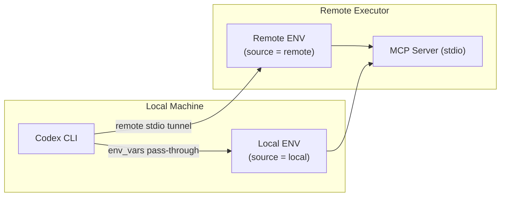
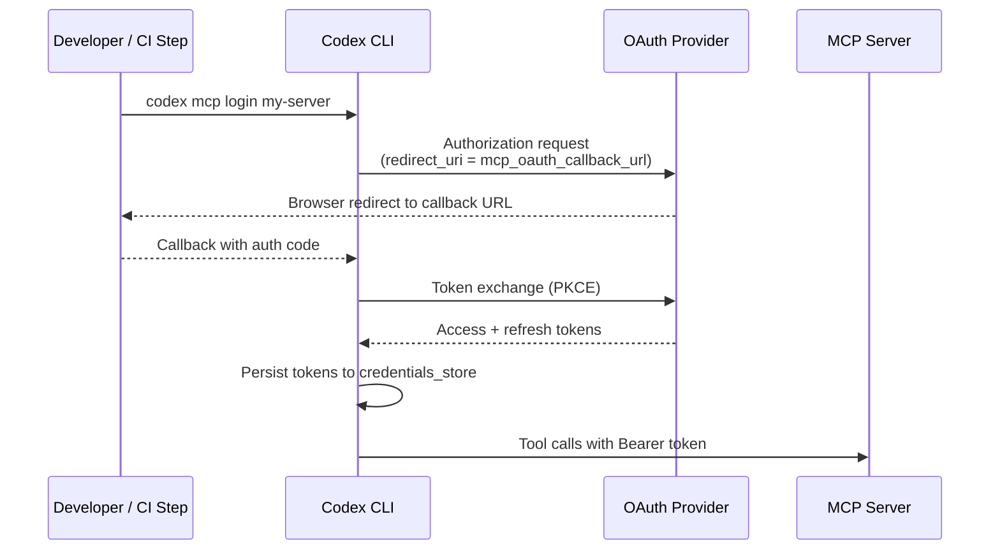

# Codex CLI MCP in v0.136: Per-Server Environment Targeting, OAuth Streamable HTTP, and Concurrent Read-Only Tools


---

The v0.136.0 release (1 June 2026) shipped several incremental but meaningful changes to how Codex CLI handles MCP servers: per-server environment variable targeting between local and remote executor environments, new OAuth callback configuration keys for devbox and container workflows, concurrent execution of read-only tools, and a dependency upgrade to rmcp 1.7.0.[^1] None of these are dramatic feature additions, but together they close gaps that have caused friction for teams running Codex against remote MCP endpoints in CI/CD and multi-environment setups.

This article unpacks each change with concrete `config.toml` examples and explains where each applies.

---

## Why Remote MCP Configuration Has Been Painful

Local MCP servers — started via `command` over stdio — work straightforwardly: they run in the same process environment as Codex and inherit environment variables without ceremony. Remote MCP servers over Streamable HTTP introduce three complications that did not have clean solutions before v0.135/v0.136:

1. **Environment variable sources diverge.** When Codex runs as a cloud agent or behind a remote executor, the environment variable available locally (e.g., a developer's personal `GITHUB_TOKEN`) may differ from the one needed at the MCP server's end (e.g., a CI service account token sourced from the remote environment).

2. **OAuth callbacks require accessible URIs.** The standard OAuth redirect flow assumes a browser and a localhost callback. On a headless remote devbox or inside a Docker container, `localhost` is unreachable from the OAuth provider, and ports may be firewalled.

3. **Read-only tool calls serialised.** Before v0.136, all tool calls were dispatched serially regardless of whether they were mutating or idempotent. For information-retrieval tools (search, read, list), this was pure latency overhead.

---

## Per-Server Environment Variable Targeting

MCP servers defined with `env_vars` can now specify a `source` per variable.[^2] The valid values are `"local"` (default) and `"remote"`.

```toml
[mcp_servers.internal-docs]
command = "npx"
args = ["-y", "@acme/docs-mcp"]
env_vars = [
  "DOCS_API_KEY",                                   # reads from local env
  { name = "CI_SERVICE_TOKEN", source = "remote" }, # reads from remote executor env
]
```

A plain string such as `"DOCS_API_KEY"` is equivalent to `{ name = "DOCS_API_KEY", source = "local" }`. The `source = "remote"` path requires the server to be configured with `experimental_environment = "remote"`, which routes its stdio channel through the remote execution layer rather than a local subprocess.[^3]



### Practical Use Case: CI Token Separation

A team running Codex CLI in GitHub Actions uses a repository secret (`CI_MCP_TOKEN`) injected into the runner environment, not the developer's local shell. By targeting that variable with `source = "remote"`, the same `config.toml` committed to `.codex/config.toml` works correctly for both local developer sessions and CI runs without per-environment overrides.[^3]

---

## OAuth for Streamable HTTP: Callback Port and URL

OAuth authentication for remote MCP servers has been available since earlier releases, but v0.135 and v0.136 added two top-level `config.toml` keys that address real-world deployment constraints.[^2]

### `mcp_oauth_callback_port`

```toml
mcp_oauth_callback_port = 5555
```

When set, Codex binds its local OAuth callback listener to this exact port rather than an ephemeral one chosen by the OS. Use this when your OAuth provider requires a pre-registered redirect URI with a fixed port.

### `mcp_oauth_callback_url`

```toml
mcp_oauth_callback_url = "https://devbox.example.internal/callback"
```

Overrides the redirect URI sent to the OAuth provider as `redirect_uri`. When the callback URL is a non-localhost address, Codex binds the listener on `0.0.0.0` so that the incoming redirect from the provider can reach it through the network interface — for example, when using an ngrok tunnel, an SSH port-forward, or a Cloudflare tunnel in a remote development environment.[^4]

When `mcp_oauth_callback_url` is set to a localhost address, Codex binds only on the loopback interface for safety. Both keys are independent: you can set the callback URL without constraining the port, and vice versa.

### `mcp_oauth_credentials_store`

A related key, `mcp_oauth_credentials_store`, controls where OAuth tokens are persisted:[^2]

| Value | Behaviour |
|-------|-----------|
| `"auto"` | Prefers OS keyring; falls back to encrypted file |
| `"keyring"` | Always uses OS keyring (macOS Keychain, Linux Secret Service, Windows Credential Manager) |
| `"file"` | Stores tokens in `~/.codex/mcp_oauth_credentials.json` (useful for headless CI) |

For CI environments where a keyring is unavailable, set `mcp_oauth_credentials_store = "file"` and ensure the credentials file is written before the Codex step via `codex mcp login <server-name>` in a prior pipeline step.



### Complete OAuth Example

```toml
# ~/.codex/config.toml

mcp_oauth_callback_port = 9876
mcp_oauth_callback_url  = "https://tunnel.example.com/codex-oauth-callback"
mcp_oauth_credentials_store = "file"

[mcp_servers.linear]
url = "https://mcp.linear.app/sse"
# No bearer_token_env_var — OAuth flow handles auth

[mcp_servers.notion]
url = "https://api.notion.com/mcp"
bearer_token_env_var = "NOTION_INTEGRATION_TOKEN"
```

---

## Concurrent Execution of Read-Only Tools

The rmcp 1.7.0 upgrade enabled a behavioural change: MCP tools that advertise `readOnlyHint: true` in their schema can now be dispatched concurrently.[^5] Previously all tool calls were serialised through a single request queue regardless of their side-effect profile.

For tools like documentation search, file listing, metrics queries, or schema inspection this can eliminate sequential latency that adds up across multi-tool agent turns. A turn that previously called four read-only lookup tools sequentially (say 4 × 800 ms = 3.2 s) can now complete in roughly the time of a single call if the MCP server handles concurrent requests.

Server authors need to declare the hint correctly in their tool schema:

```json
{
  "name": "search_docs",
  "description": "Search the documentation index",
  "inputSchema": { ... },
  "readOnlyHint": true
}
```

Codex respects the hint but does not blindly trust it — if a tool call results in an observable mutation despite the hint, that is a server bug, not a Codex responsibility.

---

## Connector Tool Schema Preservation

A bug fix in v0.136 addresses schema inference for MCP connector tools: local `$ref` and `$defs` structures within tool input schemas are now preserved rather than being flattened before exposure to the model.[^1]

Previously, schemas that relied on `$defs` for shared type references were being inlined during the connector tool registration step. This occasionally produced schemas that exceeded the model's per-tool schema size limit, causing tools to be silently omitted. The v0.136 change retains the compact `$ref`/`$defs` form, and oversized schemas are now explicitly compacted before exposure rather than silently dropped.

If you have previously observed MCP tools disappearing from the agent's tool surface with no error, upgrading to v0.136 and running `codex doctor` should surface the schema size issue if it was the underlying cause.

---

## Updated MCP Configuration Reference (v0.136)

| Key | Scope | Type | Description |
|-----|-------|------|-------------|
| `mcp_oauth_callback_port` | global | integer (1–65535) | Fixed port for OAuth callback listener |
| `mcp_oauth_callback_url` | global | string (URL) | Override redirect URI sent to OAuth provider |
| `mcp_oauth_credentials_store` | global | `"auto"` \| `"keyring"` \| `"file"` | Persistence backend for OAuth tokens |
| `env_vars` | per-server | array | Variables to inject; supports `{name, source}` objects |
| `bearer_token_env_var` | per-server (HTTP) | string | Env var name for `Authorization: Bearer` header |
| `http_headers` | per-server (HTTP) | table | Static header key-value pairs |
| `env_http_headers` | per-server (HTTP) | table | Headers populated from environment variables |
| `enabled_tools` | per-server | array | Allowlist of tool names to expose |
| `startup_timeout_sec` | per-server | float | Seconds to wait for server to become ready |
| `tool_timeout_sec` | per-server | float | Max seconds per tool call |
| `experimental_environment` | per-server | `"remote"` | Routes stdio through remote executor |

---

## Diagnosing MCP Configuration Problems

`codex doctor` in v0.136 (built on the expanded v0.135 diagnostics[^6]) reports each configured MCP server, its transport type, connection status, and the resolved list of exposed tools. If a server fails to connect or its tools are missing, the doctor output now includes the failure reason rather than a generic error.

```bash
codex doctor
# — MCP Servers ———————————————————————————————
# linear          (http)  CONNECTED  12 tools
# internal-docs   (stdio) CONNECTED   8 tools
# notion          (http)  AUTH_REQUIRED — run: codex mcp login notion
```

The `AUTH_REQUIRED` state distinguishes servers that are reachable but awaiting OAuth login from servers that are unreachable (`TIMEOUT`, `CONNECTION_ERROR`).

---

## Migration Checklist for Existing MCP Setups

1. **Run `codex doctor` after upgrading** to surface any tools that were previously silently omitted due to schema size issues.
2. **Review `env_vars` arrays**: if you are using `env` blocks to inject secrets into stdio servers in multi-environment setups, consider migrating to the `env_vars` + `source = "remote"` pattern for cleaner separation.
3. **Add `mcp_oauth_callback_port`** if your OAuth provider rejects dynamic redirect URIs or if port conflicts arise from ephemeral allocation.
4. **Set `mcp_oauth_credentials_store = "file"`** for any CI pipeline using `codex mcp login` in a preceding step — the keyring is typically absent in headless environments.
5. **Verify read-only tools declare `readOnlyHint`** in your private MCP server implementations to benefit from concurrent dispatch.

---

## Citations

[^1]: Codex CLI v0.136.0 release notes — [https://github.com/openai/codex/releases/tag/v0.136.0](https://github.com/openai/codex/releases/tag/v0.136.0)
[^2]: Codex CLI MCP Configuration Reference — [https://developers.openai.com/codex/mcp](https://developers.openai.com/codex/mcp)
[^3]: Codex CLI Configuration Reference — `experimental_environment`, `env_vars` — [https://developers.openai.com/codex/config-reference](https://developers.openai.com/codex/config-reference)
[^4]: Codex CLI Sample Configuration — OAuth callback keys — [https://developers.openai.com/codex/config-sample](https://developers.openai.com/codex/config-sample)
[^5]: rmcp 1.7.0 upgrade and concurrent read-only tool dispatch — Codex CLI changelog — [https://developers.openai.com/codex/changelog](https://developers.openai.com/codex/changelog)
[^6]: Codex CLI v0.135.0 enhanced doctor diagnostics — [https://github.com/openai/codex/releases/tag/v0.135.0](https://github.com/openai/codex/releases/tag/v0.135.0)
