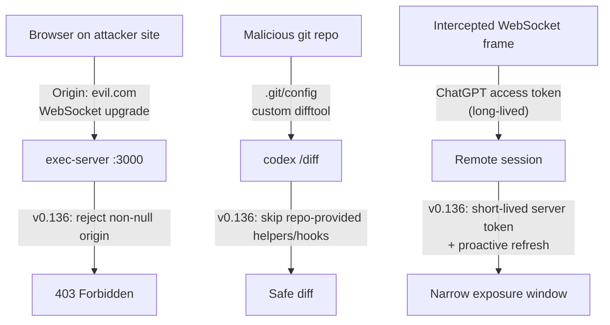
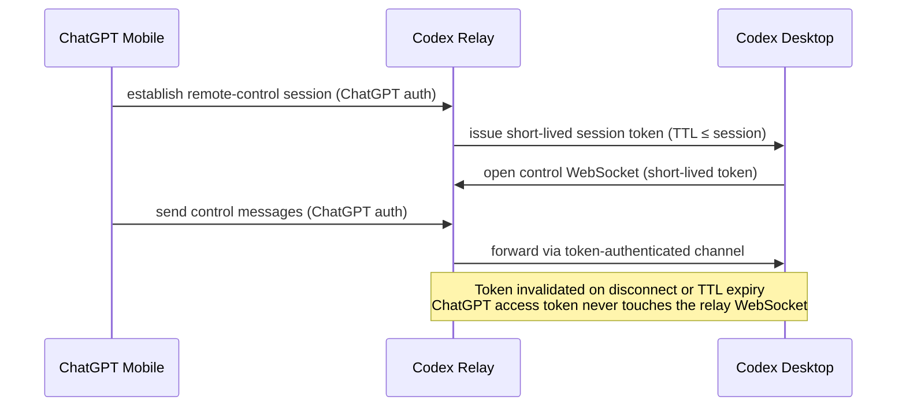

# Codex CLI v0.136 Security Hardening: Closing Three Agent Attack Surfaces


The v0.136.0 release (1 June 2026) shipped several headline features — OSC 8 hyperlinks, session archiving, the app-server `--stdio` mode — but buried in the same release were three security fixes that collectively close attack surfaces unique to AI coding agents. These are not conventional application vulnerabilities; they are threat vectors that emerge specifically because Codex runs a local WebSocket server, executes Git operations against repository-controlled configurations, and maintains long-lived remote-control token sessions. This article unpacks each fix, explains the attack class it neutralises, and gives you concrete verification steps for your own environments.[^1]

---

## Background: Why Agent Security Is Different

A traditional CLI tool processes its own inputs and exits. Codex is persistent: it runs a local `exec-server` WebSocket endpoint, holds authenticated sessions that can be driven from a remote phone, and executes commands against codebases that can contain adversarially crafted content. These properties combine into an attack surface that standard application security checklists do not adequately address.[^2]

Three vulnerability classes collided in the weeks before v0.136:

1. **Cross-site WebSocket hijacking (CSWSH)** — a browser-based attack against local dev tools.
2. **Repository-provided Git helper injection** — a way to execute arbitrary code when an agent runs `git diff`.
3. **Long-lived token leakage** — persistent ChatGPT access tokens on remote-control WebSocket connections.



---

## Fix 1: exec-server Browser-Origin Rejection

### The Attack Class

The Codex `exec-server` is a Rust WebSocket server that exposes a JSON-RPC 2.0 surface for spawning processes and managing filesystem operations. By default it binds to `127.0.0.1` — but browsers do not enforce the same-origin policy on WebSocket upgrade requests. Any website a developer visits can attempt a WebSocket upgrade to `ws://127.0.0.1:PORT`.

If that upgrade succeeds and the server accepts command-execution requests, the attacker's page can inject arbitrary prompts into the running agent, exfiltrate workspace paths, read open thread state, or trigger destructive operations.[^3]

This exact pattern was disclosed as **CVE-2026-44211** against the Cline CLI kanban server (CVSS 9.6), which ran on `127.0.0.1:3484` without Origin validation. Proof-of-concept code demonstrated full AI agent terminal hijacking from a malicious web page.[^4]

### What v0.136 Changed

PR [#24830](https://github.com/openai/codex) added explicit Origin header validation to every exec-server WebSocket handshake. Codex now rejects any upgrade request that carries a non-null `Origin` header — the signal that the request originated from a browser context rather than from the Codex app itself or a trusted CLI client.

```bash
# Simulating a browser-origin upgrade (rejected in v0.136+)
curl -i \
  -H "Connection: Upgrade" \
  -H "Upgrade: websocket" \
  -H "Origin: https://evil.example.com" \
  -H "Sec-WebSocket-Key: dGhlIHNhbXBsZSBub25jZQ==" \
  -H "Sec-WebSocket-Version: 13" \
  http://127.0.0.1:10001/

# v0.136 response: HTTP 403 Forbidden
# Connection closed immediately
```

OWASP's WebSocket Security Cheat Sheet mandates exactly this approach: validate the `Origin` header on every handshake using an explicit allowlist, not a denylist or substring match.[^5]

### Legitimate Client Impact

Clients that connect programmatically from the Codex app or the CLI itself do not send an `Origin` header (non-browser HTTP clients omit it by default), so they are unaffected. If you have built a custom exec-server client in Node.js or Python, you must confirm your WebSocket library does not automatically inject an `Origin` header from a browser-like environment.

```toml
# config.toml — exec-server port if you need to override the default
[exec_server]
port = 10001          # default; set to 0 for ephemeral port
# No explicit origin allowlist config — the allowlist is compile-time: null origin only
```

---

## Fix 2: /diff Git Helper Injection Prevention

### The Attack Class

When Codex processes a repository, running `/diff` invokes `git diff` under the hood. Git's configuration system allows a repository's `.git/config` to specify custom `diff` helpers, `difftool` executables, and filter drivers. A maliciously crafted repository can therefore arrange for arbitrary binaries to run the moment an agent calls `git diff` — even in a sandboxed session, because the helpers run with the permissions of the sandboxed process, not through the sandbox's exec fence.[^6]

This is a narrower variant of the path exploited by **CVE-2026-3854**, a high-severity GitHub Enterprise Server RCE (CVSS 3.1: 8.7) where unsanitised push option values were injected into internal service headers, allowing attackers to redirect `custom_hooks_dir` and chain into arbitrary code execution on GitHub's own servers during a `git push`.[^7]

For Codex specifically: an agent opening a public repository and running `/diff` to inspect changes between branches could silently execute attacker-controlled code. This is particularly dangerous in agentic loops where `/diff` output feeds the next planning step.

### What v0.136 Changed

PR [#24954](https://github.com/openai/codex) ensures the `git diff` invocation that backs the `/diff` command explicitly disables repository-provided helpers and hooks:

```bash
# Equivalent of what Codex now does internally:
git -c diff.external= \
    -c core.hooksPath=/dev/null \
    diff HEAD~1

# Previously, the default invocation would respect:
# diff.external from .git/config
# core.hooksPath pointing to repo-controlled scripts
```

The `diff.external=` override forces Git to use its built-in diff, ignoring any `diff.external` set in the repo's `.git/config`. The `core.hooksPath=/dev/null` (or the Windows equivalent) prevents hook scripts from running.

This is defence-in-depth alongside the existing sandbox: even if a diff.external binary were to be invoked, the sandbox would constrain its I/O. But removing the invocation entirely eliminates the attack path with no trade-offs for legitimate use — Codex's `/diff` display does not rely on custom diff drivers.

### Developer Action Required

If you use `git-diff-based` MCP tools or custom scripts that call `git diff` against user-provided repositories, apply the same flags:

```bash
#!/usr/bin/env bash
# safe-diff.sh — diff any repo path without executing repo-provided helpers
git \
  -C "$1" \
  -c diff.external= \
  -c core.hooksPath=/dev/null \
  -c core.fsmonitor= \
  diff "${@:2}"
```

Add this wrapper as your `diff` MCP tool implementation rather than calling `git diff` directly.

---

## Fix 3: Short-Lived Remote-Control Tokens

### The Attack Class

Codex's remote-control feature lets a mobile ChatGPT session drive the desktop agent. Before v0.136, the WebSocket connection carrying remote-control traffic was authenticated with the user's ChatGPT access token — a long-lived credential with broad scope. If that WebSocket connection's traffic were intercepted (via a rogue Wi-Fi AP, a compromised relay node, or a logging proxy), the token provided long-term access to the user's entire ChatGPT session.[^8]

The principle of least privilege requires that authentication credentials have the minimum scope and lifetime needed for the operation they protect. A remote-control WebSocket session is ephemeral; it should not carry a credential that outlives the session by orders of magnitude.

### What v0.136 Changed

Remote-control WebSocket connections now authenticate with **short-lived server-issued tokens** rather than the user's ChatGPT access token. The desktop agent requests a session-scoped token from the Codex backend at connection setup, and that token expires when the remote-control session ends or on a fixed TTL, whichever comes first.[^9]



The key security property: even if the relay-to-desktop WebSocket traffic is captured, the attacker holds a token that expires on session termination, not one tied to the user's long-lived ChatGPT credentials.

### Companion Fix: Proactive Auth Token Refresh

PR [#23546](https://github.com/openai/codex) introduced proactive ChatGPT token refresh — the CLI now renews the access token before the five-minute expiry window rather than waiting for a 401 response. This prevents the auth failure pattern that previously manifested as a generic cloud error, forcing users to re-authenticate mid-task in ways that could expose the old token to retry logic.[^10]

```toml
# No user-facing config required for token refresh.
# The behaviour is automatic from v0.135.0 onwards.
# Verify token health with:
#   codex doctor
# Look for: "auth: valid (expires in Xm)"
```

---

## Fix 4: CODEX_API_KEY for Approved Remote Hosts

Alongside the token improvements, v0.136 introduced `CODEX_API_KEY` as an authentication mechanism for remote execution against **approved OpenAI hosts** (managed cloud environments where OpenAI vouches for the host identity). Previously, remote execution relied solely on ChatGPT account authentication, which couples the execution credential to the user's account session.[^11]

```bash
# Register a CODEX_API_KEY for an approved remote host.
# Set the key in your environment before invoking Codex:
#   export CODEX_API_KEY=<your-approved-host-key>
codex --remote wss://approved-host.codex.openai.com exec "run tests"
```

```toml
# config.toml — remote section
[remote]
api_key_env = "CODEX_API_KEY"   # environment variable name holding the key
```

This matters for CI/CD pipelines and enterprise environments where human ChatGPT accounts should not be used as service credentials. The API key is scoped to execution operations, not to the user's ChatGPT data, and can be rotated independently of any user account.

---

## Sandboxed Command Cleanup After Interruption

A lower-profile but operationally important fix: PR [#22729](https://github.com/openai/codex) made sandboxed command teardown more reliable after an interruption (Ctrl-C or a timeout).[^12] Before this fix, interrupted sandboxed processes could leave orphan processes still holding file locks or consuming resources. The fix ensures the process group is fully reaped when the sandbox is torn down.

```bash
# Verify no orphan codex-sandbox processes after Ctrl-C:
pgrep -a codex-sandbox   # should return nothing after interrupting a task
```

---

## Checking Your Exposure: codex doctor

Run `codex doctor` on v0.136.0 or later to get a security posture snapshot:

```bash
codex doctor --json | jq '{
  version: .cli_version,
  exec_server_port: .exec_server.port,
  auth_valid: .auth.valid,
  auth_expires_in: .auth.expires_in_seconds,
  sandbox_mode: .sandbox.mode
}'
```

A healthy output will show:
- `cli_version` ≥ `0.136.0`
- `exec_server` present only if you have explicitly started the app-server
- `auth.expires_in_seconds` > 300 (token not near expiry)
- `sandbox.mode` appropriate to your platform (`elevated`, `unelevated`, or `bubblewrap`)

---

## Summary: Attack Surfaces Before and After v0.136

| Threat | Pre-v0.136 | v0.136+ |
|--------|-----------|---------|
| CSWSH against exec-server | Any browser could connect to `127.0.0.1` WebSocket | Browser-origin `Origin` header rejected with HTTP 403 |
| Git diff helper injection | Repo `.git/config` `diff.external` honoured | `diff.external=` and `core.hooksPath=/dev/null` overridden at invocation |
| Long-lived remote-control token | ChatGPT access token on relay WebSocket | Session-scoped short-lived token; ChatGPT token stays off relay |
| Remote execution auth | ChatGPT account session only | `CODEX_API_KEY` for approved hosts, enabling service-account auth |
| Auth expiry disruption | Generic cloud error at token boundary | Proactive refresh before 5-minute expiry window |
| Orphan processes on interrupt | Possible process group leaks | Full process-group reap on sandbox teardown |

These are not exotic threat models. CVE-2026-44211 against Cline (CVSS 9.6) demonstrated that CSWSH against AI agent tools is actively being researched and disclosed. CVE-2026-3854 (CVSS 3.1: 8.7) demonstrated that push-option header injection chaining into git hook redirection is a realistic RCE path. The v0.136 fixes address both classes before they manifest as Codex CVEs.

Update with `codex update` or `npm update -g @openai/codex`.

---

## Citations

[^1]: Codex CLI Changelog, v0.136.0, 2026-06-01. <https://developers.openai.com/codex/changelog>
[^2]: OpenAI Codex exec-server README (Oreoxp mirror). <https://github.com/Oreoxp/codex-cli/blob/main/codex-rs/exec-server/README.md>
[^3]: Pentest-Tools, "Cross-site WebSocket hijacking: understanding and exploiting CSWSH". <https://pentest-tools.com/blog/cross-site-websocket-hijacking-cswsh>
[^4]: GitLab Advisory Database, CVE-2026-44211: Cline Kanban Server Cross-Origin WebSocket Hijacking. <https://advisories.gitlab.com/npm/cline/CVE-2026-44211/>
[^5]: OWASP WebSocket Security Cheat Sheet. <https://cheatsheetseries.owasp.org/cheatsheets/WebSocket_Security_Cheat_Sheet.html>
[^6]: OpenAI Codex CLI v0.136.0 PR #24954 (referenced in changelog). <https://developers.openai.com/codex/changelog>
[^7]: Wiz Research, "GitHub RCE Vulnerability: CVE-2026-3854 Breakdown". <https://www.wiz.io/blog/github-rce-vulnerability-cve-2026-3854>
[^8]: Codex CLI Changelog, v0.136.0 — "remote-control websockets use short-lived server tokens instead of ChatGPT access tokens". <https://developers.openai.com/codex/changelog>
[^9]: Releasebot, "Codex Updates by OpenAI — June 2026". <https://releasebot.io/updates/openai/codex>
[^10]: Codex CLI Changelog, v0.136.0 PR #23546 — "ChatGPT auth refreshes tokens before the five-minute expiry window". <https://developers.openai.com/codex/changelog>
[^11]: OpenAI Developers, Remote Connections — Codex. <https://developers.openai.com/codex/remote-connections>
[^12]: Codex CLI Changelog, v0.136.0 PR #22729 — "Sandboxed command cleanup more reliable after interruptions". <https://developers.openai.com/codex/changelog>
