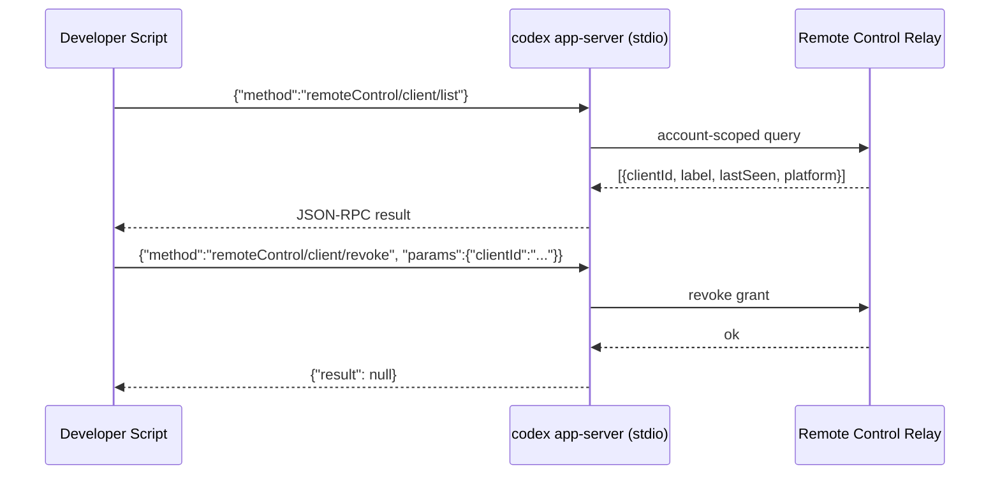
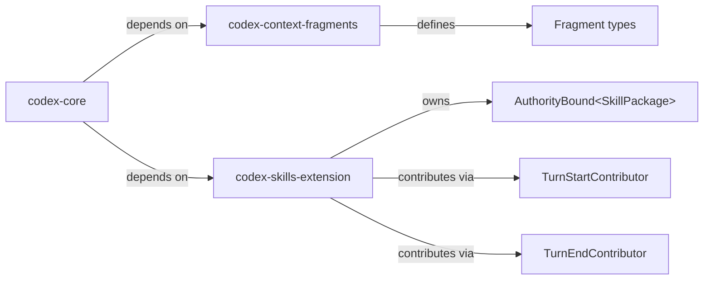

# Codex CLI v0.137 Alpha: Remote Control Client Management, Skills Extension Architecture, and Code-Mode Image Generation


`v0.137.0-alpha.4` landed on npm on 3 June 2026, one stable release after v0.136.0 (1 June 2026).[^1] Pre-releases are not production candidates — keep v0.136.0 for anything that matters — but the commit log reveals the architectural direction OpenAI is moving towards for the next stable drop. This article walks through the six most significant changes, with the PRs they landed on.

> ⚠️ All features described here are pre-release. API surfaces, configuration keys, and behaviour may change before v0.137.0 stable ships.

## Installing the alpha

```bash
npm install -g @openai/codex@0.137.0-alpha.4
codex --version   # 0.137.0-alpha.4
```

To revert to the current stable:

```bash
npm install -g @openai/codex@latest   # pins to v0.136.0
```

---

## 1 — Remote Control Client Management via JSON-RPC (PR #25785)

The headline addition is a pair of new JSON-RPC methods that let you list and revoke remote-control device grants **without going through the relay enrolment flow**.[^2] Previously, the only way to remove a remote client was to navigate through Settings → Connections in the desktop app — a manual, UI-bound operation. The new methods expose this over the app-server's existing JSON-RPC transport:

| Method | Purpose |
|---|---|
| `remoteControl/client/list` | Returns all active remote-control grants for the authenticated account |
| `remoteControl/client/revoke` | Revokes a specific grant by `clientId` |

Both methods are account-scoped and authenticate using the session credentials already present in the app-server, so no additional token plumbing is required.



This makes remote-client lifecycle management scriptable — useful for team deployments where you need to rotate devices or enforce a clean state after a security incident.

---

## 2 — Skills Extension Architecture (PR #25953 + #26122)

Two PRs lay the groundwork for extracting the skills subsystem into its own crate.[^3][^4]

`PR #26122` extracted the generic context-fragment machinery into a new `codex-context-fragments` crate. Context fragments are the typed metadata blobs that appear in turn transcripts — things like file references, web-search results, and skill invocations. Moving them into their own crate reduces the dependency surface for extensions that only need fragment types, not all of core Codex.

`PR #25953` adds a skeleton `codex-skills-extension` crate under `ext/skills`. Key concepts in the initial scaffold:

- **Authority-bound skill package types** — skill packages are parameterised by an authority level, allowing the extension host to limit which skill packages a given execution context may load.
- **Lifecycle contributor placeholders** — the crate ships stub `TurnStartContributor` and `TurnEndContributor` implementations that the skills system will hook into during turn assembly. These are empty for now but signal where the per-turn logic will live once the extraction is complete.



For end users, the short-term impact is nil — skills continue to work exactly as before. The medium-term benefit is that third-party extensions will be able to ship their own authority-scoped skill packages without forking core Codex.

---

## 3 — Per-Turn Skill Catalogue Resolution (PR #26106)

Skill catalogue resolution moved from lifecycle hooks to **turn-input contributors**.[^5] Previously, the skill catalogue (the set of skills available for a given turn) was assembled during session initialisation. The new approach resolves the catalogue fresh at the start of every turn, using the resolved executor environment as context.

Practical consequences:

- Skills that are executor-specific (for example, a skill that only makes sense inside a remote cloud executor) are now excluded automatically when you're running locally, and vice versa.
- Environment-gated skills no longer require a session restart to take effect — changing your executor mid-session will reflect in the skill catalogue at the next turn.

---

## 4 — Permission Profile Modernisation (PR #25926)

`PR #25926` refactors how sandbox defaults are represented internally.[^6] Before this change, the derivation from a raw `sandbox_mode` string to an actual permission profile involved a "projection shape" that was opaque to the rest of the system — you could not easily inspect which permission profile was active without tracing the derivation manually.

After the change, **implicit sandbox defaults are expressed directly as observable named permission profiles**. The practical effect for end users:

```bash
# /permissions now shows a concrete profile name even when no explicit
# profile was chosen, e.g. "workspace-default" instead of a blank slot
codex
/permissions
```

This also tightens the semantics of `--profile` and `codex exec --profile`: the stack of profiles that applies to a session is now fully transparent and log-friendly, which simplifies debugging hook conflicts and sandbox permission errors.

---

## 5 — Image Generation Inside Code-Mode Sessions (PR #25923)

`PR #25923` changes the image-generation tool's exposure level from `DirectModelOnly` to `Direct`.[^7] In Codex's tool-dispatch architecture, `DirectModelOnly` means the tool is callable from top-level turns but cannot be invoked from within a nested code-mode sub-turn. `Direct` removes that restriction.

The practical effect: if you have a code-mode sub-turn (for example, a subagent that is running in code-mode to implement a component), it can now call the image-generation tool inline, without surfacing back to the top-level session.

Enable the feature flag if it isn't active:

```bash
codex features enable image_generation
```

Combined with the `$imagegen` skill (available since v0.117), this enables richer multi-step design-to-code workflows where a subagent can generate an asset mid-task and immediately use it as context for the next step.[^8]

---

## 6 — Python SDK Wheel Publishing (PR #25906)

Before this change, the Python runtime wheel (the compiled Rust binary surfaced to the `openai-codex` Python package) was published as a side effect of the Rust release workflow. This created an implicit coupling: if the Rust release pipeline failed or was delayed, Python users were blocked.[^9]

`PR #25906` decouples this into a standalone SDK workflow. The change also adds **musllinux variant support**, which means the wheel now ships for Alpine-based containers and other musl-libc environments without requiring a manual build. For teams running Codex inside a slim Docker image:

```dockerfile
FROM python:3.13-alpine
RUN pip install openai-codex   # now resolves a musllinux wheel directly
```

---

## Multi-Agent Stability

Two additional fixes shipped in the alpha that affect multi-agent workflows:

**PR #26144** — `close_agent` self-target rejection.[^10] In Multi-Agents v2, an agent could erroneously call `close_agent` with its own `conversation_id` as the target, which caused a hang. The fix returns a model-visible error message (`"Cannot close the current session"`) so the model can recover gracefully.

**PR #26155** — Goal progress double-charging fix.[^11] When parallel completion hooks ran simultaneously, token deltas for goal progress were charged twice. Serialisation via a per-thread permit resolves the race.

---

## EDU Account Cloud Config (PR #25963)

Education workspace plans (`ChatGPT Edu` and `Teachers`) can now fetch cloud config bundles.[^12] Previously, cloud config was limited to Business and Enterprise workspaces. Individual and usage-based plans remain excluded.

---

## When to Expect v0.137.0 Stable

Based on recent cadence (roughly two weeks between stable releases), v0.137.0 stable is likely to land in the week of 15 June 2026. The alpha has been through four iterations (`alpha.1` through `alpha.4`), suggesting the pre-release cycle is nearing its end.

Track the release on the [GitHub releases page](https://github.com/openai/codex/releases) or subscribe to the [official changelog](https://developers.openai.com/codex/changelog).

---

## Summary

| Feature | PR | User impact |
|---|---|---|
| Remote control client management JSON-RPC | #25785 | Programmatic device revocation |
| Skills extension crate skeleton | #25953 | Foundation for third-party skill packages |
| Context fragments crate | #26122 | Smaller dependency footprint for extensions |
| Per-turn skill catalogue resolution | #26106 | Environment-aware skills without session restart |
| Permission profile observability | #25926 | Clearer `/permissions` output, better debugging |
| Image generation in code-mode | #25923 | Subagents can generate images mid-task |
| Python musllinux wheels | #25906 | Alpine/musl container support without custom build |
| `close_agent` self-target fix | #26144 | Multi-agent reliability |
| Goal progress accounting fix | #26155 | Accurate token accounting with parallel hooks |
| EDU cloud config access | #25963 | Education workspace managed rollouts |

## Citations

[^1]: GitHub, "Releases · openai/codex," https://github.com/openai/codex/releases (accessed 2026-06-03). v0.137.0-alpha.4 published 2026-06-03.

[^2]: GitHub PR #25785, "feat(app-server): add remote control client management RPCs," openai/codex, merged ~2026-06-02. Author: apanasenko-oai.

[^3]: GitHub PR #25953, "feat: add skills extension scaffold," openai/codex, merged 2026-06-02. Author: jif-oai. Creates `codex-skills-extension` crate under `ext/skills`.

[^4]: GitHub PR #26122, "chore: extract context fragments into dedicated crate," openai/codex, merged 2026-06-03. Author: jif-oai. Creates `codex-context-fragments` crate.

[^5]: GitHub PR #26106, "skills: resolve per-turn catalogs from turn input context," openai/codex, merged 2026-06-03. Author: jif-oai.

[^6]: GitHub PR #25926, "config: express implicit sandbox defaults as permission profiles," openai/codex, merged 2026-06-02. Author: bolinfest.

[^7]: GitHub PR #25923, "Expose standalone image generation in code mode," openai/codex, merged 2026-06-02. Author: won-openai. Changes exposure from `DirectModelOnly` to `Direct`.

[^8]: OpenAI Developers, "Image generation in Codex CLI: gpt-image-2, the $imagegen skill, and visual development workflows," Codex Knowledge Base, https://codex.danielvaughan.com/2026/04/27/codex-cli-image-generation-gpt-image-2-visual-development-workflows/ (2026-04-27).

[^9]: GitHub PR #25906, "[codex] Publish Python runtime wheels with Python SDK releases," openai/codex, merged 2026-06-02. Author: aibrahim-oai. Adds musllinux variant support.

[^10]: GitHub PR #26144, "Reject MAv2 close_agent self-targets," openai/codex, merged 2026-06-03. Author: jif-oai.

[^11]: GitHub PR #26155, "fix: serialize goal progress accounting," openai/codex, merged 2026-06-03. Author: jif-oai.

[^12]: GitHub PR #25963, "Allow EDU accounts to fetch cloud config bundles," openai/codex, merged 2026-06-02. Author: joeflorencio-openai.
