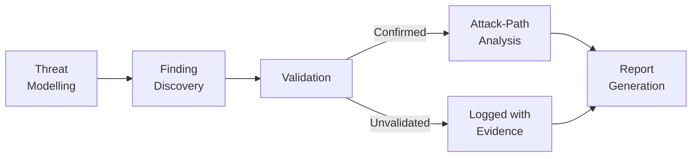
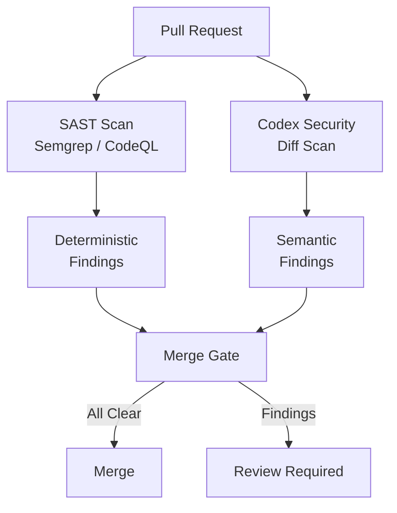

# Codex Security Plugin: Local Vulnerability Scanning, Diff Review, and Automated Remediation from the CLI


---

When OpenAI launched Codex Security as a cloud research preview in March 2026, it required the web UI and connected GitHub repositories [^1]. Three months later, the same analysis pipeline ships as a first-party **Codex plugin** that runs entirely inside the CLI — no browser, no cloud scan configuration, no GitHub-only lock-in [^2]. The plugin exposes four skills covering the full appsec triage cycle: repository scanning, high-recall deep scanning, diff-scoped review, and single-finding remediation. For teams that already run Codex CLI in their terminals and CI pipelines, this is the most significant security addition since the sandbox hardening in v0.136 [^3].

This article covers the plugin architecture, the four skills, threat-model tuning, report outputs, CI integration patterns, and the practical limitations you need to know before pointing it at production code.

## Plugin Architecture

The Codex Security plugin follows the standard `.codex-plugin/plugin.json` manifest structure introduced in v0.117.0 [^4]. It bundles four skills, no MCP servers, and no app connectors — the entire analysis runs through the Codex agent loop using the model's reasoning over your source code [^2].

```
codex-security/
├── .codex-plugin/
│   └── plugin.json
└── skills/
    ├── security-scan/SKILL.md
    ├── deep-security-scan/SKILL.md
    ├── security-diff-scan/SKILL.md
    └── fix-finding/SKILL.md
```

Each skill fires through progressive disclosure: Codex loads only the skill name and description into context initially, then pulls the full `SKILL.md` instructions when invoked [^5]. This keeps baseline token overhead negligible until you actually run a scan.

Install the plugin from the Codex plugin directory or via the CLI:

```bash
# From the TUI plugin browser
/plugins install codex-security

# Or copy to your plugins directory
cp -r codex-security ~/.codex/plugins/
```

## The Four Security Skills

### 1. Repository Scan (`$codex-security:security-scan`)

The standard repository scan performs threat modelling, finding discovery, validation, and attack-path analysis across your codebase [^2]. It follows a staged workflow:



Invoke it from an open Codex session:

```bash
$codex-security:security-scan
```

The skill identifies entry points and untrusted inputs, discovers concrete source-to-sink vulnerability paths, attempts validation in the sandbox, traces exploitable routes, rates severity, and generates both Markdown and HTML reports [^2]. The output lands in the scan directory as `report.md` and `report.html`.

Each finding includes a description, file location with line numbers, criticality rating, root cause analysis, and a suggested remediation [^6]. Validated findings carry reproduction evidence — commands executed, outputs captured, and proof-of-concept artefacts [^7].

### 2. Deep Security Scan (`$codex-security:deep-security-scan`)

The deep scan repeats discovery phases with delegated workers before validation, achieving higher recall at the cost of more tokens and wall-clock time [^2]. It suits comprehensive audits where missing a finding costs more than the extra compute.

The recommended invocation uses `/goal` mode to prevent early termination:

```bash
/goal Run a deep security scan on this repository. Do not stop
until all required steps are complete and the final report is ready.
```

Deep scans produce the same `report.md` and `report.html` output format as standard scans [^2][^8]. Expect longer runtimes — OpenAI's FAQ notes that initial scans can take several hours for large repositories, with some taking multiple days [^7].

### 3. Diff Scan (`$codex-security:security-diff-scan`)

The diff scan reviews pull requests, commits, or branch diffs for security regressions grounded in changed code [^2]. It writes a focused Markdown report rather than the dual-format output of full scans.

```bash
# Review uncommitted changes
$codex-security:security-diff-scan

# Review a specific PR branch
$codex-security:security-diff-scan against main
```

This skill maps directly to the pre-merge review workflow. Rather than scanning the entire repository, it scopes analysis to the changed lines, their call graphs, and the trust boundaries they cross. The result is a tighter, faster report suitable for gating pull requests [^9].

### 4. Finding Remediation (`$codex-security:fix-finding`)

Once you have findings from any scan type, the remediation skill validates individual findings and generates minimal patches:

```bash
$codex-security:fix-finding [finding ID or report reference]
```

The proposed patch contains a minimal actionable diff with filename and line context [^2]. Critically, the plugin **never auto-applies changes** — it generates diffs for human review [^7]. The remediation workflow also verifies that the vulnerable behaviour no longer reproduces and adds focused regression coverage [^9].

## Threat-Model Tuning

Every scan begins with threat modelling. The plugin generates an initial threat model from your codebase, summarising the repository architecture, entry points, trust boundaries, authentication assumptions, and security-sensitive components [^10].

An effective threat model should document:

- Entry points and untrusted inputs (API endpoints, file uploads, webhook handlers)
- Trust boundaries and authentication assumptions (service-to-service auth, session management)
- Sensitive data paths or privileged actions (billing mutations, credential storage)
- Review priorities — areas your team wants examined first [^10]

The model is editable. If findings seem misaligned with your actual risk profile, update the threat model first — changes directly influence future scan context and finding prioritisation [^10]. A practical pattern is to copy the auto-generated model into a Codex session, refine it collaboratively, then paste the improved version back.

```toml
# Example AGENTS.md addition for security context
# This helps the plugin build a better initial threat model

## Security Context
- Public REST API accepting JSON and multipart uploads
- Internal gRPC services behind mTLS
- PostgreSQL with row-level security policies
- Focus review on auth middleware, file parsing, and SQL construction
```

## Report Format and Severity

Standard and deep scans produce two output files in the scan directory [^2]:

| File | Format | Content |
|------|--------|---------|
| `report.md` | Markdown | Structured findings with code locations, severity, evidence |
| `report.html` | HTML | Readable report with syntax highlighting and navigation |

Diff scans produce a single focused Markdown report [^2].

Finding severity follows the standard criticality scale. In the cloud research preview's first thirty days, Codex Security identified 792 critical and 10,561 high-severity findings across 1.2 million commits, with false positive rates falling by more than 50% and over-reported severity dropping by more than 90% compared to the initial preview [^1][^11]. The local plugin uses the same analysis pipeline, so these accuracy improvements carry over.

## CI Pipeline Integration

The plugin works with `codex exec` and the `openai/codex-action` GitHub Action for automated security gating [^12][^13]:


```yaml
# .github/workflows/security-scan.yml
name: Codex Security Diff Scan
on:
  pull_request:
    branches: [main]

jobs:
  security-review:
    runs-on: ubuntu-latest
    steps:
      - uses: actions/checkout@v4
        with:
          fetch-depth: 0

      - uses: openai/codex-action@v1
        with:
          codex-args: >
            '$codex-security:security-diff-scan against origin/main'
          sandbox: read-only
          safety-strategy: drop-sudo
          output-file: security-report.md
        env:
          OPENAI_API_KEY: ${{ secrets.OPENAI_API_KEY }}

      - name: Check for critical findings
        run: |
          if grep -qi "critical" security-report.md; then
            echo "::error::Critical security findings detected"
            exit 1
          fi
```


For GitLab, the same pattern applies using `codex exec` with strict output markers [^14]:

```bash
codex exec --sandbox read-only \
  '$codex-security:security-diff-scan' \
  --output-file security-report.md
```

The `read-only` sandbox is appropriate because the security plugin only analyses code — it never needs write access during scanning [^8]. The `fix-finding` skill does need `workspace-write` when generating patches.

## Complementing Traditional SAST

Codex Security explicitly does not replace Static Application Security Testing [^7]. The plugin adds semantic, LLM-based reasoning and automated validation alongside deterministic coverage from tools like Semgrep, CodeQL, or Snyk. A practical deployment pairs both:



The SAST tool catches known vulnerability patterns with zero false negatives on its rule set. The Codex plugin catches logic-level vulnerabilities, business-logic flaws, and novel attack patterns that pattern-matching misses — but with the trade-off of non-deterministic results [^7].

## Practical Limitations

**Token cost.** Deep scans on large repositories consume substantial tokens. The plugin runs through the standard Codex agent loop, so every discovery pass, validation attempt, and report generation counts against your quota [^7].

**Language coverage.** The plugin is language-agnostic in principle — it works with whatever the model can reason about [^7]. In practice, coverage depth varies: mainstream languages with rich training data (Python, JavaScript, Go, Java) get stronger analysis than niche languages.

**No compilation required.** Findings can be produced from repository and commit context without building the project. Auto-validation may attempt builds inside the container if it helps reproduce an issue [^7].

**Rate-limit pressure.** Background security scans consume rate limits alongside your interactive sessions. On shared team quotas, schedule deep scans during off-peak hours or use a dedicated API key [^12].

**Non-determinism.** Running the same scan twice may produce different findings. The LLM-based analysis adds reasoning depth but sacrifices the reproducibility of deterministic scanners [^7]. ⚠️ Teams requiring audit-trail reproducibility should pair the plugin with a deterministic SAST tool and treat Codex findings as supplementary intelligence.

## Summary

The Codex Security plugin brings the cloud security agent's analysis pipeline to the CLI. Four skills cover the full triage cycle — scan, deep scan, diff review, and remediation — with threat-model tuning giving teams control over prioritisation. The `read-only` sandbox constraint, dual-format reporting, and GitHub Action compatibility make it practical for both interactive review and automated CI gating. It complements rather than replaces traditional SAST, adding semantic depth where pattern-matching falls short.

---

## Citations

[^1]: OpenAI, "Codex Security: now in research preview," openai.com, March 2026. [https://openai.com/index/codex-security-now-in-research-preview/](https://openai.com/index/codex-security-now-in-research-preview/)

[^2]: OpenAI, "Plugin – Codex Security," OpenAI Developers, June 2026. [https://developers.openai.com/codex/security/plugin](https://developers.openai.com/codex/security/plugin)

[^3]: OpenAI, "Codex CLI Changelog – v0.136.0," OpenAI Developers, 1 June 2026. [https://developers.openai.com/codex/changelog](https://developers.openai.com/codex/changelog)

[^4]: OpenAI, "Build plugins – Codex," OpenAI Developers, 2026. [https://developers.openai.com/codex/plugins/build](https://developers.openai.com/codex/plugins/build)

[^5]: OpenAI, "Agent Skills – Codex," OpenAI Developers, 2026. [https://developers.openai.com/codex/skills](https://developers.openai.com/codex/skills)

[^6]: OpenAI, "Security – Codex," OpenAI Developers, 2026. [https://developers.openai.com/codex/security](https://developers.openai.com/codex/security)

[^7]: OpenAI, "FAQ – Codex Security," OpenAI Developers, 2026. [https://developers.openai.com/codex/security/faq](https://developers.openai.com/codex/security/faq)

[^8]: OpenAI, "Run a deep security scan – Codex use cases," OpenAI Developers, 2026. [https://developers.openai.com/codex/use-cases/deep-security-scan](https://developers.openai.com/codex/use-cases/deep-security-scan)

[^9]: Gecko Security, "Codex Security: Complete Guide to Codex Security's Code Vulnerability Scanner," gecko.security, April 2026. [https://www.gecko.security/blog/codex-security-complete-guide-openai-code-vulnerability-scanner](https://www.gecko.security/blog/codex-security-complete-guide-openai-code-vulnerability-scanner)

[^10]: OpenAI, "Improving the threat model – Codex Security," OpenAI Developers, 2026. [https://developers.openai.com/codex/security/threat-model](https://developers.openai.com/codex/security/threat-model)

[^11]: OpenAI, "Codex Security," OpenAI Help Center, 2026. [https://help.openai.com/en/articles/20001107-codex-security](https://help.openai.com/en/articles/20001107-codex-security)

[^12]: OpenAI, "GitHub Action – Codex," OpenAI Developers, 2026. [https://developers.openai.com/codex/github-action](https://developers.openai.com/codex/github-action)

[^13]: GitHub, "openai/codex-action," github.com, 2026. [https://github.com/openai/codex-action](https://github.com/openai/codex-action)

[^14]: OpenAI, "Automating Code Quality and Security Fixes with Codex CLI on GitLab," OpenAI Cookbook, 2026. [https://developers.openai.com/cookbook/examples/codex/secure_quality_gitlab](https://developers.openai.com/cookbook/examples/codex/secure_quality_gitlab)
