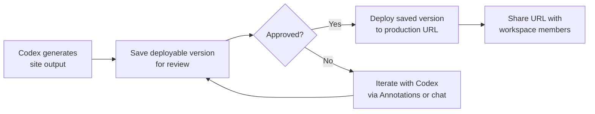
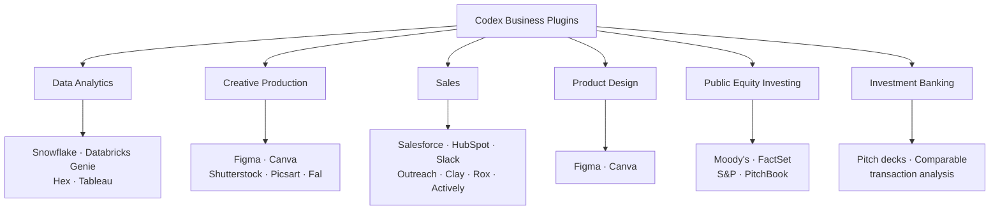

# Codex Sites, Annotations, and the June 2026 Business Expansion: Six Role-Specific Plugins and the Enterprise Hosting Layer


---

On 2 June 2026, OpenAI shipped the most significant Codex feature announcement since Goal Mode reached GA: a hosted interactive web app layer called **Sites**, an in-place document editing primitive called **Annotations**, and six domain-specific business plugins covering data analytics, creative production, sales, product design, equity investing, and investment banking.[^1] Together they represent a deliberate pivot — Codex is no longer positioned solely as a coding agent but as an enterprise work orchestration layer that non-developers can operate directly.

This article unpacks the technical architecture of each capability, examines what the changes mean for teams already running Codex in production, and gives you the configuration recipes to use Sites and Annotations from day one.

---

## The Context: Non-Developers Now Drive Adoption

The trigger for this feature wave is demographic. As of early June 2026, non-developers — financial analysts, marketers, operations staff, researchers — account for roughly 20% of Codex's five million weekly active users and are adopting the platform at three times the rate of traditional engineers.[^2] OpenAI's response is to reshape the product surface around that audience while keeping the CLI and app-server layers intact for the engineering workflows that underpin it.

The June 2 announcement simultaneously disclosed that Codex would be integrated into the ChatGPT mobile and web app "in the next few weeks" — collapsing the distinction between ChatGPT and Codex into a single product surface accessible from any device.[^3]

---

## Sites: Cloudflare-Backed Hosted Applications

### What Sites Actually Is

Sites is a Codex plugin that replaces the previous workflow of "generate a file, download it, deploy somewhere else" with a first-class deployment pipeline inside the Codex app. The output of a Sites task is a production URL, not a local artefact. Every Sites deployment is treated as a production deployment from the moment it is created.[^4]

Crucially, the infrastructure runs on Cloudflare's edge: Sites hosts projects that produce Cloudflare Worker-compatible ES module output.[^4] This gives you the full Cloudflare primitives:

| Use Case | Technology |
|---|---|
| Static content and landing pages | Cloudflare static hosting |
| Persistent application state | D1 (SQLite-compatible relational database) |
| File and asset storage | R2 (S3-compatible object storage) |
| Authenticated experiences | Workspace identity or external providers |

For context on what this covers: financial scenario planners, project request dashboards, internal marketing campaign boards, operations trackers, or any lightweight CRUD tool that would previously have required a front-end sprint to ship.

### Configuration

Project linkage is stored in `.openai/hosting.json` at the root of your workspace:

```json
{
  "project_id": "<auto-generated-id>",
  "d1": "DB",
  "r2": null
}
```

The `project_id` is provisioned automatically on first hosting activation. The `d1` binding name maps to the D1 database instance. Set `r2` to a binding name string if your site requires file storage.[^4]

Local development uses a separate `.env` file for secrets; runtime secrets are configured exclusively through the Sites panel in the app sidebar and are never committed to source code.[^4]

### Deployment Lifecycle

The Sites deployment model has two discrete stages — intentionally requiring an explicit approval gate before going live:



Before sharing a deployed URL, the documentation recommends verifying: source changes in the review pane, successful build completion, the correct saved version is selected, audience access permissions are set, and runtime secrets are configured.[^4]

### Access Control

Sites exposes three access modes for each deployed application:

```toml
# Example pattern — configured via the Sites panel, not TOML directly
access = "workspace_all"   # All active workspace members
# access = "admins_only"   # Owner and workspace admins only
# access = "custom"        # Named users/groups plus the owner
```

Enterprise admins must activate Sites in ChatGPT admin settings before workspace members can see the plugin. Business tier workspaces have it enabled by default.[^4]

### Invoking Sites

Install the Sites plugin from `/plugins`, then reference it explicitly:

```text
@Sites Build a project request dashboard for the operations team.
       Require sign-in with workspace account.
       Show open requests, owner, and due date in a filterable table.
```

OpenAI has also announced partnerships with Wix, Base44, Replit, Lovable, Figma, and Emergent for deeper export and handoff workflows — for cases where the generated site needs to graduate from internal tooling to a public-facing product.[^5]

---

## Annotations: Surgical In-Place Editing

### The Problem Being Solved

Before Annotations, targeting a specific region of an AI-generated document for refinement was fragile. Instructing the model to "update the chart in section 3" frequently caused full-document regeneration, which broke custom formatting, disrupted cell references in spreadsheets, and introduced hallucinations in adjacent sections.

Annotations solves this by exposing the same selection-scoped editing primitive that developers have used for code and Markdown files since early 2025, extended to business document types: documents, spreadsheets, and slides.[^6]

### How the Scoping Works

When a user highlights a segment — a block of spreadsheet cells, a paragraph, a slide component — Codex maps the document's underlying data schema and isolates the exact data arrays for that selection. Subsequent model execution is bounded strictly within that region: surrounding cell dependencies, styles, and unselected formulas are untouched.[^6]

The practical effect: an analyst can highlight a date range in a financial model and prompt:

```text
Add a line chart of revenue, EBITDA, and net income over the selected years.
```

The chart is generated; the surrounding model assumptions remain unmodified.

### Developer Relevance

For developers building Codex-assisted document tooling or using the app-server API to drive document workflows, Annotations changes what a turn looks like. A turn can now carry a selection anchor alongside its prompt, allowing integrations to target model output at document sub-regions without full regeneration round-trips. This directly reduces token usage and context-window pressure for iterative document editing pipelines.

---

## Six Business Plugins: Architecture and Integrations

Each plugin bundles three components — integrations (API connections), instructions (domain-specific system prompts), and context (background knowledge for the role).[^7] OpenAI has embedded 110 automated skills across the six plugins and connected 62 business applications in aggregate.[^2]

### Plugin Catalogue



**Data Analytics** — connects to data warehouses and BI tools. Intended workflow: explain why key metrics changed, generate dashboards, export reports.

**Creative Production** — converts marketing briefs into campaign assets: ad variations, lifestyle imagery, campaign boards. Integrates with Figma's MCP server for design handoffs.[^8]

**Sales** — account research, meeting preparation, CRM updates. The Clay and Rox integrations are particularly useful for enrichment workflows that would previously have required custom n8n or Zapier pipelines.

**Product Design** — converts early concepts into reviewable Figma prototypes. The Figma MCP integration is the same server used by the existing developer workflows, which means design and engineering share a single Codex session context.

**Public Equity Investing** — earnings review, company comparison, investment thesis generation from FactSet, PitchBook, and Moody's data feeds.[^7]

**Investment Banking** — pitch materials, comparable transaction analysis, research-to-recommendation conversion. ⚠️ Specific model integrations for this plugin were not detailed in the public announcement; assume standard Codex data handling policies apply.

### Installing a Business Plugin

```bash
# From within the Codex TUI
/plugins
# Search for the plugin name, e.g. "Sales"
# Click Install
```

Or from the CLI:

```bash
codex plugins install sales
```

Plugin state is stored per-workspace profile. If you use separate profiles for different clients or projects (the recommended pattern since v0.133), install plugins per-profile to avoid credential cross-contamination between workspaces.

---

## What This Means for Engineering Teams

### Sites vs. Your Existing Internal Tooling Pipeline

If your team currently builds internal dashboards on Retool, Streamlit, or a homegrown Next.js admin, Sites represents a meaningful short-circuit for the long tail of one-off tools: scenario planners, project trackers, lightweight approval workflows. The Cloudflare D1/R2 backend means the data layer is not ephemeral; it persists across sessions. The workspace identity auth layer handles SSO without additional configuration.

For heavier tools requiring custom business logic, scheduled jobs, or complex data models, Sites is not a replacement. The Cloudflare Worker constraint (ES module output, edge execution model) is intentional: it keeps the deployment surface bounded and auditable, which matters for Enterprise RBAC.

### Codex Now Competes in BI

The Data Analytics plugin, combined with Sites, creates an end-to-end pipeline: query Snowflake → generate interactive dashboard → deploy as a workspace-scoped URL. This directly overlaps with Tableau, Power BI, and internal BI teams for the specific use case of ad-hoc analysis delivery. Engineering teams maintaining internal BI infrastructure should expect increasing pressure to route simpler analytical requests through Codex rather than the BI platform.[^2]

### Annotation-Driven Document Workflows

For teams using Codex to generate technical documentation, ADRs, or specification documents, Annotations makes the review-and-refine loop substantially tighter. Instead of regenerating a 2,000-word spec to fix one section, you select the section and issue a targeted prompt. This reduces token spend and keeps formatting stable — both significant for teams with document generation hooks in their CI pipelines.

---

## Enterprise Configuration Notes

For Enterprise admins: the Sites plugin must be explicitly enabled in the ChatGPT admin console before it appears for workspace members. The same RBAC model that governs plugin access (introduced in v0.133) applies here — you can restrict Sites to specific user groups, which is the recommended posture for organisations with data residency requirements until Cloudflare D1 regional placement options are confirmed.[^4]

For CLI-first teams: Sites is currently an app-only feature; there is no `codex sites` subcommand in the CLI as of v0.136. App-server API endpoints for Sites deployment are ⚠️ not confirmed in public documentation at the time of writing — check the app-server changelog if you need programmatic deployment from CI pipelines.

---

## Citations

[^1]: OpenAI. "Codex for every role, tool, and workflow." openai.com/index/codex-for-every-role-tool-workflow/ (2 June 2026).
[^2]: Russell Brandom, TechCrunch. "OpenAI launches new Codex tools for white-collar work." techcrunch.com/2026/06/02/openai-launches-new-codex-tools-for-white-collar-work/ (2 June 2026).
[^3]: 9to5Mac. "OpenAI putting Codex inside ChatGPT app everywhere, releasing 6 business plugins." 9to5mac.com/2026/06/02/openai-putting-codex-inside-chatgpt-app-everywhere-releasing-6-business-plugins/ (2 June 2026).
[^4]: OpenAI Developer Documentation. "Sites – Codex." developers.openai.com/codex/sites (accessed 3 June 2026).
[^5]: The Next Web. "OpenAI Codex expands to enterprise with Sites, plugins, non-dev users." thenextweb.com/news/openai-codex-enterprise-plugins-sites-non-developers (2 June 2026).
[^6]: MindStudio. "How to Use OpenAI Codex for Everyday Work: 10 Use Cases Beyond Coding." mindstudio.ai/blog/openai-codex-everyday-work-use-cases (accessed 3 June 2026).
[^7]: 9to5Mac. "OpenAI putting Codex inside ChatGPT app everywhere, releasing 6 business plugins." (see [^3]).
[^8]: Cloudflare Developer Documentation. "Codex + Cloudflare · Agent setup docs." developers.cloudflare.com/agent-setup/codex/ (accessed 3 June 2026).
