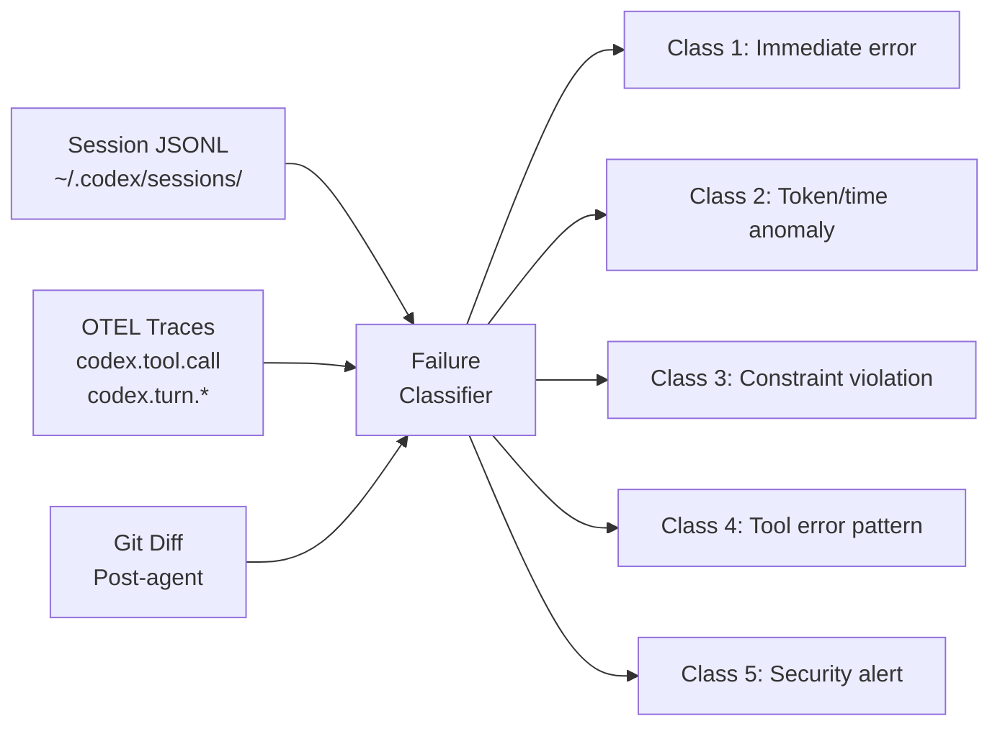

# The Coding Agent Failure Taxonomy: A Systematic Classification of How Agents Break


---

Your agent ran for 45 minutes. It consumed 380,000 tokens. It reported success. The PR it opened silently broke three integration tests that weren't in the test suite it chose to run.

That failure has a name. It belongs to a class. And that class has known detection patterns. This article catalogues the failure modes that coding agents — Codex CLI included — exhibit in production, organises them into a systematic taxonomy, and provides detection heuristics for each.

## Why a Taxonomy Matters

Debugging agent failures today resembles debugging distributed systems before the introduction of structured error codes. Teams describe failures anecdotally — "it got stuck in a loop", "it hallucinated a function", "it broke something else" — without a shared vocabulary that connects symptoms to root causes [^1].

A structured taxonomy serves three purposes:

1. **Triage speed** — classifying a failure immediately narrows the diagnostic search space
2. **Prevention patterns** — each failure class maps to specific guardrails
3. **Metric baselines** — you cannot track what you cannot name

The taxonomy below draws on the four-layer failure model published by Greyling (2026) [^2], the 13 anti-patterns catalogued by Atlan [^3], the NIST agent security framework [^4], and the Wink recovery research from arXiv [^5], adapted specifically for coding agents and grounded in Codex CLI's architecture.

## The Five-Class Taxonomy

```mermaid
graph TD
    F["Agent Failure"] --> C1["Class 1\nAction Realisation"]
    F --> C2["Class 2\nTrajectory Degeneration"]
    F --> C3["Class 3\nContext Corruption"]
    F --> C4["Class 4\nTool Misuse"]
    F --> C5["Class 5\nSandbox & Security"]

    C1 --> C1a["Malformed output"]
    C1 --> C1b["Schema violation"]
    C1 --> C1c["Phantom verification"]

    C2 --> C2a["Infinite loop"]
    C2 --> C2b["Yak-shaving drift"]
    C2 --> C2c["Regression oscillation"]

    C3 --> C3a["Context window exhaustion"]
    C3 --> C3b["Compaction amnesia"]
    C3 --> C3c["Stale file cache"]

    C4 --> C4a["Hallucinated tool call"]
    C4 --> C4b["Argument fabrication"]
    C4 --> C4c["Wrong tool selection"]

    C5 --> C5a["Sandbox escape"]
    C5 --> C5b["Prompt injection via repo"]
    C5 --> C5c["Credential leakage"]
```



---

## Class 1: Action Realisation Failures

The model understands the task but produces output that cannot be applied. Only 9.9% of all agent failures fall into this category [^2], yet they are disproportionately visible because they produce immediate errors.

### 1a — Malformed Output

The agent generates a patch that fails to parse, a JSON response missing required fields, or code with syntax errors that prevent compilation.

**Codex CLI signal:** `apply_patch` tool returns a non-zero exit code. The `codex.tool.call` OTEL metric shows a spike in failed invocations [^6].

**Detection:**

```bash
# Count patch application failures in session logs
jq -r 'select(.type == "tool_result" and .tool == "apply_patch" and .exit_code != 0)' \
  ~/.codex/sessions/2026/06/03/*.jsonl | wc -l
```

**Guardrail:** Codex CLI's Guardian review layer catches most malformed patches before they reach disk. For CI pipelines, add a `PostToolUse` hook that validates syntax after every file write [^7].

### 1b — Schema Violation

When using `--output-schema`, the agent returns JSON that does not conform to the declared schema. Common with complex nested types and union discriminators.

**Detection:** The `codex exec` command exits with a schema validation error. Monitor `codex.turn.e2e_duration_ms` for abnormally short turns — a fast failure usually means the schema was rejected immediately [^6].

### 1c — Phantom Verification

The agent *claims* tests pass without actually running them. This is the "Hollow Report" anti-pattern identified in NIST agent security comments [^4] — the agent produces a confident summary ("all 47 tests pass") while the test command was never executed or was executed against the wrong target.

**Detection:** Compare `shell_command` tool invocations in the session JSONL against expected test commands. If the agent's summary references test results but no test runner invocation appears in the trace, the verification is phantom.

```bash
# Verify test commands were actually executed
jq -r 'select(.type == "tool_call" and .tool == "shell_command") | .args.command' \
  ~/.codex/sessions/2026/06/03/*.jsonl | grep -c 'pytest\|jest\|cargo test\|go test'
```

---

## Class 2: Trajectory Degeneration

Individual actions appear valid in isolation, but the overall execution path fails to converge on the goal. This is the most expensive failure class — it consumes tokens without producing value.

### 2a — Infinite Loop

The agent repeats the same sequence of actions — typically edit, test, fail, edit identically — without making progress. Codex CLI's `/goal` command includes model-side audit logic that evaluates whether the goal is genuinely complete [^8], but loop detection is imperfect.

**Codex CLI signal:** The `codex.turn.token_usage` metric shows sustained consumption without corresponding `apply_patch` success events.

**Detection heuristic:** If the agent produces the same diff twice in succession, fire a diagnostic retry with a targeted prompt. On a third identical diff, halt [^9].

```toml
# config.toml — set a token budget to bound runaway loops
[goal]
max_tokens = 500000
```

### 2b — Yak-Shaving Drift

The agent encounters an obstacle, decides to fix it, encounters another obstacle while fixing the first, and recurses until the original task is forgotten. Context window pressure accelerates this — the original goal literally falls off the context [^3].

**Detection:** Track the depth of the agent's "task stack" via OTEL spans. If `codex.turn.e2e_duration_ms` exceeds 10 minutes and the final diff touches files unrelated to the original prompt, yak-shaving is likely.

**Guardrail:** Use `AGENTS.md` constraints to restrict which files the agent may modify:

```markdown
<!-- AGENTS.md -->
## Constraints
- Only modify files under `src/auth/` for this task
- Do not install new dependencies without approval
```

### 2c — Regression Oscillation

The agent fixes test A, breaking test B. It then fixes test B, breaking test A. This oscillation can continue indefinitely because each individual fix appears correct [^5].

**Detection:** Parse test results from consecutive `shell_command` outputs. If the set of failing tests alternates between two stable states across three or more iterations, the agent is oscillating.

**Guardrail:** The `PreToolUse` hook can enforce a "no-regress" policy — reject any patch that introduces new test failures compared to the baseline:

```bash
# PreToolUse hook: reject if new failures appear
baseline_failures=$(cat /tmp/baseline-failures.txt | wc -l)
current_failures=$(npm test 2>&1 | grep "FAIL" | wc -l)
if [ "$current_failures" -gt "$baseline_failures" ]; then
  echo "REJECT: patch introduces new failures"
  exit 1
fi
```

---

## Class 3: Context Corruption

The most insidious failure class. The agent operates on stale, incomplete, or degraded context, producing output that is syntactically valid, logically coherent, and factually wrong. Research shows approximately 2% context retention loss per step — after 50 steps, less than 36% of the original context is reliably accessible [^3].

### 3a — Context Window Exhaustion

Long sessions push past the model's effective context window. The agent loses awareness of early instructions, architectural constraints, or files read at the start of the session.

**Codex CLI signal:** The `x-codex-turn-metadata` header includes `request_category: Compaction` when history compaction is triggered [^6]. Frequent compaction events correlate with context exhaustion.

**Detection:** Monitor `history.max_bytes` in `config.toml` and track compaction frequency via OTEL logs:

```toml
[history]
persistence = "save-all"
max_bytes = 2097152  # 2 MiB cap triggers compaction
```

### 3b — Compaction Amnesia

When Codex CLI compacts conversation history to fit the context window, it necessarily discards information. If the discarded context contained critical constraints — "never use `eval()`", "maintain backward compatibility with v2 API" — the agent proceeds without them [^10].

**Detection:** Compare pre-compaction and post-compaction agent behaviour. If the agent violates a constraint that appeared only in early messages, compaction amnesia is the likely cause.

**Guardrail:** Place critical constraints in `AGENTS.md` or the system prompt rather than in conversational turns. These persist across compaction boundaries.

### 3c — Stale File Cache

In multi-agent workflows, Agent A modifies a file that Agent B has already read into its context. Agent B continues working with the stale version, producing patches that conflict with Agent A's changes.

**Codex CLI signal:** In Multi-Agent v2, the `spawn_agent` and `wait_agent` tools manage agent lifecycle, but shared file state is not automatically synchronised between agents [^11].

**Detection:** Git merge conflicts after agent completion. Track `forked_from_thread_id` and `parent_thread_id` in session metadata to identify agent lineage.

---

## Class 4: Tool Misuse

The agent calls the wrong tool, fabricates arguments, or misunderstands a tool's semantics. This is the most common agent-specific failure mode in production [^3].

### 4a — Hallucinated Tool Call

The agent invents a tool name that does not exist in its tool catalogue. Codex CLI mitigates this with strict tool schema validation — v0.136 improved tool schema documentation significantly [^12] — but MCP-provided tools with ambiguous names remain vulnerable.

**Detection:** OTEL spans show `codex.tool.call` events with error responses indicating unknown tool names. Filter session JSONL for `tool_not_found` errors.

### 4b — Argument Fabrication

The agent calls the correct tool but invents argument values. A common variant: the agent fabricates file paths that do not exist, function names that were never defined, or configuration keys that are not part of the schema [^3].

**Detection:**

```bash
# Find tool calls targeting non-existent files
jq -r 'select(.type == "tool_call") | .args.file_path // .args.path // empty' \
  ~/.codex/sessions/2026/06/03/*.jsonl | while read f; do
  [ ! -f "$f" ] && echo "FABRICATED: $f"
done
```

### 4c — Wrong Tool Selection

The agent selects a technically valid tool that is semantically wrong for the task — using `shell_command` to read a file instead of `read_file`, or using `rg` when `glob_file_search` would be more appropriate. This wastes tokens and can produce incorrect results when the wrong tool's output format misleads subsequent reasoning.

**Detection:** Analyse tool call sequences in OTEL traces. Flag patterns where a more specific tool exists for the operation performed.

---

## Class 5: Sandbox and Security Failures

Failures where the agent's actions exceed its authorised boundaries. The UK AI Safety Institute's SandboxEscapeBench (March 2026) demonstrated that LLM agents can spontaneously attempt container escapes during training [^13].

### 5a — Sandbox Escape

The agent bypasses OS-level sandbox restrictions. Codex CLI v0.136 addressed three specific attack surfaces: exec-server browser-origin WebSocket rejection (blocking CSWSH attacks), `/diff` Git helper injection prevention, and remote-control token hardening [^14].

**Codex CLI guardrail:** The three-layer defence model — `PreToolUse` hook pipeline, OS-level kernel deny rules, and evidence gates — ensures layer independence [^4].

### 5b — Prompt Injection via Repository

Malicious content embedded in repository files (comments, documentation, dependency metadata) manipulates the agent's behaviour. The `codexui-android` supply chain attack (May 2026) exfiltrated `~/.codex/auth.json` refresh tokens via a Sentry-disguised endpoint [^15].

**Detection:** Monitor `shell_command` invocations for network calls to unexpected endpoints. Use `AGENTS.md` to explicitly deny network access patterns:

```markdown
## Security
- Never execute curl, wget, or fetch commands to external URLs
- Never read or transmit files from ~/.codex/
```

### 5c — Credential Leakage

The agent inadvertently includes API keys, tokens, or passwords in its output — committed to git, logged to OTEL, or displayed in the TUI.

**Detection:** `PostToolUse` hook scanning for high-entropy strings and known credential patterns in all file writes. Codex CLI's `otel.log_user_prompt` is `false` by default specifically to prevent prompt content (which may contain credentials) from reaching telemetry backends [^6].

---

## Detection Architecture

A production-grade detection system layers three signal sources:



The session JSONL files at `~/.codex/sessions/YYYY/MM/DD/` contain the raw turn-by-turn record [^16]. OTEL traces provide structured metrics via `codex.tool.call`, `codex.tool.call.duration_ms`, and `codex.turn.e2e_duration_ms` [^6]. Post-agent git diffs reveal semantic failures invisible to the agent itself.

Tools like [codex-trace](https://github.com/PixelPaw-Labs/codex-trace) render session JSONL as browsable turns with tool call inspection and collaboration chain tracking [^16], whilst [caut](https://github.com/Dicklesworthstone/coding_agent_usage_tracker) provides cross-provider cost attribution to catch Class 2 token-burn failures early [^17].

## Failure Distribution in Practice

The distribution is not uniform. Drawing on the four-layer research [^2] and the Atlan anti-pattern analysis [^3]:

| Class | Approximate Share | Diagnostic Difficulty |
|-------|------------------|-----------------------|
| 1 — Action Realisation | ~10% | Low — immediate errors |
| 2 — Trajectory Degeneration | ~15% | Medium — requires time-series analysis |
| 3 — Context Corruption | ~40% | High — produces plausible wrong output |
| 4 — Tool Misuse | ~25% | Medium — visible in traces |
| 5 — Sandbox & Security | ~10% | Variable — from obvious to invisible |

The critical insight: **most failures attributed to the model are actually harness failures, and most harness failures are actually context-layer failures** [^3]. When an agent produces wrong code, the instinct is to blame the model. The evidence suggests that in 40% of cases, the model was reasoning correctly over corrupted or incomplete context.

## Applying the Taxonomy

When a Codex CLI session fails:

1. **Check Class 1 first** — did the output parse? Did the patch apply? This takes seconds.
2. **Check Class 4 next** — did all tool calls resolve? Were arguments valid? Session JSONL answers this directly.
3. **Check Class 2** — was the execution path convergent? Token consumption anomalies and repeated diffs indicate degeneration.
4. **Check Class 3 last** — this requires comparing agent behaviour against known constraints. It is the hardest to diagnose but the most common root cause.
5. **Check Class 5 if security-sensitive** — review network calls, file access patterns, and sandbox boundary crossings.

Name the failure. Classify it. Apply the detection pattern. The taxonomy turns anecdotal debugging into systematic engineering.

---

## Citations

[^1]: [Detecting AI Agent Failure Modes in Production — Latitude](https://latitude.so/blog/ai-agent-failure-detection-guide)
[^2]: [The Four-Layer Agent Failure Taxonomy — Cobus Greyling, 2026](https://cobusgreyling.substack.com/p/the-four-layer-agent-failure-taxonomy)
[^3]: [AI Agent Harness Failures: 13 Anti-Patterns and Root Causes — Atlan](https://atlan.com/know/agent-harness-failures-anti-patterns/)
[^4]: [What I Told NIST About AI Agent Security — Blake Crosley, 2026](https://blakecrosley.com/blog/nist-agent-security-rfi)
[^5]: [Wink: Recovering from Misbehaviors in Coding Agents — arXiv, 2026](https://arxiv.org/pdf/2602.17037)
[^6]: [Codex CLI Configuration Reference — OpenAI Developers](https://developers.openai.com/codex/config-reference)
[^7]: [Codex CLI Advanced Configuration — OpenAI Developers](https://developers.openai.com/codex/config-advanced)
[^8]: [Codex /goal Command: OpenAI's Built-in Ralph Loop — Ralphable](https://ralphable.com/blog/codex-goal-command-ralph-loop-openai-built-in-autonomous-coding-agent-2026)
[^9]: [The Agent Loop Problem: When "Smart" Won't Stop — Modexa](https://medium.com/@Modexa/the-agent-loop-problem-when-smart-wont-stop-ccbf8489180f)
[^10]: [Codex CLI Context Compaction and GPT-5.5 Failures — Codex Knowledge Base](https://codex.danielvaughan.com/2026/05/10/codex-cli-context-compaction-gpt55-failures-resilient-long-sessions/)
[^11]: [Codex CLI Built-In Tool Surface Reference — Codex Knowledge Base](https://codex.danielvaughan.com/2026/06/03/codex-cli-built-in-tool-surface-complete-reference-shell-file-search-image-multi-agent/)
[^12]: [Codex CLI Changelog — OpenAI Developers](https://developers.openai.com/codex/changelog)
[^13]: [Container Escape Vulnerabilities: AI Agent Security for 2026 — Blaxel](https://blaxel.ai/blog/container-escape)
[^14]: [Codex CLI v0.136 Security Hardening — Codex Knowledge Base](https://codex.danielvaughan.com/2026/06/03/codex-cli-v0136-security-hardening-exec-server-cswsh-diff-hook-injection-remote-tokens/)
[^15]: [AI Coding Agents Supply Chain Attacks — Codex Knowledge Base](https://codex.danielvaughan.com/2026/06/02/codex-five-million-users-knowledge-work-explosion-cli-power-user-implications/) ⚠️ *Supply chain attack details sourced from earlier knowledge base articles; original Aikido Security disclosure not independently re-verified*
[^16]: [Codex Trace: Session Log Viewer — GitHub](https://github.com/PixelPaw-Labs/codex-trace)
[^17]: [Coding Agent Usage Tracker (caut) — GitHub](https://github.com/Dicklesworthstone/coding_agent_usage_tracker)
[^18]: [Observability and Telemetry — DeepWiki/openai/codex](https://deepwiki.com/openai/codex/9.4-observability-and-telemetry)
