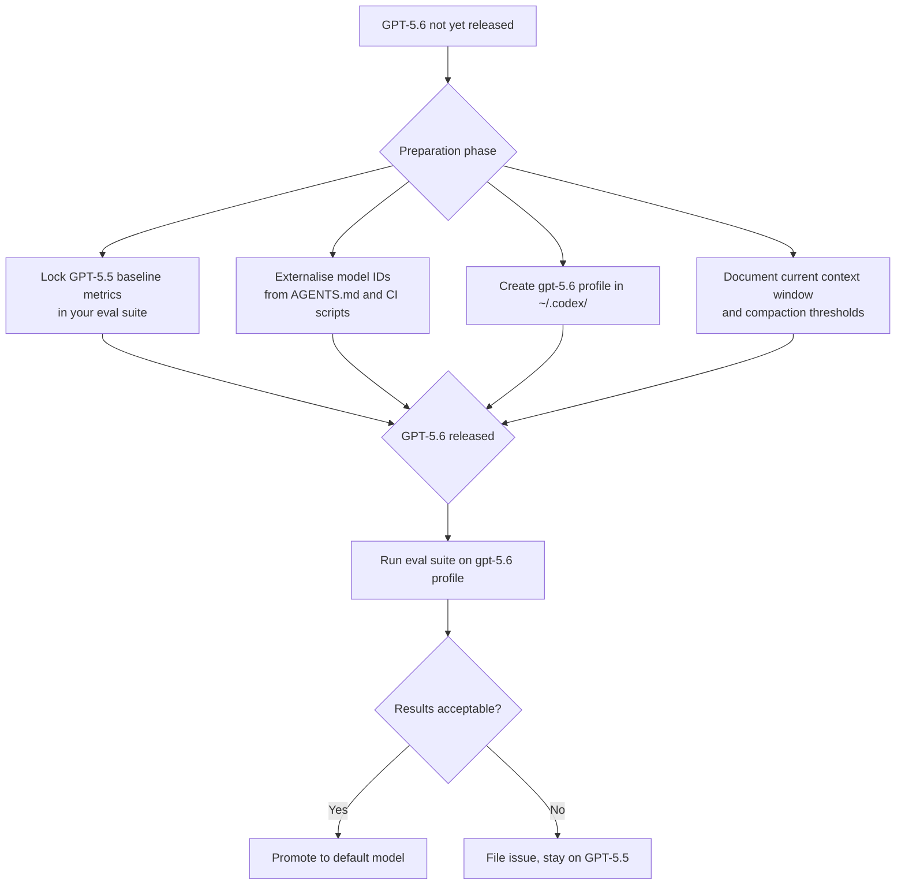

# GPT-5.6 Canary Signals and Codex CLI Readiness: A Developer Preparation Guide


---

OpenAI has made no public announcement of GPT-5.6. There is no model card, no API surface entry, no published benchmarks.[^1] What exists is a single, brief rollout-mapping entry in OpenAI's Codex backend logs briefly referencing `gpt-5.6` before disappearing, alongside Polymarket prediction markets pricing an 80–89% probability of a public release by 30 June 2026.[^2] That slim evidence is enough to prompt a practical question for every Codex CLI team: *when it ships, are you ready to move?*

This article strips out the speculation, examines what the canary evidence actually proves, and gives concrete Codex CLI configuration patterns that make any future model migration a one-line change.

---

## The Evidence: What the Canary Log Actually Shows

In mid-May 2026, a researcher named Haider observed a single routing entry in OpenAI's Codex backend infrastructure that mapped requests to `gpt-5.6` rather than the standard `gpt-5.5`. The entry was briefly reproducible, then vanished from later session files.[^3]

Two things can be stated with reasonable confidence from this:

1. **GPT-5.6 exists as a runnable artefact** capable of accepting Codex-shaped prompts — it is not merely a model name in a roadmap document.
2. **It is integrated into Codex's rollout infrastructure**, meaning agentic coding is the primary evaluation target, not general chat.

Everything else — context window size, parameter count, architecture changes, pricing — is unverifiable inference from third-party behavioural testing or prediction market sentiment. The log entry was a name, not a configuration spec.[^3]

---

## What's Rumoured (and the Confidence Level of Each Claim)

Before acting on any of the following, treat them as planning hypotheses, not deployment facts.

| Claim | Basis | Confidence |
|---|---|---|
| 1.5M token context window | ChatGPT Pro behavioural observation [^4] | ⚠️ Low |
| "ember-alpha" / "beacon-alpha" internal codenames | Developer log traces [^5] | ⚠️ Low |
| UltraFast Codex mode (2–5× latency improvement) | Third-party previews [^6] | ⚠️ Very Low |
| GPT-5.6 Pro / Lite tier split (mirroring 5.5/5.5 Pro) | Inference from past pattern [^5] | ⚠️ Low |
| June 15–July 5, 2026 release window | Polymarket 80–89% odds [^2] | Medium |

The 1.5M token context claim deserves particular scrutiny. If accurate, it would represent a 43% increase over GPT-5.5 — significant for Codex use cases involving large monorepos or multi-day agentic sessions. But the claim rests on behavioural observation of what may have been a canary-routed session, not a documented specification.[^4]

---

## The Competitive Pressure That Makes June Critical

The GPT-5.6 canary sits in a compressed release cycle. GPT-5.4 shipped on 5 March 2026, GPT-5.5 on 23 April — an interval of just 49 days.[^7] A similar cadence would place GPT-5.6 in mid-June. Compressing the timeline further, Anthropic's Claude Mythos and a Gemini 3.5 Pro update are both expected before the end of June, creating a three-way frontier convergence.[^2]

For Codex CLI teams, this convergence has a practical implication: model selection decisions made today may need to be revisited within 30–45 days. Any team that has hard-coded model identifiers into their agent workflows, CI pipelines, or `AGENTS.md` files is accumulating technical debt that will come due at the worst possible time.

OpenAI's filing of confidential SEC documents on 22 May 2026 targeting a September IPO further intensifies the incentive to ship a visible capability step before the public listing window.[^8]

---

## Building a Future-Proof Codex CLI Configuration

The practical takeaway is straightforward: **make model identity configurable**, not hard-coded. Codex CLI's layered configuration system makes this easy.

### Profile-Based Model Routing

The `--profile` flag introduced in v0.134.0 as the primary selector across CLI, TUI, and sandbox flows is your primary lever.[^9] Create a dedicated profile for each model tier:

```bash
# ~/.codex/frontier.config.toml
model = "gpt-5.5"
model_reasoning_effort = "high"

# ~/.codex/fast.config.toml
model = "gpt-5.5-instant"
model_reasoning_effort = "medium"
model_verbosity = "low"

# ~/.codex/subagent.config.toml
model = "gpt-5.4-mini"
model_reasoning_effort = "medium"
```

Switch at invocation without touching your base config:

```bash
codex --profile frontier "Refactor the auth module to use the new token store"
codex --profile subagent "Run the test suite and summarise failures"
```

When GPT-5.6 drops, add a new profile and test against it before promoting it to your default. The base config remains unchanged; your existing sessions are unaffected.

### The Base Config Model Abstraction

In `~/.codex/config.toml`, keep the `model` key explicitly set rather than relying on implicit defaults:

```toml
# config.toml
model = "gpt-5.5"
model_reasoning_effort = "high"
model_context_window = 1048576   # current gpt-5.5 context; update when 5.6 ships
model_auto_compact_token_limit = 900000  # ≤ 90% of context window
```

Setting `model_context_window` explicitly prevents Codex from auto-detecting a larger window on GPT-5.6 before you have profiled whether compaction behaviour changes at 1.5M tokens. Opt in deliberately.

### CI Pipeline Model Pinning

For non-interactive pipelines, use `CODEX_NON_INTERACTIVE=1` (stable since v0.135.0)[^9] combined with explicit `--model` flags:

```bash
CODEX_NON_INTERACTIVE=1 codex exec \
  --model gpt-5.5 \
  --output-schema ./schemas/test-report.json \
  "Run the full test suite and emit structured results"
```

Hard-coding the model in CI is acceptable — the difference from application code is that you *want* your CI baseline pinned to a specific model for reproducibility. When you evaluate GPT-5.6, run it on a separate CI job and compare structured outputs before promoting.

---

## Evaluation Readiness Checklist

Before GPT-5.6 ships, lock in the following:



**Specific actions this week:**

1. **Baseline your eval suite** against GPT-5.5 using the `codex exec --output-schema` pattern for structured, comparable outputs. Without a frozen baseline, you cannot objectively compare GPT-5.6.

2. **Audit your `AGENTS.md` files** for hard-coded model references. Replace any `model: gpt-5.5` or `model: gpt-5.4` strings with environment-variable interpolation where your toolchain supports it, or comment them as "review on next model release."

3. **Review your compaction configuration**. If GPT-5.6 ships with a 1.5M token context, your current `model_auto_compact_token_limit` (set at ≤ 90% of the current 1M window) may trigger compaction too early. Plan to benchmark session length vs. compaction frequency on the new model before accepting the expanded window.

4. **Check your Bedrock configuration** if you route through Amazon Bedrock. The v0.136.0 Bedrock auth fallback support for AWS region variables means your region config is now more resilient, but new Codex models typically lag OpenAI direct by several weeks on Bedrock availability.[^10]

---

## What to Watch For

When OpenAI officially announces GPT-5.6, the changelog entry will be the authoritative source. Until then, three signals are worth monitoring:

- **`codex doctor` output** — the diagnostics report (v0.135.0+) includes the model resolved for the current session; a `gpt-5.6` entry appearing here would confirm canary routing to your account.
- **`/status` in the TUI** — shows remote connection details and server model version.
- **The model catalogue page** at `developers.openai.com/codex/models` — currently lists gpt-5.5 as the recommended frontier model; a `gpt-5.6` entry here is the official signal.

The canary evidence gives developers roughly two to four weeks of lead time to prepare. That is enough time to do the configuration work cleanly rather than in a scramble after the announcement lands.

---

## Citations

[^1]: OpenAI Developer Documentation, "Models – Codex", accessed June 2026. [https://developers.openai.com/codex/models](https://developers.openai.com/codex/models)
[^2]: TokenMix Blog, "GPT-5.6 Release Date: Codex Leaks, June Odds, What's Real (2026)", June 2026. [https://tokenmix.ai/blog/gpt-5-6-release-date-leaks-2026](https://tokenmix.ai/blog/gpt-5-6-release-date-leaks-2026)
[^3]: WaveSpeed Blog, "GPT-5.6 Just Showed Up in OpenAI's Codex Logs — Here's What That Actually Means", May 2026. [https://wavespeed.ai/blog/posts/gpt-5-6-canary-leak-what-we-know/](https://wavespeed.ai/blog/posts/gpt-5-6-canary-leak-what-we-know/)
[^4]: Perplexity AI Magazine, "GPT-5.6 Release Date, Features & Leaks, OpenAI 2026", June 2026. [https://perplexityaimagazine.com/ai-news/gpt-56-release-date-features-leaks-openai-2026/](https://perplexityaimagazine.com/ai-news/gpt-56-release-date-features-leaks-openai-2026/)
[^5]: CometAPI, "GPT-5.6 Release Date, Features & Development: What Developers Need to Know", June 2026. [https://www.cometapi.com/gpt-5-6-release-date-features-development/](https://www.cometapi.com/gpt-5-6-release-date-features-development/)
[^6]: DEV Community (TokenMixAI), "GPT-5.6 Is Real (a Codex Log Says So) — Everything Else Is Made Up", May 2026. [https://dev.to/tokenmixai/gpt-56-is-real-a-codex-log-says-so-everything-else-is-made-up-1ep1](https://dev.to/tokenmixai/gpt-56-is-real-a-codex-log-says-so-everything-else-is-made-up-1ep1)
[^7]: Codersera, "OpenAI May 2026 Updates: GPT-5.5 Instant, Codex, GPT-5.6", May 2026. [https://codersera.com/blog/openai-may-2026-updates-roundup/](https://codersera.com/blog/openai-may-2026-updates-roundup/)
[^8]: Perplexity AI Magazine, ibid — OpenAI IPO SEC filing context, May 22, 2026. [https://perplexityaimagazine.com/ai-news/gpt-56-release-date-features-leaks-openai-2026/](https://perplexityaimagazine.com/ai-news/gpt-56-release-date-features-leaks-openai-2026/)
[^9]: OpenAI Developer Documentation, "Changelog – Codex", v0.134.0 and v0.135.0 entries. [https://developers.openai.com/codex/changelog](https://developers.openai.com/codex/changelog)
[^10]: OpenAI Developer Documentation, "Changelog – Codex", v0.136.0 entry (Bedrock auth fallback). [https://developers.openai.com/codex/changelog](https://developers.openai.com/codex/changelog)
