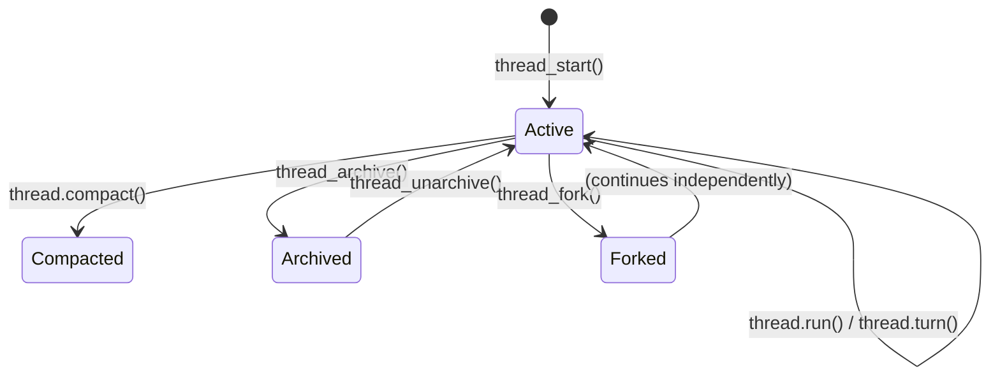

# openai-codex Python SDK v0.1.0b2: Complete API Reference and Practical Patterns


---

The Codex Python SDK has a new home. What shipped in early 2026 as an internal `codex_app_server` module is now an independently versioned PyPI package named `openai-codex`, with its first public beta (`0.1.0b1` and `0.1.0b2`) landing on 28 May 2026 alongside the v0.135.0 CLI release.[^1] The SDK installs a pinned CLI runtime automatically, decoupling its release cadence from the CLI itself.[^2] This article covers the full beta API surface — threads, turns, streaming, sandbox presets, input types, error handling — and the practical patterns that matter for production Python integration.

---

## What Changed from the Earlier SDK

The March 2026 `codex_app_server` module was a thin wrapper around the app-server JSON-RPC protocol. The new `openai-codex` package retains that architecture but substantially expands the API surface:

- **Package rename**: `pip install openai-codex` / `from openai_codex import Codex`[^1]
- **Independent versioning**: `0.1.0b2` does not track the CLI version; patch releases can ship without a CLI update[^2]
- **`openai-codex-cli-bin` pinning**: the installed package bundles the matching CLI binary, eliminating runtime version skew[^3]
- **Full type coverage**: all parameters and return types carry strict annotations; `mypy --strict` passes[^4]
- **`TurnHandle`**: mid-turn steering and interruption — absent from the earlier module
- **`thread_archive` / `thread_unarchive`**: SDK access to the session archiving introduced in v0.136.0[^5]
- **`retry_on_overload()`**: a built-in backoff utility for transient `ServerBusyError` responses[^4]

---

## Installation and Authentication

```bash
pip install openai-codex          # Python >=3.10
pip install "openai-codex[dev]"   # includes test dependencies
```

The package automatically pulls `openai-codex-cli-bin` for your platform.[^3] Four authentication flows are supported:

```python
from openai_codex import Codex

with Codex() as codex:
    # 1. Reuse existing credentials (default — works if `codex login` ran previously)
    pass

    # 2. ChatGPT browser login
    handle = codex.login_chatgpt()
    print(f"Open: {handle.auth_url}")
    result = handle.wait()          # blocks until auth completes

    # 3. Device-code flow (headless CI)
    dc = codex.login_chatgpt_device_code()
    print(f"{dc.verification_url}  code={dc.user_code}")
    dc.wait()

    # 4. API key (simplest for service accounts)
    codex.login_api_key("sk-...")
```

---

## Thread Lifecycle

The `Codex` client owns thread management. `thread_start()` creates a new conversation; `thread_resume()` reconnects to a saved one; `thread_fork()` branches from an existing turn.[^4]



Key `thread_start()` parameters worth knowing:

| Parameter | Type | Purpose |
|---|---|---|
| `model` | `str` | e.g. `"gpt-5.5"` — overrides config default |
| `sandbox` | `Sandbox` | Filesystem access preset (see below) |
| `config` | `dict` | e.g. `{"model_reasoning_effort": "high"}` for o3/o4-mini[^6] |
| `approval_mode` | `ApprovalMode` | `auto_review` (default), `on_failure`, `never` |
| `ephemeral` | `bool` | `True` suppresses local session persistence |
| `cwd` | `str` | Working directory for the agent |

`thread_resume("thr_abc123")` accepts the same overrides; the sandbox level set on resume applies to all subsequent turns unless overridden per-turn.[^4]

---

## Sandbox Presets

Three `Sandbox` enum values map to increasing trust levels:[^7]

```python
from openai_codex import Codex, Sandbox

with Codex() as codex:
    thread = codex.thread_start(sandbox=Sandbox.workspace_write)

    # Per-turn override: read-only for the review pass
    review = thread.run(
        "Review the diff. List any issues.",
        sandbox=Sandbox.read_only,
    )

    # Default resumes for mutation turns
    fix = thread.run("Apply the fix from your analysis.")
```

The sandbox set on `thread_start()` is the floor — a per-turn value cannot *relax* below that floor, only tighten further.[^7] `full_access` disables all filesystem restrictions and should be limited to trusted, isolated environments.

---

## `run()` vs `turn()`

`thread.run()` is the high-level blocking call. It starts a turn, waits for completion, and returns a `TurnResult`:[^4]

```python
result = thread.run("Generate a test plan for auth.py")

print(result.final_response)          # str | None
print(result.usage.input_tokens)      # ThreadTokenUsage
print(result.duration_ms)             # wall-clock time
for item in result.items:             # list[ThreadItem] — tool calls, messages, etc.
    print(item)
```

`thread.turn()` returns a `TurnHandle` before the turn finishes, enabling three capabilities unavailable through `run()`:[^4]

```python
handle = thread.turn("Refactor the parser module.")

# Stream intermediate notifications
for notification in handle.stream():
    print(notification)          # tool calls, file writes, agent messages

# Steer mid-execution
handle.steer("Focus only on the tokeniser; skip the AST walker.")

# Interrupt if it is taking too long
if elapsed > 60:
    handle.interrupt()

# Block for the final result
result = handle.run()
```

Concurrent streaming is supported: multiple `TurnHandle` instances on the same `Codex` client each filter to their own turn ID, so parallel thread fans can stream simultaneously.[^4]

---

## Input Types

Beyond plain strings, `thread.run()` accepts typed `Input` objects for richer context:[^4]

```python
from openai_codex.types import LocalImageInput, SkillInput, MentionInput, TextInput

result = thread.run([
    TextInput(text="Fix the layout bug shown in this screenshot:"),
    LocalImageInput(path="./screenshots/broken-layout.png"),
])

# Invoke a skill by name
result = thread.run(SkillInput(name="simplify", path="./src/utils.py"))

# Reference a file as an @ mention
result = thread.run([
    TextInput(text="Explain the following module:"),
    MentionInput(name="utils", path="./src/utils.py"),
])
```

---

## Async Patterns

`AsyncCodex` mirrors the synchronous API with `await` on every method.[^4] Use it whenever your application already runs an event loop:

```python
import asyncio
from openai_codex import AsyncCodex, Sandbox

async def run_parallel_analysis(files: list[str]) -> list[str]:
    async with AsyncCodex() as codex:
        async def analyse(path: str) -> str:
            thread = await codex.thread_start(
                model="gpt-5.4-mini",
                sandbox=Sandbox.read_only,
                ephemeral=True,
            )
            result = await thread.run(f"Summarise {path} in two sentences.")
            return result.final_response or ""

        return await asyncio.gather(*[analyse(f) for f in files])
```

`AsyncCodex` uses lazy initialisation: the app-server subprocess only starts on the first awaited call, avoiding blocking the event loop at construction time.[^4]

---

## Error Handling and Retry

```mermaid
flowchart TD
    A[thread.run()] --> B{Raises?}
    B -- No --> C[TurnResult]
    B -- JsonRpcError --> D{is_retryable_error?}
    D -- Yes: ServerBusyError --> E[retry_on_overload()]
    D -- No: MethodNotFoundError\nInvalidParamsError --> F[Propagate to caller]
    E --> A
```

```python
from openai_codex import Codex
from openai_codex.errors import ServerBusyError, JsonRpcError
from openai_codex.retry import retry_on_overload

with Codex() as codex:
    thread = codex.thread_start(model="gpt-5.5")

    # Automatic backoff on overload
    result = retry_on_overload(lambda: thread.run("Generate migration SQL"))

    # Manual handling for other errors
    try:
        result = thread.run("Unusual request")
    except JsonRpcError as exc:
        print(f"RPC error {exc.code}: {exc.message}")
```

`retry_on_overload()` uses exponential back-off with jitter; it wraps any callable, not just `run()`, so it also works around `turn()`, `thread_start()`, or custom orchestration functions.[^4]

---

## Practical Recipes

### Reasoning-intensive analysis with o3

```python
thread = codex.thread_start(
    model="o3",
    config={"model_reasoning_effort": "high"},
    sandbox=Sandbox.read_only,
)
result = thread.run("Audit ./src for race conditions. Return a JSON list of findings.")
```

`model_reasoning_effort` is passed through to the underlying API `reasoning.effort` parameter.[^6]

### Structured output from `exec`-style workflows

```python
import json, pathlib

schema = json.loads(pathlib.Path("schemas/findings.json").read_text())
result = thread.run("Run the audit.", output_schema=schema)
findings = json.loads(result.final_response)
```

`output_schema` on `thread.run()` corresponds to the `--output-schema` flag on `codex exec`; note that as of v0.135 only `gpt-5`-family models enforce the schema at the API layer.[^8]

### Thread listing and housekeeping

```python
page = codex.thread_list(limit=20, sort_key="updated_at")
for thread_meta in page.threads:
    if thread_meta.updated_at < cutoff:
        codex.thread_archive(thread_meta.id)
```

`thread_list()` supports cursor-based pagination via the `cursor` parameter in `ThreadListResponse`.[^4]

---

## Ecosystem Context

The `acodex` community package (`uv add acodex`) offers an alternative surface with explicit `output_type=SomePydanticModel` structured-output support and a richer `ThreadOptions` abstraction.[^9] For teams already on Pydantic v2, it is worth evaluating alongside the official beta. The `codex-sdk-python` PyPI package (v0.117.0+) is a separate third-party project unrelated to the official SDK.[^10]

---

## Citations

[^1]: openai-codex PyPI release history — v0.1.0b1 and v0.1.0b2 both published 2026-05-28. https://pypi.org/project/openai-codex/

[^2]: Codex CLI v0.135.0 release notes, 2026-05-28 — "Python SDK publishes independently of CLI releases." https://github.com/openai/codex/releases/tag/v0.135.0

[^3]: openai-codex GitHub README, sdk/python. https://github.com/openai/codex/blob/main/sdk/python/README.md

[^4]: openai-codex API reference, sdk/python/docs/api-reference.md. https://github.com/openai/codex/blob/main/sdk/python/docs/api-reference.md

[^5]: Codex CLI v0.136.0 session archiving. https://github.com/openai/codex/releases/tag/v0.136.0

[^6]: OpenAI Responses API — `reasoning.effort` parameter for o3/o4-mini. https://platform.openai.com/docs/api-reference/responses

[^7]: OpenAI Developers — Codex SDK sandbox presets. https://developers.openai.com/codex/sdk

[^8]: GitHub issue #4181 openai/codex — `--output-schema` guard too narrow for Codex-branded model families. https://github.com/openai/codex/issues/4181

[^9]: acodex community SDK — typed Python wrapper with Pydantic output support. https://github.com/maksimzayats/acodex

[^10]: codex-sdk-python PyPI (third-party, unrelated to official SDK). https://pypi.org/project/codex-sdk-python/
