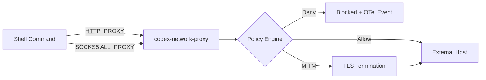

# Codex CLI Network Proxy: Sandboxed Outbound Traffic, Domain Policies, SOCKS5, and MITM Hooks


---

Every tool call and shell command Codex executes runs inside a sandbox. The filesystem layer of that sandbox is well understood — Seatbelt on macOS, bubblewrap on Linux, restricted tokens on Windows. The *network* layer is less discussed, yet it is the one that decides whether your agent can `curl` an internal API, pull packages from a private registry, or quietly exfiltrate environment variables to a remote endpoint.

Since v0.129, Codex ships a dedicated Rust crate — `codex-network-proxy` — that acts as a local policy enforcement engine for all outbound traffic initiated by sandboxed processes [^1]. This article is a deep dive into how it works, how to configure it, and how to build practical domain policies for real-world workflows.

## Architecture Overview

The network proxy sits between the sandbox and the external network. When `network_access` is enabled for a permission profile, Codex starts a dual-protocol proxy on loopback and injects `HTTP_PROXY` and `ALL_PROXY` environment variables into every subprocess [^2].



The proxy exposes two listeners [^1]:

| Protocol | Default Address | Purpose |
|----------|----------------|---------|
| HTTP/CONNECT | `127.0.0.1:3128` | Standard HTTP proxy for `curl`, `npm`, `pip`, most CLI tools |
| SOCKS5 | `127.0.0.1:8081` | Fallback for tools that only speak SOCKS (SSH tunnels, some database drivers) |

Both bind exclusively to loopback. The `dangerously_allow_non_loopback_proxy` flag exists but is marked dangerous for good reason — enabling it would expose the proxy to other processes on the host [^3].

## Enabling Sandboxed Networking

Network access is off by default in `workspace-write` mode [^4]. You can enable it at three levels of granularity.

### Option 1: Legacy Sandbox Mode

```toml
[sandbox_workspace_write]
network_access = true
```

This is a blunt instrument — it enables outbound networking with no domain filtering. Every resolvable host is reachable.

### Option 2: Permission Profile with Domain Policies

```toml
default_permissions = "web-dev"

[permissions.web-dev]
extends = ":workspace"

[permissions.web-dev.network]
enabled = true

[permissions.web-dev.network.domains]
"registry.npmjs.org" = "allow"
"*.github.com" = "allow"
"**.googleapis.com" = "allow"
"*" = "deny"
```

This is the recommended approach. Named permission profiles are reusable, composable, and auditable [^5].

### Option 3: Requirements.toml Enforcement (Enterprise)

Enterprise admins can enforce network policies via managed configuration that users cannot override:

```toml
[experimental_network]
allow = ["registry.npmjs.org", "*.internal.corp.com"]
deny = ["*"]
```

Cloud-managed requirements push these policies to every CLI instance in the workspace without touching individual machines [^6].

## Domain Matching Semantics

The proxy compiles domain patterns into `GlobSet` structures at initialisation for efficient runtime matching [^1]. Three pattern forms are supported:

| Pattern | Matches | Example |
|---------|---------|---------|
| `example.com` | Exact host only | `example.com` but not `api.example.com` |
| `*.example.com` | Direct subdomains only | `api.example.com` but not `example.com` |
| `**.example.com` | Apex and all subdomains | `example.com`, `api.example.com`, `deep.api.example.com` |

A global `*` wildcard matches everything. When used with `deny`, it creates a default-deny policy; when used with `allow`, it creates a default-allow policy (not recommended) [^3].

### Conflict Resolution

**Deny always wins.** If a hostname matches both an allow and a deny rule, the request is blocked [^1]. This means you can write broad allow rules and carve out specific denials:

```toml
[permissions.ci-runner.network.domains]
"**.npmjs.org" = "allow"
"**.pypi.org" = "allow"
"audit.npmjs.org" = "deny"   # Block telemetry endpoint
"*" = "deny"
```

## The Local Protection Guard

Even when a hostname is allowlisted, the proxy applies a secondary check: if the resolved IP address falls within a non-public range (RFC 1918, RFC 4193, link-local), the request is blocked unless `allow_local_binding = true` [^1].

This prevents a class of SSRF attacks where a public hostname resolves to an internal IP — a technique known as DNS rebinding. For most workflows, leave this guard enabled.

```toml
[permissions.dev.network]
enabled = true
allow_local_binding = false  # Default; blocks 10.x, 172.16-31.x, 192.168.x
```

If your workflow requires access to services on `localhost` (e.g., a local database or dev server), you'll need to explicitly opt in:

```toml
[permissions.dev.network]
enabled = true
allow_local_binding = true
```

## Unix Socket Controls

On macOS, some tools communicate over Unix sockets rather than TCP — Docker being the primary example. The proxy supports Unix socket proxying via the `x-unix-socket` HTTP header [^1].

```toml
[permissions.docker-dev.network]
enabled = true

[permissions.docker-dev.network.unix_sockets]
"/var/run/docker.sock" = "allow"
```

The `dangerously_allow_all_unix_sockets` flag bypasses all socket restrictions. Avoid it outside of testing.

## SOCKS5 Configuration

The SOCKS5 listener handles tools that don't honour `HTTP_PROXY`. Configuration options:

```toml
[permissions.dev.network]
enabled = true
enable_socks5 = true          # Default: true when networking enabled
enable_socks5_udp = true      # Allow UDP over SOCKS5 (DNS, etc.)
socks_url = "http://127.0.0.1:8081"  # Default
```

In **Limited mode** (read-only network access), SOCKS5 is disabled entirely because the proxy cannot inspect encrypted tunnel contents to determine whether the operation is read-only [^1].

## Proxy Modes: Full vs Limited

Permission profiles support two network modes:

| Mode | HTTP Methods | SOCKS5 | Use Case |
|------|-------------|--------|----------|
| `full` | All methods allowed | Enabled | Development, CI with write access |
| `limited` | Safe methods only (GET, HEAD, OPTIONS) | Disabled | Read-only research, documentation retrieval |

```toml
[permissions.read-only-net.network]
enabled = true
mode = "limited"
```

In limited mode, POST/PUT/DELETE requests are blocked at the proxy level, regardless of domain allowlisting. HTTPS traffic through CONNECT tunnels hides the HTTP method from the proxy unless MITM termination is active [^1].

## MITM Hooks: Inspecting HTTPS Traffic

For organisations that need visibility into HTTPS traffic, the proxy supports optional TLS termination using internally generated CA certificates managed by the `ManagedMitmCa` subsystem [^1]. When enabled:

1. The proxy intercepts CONNECT requests
2. Generates a leaf certificate for the target domain using `rustls`
3. Terminates TLS, inspects the request
4. Evaluates MITM hooks for header injection or request blocking
5. Re-encrypts and forwards to the upstream

This is a powerful capability with significant trust implications. It requires the generated CA certificate to be installed in the sandbox's trust store. The primary use cases are:

- **Header injection** — adding authentication tokens to requests that pass through the proxy
- **Request auditing** — logging which API endpoints the agent contacts
- **Method enforcement** — blocking unsafe methods on HTTPS connections in limited mode

MITM hooks are configured as part of the broader hooks system and fire with the request's host, path, and method as context [^7].

## Observability and Auditing

Every policy decision emits a structured OpenTelemetry event [^1]. The proxy maintains a `BlockedRequest` buffer that surfaces violations in the TUI — when a tool call is blocked by network policy, you'll see the blocked domain and the reason in the status bar.

For enterprise deployments with centralised observability:

```toml
[otel]
exporter = "otlp-http"

[otel.exporter.otlp-http]
endpoint = "https://otel-collector.internal:4318"
```

Network policy decisions appear as span events on the tool-execution trace, making it straightforward to audit which external services your agents contact [^8].

## Practical Recipes

### Node.js Project with Private Registry

```toml
default_permissions = "node-dev"

[permissions.node-dev]
extends = ":workspace"

[permissions.node-dev.network]
enabled = true

[permissions.node-dev.network.domains]
"registry.npmjs.org" = "allow"
"npm.pkg.github.com" = "allow"
"**.githubusercontent.com" = "allow"
"*" = "deny"
```

### Python ML Project

```toml
default_permissions = "ml-dev"

[permissions.ml-dev]
extends = ":workspace"

[permissions.ml-dev.network]
enabled = true

[permissions.ml-dev.network.domains]
"pypi.org" = "allow"
"*.pythonhosted.org" = "allow"
"**.huggingface.co" = "allow"
"*.docker.io" = "allow"
"*" = "deny"

[permissions.ml-dev.network.unix_sockets]
"/var/run/docker.sock" = "allow"
```

### CI Pipeline (Strict)

```toml
default_permissions = "ci-locked"

[permissions.ci-locked]
extends = ":workspace"

[permissions.ci-locked.network]
enabled = true
mode = "limited"
allow_local_binding = false
enable_socks5 = false

[permissions.ci-locked.network.domains]
"registry.npmjs.org" = "allow"
"*" = "deny"
```

### Enterprise Air-Gap with Internal Mirror

```toml
default_permissions = "corp"

[permissions.corp]
extends = ":workspace"

[permissions.corp.network]
enabled = true
allow_local_binding = true   # Internal services on RFC 1918

[permissions.corp.network.domains]
"**.internal.corp.com" = "allow"
"nexus.corp.com" = "allow"
"*" = "deny"
```

## Dynamic Policy Reloading

The proxy supports policy updates without restart via `NetworkProxy::replace_config_state` [^1]. In practice, this means:

- Changing permission profiles mid-session with `/permissions` updates network policies immediately
- Enterprise managed configuration changes apply on the next fetch cycle without requiring a CLI restart
- The `ConfigReloader` watches for changes and recompiles `GlobSet` patterns

## Testing Your Policies

Use `codex sandbox` to test network policies in isolation before committing them to your config:

```bash
# Test whether curl can reach a specific host under your profile
codex sandbox --permissions-profile node-dev -- curl -I https://registry.npmjs.org

# Verify a blocked domain is actually blocked
codex sandbox --permissions-profile node-dev -- curl -I https://evil.example.com
```

The `--log-denials` flag on `codex sandbox` will print every blocked syscall and network request, making it straightforward to debug overly restrictive policies [^9].

## Upstream Proxy Chaining

For corporate environments that route all traffic through an existing proxy, the network proxy can chain:

```toml
[permissions.corp.network]
enabled = true
allow_upstream_proxy = true  # Default: true
```

The proxy respects the host system's `HTTPS_PROXY` and `NO_PROXY` environment variables when forwarding traffic, provided `allow_upstream_proxy` is not explicitly disabled [^3].

## Key Takeaways

1. **Default-deny is the production stance.** Start with `"*" = "deny"` and add only the domains your workflow needs.
2. **Permission profiles are the right abstraction.** They compose, extend, and travel with your project.
3. **The local protection guard prevents DNS rebinding.** Only disable it when you genuinely need localhost access.
4. **SOCKS5 is disabled in limited mode for safety.** If your tools need SOCKS, you need full mode.
5. **MITM hooks are powerful but invasive.** Use them for enterprise auditing, not casual development.
6. **OTel integration provides auditability.** Every blocked request is a traceable event.

The network proxy is the piece of the Codex sandbox that most teams skip configuring — and the piece that matters most when an agent has write access to your codebase and you'd rather it didn't phone home.

## Citations

[^1]: [codex-network-proxy crate architecture — DeepWiki](https://deepwiki.com/openai/codex/3.12-network-proxy)
[^2]: [Permissions documentation — OpenAI Developers](https://developers.openai.com/codex/permissions)
[^3]: [Configuration Reference — OpenAI Developers](https://developers.openai.com/codex/config-reference)
[^4]: [Agent approvals and security — OpenAI Developers](https://developers.openai.com/codex/agent-approvals-security)
[^5]: [Codex CLI Permission Profiles — Codex Knowledge Base](https://codex.danielvaughan.com/2026/05/08/codex-cli-permission-profiles-sandbox-modes-security-layers/)
[^6]: [Managed Configuration — OpenAI Developers](https://developers.openai.com/codex/enterprise/managed-configuration)
[^7]: [Codex CLI MITM Hooks — Codex Knowledge Base](https://codex.danielvaughan.com/2026/05/21/codex-cli-mitm-hooks-https-request-interception-network-proxy-enterprise-security/)
[^8]: [Advanced Configuration — OpenAI Developers](https://developers.openai.com/codex/config-advanced)
[^9]: [Codex CLI `codex sandbox` Subcommand — Codex Knowledge Base](https://codex.danielvaughan.com/2026/06/04/codex-cli-sandbox-subcommand-standalone-command-isolation-platform-native-security/)
