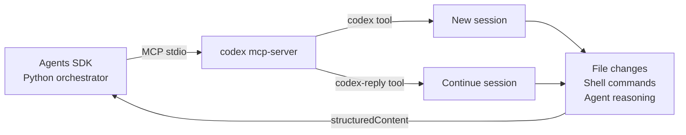
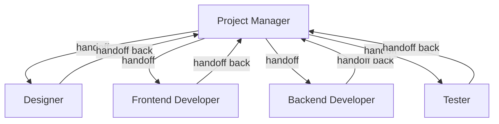
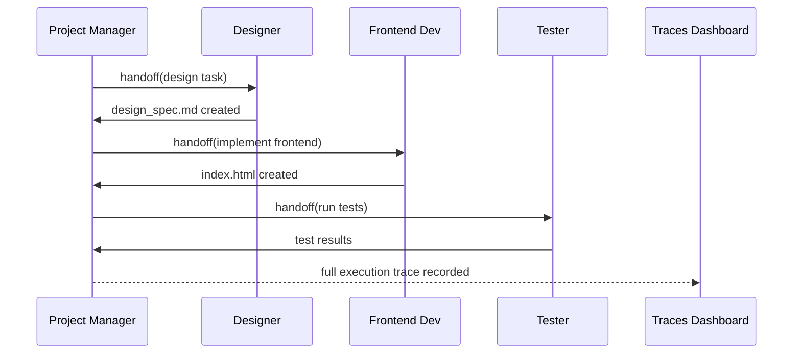

# Codex CLI + OpenAI Agents SDK: Building Multi-Agent Pipelines with MCP, Handoffs, and Traces


---

Codex CLI's `codex mcp-server` mode turns the agent into a callable tool that any MCP-compatible orchestrator can invoke. Pair it with the OpenAI Agents SDK and you get deterministic, multi-agent software delivery pipelines — designer hands off to developer, developer hands off to tester — with full execution traces recorded to the OpenAI platform. This article covers the current integration surface as of v0.137, with working code, architectural patterns, and the gotchas that the official quickstart glosses over.

---

## Why Use the Agents SDK Instead of Subagents?

Codex's built-in subagent system (`spawn_agent`, `wait`, `close_agent`) is model-driven: the LLM decides when to spawn workers and how to consolidate results.[^1] That works well for exploratory tasks where the agent needs autonomy. But for repeatable workflows — a CI pipeline that always runs design → implementation → test — you want the *orchestration* to be deterministic while the *execution* within each step remains agentic.

The Agents SDK provides exactly that. You define agents in Python with explicit handoff chains, and the SDK manages turn-taking, tool resolution, and trace capture.[^2] Codex participates as an MCP server, contributing its `codex` and `codex-reply` tools to the agent's tool surface.



---

## Starting the MCP Server

Launch Codex in MCP server mode with a single command:

```bash
codex mcp-server
```

The server exposes two tools over stdio:[^3]

| Tool | Purpose | Key parameters |
|------|---------|----------------|
| `codex` | Start a new Codex session | `prompt`, `approval-policy`, `sandbox`, `model`, `cwd`, `profile`, `config` |
| `codex-reply` | Continue an existing session | `prompt`, `threadId` |

Both return a `structuredContent` object containing a `threadId` (for session continuity) and the agent's `content` response. The `threadId` is the critical piece — lose it and you cannot resume the session.

To inspect the MCP surface before writing code, use the Model Context Protocol Inspector:

```bash
npx @modelcontextprotocol/inspector codex mcp-server
```

---

## Minimal Python Integration

### Prerequisites

- Codex CLI v0.137+ installed and authenticated
- Python 3.10+
- Packages: `openai`, `openai-agents`, `python-dotenv`

```bash
mkdir codex-pipeline && cd codex-pipeline
python -m venv .venv && source .venv/bin/activate
pip install --upgrade openai openai-agents python-dotenv
```

Create a `.env` file with your API key:

```bash
OPENAI_API_KEY=sk-...
```

### Single-Agent Example

The simplest integration launches one agent with Codex as its tool:

```python
import asyncio
import os
from dotenv import load_dotenv
from agents import Agent, Runner, set_default_openai_api
from agents.mcp import MCPServerStdio

load_dotenv(override=True)
set_default_openai_api(os.getenv("OPENAI_API_KEY"))

async def main() -> None:
    async with MCPServerStdio(
        name="Codex CLI",
        params={
            "command": "codex",
            "args": ["mcp-server"],
        },
        client_session_timeout_seconds=360000,
    ) as codex_mcp_server:
        agent = Agent(
            name="Refactoring Agent",
            instructions=(
                "You refactor Python code for clarity and performance. "
                'Call codex with "approval-policy": "never" '
                'and "sandbox": "workspace-write". '
                "Report what you changed and why."
            ),
            mcp_servers=[codex_mcp_server],
        )

        result = await Runner.run(
            agent, "Refactor src/auth.py to use dataclasses instead of dicts"
        )
        print(result.final_output)

if __name__ == "__main__":
    asyncio.run(main())
```

The `client_session_timeout_seconds` is set high (100 hours) because Codex sessions can run for extended periods. If you leave it at the default, the MCP connection may drop mid-task.[^4]

---

## Multi-Agent Handoff Pipelines

The real power appears when you chain multiple agents with explicit handoffs. The Agents SDK's `handoffs` parameter defines which agents can receive control, and the orchestrator manages the transition.[^2]

### Architecture



### Implementation

```python
import asyncio
import os
from dotenv import load_dotenv
from agents import Agent, ModelSettings, Runner, set_default_openai_api
from agents.extensions.handoff_prompt import RECOMMENDED_PROMPT_PREFIX
from agents.mcp import MCPServerStdio
from openai.types.shared import Reasoning

load_dotenv(override=True)
set_default_openai_api(os.getenv("OPENAI_API_KEY"))

async def main() -> None:
    async with MCPServerStdio(
        name="Codex CLI",
        params={
            "command": "codex",
            "args": ["mcp-server"],
        },
        client_session_timeout_seconds=360000,
    ) as codex:
        tester = Agent(
            name="Tester",
            instructions=(
                f"{RECOMMENDED_PROMPT_PREFIX}"
                "Run tests against deliverables. Verify acceptance "
                "criteria from TEST.md. Use Codex with read-only sandbox. "
                "Report pass/fail with evidence."
            ),
            mcp_servers=[codex],
        )

        frontend_dev = Agent(
            name="Frontend Developer",
            instructions=(
                f"{RECOMMENDED_PROMPT_PREFIX}"
                "Implement the frontend per design_spec.md. "
                "Save to /frontend/index.html. Use Codex with "
                '"approval-policy": "never", "sandbox": "workspace-write".'
            ),
            mcp_servers=[codex],
        )

        backend_dev = Agent(
            name="Backend Developer",
            instructions=(
                f"{RECOMMENDED_PROMPT_PREFIX}"
                "Implement the API per design_spec.md. "
                "Save to /backend/server.js. Use Codex with "
                '"approval-policy": "never", "sandbox": "workspace-write".'
            ),
            mcp_servers=[codex],
        )

        designer = Agent(
            name="Designer",
            instructions=(
                f"{RECOMMENDED_PROMPT_PREFIX}"
                "Produce a UI/UX specification. Save to "
                "/design/design_spec.md. Hand off to Project Manager "
                "when complete."
            ),
            model="gpt-5.5",
            mcp_servers=[codex],
        )

        pm = Agent(
            name="Project Manager",
            instructions=(
                f"{RECOMMENDED_PROMPT_PREFIX}"
                "Create REQUIREMENTS.md, TEST.md, AGENT_TASKS.md. "
                "Hand off to Designer first. After design_spec.md exists, "
                "hand off to Frontend and Backend developers. "
                "After their deliverables exist, hand off to Tester. "
                "Gate each handoff on file existence verification. "
                'Use Codex with "sandbox": "workspace-write".'
            ),
            model="gpt-5.5",
            model_settings=ModelSettings(
                reasoning=Reasoning(effort="medium"),
            ),
            handoffs=[designer, frontend_dev, backend_dev, tester],
            mcp_servers=[codex],
        )

        result = await Runner.run(
            pm,
            "Build a task tracker web app with REST API",
            max_turns=30,
        )
        print(result.final_output)

if __name__ == "__main__":
    asyncio.run(main())
```

---

## Session Continuity with `codex-reply`

Each call to the `codex` tool starts a fresh session and returns a `threadId`. To continue the same session — keeping file state, conversation history, and tool context — the agent must call `codex-reply` with that `threadId`.[^3]

This matters in practice because a multi-step implementation often requires several turns: "create the file", "now add tests", "fix the failing test". If the agent calls `codex` each time instead of `codex-reply`, each invocation starts cold with no memory of prior work.

The fix is in the agent's instructions:

```python
Agent(
    name="Iterative Developer",
    instructions=(
        "When calling Codex for the first time, use the codex tool. "
        "For follow-up messages in the same task, use codex-reply "
        "with the threadId from the previous response. "
        "Never start a new session for continuation work."
    ),
    mcp_servers=[codex_mcp_server],
)
```

---

## Execution Traces

Every Agents SDK run automatically records to the OpenAI Traces dashboard at `platform.openai.com/trace`.[^5] Traces capture:

- Agent-to-agent handoff sequences
- Every MCP tool invocation (including the full Codex prompt and response)
- Token usage per turn
- Execution timelines

This is invaluable for debugging pipeline failures. When a tester agent reports a failing test, you can trace backwards through the handoff chain to see exactly what the developer agent wrote and what the designer agent specified.



---

## Configuration Patterns

### Sandbox and Approval Policies

Match the sandbox to the agent's role:

| Agent role | `approval-policy` | `sandbox` | Rationale |
|-----------|-------------------|-----------|-----------|
| Explorer / Reviewer | `"untrusted"` | `"read-only"` | No file modifications needed |
| Developer / Builder | `"never"` | `"workspace-write"` | Must create and edit files |
| Tester | `"on-request"` | `"workspace-write"` | May need to run test commands |
| Security Auditor | `"untrusted"` | `"read-only"` | Read-only analysis only |

### Model Selection per Agent

Different agents benefit from different models. Use the `model` parameter on the `Agent` constructor *and* the `model` parameter in the Codex tool call:

```python
# The Agent's own reasoning model
designer = Agent(
    name="Designer",
    model="gpt-5.5",  # strong reasoning for design decisions
    ...
)

# The Codex session model (passed in instructions)
# "Call codex with model: codex-spark"
# Use Spark for high-throughput file operations
```

The Agent's `model` controls the orchestration-level reasoning. The Codex tool's `model` parameter controls the coding model used within the Codex session.[^6] These can and often should differ.

### Using Profiles

If you have named profiles in `~/.codex/`, pass them through the Codex tool:

```python
Agent(
    instructions=(
        'Call codex with "profile": "security-audit" for '
        "security-focused configuration."
    ),
    ...
)
```

This loads `~/.codex/security-audit.config.toml`, which might set `model_reasoning_effort = "xhigh"` and `sandbox_mode = "read-only"`.[^7]

---

## Practical Gotchas

### 1. Timeout Configuration

The default MCP client timeout is far too short for Codex sessions. Always set `client_session_timeout_seconds` to at least 3600 (one hour). For long-running pipelines, 360000 (100 hours) is safer.[^4]

### 2. Working Directory

The `cwd` parameter in the Codex tool call determines where Codex operates. If you omit it, Codex uses the directory where `codex mcp-server` was launched. For multi-project pipelines, always pass `cwd` explicitly:

```python
Agent(
    instructions=(
        'Call codex with "cwd": "/path/to/project" '
        "to ensure file operations target the correct repository."
    ),
    ...
)
```

### 3. Approval Policy in CI

Setting `approval-policy` to `"never"` skips all human approval prompts — essential for unattended pipelines but dangerous if the agent can execute arbitrary shell commands. Pair it with `"sandbox": "workspace-write"` (not `"danger-full-access"`) to maintain filesystem boundaries.[^8]

### 4. Thread Leaks

Each `codex` tool call creates a persistent thread backed by SQLite. In pipelines that run frequently, these accumulate. Use `codex archive` to clean up completed sessions, or pass `--ephemeral` in the MCP server args to prevent persistence entirely:

```python
MCPServerStdio(
    params={
        "command": "codex",
        "args": ["mcp-server"],  # sessions persist by default
    },
)
```

### 5. Handoff Prompt Prefix

The `RECOMMENDED_PROMPT_PREFIX` from `agents.extensions.handoff_prompt` injects context about the handoff chain into each agent's instructions. Always include it — without it, agents lose track of what prior agents accomplished.[^2]

---

## When to Use This Pattern

Use the Agents SDK + Codex MCP integration when:

- **The workflow is repeatable**: design → build → test → deploy follows the same shape every time
- **You need audit trails**: Traces give you a complete record of every agent decision
- **Different steps need different models**: the designer might use GPT-5.5 for reasoning while the builder uses Spark for speed
- **You want programmatic control**: Python gives you loops, conditionals, error handling, and retry logic that prompt-driven orchestration cannot match

Stick with Codex's built-in subagents when:

- **The task is exploratory**: you do not know in advance how many agents or what roles are needed
- **You want zero infrastructure**: no Python script, no dependencies, just the terminal
- **Token budget matters**: the Agents SDK adds overhead from its own orchestration calls

---

## Citations

[^1]: [Subagents — Codex CLI documentation](https://developers.openai.com/codex/subagents) — official subagent reference covering spawn_agent, wait, close_agent, and the built-in agent types.

[^2]: [Use Codex with the Agents SDK — OpenAI Developers](https://developers.openai.com/codex/guides/agents-sdk) — official integration guide with single-agent and multi-agent workflow examples.

[^3]: [Codex CLI as MCP Server — tool surface](https://developers.openai.com/codex/guides/agents-sdk) — documentation of the `codex` and `codex-reply` MCP tools with parameter schemas and response structure.

[^4]: [MCPServerStdio timeout configuration — openai-agents Python package](https://github.com/openai/openai-agents-python) — the `client_session_timeout_seconds` parameter defaults to a value that is too low for long-running Codex sessions.

[^5]: [OpenAI Traces dashboard](https://platform.openai.com/trace) — automatic execution trace recording for all Agents SDK runs.

[^6]: [Codex CLI model selection — command line reference](https://developers.openai.com/codex/cli/reference) — the `--model` flag and `model` config key control which model the Codex session uses for reasoning and code generation.

[^7]: [Advanced Configuration — Codex CLI profiles](https://developers.openai.com/codex/config-advanced) — named configuration profiles loaded via `--profile` flag, with dedicated `.config.toml` files per profile.

[^8]: [Non-interactive mode — Codex CLI](https://developers.openai.com/codex/noninteractive) — approval and sandbox configuration for unattended execution, including security considerations for CI environments.
