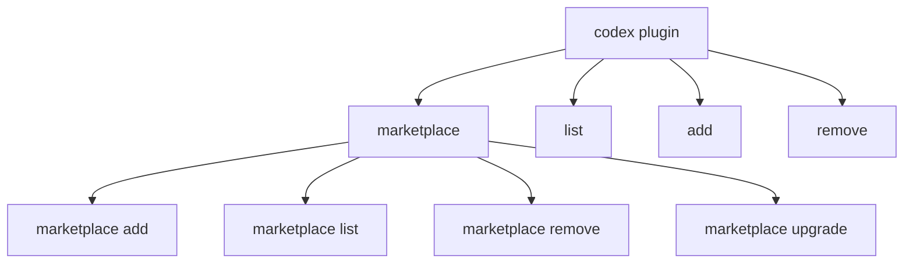
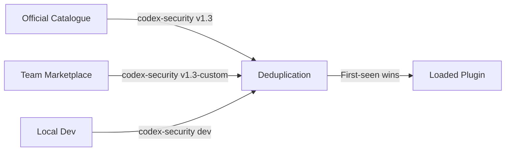

# Codex CLI Plugin Management from the Terminal: Marketplace Commands, JSON Output, and Automation Patterns for v0.137


---

Most Codex CLI plugin guides focus on the TUI browser or the desktop app's plugin directory. That works for one-off installs, but it falls apart when you need to provision a team of twenty developers, audit which plugins are active across a fleet, or gate CI pipelines on a known plugin configuration. Codex CLI v0.137, released 4 June 2026, closes the gap with machine-readable `codex plugin list --json` output, cached remote catalogue suggestions, and improved plugin deduplication[^1]. This article covers the terminal-first plugin management surface — from marketplace registration through to automation scripts that keep plugin stacks consistent across your organisation.

## The Plugin Subcommand Tree

Codex CLI exposes plugin management through the `codex plugin` subcommand family[^2]. The hierarchy looks like this:



Each command operates on the local plugin cache at `~/.codex/plugins/cache/` and the marketplace configuration stored alongside your `config.toml`[^3].

## Marketplace Registration

Before installing plugins, you register one or more marketplace sources. A marketplace is a JSON manifest (`marketplace.json`) that declares available plugins, their sources, and installation policies[^3].

### Adding Marketplaces

The `codex plugin marketplace add` command accepts four source formats[^2]:

```bash
# GitHub shorthand (most common)
codex plugin marketplace add openai/plugins

# GitHub shorthand with pinned ref
codex plugin marketplace add openai/plugins --ref v2.1.0

# Full Git URL
codex plugin marketplace add https://github.com/myorg/codex-plugins.git

# Local directory (useful for development)
codex plugin marketplace add ./my-local-marketplace
```

For monorepos where the marketplace lives in a subdirectory, use `--sparse` to avoid cloning the entire repository[^2]:

```bash
codex plugin marketplace add myorg/monorepo --sparse .agents/plugins
```

Codex reads marketplaces from a well-defined precedence chain[^3]:

1. **Official curated Plugin Directory** — OpenAI's first-party catalogue
2. **Repository-scoped** — `$REPO_ROOT/.agents/plugins/marketplace.json`
3. **Legacy compatible** — `$REPO_ROOT/.claude-plugin/marketplace.json`
4. **Personal scope** — `~/.agents/plugins/marketplace.json`

### Listing and Upgrading Marketplaces

```bash
# Show all configured marketplaces and their root paths
codex plugin marketplace list

# Machine-readable output (new in v0.137)
codex plugin marketplace list --json

# Refresh a specific marketplace from its remote source
codex plugin marketplace upgrade my-marketplace

# Refresh all configured Git-backed marketplaces
codex plugin marketplace upgrade
```

The `upgrade` command fetches the latest `marketplace.json` from the configured ref, updates the local cache, and surfaces any newly available plugins[^2]. In v0.137, the remote catalogue is cached locally so that subsequent `codex plugin list` invocations include suggestions from remote marketplaces without incurring a network round-trip on every call[^1].

## Installing and Removing Plugins

Once a marketplace is registered, install plugins by name:

```bash
# Install from any configured marketplace
codex plugin add codex-security

# Install a specific version
codex plugin add codex-security@1.2.0

# Remove a plugin
codex plugin remove codex-security
```

Installed plugins land in `~/.codex/plugins/cache/$MARKETPLACE_NAME/$PLUGIN_NAME/$VERSION/`[^3]. Each plugin must contain a `.codex-plugin/plugin.json` manifest at minimum[^4].

## The `codex plugin list --json` Output

Prior to v0.137, `codex plugin list` produced human-readable text. The new `--json` flag emits structured JSON, making it straightforward to pipe into `jq`, feed to dashboards, or use in compliance scripts[^1]:

```bash
# Human-readable list
codex plugin list

# Machine-readable JSON
codex plugin list --json
```

The JSON output includes installed plugins, their versions, enabled/disabled state, source marketplace, and any available upgrades from remote catalogues. Combined with the cached remote suggestions, the output also surfaces plugins available for installation that match your project's technology stack[^1].

### Practical Automation: Auditing Plugin State

A common enterprise requirement is verifying that every developer workstation runs an approved plugin set. With `--json` output, this becomes a one-liner:

```bash
# Check that codex-security is installed and enabled
codex plugin list --json | jq -e \
  '.[] | select(.name == "codex-security" and .enabled == true)' \
  > /dev/null || echo "FAIL: codex-security not active"
```

### CI/CD Plugin Verification

In GitHub Actions, you can gate workflow runs on the correct plugin configuration:

```yaml
- name: Verify plugin stack
  run: |
    PLUGINS=$(codex plugin list --json)
    echo "$PLUGINS" | jq -e '
      [.[] | select(.enabled)] |
      map(.name) |
      contains(["codex-security", "gmail"])
    ' > /dev/null
```

## Plugin Configuration in `config.toml`

Beyond the CLI commands, plugins are configured through `config.toml` keys[^3]. You can disable a plugin without uninstalling it:

```toml
[plugins."codex-security@openai-curated"]
enabled = false
```

You can also configure bundled MCP servers within a plugin:

```toml
[plugins."my-data-plugin@team-marketplace".mcp_servers.analytics]
enabled = true
env_vars = { DB_HOST = "analytics.internal" }
```

## Plugin Deduplication and Manifest Ordering

v0.137 fixed a subtle issue: when the same plugin appeared in multiple marketplaces (e.g. both the official catalogue and a team marketplace), previous versions could load duplicate instances. The fix ensures that plugin loading preserves the app manifest order and deduplicates installations, with the first-seen source taking precedence[^1].

This matters in practice when teams overlay the official catalogue with custom versions of first-party plugins — for instance, wrapping the Codex Security plugin with additional organisation-specific threat model rules.



## Building a Reproducible Plugin Stack

For teams that need every developer running the same plugin configuration, combine a repository-scoped marketplace with a `.codex/config.toml`:

```json
// .agents/plugins/marketplace.json
{
  "name": "acme-plugins",
  "interface": { "displayName": "Acme Engineering Plugins" },
  "plugins": [
    {
      "name": "codex-security",
      "source": { "source": "url", "url": "https://github.com/openai/codex-security-plugin.git" },
      "policy": { "installation": "INSTALLED_BY_DEFAULT" },
      "category": "Security"
    },
    {
      "name": "acme-review",
      "source": { "source": "local", "path": "./plugins/acme-review" },
      "policy": { "installation": "INSTALLED_BY_DEFAULT" },
      "category": "Productivity"
    }
  ]
}
```

Pair this with a project-level `config.toml` that enforces plugin settings:

```toml
# .codex/config.toml
[plugins."codex-security@acme-plugins"]
enabled = true

[plugins."acme-review@acme-plugins"]
enabled = true
```

When a developer clones the repository and runs `codex`, both plugins install automatically from the repository-scoped marketplace[^3].

## Scripting Plugin Management

The `--json` output unlocks several automation patterns:

### Generating a Plugin Bill of Materials

```bash
codex plugin list --json | jq '[.[] | {
  name: .name,
  version: .version,
  marketplace: .source,
  enabled: .enabled
}]' > plugin-bom.json
```

### Diffing Plugin State Between Machines

```bash
# On machine A
codex plugin list --json | jq '[.[] | .name + "@" + .version]' > /tmp/a.json

# On machine B — compare
codex plugin list --json | jq '[.[] | .name + "@" + .version]' | \
  diff /tmp/a.json - || echo "Plugin mismatch detected"
```

### Bulk Install from a Manifest

```bash
# plugins-required.txt: one plugin name per line
while IFS= read -r plugin; do
  codex plugin add "$plugin" 2>&1 || echo "Failed: $plugin"
done < plugins-required.txt
```

## What Changed from v0.135 to v0.137

| Feature | v0.135 | v0.137 |
|---|---|---|
| `codex plugin list --json` | Not available | Machine-readable JSON output[^1] |
| Remote catalogue caching | Fetched on every invocation | Cached locally with `marketplace upgrade` refresh[^1] |
| Plugin deduplication | Duplicates possible across marketplaces | First-seen-wins with manifest order preservation[^1] |
| Bundled zsh discovery | Initial support | Packaged builds discover bundled patched zsh helper[^5] |
| `codex doctor` plugin diagnostics | Basic checks | Enhanced troubleshooting for plugin loading issues[^5] |

## Recommendations

1. **Register your team marketplace in the repository**, not in individual `~/.agents/` directories. This ensures every clone gets the same plugin catalogue.
2. **Use `INSTALLED_BY_DEFAULT`** for plugins that every team member needs. Reserve `AVAILABLE` for optional tooling.
3. **Pin marketplace refs** in CI environments with `--ref` to prevent unexpected plugin updates breaking pipelines.
4. **Run `codex plugin list --json`** in your CI health check step to verify the expected plugin stack before running `codex exec`.
5. **Upgrade marketplaces explicitly** with `codex plugin marketplace upgrade` rather than relying on automatic refresh, especially in environments where network access is restricted.

## Citations

[^1]: OpenAI, "Codex Changelog — June 4, 2026," *OpenAI Developers*, 2026. [https://developers.openai.com/codex/changelog](https://developers.openai.com/codex/changelog)

[^2]: OpenAI, "Command line options — Codex CLI," *OpenAI Developers*, 2026. [https://developers.openai.com/codex/cli/reference](https://developers.openai.com/codex/cli/reference)

[^3]: OpenAI, "Build plugins — Codex," *OpenAI Developers*, 2026. [https://developers.openai.com/codex/plugins/build](https://developers.openai.com/codex/plugins/build)

[^4]: OpenAI, "Plugins — Codex," *OpenAI Developers*, 2026. [https://developers.openai.com/codex/plugins](https://developers.openai.com/codex/plugins)

[^5]: OpenAI, "Codex Changelog — May 28, 2026," *OpenAI Developers*, 2026. [https://developers.openai.com/codex/changelog](https://developers.openai.com/codex/changelog)
