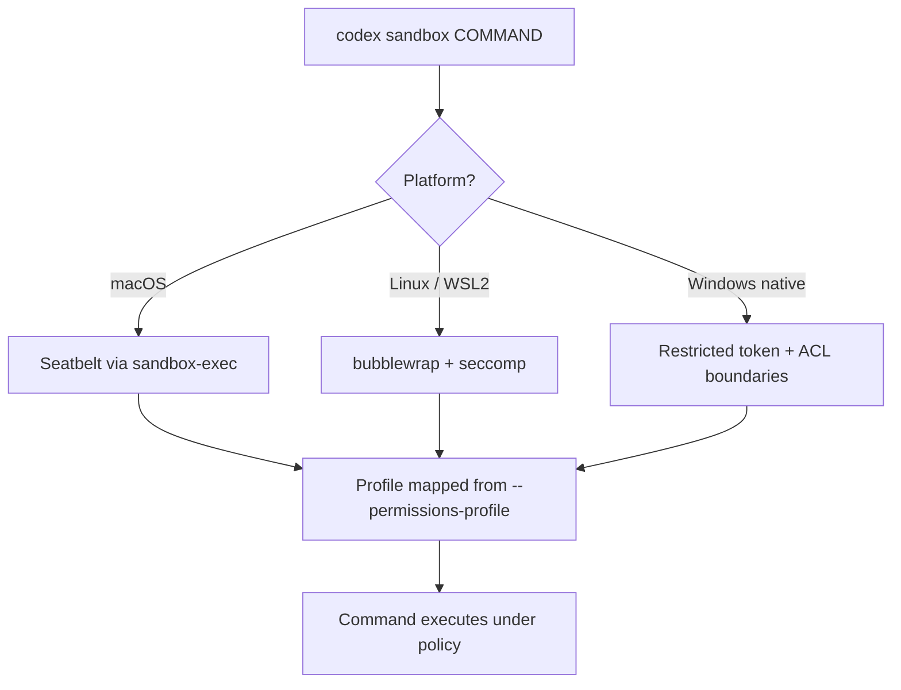
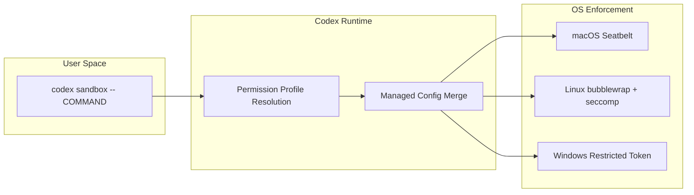

# Codex CLI `codex sandbox` Subcommand: Running Arbitrary Commands Under Agent-Grade Isolation


---

Most developers know that Codex CLI sandboxes the commands its AI agent executes. Fewer realise that the same platform-native isolation is available as a standalone subcommand. `codex sandbox` lets you run *any* command under the same Seatbelt, Landlock, or Windows restricted-token policies that protect agent sessions — without invoking the model at all[^1]. Think of it as a portable, zero-configuration security wrapper that ships free with every Codex installation.

This article covers the subcommand's interface, its per-platform enforcement mechanisms, practical use cases for development and CI, and the enterprise configuration surface added in v0.137[^2].

## Why a Standalone Sandbox Subcommand?

When Codex executes a shell command during an agent turn, it wraps that command in a platform-native sandbox whose policy matches the session's `sandbox_mode`[^1]. The `codex sandbox` subcommand exposes that same machinery directly:

```bash
codex sandbox macos -- npm test
codex sandbox linux -- python -m pytest
codex sandbox windows -- cargo test
```

Each invocation spawns the target command under OS-level restrictions — filesystem write boundaries, network controls, and process-isolation rules — identical to those applied during an AI-driven session[^3]. No API key is consumed and no model call is made.

The primary use cases are:

- **Testing sandbox compatibility** before running an agent session with `--ask-for-approval never`
- **Hardening CI pipelines** by wrapping build and test steps in agent-grade isolation
- **Running untrusted scripts** (community plugins, downloaded installers) in a confined environment
- **Debugging denial logs** to understand why a command fails under sandbox policy

## Platform-Specific Invocation

The subcommand dispatches to the correct OS backend automatically, but you can also target a specific implementation explicitly[^1]:



### macOS: Seatbelt

On macOS 12+, `codex sandbox macos` calls `sandbox-exec` with a compiled Seatbelt profile that corresponds to your selected sandbox mode[^3]. No additional installation is required — Seatbelt ships with every macOS release.

```bash
# Run a build under workspace-write restrictions, logging any denied syscalls
codex sandbox macos --permissions-profile workspace-write --log-denials -- make build
```

The `--log-denials` flag is macOS-specific and captures every Seatbelt denial to stderr, which is invaluable for diagnosing unexpected failures[^1].

### Linux: bubblewrap + seccomp

Linux enforcement uses `bubblewrap` (bwrap) combined with seccomp filters[^4]. You must install the runtime dependency first:

```bash
# Ubuntu / Debian
sudo apt install bubblewrap

# Fedora / RHEL
sudo dnf install bubblewrap
```

Then run commands under the sandbox:

```bash
codex sandbox linux --permissions-profile workspace-write -- ./run-tests.sh
```

Landlock LSM is used where available (kernel 5.13+) to provide additional filesystem access control beyond bwrap's namespace isolation[^4].

### Windows: Elevated and Unelevated Modes

Windows has two sandbox backends, configured in `config.toml`[^5]:

```toml
[windows]
sandbox = "elevated"  # preferred — or "unelevated" as fallback
```

The **elevated** sandbox is the stronger option. It creates two dedicated local users — `CodexSandboxOffline` and `CodexSandboxOnline` — and runs commands under a write-restricted token whose principal is one of these users rather than your actual Windows account[^6]. Windows Firewall rules block outbound network access for the `CodexSandboxOffline` user, giving you a hardware-enforced offline mode.

Setting up the elevated sandbox requires administrator privileges:

```powershell
codex sandbox setup --elevated
```

This provisions the sandbox users, configures ACLs, and installs the firewall rules[^5]. The `--elevated` provisioning path was promoted from alpha status in v0.136[^2].

The **unelevated** fallback derives a restricted token from your current user and applies ACL-based filesystem boundaries, but cannot enforce network isolation via firewall rules[^6].

## Permission Profiles

Rather than specifying raw sandbox modes, you can use named permission profiles — predefined or custom policy bundles that map to specific sandbox configurations[^7]:

```bash
# Use a named profile
codex sandbox macos --permissions-profile ci-readonly -- npm audit

# Use the default workspace-write profile
codex sandbox linux -- cargo clippy
```

The three built-in profiles correspond to the sandbox modes[^1]:

| Profile | Filesystem | Network | Use Case |
|---------|-----------|---------|----------|
| `read-only` | Read anywhere, write nowhere | Blocked | Auditing, code review |
| `workspace-write` | Read anywhere, write within project | Blocked by default | Development, testing |
| `danger-full-access` | Unrestricted | Unrestricted | Not recommended |

### Network Access Within workspace-write

To allow network access while maintaining filesystem restrictions, set the following in `config.toml`[^1]:

```toml
[sandbox_workspace_write]
network_access = true
```

For finer control, the network proxy feature flag enables domain-level allowlisting[^1]:

```toml
[features.network_proxy]
enabled = true
domains = { "registry.npmjs.org" = "allow", "*.githubusercontent.com" = "allow" }
```

Domain matching follows these rules: exact hosts match only themselves; `*.example.com` matches subdomains but not the apex; `**.example.com` matches both; a global `*` allow matches any public host; and `deny` always overrides `allow`[^1].

## Protected Paths

Even in `workspace-write` mode, certain paths remain read-only to prevent the sandboxed process from tampering with version control or agent configuration[^1]:

- `.git` directory (and the resolved Git directory if `.git` is a `gitdir:` pointer)
- `.agents/` directory
- `.codex/` directory

This means a sandboxed `npm install` can write to `node_modules/` but cannot modify `.git/hooks/` — an important safeguard against supply-chain attacks in post-install scripts[^8].

## Enterprise: Managed Configuration

v0.137 introduced cloud-managed configuration bundles for Business, Enterprise, and EDU workspaces[^2]. The `codex sandbox` subcommand can incorporate these managed policies:

```bash
codex sandbox linux --include-managed-config -- ./deploy.sh
```

The `--include-managed-config` flag merges the organisation's cloud-pushed policy (sandbox mode, network allowlists, writable roots) with local configuration, ensuring that sandboxed commands in CI adhere to centrally managed security posture[^2].

## Practical Recipes

### Recipe 1: Sandboxed CI Test Step

Wrap your test suite in agent-grade isolation within a GitHub Actions workflow:

```yaml
- name: Run tests under Codex sandbox
  run: |
    codex sandbox linux \
      --permissions-profile workspace-write \
      -- npm test
```

This prevents test code from writing outside the workspace or making unexpected network calls, without requiring Docker or a custom container image[^4].

### Recipe 2: Auditing a Community Plugin

Before installing a community Codex plugin, run its install script in read-only mode:

```bash
codex sandbox macos \
  --permissions-profile read-only \
  --log-denials \
  -- bash ./install-plugin.sh
```

Every filesystem write and network access attempt is logged to stderr via `--log-denials`, letting you inspect exactly what the script tries to do before granting it real access[^1].

### Recipe 3: Debugging Sandbox Denials

When an agent session fails with cryptic errors, reproduce the failing command under the sandbox subcommand with denial logging:

```bash
codex sandbox macos \
  --permissions-profile workspace-write \
  --log-denials \
  -- python manage.py migrate
```

The denial log shows precisely which syscall was blocked and the target path, making it straightforward to adjust writable roots or network policy[^1].

### Recipe 4: Windows Offline Build Verification

Verify that a build completes without network access on Windows:

```powershell
codex sandbox windows --permissions-profile workspace-write -- dotnet build
```

With the elevated sandbox active, the command runs as `CodexSandboxOffline`, which has firewall rules blocking all outbound traffic[^6]. If the build succeeds, you know it has no hidden network dependencies.

## Architecture Summary



The subcommand resolves the permission profile, optionally merges managed enterprise configuration, then delegates to the platform-native enforcement layer. The sandboxed command inherits the resolved policy — no Codex agent loop, no API calls, no token spend.

## Limitations and Caveats

- **macOS**: macOS is the only platform where `--log-denials` surfaces denial details directly; Linux and Windows require external logging (e.g., `auditd` or Windows Event Log) for equivalent visibility[^1]
- **Linux**: bubblewrap must be installed separately; it is not bundled with Codex[^4]
- **Windows**: the elevated sandbox requires a one-time `codex sandbox setup --elevated` provisioning step with administrator privileges; some enterprise group policies may block the required logon type (Error 1385)[^5]
- **Network proxy**: the domain-allowlist feature flag is separate from the sandbox mode and must be explicitly enabled[^1]

## Conclusion

The `codex sandbox` subcommand transforms Codex CLI from a pure AI coding tool into a general-purpose command isolation utility. Whether you are hardening CI pipelines, vetting untrusted scripts, or debugging agent sandbox failures, the same platform-native enforcement that protects agent sessions is available at your fingertips — no model calls required.

---

## Citations

[^1]: OpenAI, "Agent approvals & security — Codex," OpenAI Developers, June 2026. [https://developers.openai.com/codex/agent-approvals-security](https://developers.openai.com/codex/agent-approvals-security)

[^2]: OpenAI, "Changelog — Codex," OpenAI Developers, 4 June 2026 (v0.137.0 entry). [https://developers.openai.com/codex/changelog](https://developers.openai.com/codex/changelog)

[^3]: OpenAI, "Sandbox — Codex," OpenAI Developers, June 2026. [https://developers.openai.com/codex/concepts/sandboxing](https://developers.openai.com/codex/concepts/sandboxing)

[^4]: OpenAI, "Command line options — Codex CLI," OpenAI Developers, June 2026. [https://developers.openai.com/codex/cli/reference](https://developers.openai.com/codex/cli/reference)

[^5]: OpenAI, "Windows — Codex," OpenAI Developers, June 2026. [https://developers.openai.com/codex/windows](https://developers.openai.com/codex/windows)

[^6]: OpenAI, "Building a safe, effective sandbox to enable Codex on Windows," OpenAI Blog, 15 May 2026. [https://openai.com/index/building-codex-windows-sandbox/](https://openai.com/index/building-codex-windows-sandbox/)

[^7]: OpenAI, "Codex CLI Permission Profiles," OpenAI Developers, June 2026. [https://developers.openai.com/codex/cli/features](https://developers.openai.com/codex/cli/features)

[^8]: Pierce Freeman, "A deep dive on agent sandboxes," pierce.dev, May 2026. [https://pierce.dev/notes/a-deep-dive-on-agent-sandboxes](https://pierce.dev/notes/a-deep-dive-on-agent-sandboxes)
