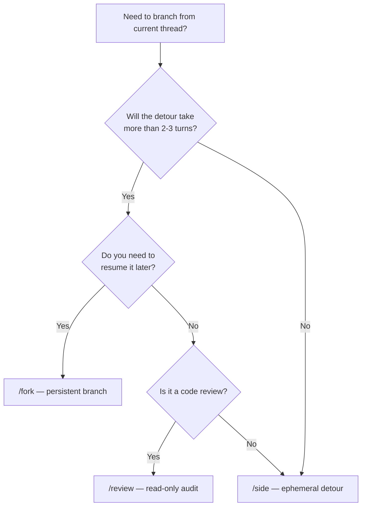
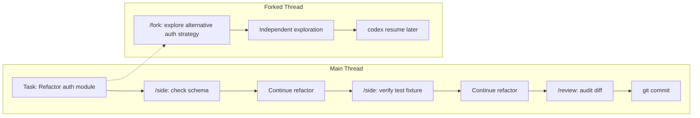

# Codex CLI Side Conversations: Ephemeral Forks, Session Branching, and the /side vs /fork Decision Tree


---

Every senior developer who has used Codex CLI for more than a week hits the same inflection point: a main thread is running — perhaps a refactoring pass that will take several more turns — and you need to ask the agent a quick question about an unrelated file. Do you interrupt the thread? Start a fresh terminal? Fork?

Since v0.132, the answer is `/side`. This article dissects the ephemeral side-conversation primitive, compares it to `/fork` and `/review`, maps out practical workflow patterns, and explains how the three branching commands compose into a session-management strategy that keeps context clean without sacrificing flow.

---

## What `/side` Actually Does

`/side` opens a **lightweight, ephemeral conversation** that inherits the parent thread's project context — AGENTS.md, file tree, model selection — but maintains a **separate transcript**.[^1] When the side conversation ends, control returns to the parent thread exactly where it left off. No context leaks in; no context leaks out.

The syntax is minimal:

```bash
# Open an empty side conversation
/side

# Open with an initial prompt
/side Check whether the payment gateway client handles retries correctly
```

The alias `/btw` does the same thing for those who prefer brevity.[^1]

While inside a side conversation, the TUI continues to render parent-thread status in the status line, so you can monitor whether a long-running command in the main thread has completed.[^1]

### Constraints

- **No nesting.** You cannot open a `/side` from within a `/side`.[^1]
- **No review mode.** `/side` is unavailable while `/review` is active.[^1]
- **Ephemeral by design.** The side transcript is not saved to the session's rollout JSONL file. Once you exit the side conversation, its content is gone.[^2]

---

## `/side` vs `/fork` vs `/review`: A Decision Tree

Codex CLI offers three session-branching primitives, and choosing the wrong one wastes tokens and muddies context. Here is how they differ:

| Dimension | `/side` | `/fork` | `/review` |
|-----------|---------|---------|-----------|
| **Persistence** | Ephemeral — transcript discarded on exit | Persistent — creates a new session ID | Ephemeral — findings printed, no new session |
| **Context inheritance** | Full project context, no parent transcript | Full parent transcript up to fork point | Diff-scoped — reads only the selected changeset |
| **Mutates working tree?** | Yes (if you instruct the agent) | Yes (independent thread) | No — read-only by design |
| **Resumable?** | No | Yes, via `codex resume` | No |
| **Use case** | Quick tangential question | Divergent exploration path | Pre-commit or pre-PR audit |



The rule of thumb: **if you would not bother creating a Git branch for it, use `/side`; if you would, use `/fork`.**[^3]

---

## Practical Workflow Patterns

### Pattern 1: Sanity-Check Before Accepting a Risky Change

You have asked Codex to refactor a database migration. Before approving the generated `ALTER TABLE` statements, drop into a side conversation to verify assumptions:

```bash
# Main thread is waiting for approval on a migration
/side Does the orders table have a foreign key constraint on customer_id in production? Check the schema file.
```

The side conversation reads the schema, confirms the constraint exists, and you return to the main thread with confidence to approve — or reject — the migration.

### Pattern 2: Exploring Error Context Without Polluting the Thread

A test suite has failed mid-refactor. You need to understand why, but the diagnostic noise would bloat the main thread's context window:

```bash
/side The integration test test_checkout_flow is failing with a 422. Read the test file and the route handler, then explain the likely cause.
```

Once you have the explanation, return to the main thread and give the agent a precise instruction rather than dumping 200 lines of stack trace into the primary conversation.

### Pattern 3: Quick Documentation Lookup

Need to check an API contract without derailing a coding session:

```bash
/btw What HTTP status code does Stripe return for an idempotency key collision?
```

Two seconds, one answer, back to work.

### Pattern 4: Composing `/side` with `/review`

A powerful pattern is to run `/side` to draft a quick change, then once back in the main thread, use `/review` to audit the full working-tree diff before committing:

```bash
# 1. Main thread: large refactor in progress
# 2. Quick tangent
/side Add a FIXME comment to the rate limiter — we need to revisit the bucket size

# 3. Back in main thread — continue refactoring
# 4. When ready to commit:
/review
```

This keeps the main thread focused on the refactor while still allowing small drive-by fixes.

---

## How Side Conversations Interact with Subagents

If your main thread has spawned subagents (via `spawn_agent` or the multi-agent v2 runtime), those subagents continue executing while you are inside a `/side` conversation.[^4] The side conversation itself does **not** inherit running subagent handles — it is a clean, isolated context. This is intentional: side conversations are for the human operator to ask quick questions, not to orchestrate parallel agent work.

If you need to inspect subagent output mid-flight, use `/ps` to check background terminal status instead of `/side`.[^1]

---

## Thread Hygiene: When to Start Fresh

Side conversations are a pressure valve, not a replacement for proper thread management. The Codex team's guidance is clear: **one coherent unit of work per thread**.[^3] `/side` handles the inevitable tangential questions; `/fork` handles genuine divergence. If you find yourself using `/side` more than three or four times in a session, that is a signal the main thread's scope has grown too broad and you should start a new conversation with `/new` or `codex` in a fresh terminal.



---

## Configuration and Compatibility

`/side` requires no configuration. It works with all models currently supported by Codex CLI, including gpt-5-codex, gpt-5-codex-mini, and local model providers.[^5] The side conversation inherits the parent thread's model selection by default; you can switch models inside the side conversation with `/model` without affecting the parent.

The feature is available in:

- **Codex CLI** (v0.132+): via `/side` or `/btw` slash commands[^1]
- **Codex App** (desktop/iOS): via the "Open Side Chat" button in the top right of any active session[^6]
- **Codex App** (iOS 1.2026.146+): via `/side <prompt>` in the message composer[^7]

The Codex App variant offers a split-pane UI where the side conversation runs in a panel alongside the main thread, which is arguably more ergonomic than the CLI's sequential approach.

---

## Limitations and Caveats

- **No transcript persistence.** If you need to reference side-conversation output later, copy it before exiting. The ephemeral design is deliberate — OpenAI's Eric Traut confirmed that adding persistence or multi-side-chat management "would obscure the original intent" of the feature.[^2]
- **No `/side` inside `/side`.** If you need nested tangents, you have outgrown side conversations; use `/fork` or open a second terminal.
- **Token cost.** Each `/side` conversation starts a new inference context with the project's system prompt and AGENTS.md. For projects with large AGENTS.md files, this overhead is non-trivial. Keep side conversations short and focused.
- **No subagent spawning.** Side conversations do not support `spawn_agent`. If you need parallel work, return to the main thread first.

---

## Summary

| Command | Mental Model | Lifetime | Cost |
|---------|-------------|----------|------|
| `/side` | Sticky note on your desk | Seconds to minutes | Low (ephemeral context) |
| `/fork` | New Git branch | Minutes to hours | Medium (persistent session) |
| `/review` | Code review checklist | Minutes | Low (read-only, no mutations) |

The `/side` command fills the gap between "I need to ask a quick question" and "I need to start a whole new session". Used judiciously, it keeps main threads clean, reduces context-window bloat, and lets you verify assumptions before committing to expensive agent actions. Combined with `/fork` for genuine divergence and `/review` for pre-commit audits, the three branching primitives give you a complete session-management toolkit without ever leaving the TUI.

---

## Citations

[^1]: OpenAI, "Slash commands in Codex CLI", OpenAI Developers Documentation, 2026. [https://developers.openai.com/codex/cli/slash-commands](https://developers.openai.com/codex/cli/slash-commands)

[^2]: Eric Traut (OpenAI), response on GitHub Issue #22307, "Feature: Manage multiple concurrent /side chats with tabs / switcher in Codex CLI", May 2026. [https://github.com/openai/codex/issues/22307](https://github.com/openai/codex/issues/22307)

[^3]: OpenAI, "Best practices — Codex", OpenAI Developers Documentation, 2026. [https://developers.openai.com/codex/learn/best-practices](https://developers.openai.com/codex/learn/best-practices)

[^4]: OpenAI, "Features — Codex CLI", OpenAI Developers Documentation, 2026. [https://developers.openai.com/codex/cli/features](https://developers.openai.com/codex/cli/features)

[^5]: OpenAI, "CLI — Codex", OpenAI Developers Documentation, 2026. [https://developers.openai.com/codex/cli](https://developers.openai.com/codex/cli)

[^6]: MindStudio, "OpenAI Codex Super-App: 9 Features Most Users Haven't Found Yet", 2026. [https://www.mindstudio.ai/blog/openai-codex-super-app-9-hidden-features](https://www.mindstudio.ai/blog/openai-codex-super-app-9-hidden-features)

[^7]: OpenAI, "Changelog — Codex", Codex Changelog entry for ChatGPT for iOS 1.2026.146, June 2026. [https://developers.openai.com/codex/changelog](https://developers.openai.com/codex/changelog)
