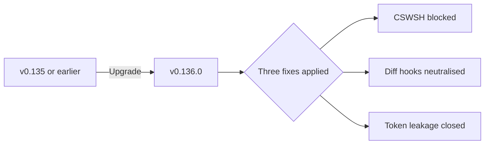
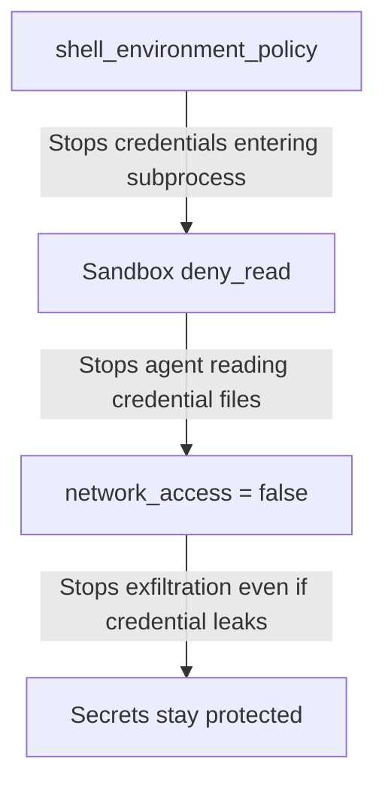

# Codex CLI v0.136 Production Hardening Checklist: Security, Performance, and Reliability for Enterprise Teams


v0.136.0 shipped on 1 June 2026 with three targeted security fixes, session archiving, app-server `--stdio` mode, and upgraded MCP dependencies.[^1] If your team runs Codex CLI in CI pipelines, shared developer environments, or production-adjacent workflows, this article consolidates every hardening step into a single, actionable checklist — cross-referenced to the specific v0.136 changes that make each item possible or necessary.

> This is a consolidation article. Individual topics are covered in depth elsewhere in this knowledge base; what follows is the executive-level checklist with the _minimum viable configuration_ for each item.

---

## 1 — Patch to v0.136.0

Before anything else, confirm you are running the current stable release:

```bash
codex --version   # expect 0.136.0
npm update -g @openai/codex
```

v0.136.0 closes three attack surfaces that affect every prior version.[^2] Staying on v0.135 or earlier leaves you exposed to:

- **CSWSH via exec-server** — a browser-origin WebSocket hijack analogous to CVE-2026-44211 in Cline (CVSS 9.6).[^3]
- **Git diff helper/hook injection** — a repository-provided `.gitconfig` could execute arbitrary code through `diff.external` or `core.hooksPath`.[^4]
- **Remote-control token leakage** — ChatGPT access tokens were previously forwarded over the remote-control WebSocket; v0.136 replaces them with short-lived server tokens and adds `CODEX_API_KEY` registration for approved hosts.[^5]



---

## 2 — Lock Down the Sandbox

The two-layer security model — sandbox enforcement plus approval policy — must both be configured deliberately.[^6] The defaults are safe for interactive use, but production and CI workloads need tighter bounds.

### 2.1 — Permission Profiles

Use named permission profiles rather than ad-hoc flags. Three built-in profiles ship with every installation:

| Profile | Filesystem | Network | Use Case |
|---------|-----------|---------|----------|
| `:read-only` | Read anywhere, write nowhere | Blocked | Code review, analysis |
| `:workspace` | Read anywhere, write to project root | Blocked by default | Feature development |
| `:danger-full-access` | Unrestricted | Unrestricted | Only inside isolated CI runners |

For CI pipelines, define a custom profile:

```toml
# ~/.codex/ci-runner.config.toml
default_permissions = "ci-runner"

[permissions.ci-runner]
deny_read = [".env", ".env.*", "*.pem", "*.key", "~/.ssh/*", "~/.aws/credentials"]
writable_roots = ["."]
network_access = false
```

Activate it with `--profile ci-runner`.[^7]

### 2.2 — Windows Elevated Sandbox (New in v0.136)

Windows admins can now provision the native sandbox with elevated privileges:

```bash
codex sandbox setup --elevated
```

This creates restricted tokens and ACL rules without requiring WSL2.[^8] Use this for Windows CI runners and developer workstations where WSL2 is unavailable.

---

## 3 — Protect Secrets from the Agent

Codex subprocesses inherit your shell environment by default. In a production context, that means API keys, cloud credentials, and database connection strings are one `env` command away from the model's context window.

### 3.1 — Shell Environment Policy

Strip the environment to essentials:

```toml
[shell_environment_policy]
inherit = "none"
set = { PATH = "/usr/local/bin:/usr/bin:/bin" }
exclude = ["AWS_*", "AZURE_*", "GH_TOKEN", "GITHUB_TOKEN"]
```

The `inherit = "none"` setting starts from a clean slate; `inherit = "core"` preserves `PATH`, `HOME`, `USER`, `SHELL`, and locale variables while stripping everything else.[^9]

### 3.2 — Filesystem Deny Rules

Block read access to credential files at the sandbox level:

```toml
[permissions.production]
deny_read = [".env", ".env.*", "*.pem", "*.key", "~/.ssh/*", "~/.aws/*", "~/.config/gcloud/*"]
```

### 3.3 — Defence in Depth

The three layers work together:[^10]



---

## 4 — Configure Authentication for Non-Interactive Use

Interactive sessions use OAuth device-code flow. CI pipelines and automation scripts must use `CODEX_API_KEY`:

```bash
# Set your Codex API key (see OpenAI dashboard)
export CODEX_API_KEY
codex exec "Run all tests and report failures" --sandbox read-only
```

`CODEX_API_KEY` is supported exclusively in `codex exec` — it will not work in the interactive TUI.[^11] For remote-control scenarios, v0.136 now supports `CODEX_API_KEY` registration for approved OpenAI hosts, replacing the previous ChatGPT access token forwarding.[^5]

---

## 5 — Tune Performance for Production Workloads

### 5.1 — Model Selection

For production automation, pin the model explicitly:

```toml
model = "gpt-5.5"
model_reasoning_effort = "medium"
```

Use `o4-mini` for high-volume, low-complexity tasks (linting, formatting, changelog generation). Reserve `gpt-5.5` for complex multi-file reasoning.[^12] Pin the model in your profile to prevent drift:

```bash
codex exec --model gpt-5.5 --profile ci-runner "..."
```

### 5.2 — Context Window and Compaction

Set the compaction threshold below the default to avoid late-session degradation:

```toml
model_context_window = 200000
model_auto_compact_token_limit = 160000  # 80% — fires before the 90% ceiling
```

Manual compaction at roughly 60% context usage gives better results than waiting for the automatic trigger.[^13]

### 5.3 — Tool Output Limits

Cap tool output to prevent large log files or test outputs from consuming the context window:

```toml
tool_output_token_limit = 12000
```

This forces Codex to work with summaries rather than entire files — particularly valuable when the model reads CI logs or generated outputs.[^14]

### 5.4 — Service Tier

For latency-sensitive automation, set the processing tier:

```toml
service_tier = "fast"   # Lower latency, higher cost
# service_tier = "flex"  # Lower cost, higher latency
```

---

## 6 — Enable Observability

### 6.1 — OpenTelemetry Export

Wire traces into your existing observability stack:

```toml
[otel]
environment = "production"
exporter = "otlp-http"
log_user_prompt = false  # Do not log prompt content
```

The `log_user_prompt = false` setting is critical for production — it prevents sensitive code snippets from appearing in trace data.[^15]

### 6.2 — Diagnostic Baseline

Run `codex doctor` after any configuration change to confirm the environment is healthy:

```bash
codex doctor --format support
```

v0.136 inherits the enhanced diagnostics from v0.135, covering environment, Git, terminal, app-server, and thread inventory checks.[^16]

---

## 7 — MCP Server Hardening

v0.136 ships with `rmcp` 1.7.0, which enables concurrent dispatch for tools marked with `readOnlyHint`.[^17] This improves throughput but widens the attack surface if MCP servers are misconfigured.

### 7.1 — Per-Server Environment Targeting

New in v0.136: you can target environment variables to specific MCP servers and control whether they run in the local or remote executor:[^18]

```toml
[mcp_servers.database]
command = "npx"
args = ["-y", "@mcp/postgres-server"]
env_vars = { DATABASE_URL = "postgresql://..." }
source = "local"  # Never send to remote executor

[mcp_servers.search]
command = "npx"
args = ["-y", "@mcp/web-search"]
source = "remote"  # Safe for remote execution
```

### 7.2 — Tool Allowlists

Restrict which tools each MCP server can expose:

```toml
[mcp_servers.database]
allowed_tools = ["query", "list_tables"]
# Blocks any tools not explicitly listed
```

### 7.3 — OAuth for Containerised Environments

If running in Docker or a devbox, configure the OAuth callback for MCP servers that require authentication:

```toml
mcp_oauth_callback_port = 8080
mcp_oauth_callback_url = "http://localhost:8080/callback"
```

---

## 8 — Session Management and Audit Trails

### 8.1 — Session Archiving (New in v0.136)

Archive completed sessions to protect them from accidental resume or fork:

```bash
codex archive <session-id>
codex unarchive <session-id>  # Restore when needed
```

From the TUI, use `/archive`.[^1] Archived sessions remain in the local SQLite state store but are excluded from `codex resume` and `codex fork` operations until explicitly restored.

### 8.2 — Transcript Retention

All Codex sessions produce transcripts stored locally. For audit compliance, ensure the state directory is included in your backup strategy:

```bash
ls ~/.codex/state.db        # Session metadata
ls ~/.codex/sessions/       # Full transcripts
```

---

## 9 — CI/CD Integration Checklist

For teams using `codex-action` in GitHub Actions:[^19]


```yaml
- uses: openai/codex-action@v1
  with:
    codex-args: >-
      --model gpt-5.5
      --sandbox read-only
      --profile ci-runner
    prompt: "Review the PR diff for P0/P1 issues"
  env:
    CODEX_API_KEY: ${{ secrets.CODEX_TOKEN }}
```


The action drops `sudo` by default on Linux and macOS runners, revoking superuser privileges before invoking Codex.[^20]

---

## 10 — The Consolidated Checklist

| # | Item | Config Key / Command | Priority |
|---|------|---------------------|----------|
| 1 | Upgrade to v0.136.0 | `npm update -g @openai/codex` | Critical |
| 2 | Set permission profile | `default_permissions` | Critical |
| 3 | Configure `shell_environment_policy` | `inherit = "none"` or `"core"` | Critical |
| 4 | Add `deny_read` for credential files | `permissions.<name>.deny_read` | High |
| 5 | Block network in sandbox | `network_access = false` | High |
| 6 | Use `CODEX_API_KEY` for CI | Environment variable | High |
| 7 | Pin model version | `model = "gpt-5.5"` | High |
| 8 | Set compaction threshold | `model_auto_compact_token_limit` | Medium |
| 9 | Cap tool output | `tool_output_token_limit = 12000` | Medium |
| 10 | Enable OTEL export | `[otel]` table | Medium |
| 11 | Restrict MCP tool allowlists | `allowed_tools` | Medium |
| 12 | Configure MCP source targeting | `source = "local"` | Medium |
| 13 | Archive completed sessions | `codex archive` | Low |
| 14 | Run `codex doctor` post-config | `codex doctor --format support` | Low |
| 15 | Windows: elevated sandbox setup | `codex sandbox setup --elevated` | Conditional |

---

## What Changed from v0.135 to v0.136

For teams already running a hardened v0.135 deployment, the incremental changes are:

1. **Exec-server origin checking** — no configuration required; the fix is unconditional.[^3]
2. **Diff hook neutralisation** — no configuration required; `diff.external=` and `core.hooksPath=/dev/null` are injected automatically.[^4]
3. **Remote-control token replacement** — short-lived server tokens replace ChatGPT access tokens automatically.[^5]
4. **Session archiving** — opt-in; use `/archive` or `codex archive`.[^1]
5. **`rmcp` 1.7.0 concurrent dispatch** — automatic for `readOnlyHint` tools; review MCP server security if you have custom servers.[^17]
6. **Per-server `env_vars` and `source` targeting** — opt-in; configure in `[mcp_servers.<id>]`.[^18]
7. **Windows elevated sandbox** — opt-in; `codex sandbox setup --elevated`.[^8]

Items 1-3 apply without configuration changes. Items 4-7 require deliberate adoption.

---

## Citations

[^1]: OpenAI, "Codex CLI v0.136.0 Release Notes," GitHub Releases, 1 June 2026. [https://github.com/openai/codex/releases/tag/rust-v0.136.0](https://github.com/openai/codex/releases/tag/rust-v0.136.0)

[^2]: OpenAI, "Changelog — Codex," OpenAI Developers, June 2026. [https://developers.openai.com/codex/changelog](https://developers.openai.com/codex/changelog)

[^3]: GitHub PR #24851, "Reject non-origin WebSocket upgrades in exec-server," openai/codex, merged 2026-05-31.

[^4]: GitHub PR #24954, "Override diff.external and core.hooksPath in /diff," openai/codex, merged 2026-05-31.

[^5]: GitHub PR #23546, "Replace ChatGPT access tokens with short-lived server tokens for remote-control WebSocket," openai/codex, merged 2026-05-30.

[^6]: OpenAI, "Permissions — Codex," OpenAI Developers. [https://developers.openai.com/codex/permissions](https://developers.openai.com/codex/permissions)

[^7]: OpenAI, "Config basics — Codex," OpenAI Developers. [https://developers.openai.com/codex/config-basic](https://developers.openai.com/codex/config-basic)

[^8]: OpenAI, "Windows — Codex app," OpenAI Developers. [https://developers.openai.com/codex/app/windows](https://developers.openai.com/codex/app/windows)

[^9]: OpenAI, "Advanced Configuration — Codex," OpenAI Developers. [https://developers.openai.com/codex/config-advanced](https://developers.openai.com/codex/config-advanced)

[^10]: Daniel Vaughan, "Codex CLI Secrets Defence: Preventing .env Leakage," Codex Knowledge Base, 10 May 2026. [https://codex.danielvaughan.com/2026/05/10/codex-cli-secrets-defence-env-leakage-agent-vault-runtime-injection/](https://codex.danielvaughan.com/2026/05/10/codex-cli-secrets-defence-env-leakage-agent-vault-runtime-injection/)

[^11]: OpenAI, "Non-interactive mode — Codex," OpenAI Developers. [https://developers.openai.com/codex/noninteractive](https://developers.openai.com/codex/noninteractive)

[^12]: OpenAI, "Best practices — Codex," OpenAI Developers. [https://developers.openai.com/codex/learn/best-practices](https://developers.openai.com/codex/learn/best-practices)

[^13]: Justin3go, "Context Compaction in Codex, Claude Code, and OpenCode," 9 April 2026. [https://justin3go.com/en/posts/2026/04/09-context-compaction-in-codex-claude-code-and-opencode](https://justin3go.com/en/posts/2026/04/09-context-compaction-in-codex-claude-code-and-opencode)

[^14]: Apidog, "How to Reduce Agent Token Costs From the CLI (2026 Guide)." [https://apidog.com/blog/how-to-reduce-agent-token-costs-cli/](https://apidog.com/blog/how-to-reduce-agent-token-costs-cli/)

[^15]: OpenAI, "Advanced Configuration — Codex," OpenAI Developers. [https://developers.openai.com/codex/config-advanced](https://developers.openai.com/codex/config-advanced)

[^16]: OpenAI, "Command line options — Codex CLI," OpenAI Developers. [https://developers.openai.com/codex/cli/reference](https://developers.openai.com/codex/cli/reference)

[^17]: Releasebot, "Codex Updates by OpenAI — June 2026." [https://releasebot.io/updates/openai/codex](https://releasebot.io/updates/openai/codex)

[^18]: Daniel Vaughan, "Codex CLI MCP in v0.136: Per-Server Environment Targeting," Codex Knowledge Base, 3 June 2026. [https://codex.danielvaughan.com/2026/06/03/codex-cli-mcp-v0136-per-server-env-targeting-oauth-streamable-http-concurrent-tools/](https://codex.danielvaughan.com/2026/06/03/codex-cli-mcp-v0136-per-server-env-targeting-oauth-streamable-http-concurrent-tools/)

[^19]: OpenAI, "GitHub Action — Codex," OpenAI Developers. [https://developers.openai.com/codex/github-action](https://developers.openai.com/codex/github-action)

[^20]: OpenAI, "codex-action," GitHub. [https://github.com/openai/codex-action](https://github.com/openai/codex-action)
