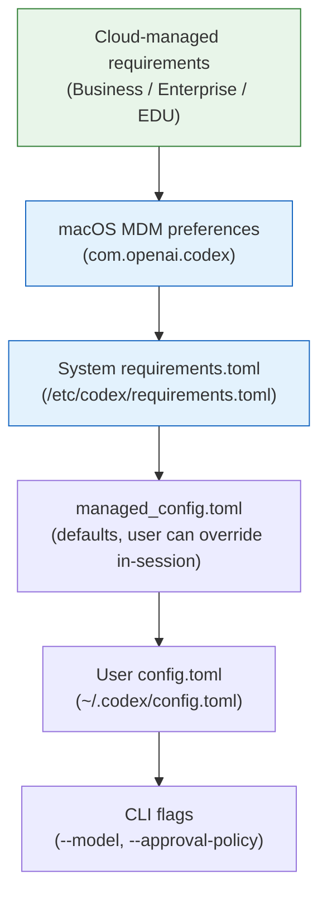
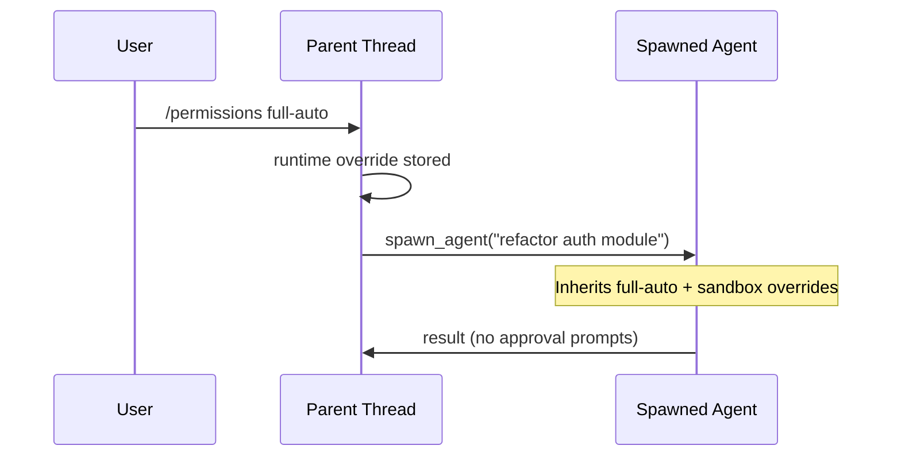

# Codex CLI v0.137.0 Stable: Cloud Config Bundles, Multi-Agent Runtime Persistence, and Plugin JSON Output


Three days after v0.136.0 shipped the session archiving and `--stdio` app-server transport, v0.137.0 landed as a stable release on 4 June 2026.[^1] The alpha previews (up to `0.137.0-alpha.4` on 3 June) introduced the skills extension crate and remote-control client management.[^2] The stable cut adds enterprise cloud-managed configuration bundles, multi-agent v2 runtime persistence, machine-readable plugin output, and a clutch of TUI and platform fixes. This article covers everything that shipped.

## What graduated from alpha

The features covered in the [alpha preview article](/2026/06/03/codex-cli-v0137-alpha-preview/) moved to stable with minimal API changes:

- **`remoteControl/client/list` and `remoteControl/client/revoke`** — JSON-RPC methods for account-scoped device grant management remain unchanged.[^2]
- **`codex-skills-extension` and `codex-context-fragments` crates** — shared prompts, context fragments, and skills plumbing now live in dedicated crates, reducing `codex-core` coupling.[^3]
- **Per-turn skill catalogue resolution** — turn-input contributors resolve environment-aware skills per turn.[^2]
- **Permission profile modernisation** — sandbox defaults expressed as observable named profiles.[^2]
- **Image generation in code-mode** — exposure changed from `DirectModelOnly` to `Direct`, enabling nested code-mode access to `gpt-image-2`.[^2]

If you tested the alpha, `npm install -g @openai/codex@latest` now points at 0.137.0 stable.

---

## 1 — Cloud-managed configuration bundles

The headline enterprise addition: admins on ChatGPT Business, Enterprise, or EDU plans can now push **cloud-managed config bundles** that the CLI fetches at sign-in.[^1][^4]

### How it works

Codex assembles effective configuration through a precedence stack. Cloud-managed settings sit at the top:



Two mechanisms exist at the cloud layer:

| Mechanism | Effect | User can override? |
|---|---|---|
| **Requirements** | Hard constraints (allowed sandbox modes, approval policies, network rules) | No |
| **Managed defaults** | Starting values applied at launch | Yes, during session |

### Example: locking down an EDU workspace

An administrator might push a cloud bundle equivalent to:

```toml
# requirements (enforced)
allowed_approval_policies = ["untrusted", "on-request"]
allowed_sandbox_modes = ["read-only", "workspace-write"]

[sandbox_workspace_write]
network_access = false

# managed defaults (soft)
approval_policy = "on-request"
sandbox_mode = "workspace-write"
```

Students can still switch between `on-request` and `untrusted` approval policies, but cannot escalate to `full-auto`. Network access stays off regardless of local `config.toml` settings.[^4]

### Monthly credit limits

Enterprise and EDU admin flows now surface **monthly credit limits** in the CLI, displaying remaining budget and workspace-specific usage-limit messages for credit and spend-cap failures.[^1][^5]

---

## 2 — Multi-Agent v2: runtime persistence across threads

Prior to v0.137.0, spawning a subagent created a fresh runtime context. If you changed approval policy to `full-auto` mid-session or toggled `/permissions`, child agents reverted to defaults.[^6]

v0.137.0 fixes this: **Multi-Agent v2 keeps the runtime choice with each thread** and propagates it to spawned agents.[^1]

Concretely:

- The parent turn's live runtime overrides — sandbox mode, approval policy, `/permissions` changes, `--yolo` flag — are reapplied when Codex spawns a child.[^6]
- Follow-up task handling is cleaner: metadata defaults for spawned agents inherit the parent context rather than falling back to profile defaults.
- Thread labels surface in approval overlays, so when many agents run concurrently you can tell which thread is requesting permission.



This matters most in CSV batch workflows (`spawn_agents_on_csv`) where dozens of agents run in parallel — previously each one prompted for approval independently.[^6]

---

## 3 — Machine-readable plugin output

`codex plugin list` now accepts a `--json` flag, emitting structured JSON instead of the human-readable table:[^1]

```bash
codex plugin list --json
```

```json
[
  {
    "name": "codex-security",
    "version": "1.2.0",
    "source": "remote",
    "marketplace": "openai/codex-plugins",
    "skills": ["security-scan", "deep-security-scan", "security-diff-scan", "fix-finding"],
    "mcp_servers": 0
  },
  {
    "name": "my-team-standards",
    "version": "0.3.1",
    "source": "local",
    "marketplace": null,
    "skills": ["lint-config", "review-checklist"],
    "mcp_servers": 1
  }
]
```

The release also adds **cached remote catalogue suggestions**: when you run `codex plugin search`, results from the remote catalogue are cached locally, reducing network round-trips for repeated queries.[^1][^7]

### Scripting example

Audit installed plugins in CI:

```bash
codex plugin list --json | jq -r '.[] | select(.source == "remote") | "\(.name)@\(.version)"'
```

Or verify a required plugin is present before a pipeline step:

```bash
if ! codex plugin list --json | jq -e '.[] | select(.name == "codex-security")' > /dev/null 2>&1; then
  echo "Required plugin codex-security not installed" >&2
  exit 1
fi
```

---

## 4 — Expanded code-mode tooling

Hosted web search and image generation tools are now available in **more code-mode flows**, with standalone web searches able to execute in parallel.[^1]

Previously, `web_search` inside a code-mode turn was serialised — each search blocked the next. v0.137.0 allows the model to dispatch multiple web searches concurrently when they are independent, reducing latency for research-heavy coding tasks.

Image generation via `gpt-image-2` (graduated from alpha) is now accessible inside code-mode sessions without requiring a separate turn, enabling workflows like:

1. Generate a placeholder image for a UI component
2. Write the React component referencing the generated asset
3. Run the dev server to verify

All within a single code-mode turn.

---

## 5 — TUI ergonomic improvements

### F13–F24 keybindings

Power users with extended keyboards or remapped layouts can now bind TUI actions to F13–F24 keys.[^1] Configure them in `config.toml`:

```toml
[keybindings]
F13 = "toggle_reasoning"
F14 = "toggle_context_stats"
```

### Paste in searchable menus

The session picker, plugin search, and slash-command menus now accept pasted text for filtering — previously, paste was silently dropped in these contexts.[^1]

### Compact reasoning-only status item

A new `model+reasoning` status-line item displays model name and current reasoning effort in a single compact widget, replacing the need for two separate items:[^1][^8]

```toml
[status_line]
items = ["model+reasoning", "context_stats", "git_branch"]
```

---

## 6 — Bug fixes worth noting

Several fixes in this release address real workflow pain points:

| Fix | Impact |
|---|---|
| Cancelled prompts restore drafts, attachments, and collaboration mode[^1] | No more lost work when you hit Escape after typing a long prompt |
| Slash-command filtering resets properly[^1] | `/` menu no longer shows stale results from a previous filter |
| Plugin manifest order preserved[^1] | Skills appear in the order the plugin author intended |
| Duplicate plugin installations deduplicated[^1] | `codex plugin install` no longer creates duplicates when run twice |
| Malformed skills fields treated as warnings[^1] | A single broken skill no longer prevents the entire plugin from loading |
| Permission requests carry environment identity[^1] | Approval prompts show which environment (local/remote) is requesting access |
| MITM proxy exports readable CA bundles[^1] | Corporate proxy users get PEM-formatted certificates instead of binary blobs |

### Platform-specific fixes

- **macOS**: App launch reliability improved.[^1]
- **Windows**: SQLite startup failures resolved; Bazel CI made Windows-compatible.[^1]
- **Thread resume**: Pathless side-chat reloads and compressed rollouts handle edge cases more safely.[^1]

---

## Upgrade path

```bash
npm install -g @openai/codex@latest
codex --version   # 0.137.0
```

If your organisation uses managed configuration, the cloud config bundle will apply automatically at next sign-in — no local file changes required.[^4]

For teams pinning versions in CI:

```bash
npm install -g @openai/codex@0.137.0
```

---

## What to watch next

The `codex-skills-extension` and `codex-context-fragments` crate extraction signals that plugin and skill loading are being decomposed for independent versioning.[^3] Combined with the `plugin list --json` output, this points towards a more scriptable, composable plugin ecosystem — potentially with lock-file-style dependency resolution in a future release.

The cloud-managed config bundle mechanism is currently Business/Enterprise/EDU only, but the underlying precedence architecture supports MDM profiles on macOS and system-level `requirements.toml` on Linux.[^4] Teams not on enterprise plans can achieve similar controls using the system-level files today.

---

## Citations

[^1]: OpenAI, "Release 0.137.0", GitHub, 4 June 2026. [https://github.com/openai/codex/releases/tag/rust-v0.137.0](https://github.com/openai/codex/releases/tag/rust-v0.137.0)

[^2]: OpenAI, "Release 0.137.0-alpha.4", GitHub, 3 June 2026. [https://github.com/openai/codex/releases/tag/rust-v0.137.0-alpha.4](https://github.com/openai/codex/releases/tag/rust-v0.137.0-alpha.4)

[^3]: OpenAI, "Codex CLI Rust Workspace Structure", Mintlify docs, 2026. [https://mintlify.com/openai/codex/architecture/rust-crates](https://mintlify.com/openai/codex/architecture/rust-crates)

[^4]: OpenAI, "Managed configuration – Codex", OpenAI Developers, 2026. [https://developers.openai.com/codex/enterprise/managed-configuration](https://developers.openai.com/codex/enterprise/managed-configuration)

[^5]: OpenAI, "Codex rate card", OpenAI Help Center, 2026. [https://help.openai.com/en/articles/20001106-codex-rate-card](https://help.openai.com/en/articles/20001106-codex-rate-card)

[^6]: OpenAI, "Subagents – Codex", OpenAI Developers, 2026. [https://developers.openai.com/codex/subagents](https://developers.openai.com/codex/subagents)

[^7]: Hashgraph Online, "awesome-codex-plugins", GitHub, 2026. [https://github.com/hashgraph-online/awesome-codex-plugins](https://github.com/hashgraph-online/awesome-codex-plugins)

[^8]: OpenAI, "Changelog – Codex", OpenAI Developers, June 2026. [https://developers.openai.com/codex/changelog](https://developers.openai.com/codex/changelog)
