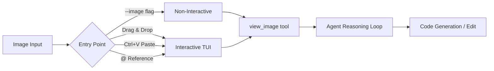
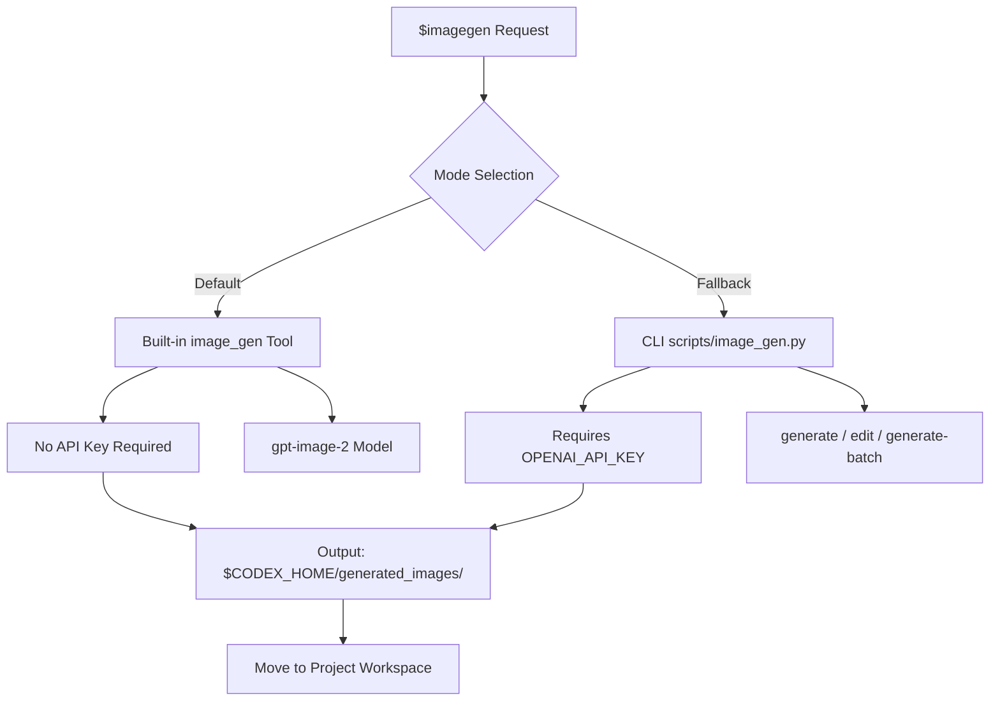
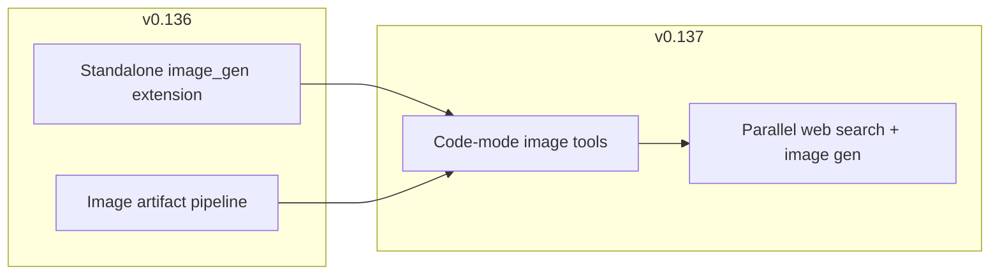

# Codex CLI Visual Workflows: Image Input, gpt-image-2 Generation, and Asset Pipelines for v0.137


---

Codex CLI is no longer text-only. Since March 2026, the CLI has shipped full-resolution image input, built-in generation powered by gpt-image-2, and a structured asset pipeline that moves generated images from scratch into your project tree. Version 0.137 expands these capabilities further, bringing hosted image tools into more code-mode flows and enabling parallel web searches alongside visual asset creation [^1]. This article covers the complete visual workflow surface as it stands today.

## Image Input: Four Entry Points

Codex CLI accepts image attachments through four distinct mechanisms, each suited to a different workflow [^2]:

### CLI Flag (Non-Interactive)

The `--image` flag attaches one or more images before the session starts. This is the most reliable entry point for scripted and `codex exec` workflows:

```bash
# Single image
codex -i screenshot.png "Why does this button overflow its container?"

# Multiple images
codex --image mockup.png,current.png "Compare these two designs and list differences"
```

### Drag-and-Drop (Interactive TUI)

Terminal emulators that support drag-and-drop events (iTerm2, WezTerm, Windows Terminal, Ghostty) let you drag image files directly into the Codex TUI. The image attaches to your next prompt [^2].

### Clipboard Paste (Interactive TUI)

Inside the interactive TUI, paste with `Ctrl+V` (Linux/Windows) or `Cmd+V` (macOS). This works well for macOS screenshot workflows: `Cmd+Shift+4` to capture, click the thumbnail, `Cmd+C` to copy, then `Ctrl+V` in Codex [^3].

### Inline Reference

Within an active session, reference image files using `@` path syntax:

```
@designs/hero-banner.png Implement this banner as a React component
```

## The view_image Tool

Codex has a built-in `view_image` tool that returns resolvable URLs in code mode, allowing the agent to inspect images at full resolution during a session [^2]. This is critical for edit workflows where the agent needs to understand the current state of an image before modifying it.



## gpt-image-2: The Generation Engine

On 21 April 2026, OpenAI launched gpt-image-2, replacing gpt-image-1.5 as the default generation model in Codex CLI [^4]. DALL·E 2 and DALL·E 3 were retired from the API entirely on 12 May 2026 [^5].

### Key Capabilities

- **Text rendering**: Greater than 99% accuracy on dense text, making it viable for labelled diagrams, annotated architecture visuals, and placeholder marketing banners with real copy [^4]
- **Reference images**: Accepts up to 16 reference images per generation call [^4]
- **Native resolutions**: 1K, 2K, and 4K output [^4]
- **Edit operations**: Inpainting, background replacement, object removal, lighting changes, and style transfer [^6]

### Size Constraints

When using the CLI fallback mode, gpt-image-2 enforces specific dimension rules [^6]:

| Constraint | Value |
|---|---|
| Maximum edge | 3,840 px |
| Both edges | Multiples of 16 px |
| Aspect ratio | Long-to-short ≤ 3:1 |
| Total pixels | 655,360–8,294,400 |

Popular presets include `1024x1024`, `1536x1024`, `2048x2048`, and `3840x2160`.

## The $imagegen Skill

Codex ships a built-in `$imagegen` skill at `codex-rs/skills/src/assets/samples/imagegen/SKILL.md` that structures the image generation workflow into a repeatable pipeline [^6]. Invoke it explicitly or let Codex activate it from natural language:

```bash
# Explicit skill invocation
codex '$imagegen Generate a set of 6 monochrome line icons at 64x64: \
  home, settings, profile, notifications, search, logout. \
  White stroke on transparent background. 2px stroke width.'
```

### Two Modes of Operation

The skill operates in two distinct modes [^6]:



**Built-in tool mode** (preferred): Uses the native `image_gen` tool. No API key required. Counts against your ChatGPT plan limits [^6].

**CLI fallback mode**: Uses `scripts/image_gen.py` with three subcommands — `generate`, `edit`, and `generate-batch`. Requires `OPENAI_API_KEY`. Use only when explicitly requested or when true transparency is needed via `gpt-image-1.5 --background transparent` [^6].

### Transparent Image Workflow

Generating images with transparent backgrounds requires a chroma-key pipeline rather than a model downgrade [^6]:

```bash
# Step 1: Generate on solid green chroma-key background
# (handled automatically by $imagegen)

# Step 2: Remove chroma-key with the bundled helper
python "${CODEX_HOME:-$HOME/.codex}/skills/.system/imagegen/scripts/remove_chroma_key.py" \
  --input source.png --out final.png \
  --auto-key border --soft-matte \
  --transparent-threshold 12 --opaque-threshold 220 --despill
```

This avoids downgrading to `gpt-image-1.5` for transparent backgrounds. The skill asks explicitly before falling back to the older model for complex subjects like hair, fur, smoke, or glass [^6].

## Practical Workflows

### Screenshot-to-Code

The canonical visual workflow: capture a screenshot of a design, feed it to Codex, and get working code back.

```bash
codex -i designs/dashboard-mockup.png \
  "Implement this dashboard layout as a Next.js page using Tailwind CSS. \
   Match the spacing, colours, and typography exactly."
```

Codex inspects the image at full resolution via `view_image`, reasons about the layout, and generates the component code. For best results, attach multiple screenshots showing different states (hover, loading, error) [^2].

### Icon and Sprite Generation

Generate consistent icon sets for projects:

```bash
codex exec '$imagegen Generate 8 flat-design icons at 128x128 for a \
  fintech app: wallet, transfer, analytics, settings, notifications, \
  support, security, profile. Use a consistent 3px stroke, \
  #1a1a2e fill on white background.'
```

The `codex exec` form is useful for batch asset generation in CI or build scripts. Each icon generates as a separate file under `$CODEX_HOME/generated_images/`, then gets moved into your project's `assets/` directory [^6].

### Design Iteration with Live Preview

Run Codex in one terminal and a dev server in another. Attach a screenshot of the current state, request changes, and watch them render live:

```bash
# Terminal 1: dev server
npm run dev

# Terminal 2: Codex session
codex -i screenshot-current-state.png \
  "The hero section needs more vertical padding and the CTA button \
   should be primary blue (#2563eb). Update the component."
```

### Documentation Asset Generation

Generate diagrams, architecture visuals, and placeholder images for documentation:

```bash
codex '$imagegen Create an architecture diagram showing: \
  Client → API Gateway → Auth Service → User DB. \
  Clean technical style, white background, \
  labelled arrows with protocol names (HTTPS, gRPC, SQL).'
```

## Usage Limits and Pricing

Image generation sits within the same credit system as text-based Codex usage, but consumes limits faster [^7]:

| Plan | Image Generation | Rate |
|---|---|---|
| Free | Not available | — |
| Plus (\$20/month) | Included | Standard limits |
| Pro (\$100+/month) | Included | 5×–20× limits |
| Business | Included | Standard limits |
| Enterprise/EDU | Included | Flexible |
| API Key | API pricing | Per-token [^7] |

When drawing from credits, gpt-image-2 rates are 200 credits per 1M input tokens (image) and 125 credits per 1M input tokens (text) [^7]. Image generation uses included limits **3–5× faster** than text-only turns, depending on quality and size [^1].

Monitor your remaining limits mid-session with the `/status` slash command [^7].

### API Key Override

For larger batch runs, set `OPENAI_API_KEY` to route image generation through the API at standard API pricing rather than consuming ChatGPT plan limits [^1]:

```bash
export OPENAI_API_KEY="sk-..."
codex exec '$imagegen Generate product mockups for all 12 colour variants'
```

Rate limits cap at 250 images per minute for established accounts, with new accounts starting at 5 images per minute [^4]. Batch generation workflows need pacing.

## v0.136 and v0.137 Improvements

### v0.136: Standalone Image Generation Extension

Version 0.136 introduced a feature-gated standalone image generation extension that runs through the native Codex image artifact pipeline [^8]. This separated image generation from the main agent loop, allowing images to generate as first-class artifacts with proper lifecycle management.

### v0.137: Expanded Code-Mode Image Tools

Version 0.137 made hosted web and image tools available in more code-mode flows [^1]. Previously, image generation was limited to interactive sessions; now it integrates into broader automated workflows alongside parallel web searches.



## Prompt Engineering for Image Generation

The `$imagegen` skill enforces a structured prompt schema [^6]:

```
Use case: [taxonomy slug, e.g. ui-mockup, product-mockup]
Asset type: [where used, e.g. hero banner, app icon]
Primary request: [user's main prompt]
Scene/backdrop: [background description]
Subject: [main subject]
Style/medium: [flat design, photorealistic, etc.]
Composition/framing: [layout guidance]
Text (verbatim): "[exact text to render]"
Constraints: [dimensions, format, colour palette]
Avoid: [negative constraints]
```

### What the Skill Adds (and Does Not)

The skill augments vague prompts with composition hints and polish-level guidance, but it **will not** add unrequested characters, brand names, slogans, or narrative elements [^6]. If your prompt is already specific, it normalises without creative additions.

### When NOT to Use Image Generation

The `$imagegen` skill explicitly redirects certain tasks away from raster generation [^6]:

- **SVG/vector icon sets**: Better produced as code
- **Simple geometric shapes**: Use HTML/CSS or SVG
- **Deterministic output**: When pixel-perfect reproducibility matters

## Configuration Reference

| Setting | Purpose | Default |
|---|---|---|
| `OPENAI_API_KEY` | Enable CLI fallback mode | Not set |
| `$CODEX_HOME` | Base path for generated images | `~/.codex` |
| Generated images path | Output directory | `$CODEX_HOME/generated_images/` |
| Chroma-key helper | Transparency post-processing | `$CODEX_HOME/skills/.system/imagegen/scripts/remove_chroma_key.py` |

## Conclusion

Codex CLI's visual capabilities have matured from basic image attachment in March 2026 to a full design-to-code-to-asset pipeline in v0.137. The combination of gpt-image-2's text rendering accuracy, the structured `$imagegen` skill workflow, and the transparent integration with `codex exec` makes it practical to generate, edit, and manage visual assets entirely from the terminal. The key decision point remains whether to use the built-in tool (no API key, ChatGPT plan limits) or the CLI fallback (API key required, per-token pricing, batch support) — and for most workflows, the built-in tool is the right default.

## Citations

[^1]: OpenAI, "Features – Codex CLI", OpenAI Developers, June 2026. [https://developers.openai.com/codex/cli/features](https://developers.openai.com/codex/cli/features)

[^2]: OpenAI, "Working with Images in Codex CLI", Codex CLI documentation, March 2026. [https://developers.openai.com/codex/cli/features](https://developers.openai.com/codex/cli/features)

[^3]: Josh Bickett, "How to copy-paste a screenshot into Codex CLI", X/Twitter, 2026. [https://x.com/josh_bickett/status/1978162814125580693](https://x.com/josh_bickett/status/1978162814125580693)

[^4]: OpenAI, "Introducing gpt-image-2 — available today in the API and Codex", OpenAI Developer Community, April 2026. [https://community.openai.com/t/introducing-gpt-image-2-available-today-in-the-api-and-codex/1379479](https://community.openai.com/t/introducing-gpt-image-2-available-today-in-the-api-and-codex/1379479)

[^5]: OpenAI, "All models", OpenAI API Documentation, June 2026. [https://developers.openai.com/api/docs/models/all](https://developers.openai.com/api/docs/models/all)

[^6]: OpenAI, "imagegen SKILL.md", openai/codex GitHub repository, 2026. [https://github.com/openai/codex/blob/main/codex-rs/skills/src/assets/samples/imagegen/SKILL.md](https://github.com/openai/codex/blob/main/codex-rs/skills/src/assets/samples/imagegen/SKILL.md)

[^7]: OpenAI, "Pricing – Codex", OpenAI Developers, June 2026. [https://developers.openai.com/codex/pricing](https://developers.openai.com/codex/pricing)

[^8]: OpenAI, "Codex CLI v0.136.0 Release Notes", GitHub Releases, June 2026. [https://github.com/openai/codex/releases](https://github.com/openai/codex/releases)
