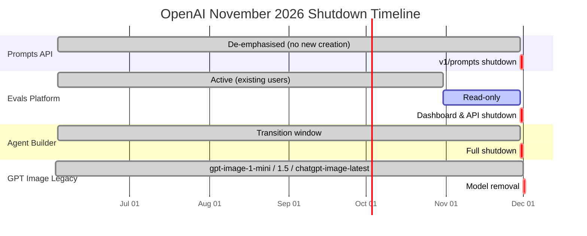
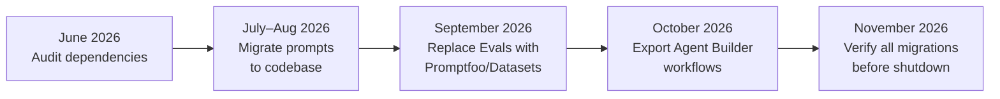

# OpenAI's June 2026 Platform Deprecations: Evals, Agent Builder, and Prompts API Shutdown — What Codex CLI Developers Must Do Before November


---

On 3 June 2026, OpenAI announced the deprecation of three platform services in a single day: the Evals dashboard, Agent Builder, and the reusable Prompts API (`v1/prompts`) [^1]. All three are scheduled for shutdown on 30 November 2026, with the Evals platform entering read-only mode a month earlier on 31 October [^2]. A fourth deprecation — three legacy GPT Image models — follows on 1 December [^3]. For Codex CLI developers who have woven any of these services into their workflows, the clock is ticking.

This article breaks down each deprecation, explains the official migration paths, maps each one to Codex CLI equivalents where they exist, and provides a concrete timeline for action.

## What Is Being Deprecated



### 1. Reusable Prompts API (`v1/prompts`)

The Prompts API allowed developers to store parameterised prompt templates on OpenAI's servers and reference them by ID in API calls [^4]. Rather than embedding prompt text in application code, you passed a `prompt_id` and `variables` object:

```javascript
// DEPRECATED — will stop working 30 November 2026
const response = await client.responses.create({
  prompt: {
    prompt_id: "pmpt_abc123",
    version: "3",
    variables: { language: "TypeScript", task: "refactor" },
  },
});
```

OpenAI's stated rationale: prompt content belongs in your codebase where it benefits from version control, code review, and CI/CD pipelines [^4].

### 2. Evals Platform

The managed Evals dashboard and its backing API (`v1/evals`) let teams define evaluation configurations, upload test datasets with ground-truth labels, run model outputs through graders (string-match, model-graded, custom), and track results over time [^5]. OpenAI now recommends two alternatives: the newer **Datasets** feature for teams staying within the OpenAI ecosystem, and **Promptfoo** for those wanting an open-source, vendor-neutral framework [^2] [^6].

Promptfoo's position is notable: OpenAI acquired the company in March 2026 at an \$86M valuation, though Ian Webster has committed to keeping it MIT-licensed and vendor-neutral [^7].

### 3. Agent Builder

Agent Builder was a visual, node-based canvas for composing multi-step agent workflows — drag-and-drop tool chaining without writing code [^8]. It shipped code exports in Python and TypeScript, which could be deployed via the Agents SDK or imported into ChatGPT Workspace Agents. With the deprecation, OpenAI is consolidating around two approaches [^9]:

- **Agents SDK** — code-first multi-agent orchestration (Python and TypeScript)
- **ChatGPT Workspace Agents** — natural-language agent creation for non-developers

ChatKit, the embeddable UI component, remains available and unaffected [^8].

### 4. Legacy GPT Image Models

Three image models reach end-of-life on 1 December 2026 [^3]:

| Deprecated Model | Replacement |
|---|---|
| `gpt-image-1-mini` | `gpt-image-2` |
| `gpt-image-1.5` | `gpt-image-2` |
| `chatgpt-image-latest` | `gpt-image-2` |

Codex CLI's built-in `$imagegen` skill and the `image_gen` tool already default to `gpt-image-2` on v0.137 [^10], so most CLI users are unaffected unless they have explicitly pinned an older model in their configuration.

## Impact on Codex CLI Workflows

Not every deprecation affects every Codex CLI user equally. Here is a practical assessment:

### Prompts API — Low Direct Impact, High Indirect Risk

Codex CLI itself does not call `v1/prompts`. However, if your CI pipelines or custom harnesses that *invoke* Codex CLI also manage prompts through the API — for instance, dynamically selecting system prompts before launching `codex exec` — those integrations will break.

**Migration:** Move prompt templates into your repository. Codex CLI's own instruction hierarchy already encourages this pattern: system instructions live in `AGENTS.md`, reusable prompts live in skills (`.codex/skills/`), and per-invocation prompts are passed via `--prompt` or `-p` flags [^11].

```toml
# config.toml — use a profile to bundle prompt-related settings
[profiles.ci-review]
model = "gpt-5.4"
approval_mode = "auto-edit"
system_prompt_suffix = "Follow the coding standards in AGENTS.md. Output structured JSON."
```

### Evals Platform — Moderate Impact

Teams that evaluated Codex CLI output quality through the Evals dashboard lose their managed evaluation infrastructure. This matters for:

- **Prompt regression testing** — catching quality drops after changing `AGENTS.md` or skill files
- **Model migration validation** — confirming that switching from `gpt-5.4` to `gpt-5.5` does not degrade output
- **Hook output verification** — ensuring hook-gated quality checks remain calibrated

**Migration to Promptfoo:**

Promptfoo runs locally or in CI, reads YAML test definitions, and supports custom assertions [^6]. A minimal migration for Codex CLI evaluation:


```yaml
# promptfoo-config.yaml
prompts:
  - "Review this diff and report bugs: {{diff}}"

providers:
  - id: openai:gpt-5.4
    config:
      temperature: 0

tests:
  - vars:
      diff: file://test-fixtures/null-check-missing.patch
    assert:
      - type: contains
        value: "null"
      - type: llm-rubric
        value: "The response identifies the missing null check on line 12"
```


```bash
# Run in CI alongside codex exec
npx promptfoo eval --config promptfoo-config.yaml --output results.json
```

Alternatively, OpenAI's newer **Datasets** feature supports trace grading and automated prompt optimisation for teams that prefer to stay within the OpenAI ecosystem [^5].

### Agent Builder — Low Impact for CLI Users, High Impact for Platform Teams

Codex CLI developers rarely use Agent Builder directly — it targeted low-code workflow composition rather than terminal-native agent sessions. However, platform teams that built internal tools on Agent Builder and then connected those tools to Codex CLI via MCP servers or the Agents SDK need to migrate.

**Migration:** Export your Agent Builder workflows as Agents SDK code (Python or TypeScript), then run them as standalone services or Codex CLI MCP servers [^9]:

```python
# Exported from Agent Builder, adapted for Codex CLI MCP integration
from agents import Agent, Runner

review_agent = Agent(
    name="code-reviewer",
    model="gpt-5.4",
    instructions="You review pull requests for security issues.",
    tools=[],  # Add MCP tools as needed
)

# Run as a service that Codex CLI can call via MCP
result = Runner.run_sync(review_agent, "Review PR #1234")
print(result.final_output)
```

## Migration Checklist

The following table maps each deprecation to concrete actions for Codex CLI teams:

| Deprecation | Deadline | Action Required | Codex CLI Equivalent |
|---|---|---|---|
| `v1/prompts` | 30 Nov 2026 | Move templates to code/config | `AGENTS.md`, skills, `--prompt` flag |
| Evals platform | 31 Oct 2026 (read-only) | Export datasets; adopt Promptfoo or Datasets | Promptfoo in CI; `codex exec` + assertions |
| Agent Builder | 30 Nov 2026 | Export as Agents SDK code | Agents SDK + MCP server integration |
| `gpt-image-1-mini` / `1.5` / `chatgpt-image-latest` | 1 Dec 2026 | Update to `gpt-image-2` | Already default in v0.137 |

## Recommended Timeline



**June (now):** Run `grep -r "v1/prompts\|prompt_id\|evals.openai" .` across your repositories to identify affected code. Check whether any MCP servers or CI scripts reference deprecated endpoints.

**July–August:** Migrate prompt templates into version-controlled files. For Codex CLI specifically, convert any externally managed prompts into skills or `AGENTS.md` sections.

**September:** Stand up Promptfoo (or Datasets) for evaluation workflows. Port existing eval configurations and datasets. Validate that grading criteria produce equivalent results.

**October:** Export all Agent Builder workflows before the Evals platform enters read-only mode on 31 October. Convert to Agents SDK code and test integrations with Codex CLI's MCP server support.

**November:** Final verification pass. Remove all references to deprecated endpoints. Confirm CI pipelines run cleanly.

## The Broader Signal

These deprecations share a common thread: OpenAI is consolidating around **code-first, developer-owned** patterns rather than managed platform services. Prompts belong in git. Evaluations run in your CI pipeline. Agent orchestration happens through SDKs, not visual builders.

For Codex CLI users, this is largely good news — the CLI has always been the code-first surface. The instruction stack (`AGENTS.md` > skills > hooks > profiles) already embodies the "prompts as code" philosophy that OpenAI is now enforcing across the platform [^11]. The Agents SDK integration that shipped with `codex` as an MCP server means Agent Builder's drag-and-drop workflows can be replaced with composable, testable Python or TypeScript code [^12].

The one area that demands attention is evaluation infrastructure. If your team relied on the Evals dashboard for quality gates, you have until 31 October to stand up an alternative — and Promptfoo, now OpenAI-owned but MIT-licensed, is the path of least resistance [^6] [^7].

## Citations

[^1]: OpenAI, "Changelog — June 3, 2026 deprecation announcements," [developers.openai.com/api/docs/changelog](https://developers.openai.com/api/docs/changelog)

[^2]: OpenAI, "Deprecations — Evals platform shutdown timeline," [developers.openai.com/api/docs/deprecations](https://developers.openai.com/api/docs/deprecations)

[^3]: OpenAI, "Deprecations — GPT Image model removal December 2026," [developers.openai.com/api/docs/deprecations](https://developers.openai.com/api/docs/deprecations)

[^4]: OpenAI, "Migrate from prompt objects," [developers.openai.com/api/docs/guides/prompting/migrate-from-prompt-object](https://developers.openai.com/api/docs/guides/prompting/migrate-from-prompt-object)

[^5]: OpenAI, "Working with evals," [developers.openai.com/api/docs/guides/evals](https://developers.openai.com/api/docs/guides/evals)

[^6]: OpenAI, "Moving from OpenAI Evals to Promptfoo," referenced in deprecations page, [developers.openai.com/api/docs/deprecations](https://developers.openai.com/api/docs/deprecations)

[^7]: Braintrust, "Best Promptfoo alternatives in 2026," [braintrust.dev/articles/best-promptfoo-alternatives-2026](https://www.braintrust.dev/articles/best-promptfoo-alternatives-2026)

[^8]: OpenAI, "Agent Builder documentation," [developers.openai.com/api/docs/guides/agent-builder](https://developers.openai.com/api/docs/guides/agent-builder)

[^9]: OpenAI, "Migrate from Agent Builder," [developers.openai.com/api/docs/guides/agent-builder/migrate-from-agent-builder](https://developers.openai.com/api/docs/guides/agent-builder/migrate-from-agent-builder)

[^10]: OpenAI, "Codex CLI v0.137.0 release notes," [github.com/openai/codex/releases](https://github.com/openai/codex/releases)

[^11]: OpenAI, "Custom Prompts — Codex CLI," [developers.openai.com/codex/custom-prompts](https://developers.openai.com/codex/custom-prompts)

[^12]: OpenAI, "Codex CLI as MCP server," [developers.openai.com/codex/cli/features](https://developers.openai.com/codex/cli/features)
