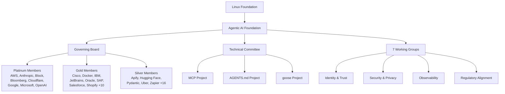
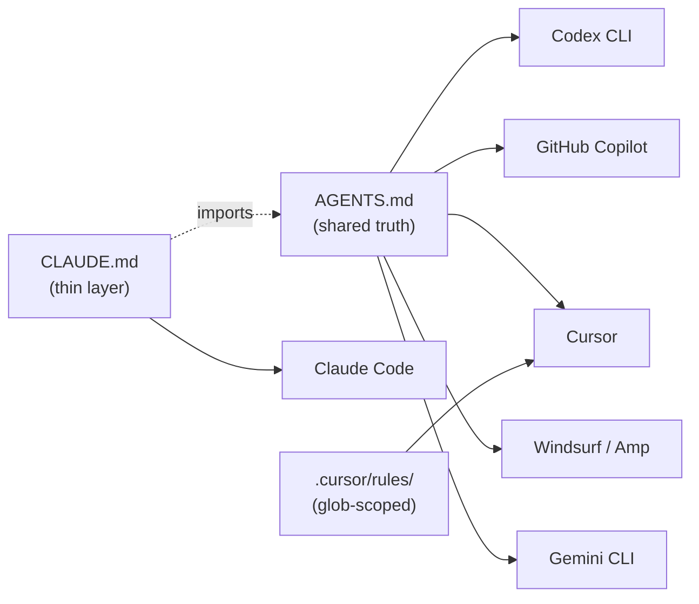

# The Agentic AI Foundation: What AGENTS.md, MCP, and Linux Foundation Governance Mean for Codex CLI Developers


---

In December 2025, Anthropic, Block, and OpenAI jointly donated three foundational projects — the Model Context Protocol (MCP), goose, and AGENTS.md — to a new Linux Foundation entity called the Agentic AI Foundation (AAIF) [^1]. Six months in, AAIF has grown to 190 member organisations [^2], shipped MCP Apps as a cross-platform UI standard [^3], and begun drafting AGENTS.md v1.1 [^4]. For Codex CLI users who already depend on AGENTS.md for project context and MCP for tool integrations, these moves are not theoretical governance shuffles — they directly shape what you can configure, which agents read your instructions, and how your MCP servers interoperate.

This article unpacks the foundation's structure, its first concrete deliverables, and the practical steps Codex CLI developers should take today.

## Why a Foundation?

Before AAIF, AGENTS.md was an OpenAI-controlled specification and MCP was an Anthropic-controlled protocol. Both were open-source, but "open-source" and "open-governance" are different things. A single vendor controlling a specification can deprecate fields, change discovery semantics, or add vendor-specific extensions without community consent.

The Linux Foundation model — the same governance that stewards Linux, Kubernetes, and Node.js — provides:

- **Vendor-neutral stewardship**: No single company can unilaterally change the spec [^1].
- **Transparent decision-making**: A Governing Board (chaired by David Nalley) and a Technical Committee with representatives from eight Platinum members meet biweekly [^3].
- **Working groups**: Seven groups covering identity and trust, security and privacy, observability, and regulatory alignment [^3].



## The Three Pillar Projects

### AGENTS.md — Universal Agent Instructions

AGENTS.md started as OpenAI's answer to a simple problem: how does a coding agent know your project's conventions? Adopted by over 60,000 open-source repositories, it is now read natively by Codex CLI, GitHub Copilot, Cursor, Windsurf, Amp, Devin, Gemini CLI, and others [^5].

Under AAIF governance, the specification gains stability guarantees. The proposed v1.1 adds optional YAML frontmatter for `description` and `tags` fields [^4], though as of June 2026 this remains an open proposal rather than a merged change. Several agents — including Copilot's custom-agent profiles and parts of Codex CLI — already parse optional frontmatter for forward compatibility [^4].

### MCP — Model Context Protocol

MCP provides the universal protocol connecting AI models to tools, data, and applications. With over 10,000 MCP servers deployed across Claude, Cursor, Copilot, Gemini, VS Code, and ChatGPT [^1], it is the de facto standard for agent-tool communication. Codex CLI's `config.toml` has supported MCP server configuration since early 2025, and v0.136 added per-server `env_vars` source targeting, OAuth configuration keys, and concurrent dispatch for read-only tools [^6].

The most significant post-AAIF delivery was **MCP Apps**, launched on 26 January 2026 [^3]. MCP Apps enable interactive UI capabilities — dashboards, forms, visualisations — that render identically across ChatGPT, Claude, goose, and VS Code without client-specific code. This was a landmark collaboration between OpenAI and Anthropic engineers working under shared governance [^3].

### goose — Local-First Agent Framework

Block's goose is an open-source, local-first AI agent framework combining language models with extensible tools via MCP [^1]. While less directly relevant to Codex CLI users, goose serves as a reference implementation for how MCP servers should behave and provides interoperability test cases that benefit the entire ecosystem.

## How Codex CLI Reads AGENTS.md Today

Understanding the current mechanics is essential before the spec evolves further. Codex CLI implements a three-tier instruction hierarchy [^7]:

### 1. Global Scope

Codex checks `~/.codex/AGENTS.override.md` first, then `~/.codex/AGENTS.md`. It uses only the first non-empty file at this level.

### 2. Project Scope

Starting at the Git root, Codex walks down to your current working directory. In each directory along the path, it checks:

1. `AGENTS.override.md`
2. `AGENTS.md`
3. Any fallback filenames defined in `project_doc_fallback_filenames`

At most one file per directory is included.

### 3. Merge Order

Files concatenate from root downward with blank-line separators. Files closer to the working directory appear later in the combined prompt, giving them effective precedence.

```toml
# ~/.codex/config.toml
project_doc_fallback_filenames = ["TEAM_GUIDE.md", ".agents.md"]
project_doc_max_bytes = 65536  # default is 32768
```

Key details:

- **Empty files are skipped** — Codex stops accumulating once the combined size reaches `project_doc_max_bytes` (32 KiB default) [^7].
- **Override semantics** — `AGENTS.override.md` temporarily replaces the base file without deleting it. Removing the override restores shared guidance [^7].
- **Rebuilt per session** — The instruction chain rebuilds on every run. No manual cache clearing is required [^7].

### Verification

Confirm which files Codex loaded:

```bash
# Quick verification — ask Codex to summarise its instructions
codex --ask-for-approval never "Summarise current instructions"

# Check logs for the instruction chain
cat ./.codex-log/codex-tui.log | grep -i "instruction\|agents.md"
```

## The Cross-Agent Compatibility Landscape

One of AAIF's core goals is interoperability. In practice, the 2026 landscape looks like this [^8] [^9]:

| File | Primary Agent | Read by Others? |
|------|--------------|----------------|
| `AGENTS.md` | Codex CLI | Cursor, Copilot, Windsurf, Amp, Devin, Gemini CLI, Aider, Zed |
| `CLAUDE.md` | Claude Code | Pending AGENTS.md support; richer 3-layer memory model |
| `.cursor/rules/*.mdc` | Cursor | YAML frontmatter with glob-scoped activation |
| `SKILL.md` | Codex CLI / Claude Code | Task-scoped skills format |
| `.github/copilot-instructions.md` | GitHub Copilot | Microsoft-specific variant |
| `GEMINI.md` | Gemini CLI | Gemini-specific |

The pragmatic recommendation for teams using multiple agents [^8]:

1. **Start with `AGENTS.md`** as the shared source of truth.
2. **Add `CLAUDE.md`** only if your team standardises on Claude Code — make it a thin layer that references or imports `AGENTS.md` content.
3. **Add `.cursor/rules/`** only if you need glob-scoped activation for specific file patterns.



## What AAIF Governance Changes for You

### Spec Stability

Before AAIF, OpenAI could change AGENTS.md discovery rules between Codex CLI releases. Under foundation governance, breaking changes must go through the Technical Committee and working groups [^3]. This means your `AGENTS.md` files have a longer shelf life.

### Security Standards

The AAIF Security and Privacy Working Group is actively addressing MCP's dynamic client-server authorisation challenges [^3]. Proposed solutions include OAuth client ID metadata documents and registry-based trust mechanisms. For Codex CLI users running MCP servers with sensitive data access, this means standardised security patterns rather than ad-hoc per-server configurations.

### Cross-Vendor MCP Interoperability

MCP servers built for Claude will work with Codex CLI and vice versa — this was already largely true, but AAIF formalises the compatibility contract. The MCP Apps specification ensures that rich UI components render consistently across clients [^3].

## Practical Steps for Codex CLI Teams

### 1. Audit Your AGENTS.md Structure

Ensure your project uses `AGENTS.md` at the repository root. If you have been using only `CLAUDE.md` or tool-specific configuration, add an `AGENTS.md` to maximise cross-agent compatibility:

```bash
# Check current state
find . -maxdepth 3 -name "AGENTS.md" -o -name "CLAUDE.md" \
  -o -name "AGENTS.override.md" -o -name "copilot-instructions.md" \
  2>/dev/null
```

### 2. Prepare for v1.1 Frontmatter

The proposed v1.1 spec adds optional YAML frontmatter [^4]. While not yet merged, adding frontmatter now is safe — agents that do not understand it will ignore it:

```markdown
---
description: "Backend API service — Go 1.23, PostgreSQL, gRPC"
tags: ["go", "grpc", "postgresql", "microservice"]
---

# Project Instructions

Use `make test` before committing...
```

### 3. Size Your Instructions Properly

With Codex CLI's default 32 KiB limit per file and concatenation across the directory tree, brevity matters. If your root `AGENTS.md` is 20 KiB, subdirectory files only get 12 KiB before truncation:

```toml
# Increase if needed — but keep instructions focused
project_doc_max_bytes = 65536
```

### 4. Track AAIF Releases

Key dates for your calendar:

- **MCP Dev Summit, Amsterdam**: 17–18 September 2026 [^3]
- **AGNTCon + MCPCon**: 22–23 October 2026, San Jose — the flagship annual conference [^3]
- **AGENTS.md v1.1**: Status open as of June 2026; watch the AAIF repository for merge announcements [^4]

### 5. Test Cross-Agent Compatibility

If your team uses multiple agents, verify that your `AGENTS.md` produces sensible behaviour across all of them:

```bash
# Codex CLI
codex --ask-for-approval never "What project conventions do you see?"

# Verify the same file works with other agents
# by checking their respective instruction loading
```

## The Bigger Picture

AAIF represents a maturation point for agentic AI tooling. The pattern is familiar — it mirrors CNCF's role in standardising container orchestration and the OpenSSF's role in supply-chain security. When the dust settles, the winners are developers who invested in the open standards early.

For Codex CLI users, the practical upshot is straightforward: your `AGENTS.md` files and MCP server configurations are now backed by multi-vendor governance with 190 member organisations. The instructions you write today will be read by agents that do not yet exist, and the MCP servers you build will interoperate with clients that have not shipped yet.

That is the promise of open governance — and for once, the major players are aligned on delivering it.

---

## Citations

[^1]: Linux Foundation, "Linux Foundation Announces the Formation of the Agentic AI Foundation (AAIF)", 9 December 2025 — [linuxfoundation.org](https://www.linuxfoundation.org/press/linux-foundation-announces-the-formation-of-the-agentic-ai-foundation)

[^2]: AAIF Blog, "AAIF's First Quarter Success Story: New Members, Technical Wins, and Open Governance", Q1 2026 — [aaif.io](https://aaif.io/blog/aaifs-first-quarter-success-story-new-members-technical-wins-and-open-governance/)

[^3]: AAIF Blog, "AAIF's First Quarter Success Story", Q1 2026 — details on MCP Apps launch, governance milestones, and events — [aaif.io](https://aaif.io/blog/aaifs-first-quarter-success-story-new-members-technical-wins-and-open-governance/)

[^4]: Codersera, "AGENTS.md Complete Guide 2026: Spec, Tools, Examples" — v1.1 frontmatter proposal status — [codersera.com](https://codersera.com/blog/agents-md-complete-guide-2026/)

[^5]: AGENTS.md project site, "AGENTS.md", 2026 — adoption statistics and supported agents — [agents.md](https://agents.md/)

[^6]: OpenAI Developers, "Codex CLI Changelog", June 2026 — MCP improvements in v0.136 — [developers.openai.com](https://developers.openai.com/codex/changelog)

[^7]: OpenAI Developers, "Custom instructions with AGENTS.md", 2026 — discovery rules, merge order, configuration — [developers.openai.com](https://developers.openai.com/codex/guides/agents-md)

[^8]: The Prompt Shelf, "AGENTS.md vs CLAUDE.md (2026 Q2 Updated): The Complete Comparison", 2026 — [thepromptshelf.dev](https://thepromptshelf.dev/blog/agents-md-vs-claude-md/)

[^9]: DeployHQ, "CLAUDE.md, AGENTS.md & Copilot Instructions: Configure Every AI Coding Assistant", 2026 — [deployhq.com](https://www.deployhq.com/blog/ai-coding-config-files-guide)
