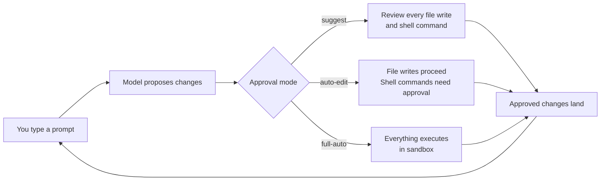
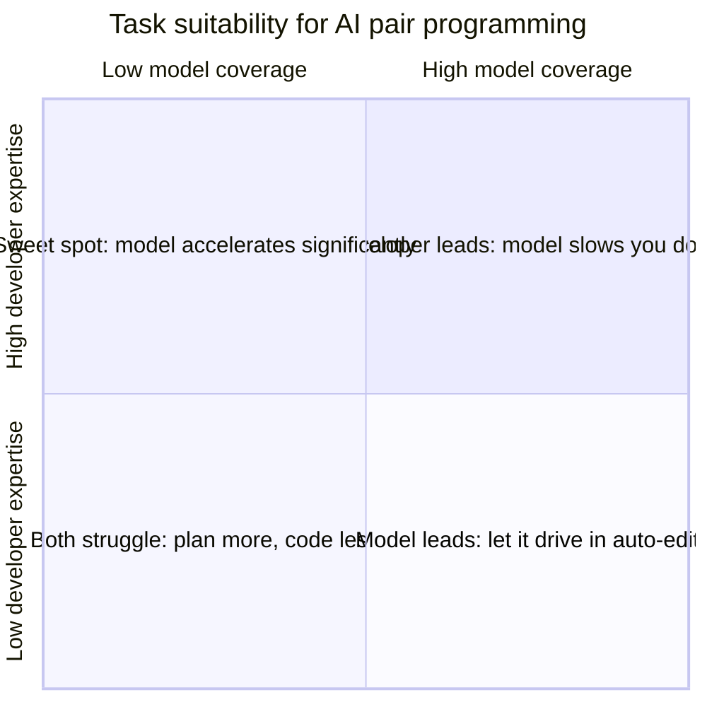

# Codex CLI as a Pair Programming Partner: Interactive Workflows, Conversation Patterns, and the Productivity Evidence


---

Pair programming — two developers working at one keyboard, one driving and one navigating — has been a staple of agile practice since the late 1990s. The promise was always better code through continuous review. The friction was always cost: two engineers, one deliverable.

Codex CLI's interactive terminal UI offers a different trade-off. The navigator is a model. The driver is you. The session runs in your terminal, scoped to your repository, with every tool call gated by the sandbox and permission profile you configured. This article covers how to structure those sessions for effective pairing, which TUI primitives matter most, and what the productivity evidence actually says.

---

## The Interactive Session as a Pairing Surface

When you launch `codex` without the `exec` flag, you enter an interactive session — the TUI. This is the pairing surface. The model sees your repository context (via AGENTS.md, skills, and the files you reference), proposes changes, and waits for your approval before executing tool calls.[^1]

The approval gate is what distinguishes this from batch automation. In `suggest` mode (the default), every file write and shell command requires explicit confirmation. In `auto-edit` mode, file writes proceed but shell commands still require approval. In `full-auto` mode, everything executes within the sandbox without interruption.[^2] For pair programming, `suggest` or `auto-edit` strikes the right balance: the model proposes, you review, and only approved changes land.



---

## Slash Commands That Shape the Pairing Conversation

The TUI exposes over twenty slash commands.[^3] For pair programming, six carry most of the weight:

| Command | Role in pairing |
|---|---|
| `/plan` | Switches the model to planning mode — it reasons about approach without executing. Use this at the start of a task to align on strategy before writing code.[^1] |
| `/diff` | Shows the cumulative diff of all changes in the session. The equivalent of looking over your pair's shoulder at what they have changed so far.[^3] |
| `/review` | Asks the model to review the current diff for bugs, style issues, and missed edge cases — the navigator's core job.[^3] |
| `/fork` | Creates a branching copy of the current session. Use this when you want to explore an alternative approach without losing the current thread.[^4] |
| `/compact` | Summarises the conversation and resets context window usage. Essential for long pairing sessions that approach token limits.[^4] |
| `/model` | Switches the active model mid-session. Start with `gpt-5.5` for complex architectural reasoning, drop to `codex-mini` for mechanical edits.[^3] |

Two keyboard shortcuts complement these commands:

- **Alt+, / Alt+.** — decrease or increase the model's reasoning effort level (Low, Medium, High, Extra High) without leaving the prompt line.[^5] Medium is the recommended default; raise it for architectural decisions, lower it for formatting passes.
- **Tab** — queues a follow-up message while the model is still responding, so you can steer the next turn without waiting.[^5]

---

## Conversation Patterns for Effective Pairing

### Pattern 1: Plan → Implement → Review

The most reliable pattern mirrors how human pairs work. Start with `/plan` to agree on the approach, then let the model implement, then run `/review` on the result.

```text
You:    /plan Add retry logic to the HTTP client. Exponential backoff,
        max 3 retries, jitter. Don't change the public API surface.

Model:  [Outlines approach — which files, which functions, test strategy]

You:    Looks good. Go ahead.

Model:  [Implements changes, writes tests]

You:    /review
Model:  [Reviews its own diff, flags a missing timeout on the retry loop]

You:    Fix that.
Model:  [Adds the timeout]
```

This three-phase loop keeps the model's navigator and driver roles separate, reducing the chance of self-reinforcing errors.[^1]

### Pattern 2: Side-by-Side Exploration

When you are uncertain about the right approach, use `/fork` to explore alternatives in parallel:

```text
You:    /fork
        [In the forked session] Implement retry logic using a decorator pattern.

        [In the original session] Implement retry logic inline in the request method.

        [Compare the two diffs, pick the cleaner one]
```

Forked sessions share the same repository but maintain independent conversation history, so the model's reasoning in one branch does not contaminate the other.[^4]

### Pattern 3: Incremental Narrowing

For large tasks, break the work into scoped turns. Each turn should target a single file or a single concern. Between turns, use `/diff` to verify the cumulative state before proceeding:

```text
You:    Add the RetryConfig struct to config.go. Nothing else.
Model:  [Writes the struct]
You:    /diff
        [Verify only config.go changed]
You:    Now wire RetryConfig into the HTTP client constructor.
```

This pattern exploits the TUI's turn-by-turn approval to maintain the same granular control you would have driving the keyboard yourself.[^2]

---

## Session Management for Long Pairing Sessions

Pair programming sessions often run longer than a single context window allows. Three mechanisms handle this:

**Compaction** — `/compact` summarises the conversation into a shorter representation, freeing context window capacity. The model retains the key decisions and file states but loses verbatim earlier exchanges. Run it proactively when `/status` shows context usage above 70%.[^4]

**Resume** — `/resume` restarts a previous session from its last state. If you break for lunch, you can pick up the pairing session where you left it, including the conversation history and any pending changes.[^4]

**One thread per task** — OpenAI's best practices documentation explicitly recommends keeping one task per conversation thread. If the pairing session drifts to a second concern, start a new session rather than overloading the context.[^1]

---

## What the Productivity Research Shows

The headline numbers are striking. GitHub's 2024 study reported that developers using AI pair programming tools completed tasks 55% faster.[^6] A 2025 meta-analysis across enterprise deployments found 13.6% fewer errors in AI-assisted code and an average of 3.6 hours saved per developer per week.[^7]

But the picture is not uniformly positive. METR's 2025 randomised controlled trial — one of the few studies with proper experimental controls — found that experienced open-source developers were **19% slower** when using AI coding tools on their own repositories.[^8] The researchers attributed this to context-switching overhead: developers spent time reviewing, correcting, and re-prompting the model rather than writing code directly.

The reconciliation is straightforward: AI pair programming accelerates tasks where the model has strong prior coverage (boilerplate, standard patterns, well-documented APIs) and decelerates tasks where the developer's domain expertise significantly exceeds the model's (novel algorithms, codebase-specific conventions, performance-critical paths).[^8]



The practical implication for Codex CLI users: choose your approval mode based on the quadrant. Use `suggest` mode when your expertise exceeds the model's coverage. Use `auto-edit` when the model's coverage is high. Reserve `full-auto` for mechanical tasks where review adds no value.[^2]

---

## Configuring the Pairing Environment

Two configuration choices have outsized impact on pairing quality:

**AGENTS.md** — treat this as the briefing document you would give a new pair. Include build commands, test commands, naming conventions, and prohibited patterns. The model reads it at session start and uses it to constrain its proposals.[^9] GitHub's analysis of 2,500 repositories found that AGENTS.md quality directly correlates with agent effectiveness.[^10]

**Reasoning level** — the default Medium level suits most pairing turns. Raise to High or Extra High for architectural decisions, design reviews, or when the model's first response misses nuance. Lower to Low for formatting, renaming, and other mechanical edits. Adjusting per-turn with Alt+, and Alt+. is faster than changing model.[^5]

---

## When Not to Pair with the Model

Not every task benefits from an AI navigator. Skip the pairing session when:

- You are debugging a production incident where the codebase context exceeds what AGENTS.md and the context window can represent.
- The task requires sustained creative design thinking — the model will converge on conventional patterns rather than challenge your assumptions.
- You need to learn the code yourself. Pair programming with a model that already knows the answer short-circuits the learning process that makes human pairing valuable.

For everything else — feature implementation, test writing, refactoring, code review, documentation — the interactive TUI provides a pairing surface that scales to every repository in your organisation without scheduling a second engineer.

---

## Citations

[^1]: OpenAI. "Best practices." *Codex Developer Documentation*, 2026. [https://developers.openai.com/codex/learn/best-practices](https://developers.openai.com/codex/learn/best-practices)

[^2]: OpenAI. "Agent approvals & security." *Codex Developer Documentation*, 2026. [https://developers.openai.com/codex/agent-approvals-security](https://developers.openai.com/codex/agent-approvals-security)

[^3]: OpenAI. "Slash commands." *Codex CLI Reference*, 2026. [https://developers.openai.com/codex/cli/slash-commands](https://developers.openai.com/codex/cli/slash-commands)

[^4]: OpenAI. "CLI features." *Codex Developer Documentation*, 2026. [https://developers.openai.com/codex/cli/features](https://developers.openai.com/codex/cli/features)

[^5]: OpenAI. "Keyboard shortcuts." *Codex CLI Reference*, 2026. [https://developers.openai.com/codex/cli/keyboard-shortcuts](https://developers.openai.com/codex/cli/keyboard-shortcuts)

[^6]: Ziegler, Albert et al. "Research: Quantifying GitHub Copilot's impact on developer productivity and happiness." *GitHub Blog*, 2024. [https://github.blog/news-insights/research/research-quantifying-github-copilots-impact-on-developer-productivity-and-happiness/](https://github.blog/news-insights/research/research-quantifying-github-copilots-impact-on-developer-productivity-and-happiness/)

[^7]: Uplevel. "The Impact of AI on Developer Productivity: Evidence from the Field." *Uplevel Research*, 2025. [https://uplevelteam.com/resources/ai-developer-productivity-study](https://uplevelteam.com/resources/ai-developer-productivity-study)

[^8]: METR. "Measuring the Impact of Early AI Assistance on Experienced Open-Source Developer Productivity." *METR Research*, 2025. [https://metr.org/blog/2025-07-10-early-ai-assistance-experienced-os-devs/](https://metr.org/blog/2025-07-10-early-ai-assistance-experienced-os-devs/)

[^9]: OpenAI. "Custom instructions with AGENTS.md." *Codex Developer Documentation*, 2026. [https://developers.openai.com/codex/guides/agents-md](https://developers.openai.com/codex/guides/agents-md)

[^10]: Nigh, Matt. "How to write a great agents.md: lessons from over 2,500 repositories." *GitHub Blog*, 2026. [https://github.blog/ai-and-ml/github-copilot/how-to-write-a-great-agents-md-lessons-from-over-2500-repositories/](https://github.blog/ai-and-ml/github-copilot/how-to-write-a-great-agents-md-lessons-from-over-2500-repositories/)
