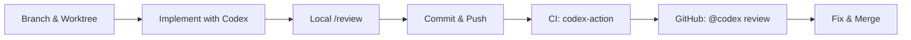

# Codex CLI Pull Request Workflows: Branch to Merge with Agent-Assisted Review and CI Integration


---

Pull requests are where code quality lives or dies. Most teams treat Codex CLI as a code-generation tool and then fall back to manual workflows the moment they push a branch. That wastes most of the agent's value. Codex CLI can assist at every stage of the PR lifecycle — from branch creation through local review, CI gating, GitHub-native review comments, and post-merge cleanup. This article maps the complete workflow, shows the configuration needed at each stage, and identifies the integration points most teams miss.

---

## The End-to-End PR Pipeline

A modern Codex-assisted PR workflow has six stages. Each stage has a corresponding Codex surface — CLI, GitHub cloud, or CI — and specific configuration requirements.



---

## Stage 1: Branch Isolation with Git Worktrees

Running Codex on your main working tree is a recipe for merge conflicts. The recommended pattern is to create a git worktree for each feature branch, giving Codex an isolated filesystem to operate in while your main checkout stays clean[^1].

```bash
# Create a worktree for the feature branch
git worktree add ../feature-auth-refactor -b feature/auth-refactor

# Start Codex in the worktree directory
cd ../feature-auth-refactor
codex
```

Each worktree gets its own Codex session, branch, and file state. You can run multiple Codex sessions in parallel across different worktrees without interference[^1]. Project-level `.codex/config.toml` and `AGENTS.md` files travel with the repository, so every worktree inherits the same agent configuration.

For teams running multiple agents simultaneously, the `--add-dir` flag lets Codex write to additional directories beyond the worktree root[^2]:

```bash
codex --cd ../feature-auth-refactor --add-dir ../shared-types
```

---

## Stage 2: Implementation with Agent Guidance

The implementation phase is where most teams already use Codex well, but two patterns improve PR quality downstream.

### Write AGENTS.md Review Guidelines Early

AGENTS.md is not just for build commands. Adding a `Review guidelines` section means both the implementation agent and the review agent follow the same standards[^3]:

```markdown
## Review guidelines

- Flag any function longer than 40 lines as P1
- All public API endpoints must have integration tests
- Do not log PII — flag as P0 if detected
- Prefer composition over inheritance in new code
- Every database migration must be reversible
```

Codex discovers these guidelines automatically during both `/review` and `@codex review` on GitHub[^3]. Writing them before implementation — not after — prevents the agent from generating code that its own review will flag.

### Use Plan Mode for Non-Trivial Changes

For multi-file changes that will touch more than three files, start with plan mode[^4]:

```
> /plan Refactor the auth middleware to extract token validation into a standalone module
```

Codex produces a plan without making changes. Review the plan, adjust scope, then switch to implementation. This reduces the diff size per PR and produces cleaner commit histories.

---

## Stage 3: Local Review with /review

The `/review` command launches a dedicated reviewer that analyses your diff and reports prioritised findings without touching the working tree[^5]. It operates in three modes:

| Mode | What It Reviews | When to Use |
|---|---|---|
| Review against base branch | Merge-base diff vs upstream | Before opening the PR |
| Review uncommitted changes | Staged + unstaged files | Before committing |
| Review a commit | Specific SHA | After committing, before pushing |

```
> /review
# Select: "Review against base branch"
# Select: main
```

The reviewer flags P0 (must fix) and P1 (should fix) issues with file paths and line ranges[^5]. It respects the `Review guidelines` section in your `AGENTS.md`, so the findings align with your team's standards[^3].

### Configuring a Review-Specific Model

You can route review tasks to a different model using a named profile[^6]:

```toml
# ~/.codex/config.toml

[profiles.review]
model = "gpt-5.5"
model_reasoning_effort = "high"
approval_policy = "on-request"
```

Then invoke it:

```bash
codex -p review
```

Using GPT-5.5 with high reasoning effort for reviews catches subtle issues — race conditions, security regressions, missing edge cases — that faster models miss[^7]. The extra cost is worth it because review runs once per PR, not once per edit.

---

## Stage 4: Commit and Push

After local review passes, commit with a descriptive message. Codex can generate commit messages that summarise the diff:

```
> Write a conventional commit message for the current staged changes
```

For teams enforcing commit conventions, add the format to your `AGENTS.md`:

```markdown
## Commit conventions

- Use Conventional Commits format: type(scope): description
- Types: feat, fix, refactor, test, docs, chore
- Scope is the module or directory name
- Description is imperative mood, lowercase, no period
```

---

## Stage 5: CI Integration with codex-action

The `openai/codex-action@v1` GitHub Action installs Codex CLI, starts the Responses API proxy, and runs `codex exec` with your prompt inside the CI runner[^8]. This gives you an agent-powered quality gate in your pipeline.

### Basic PR Review Workflow


```yaml
name: Codex PR Review
on:
  pull_request:
    types: [opened, synchronize, reopened]

jobs:
  codex-review:
    runs-on: ubuntu-latest
    permissions:
      contents: read
      pull-requests: write
    steps:
      - uses: actions/checkout@v5
        with:
          fetch-depth: 0

      - name: Run Codex Review
        id: review
        uses: openai/codex-action@v1
        with:
          openai-api-key: ${{ secrets.OPENAI_API_KEY }}
          prompt-file: .github/codex/prompts/review.md
          output-file: codex-review.md
          model: gpt-5.5
          sandbox: read-only
```


The `safety-strategy` defaults to `drop-sudo`, which irreversibly removes sudo privileges from the runner — a sensible default for review tasks[^8]. For tasks that need to run builds or tests, use `workspace-write` sandbox mode.

### Structured Output for Automated Gating

Use `--output-schema` to enforce machine-readable review output[^8]:

```json
{
  "type": "object",
  "properties": {
    "p0_issues": { "type": "integer" },
    "p1_issues": { "type": "integer" },
    "summary": { "type": "string" },
    "approve": { "type": "boolean" }
  },
  "required": ["p0_issues", "p1_issues", "approve"]
}
```

Then gate the merge on the result:

```yaml
      - name: Check Review Result
        run: |
          P0=$(jq '.p0_issues' codex-review.md)
          if [ "$P0" -gt 0 ]; then
            echo "::error::Codex found $P0 P0 issues — blocking merge"
            exit 1
          fi
```

### Security Considerations

Three rules for running Codex in CI[^8]:

1. **Restrict triggers.** Use `allow-users` and `allow-bots` to prevent untrusted actors from injecting prompts via PR descriptions.
2. **Sanitise inputs.** Never pass raw PR body text as a prompt — it is an injection vector.
3. **Isolate the step.** Run Codex as the final job step to contain side effects. Rotate API keys immediately if exposure is suspected.

---

## Stage 6: GitHub-Native Review with @codex

Once the PR is open, Codex can review it directly on GitHub as a cloud-based coding agent[^3]. This is separate from the CI action — it posts standard GitHub review comments visible to all reviewers.

### Manual Trigger

Comment on the PR:

```
@codex review
```

Codex reacts with a eyes emoji, reads the diff against the base branch, and posts a review with P0 and P1 findings as inline comments[^3].

### Automatic Reviews

Enable automatic reviews in Codex settings to have every new PR reviewed without a manual trigger[^3]. This is useful for high-volume repositories where human reviewers want an initial triage before investing time.

### Custom Review Instructions

Add context to the trigger:

```
@codex review for security regressions in the auth module
```

Codex scopes its analysis accordingly[^3].

### Fix-and-Push Loop

After Codex posts findings, you can ask it to fix the issues in the same PR[^3]:

```
@codex fix the P1 issue in auth/validate.ts
```

Codex starts a cloud task using the PR as context, implements the fix, and pushes a commit to the branch — provided it has write access to the repository. This closes the loop without switching back to your terminal.

---

## Connecting the Stages: A Complete Configuration

Here is the minimum configuration set for the full pipeline:

### Repository Structure

```
project/
  AGENTS.md                    # Review guidelines + build commands
  .codex/
    config.toml                # Project-level Codex config
  .github/
    codex/
      prompts/
        review.md              # CI review prompt
    workflows/
      codex-review.yml         # GitHub Action workflow
```

### Project-Level config.toml

```toml
# .codex/config.toml
model = "gpt-5.5"
approval_policy = "on-request"
sandbox_mode = "workspace-write"

[features]
web_search = "disabled"
```

### CI Review Prompt (.github/codex/prompts/review.md)

```markdown
Review the changes in this pull request against the base branch.

Focus on:
1. Correctness — logic errors, off-by-one, null handling
2. Security — injection, auth bypass, secrets in code
3. Performance — N+1 queries, unbounded loops, missing indices
4. Test coverage — new code paths without tests

Output structured JSON with p0_issues, p1_issues, summary, and approve fields.
Follow the Review guidelines in AGENTS.md.
```

---

## The Decision Matrix: Which Review Surface When

```mermaid
flowchart TD
    A[Changes ready for review] --> B{Still local?}
    B -->|Yes| C[/review in CLI]
    C --> D{P0 issues found?}
    D -->|Yes| E[Fix locally, re-review]
    D -->|No| F[Push branch, open PR]
    B -->|No, PR is open| F
    F --> G[codex-action runs in CI]
    G --> H{CI gate passes?}
    H -->|No| I[Fix issues, push again]
    H -->|Yes| J[@codex review on GitHub]
    J --> K{Findings?}
    K -->|Yes| L[@codex fix or manual fix]
    K -->|No| M[Human reviewer approves]
    L --> G
    M --> N[Merge]
```

Running `/review` locally before pushing catches approximately 60-70% of issues that would otherwise appear in CI or GitHub review[^9]. This reduces CI costs, shortens feedback loops, and keeps the PR comment thread focused on genuinely ambiguous decisions that need human judgement.

---

## Common Mistakes

**Running all reviews at the same reasoning level.** Local `/review` during active development can use medium reasoning effort. CI and GitHub reviews — which run once and gate the merge — should use high effort with GPT-5.5[^7].

**Skipping AGENTS.md review guidelines.** Without explicit guidelines, Codex applies generic heuristics. Teams report a 40-50% increase in actionable findings after adding project-specific rules to `AGENTS.md`[^3].

**Using `codex-action` without `fetch-depth: 0`.** The action needs full git history to compute the merge-base diff. Shallow clones produce incomplete reviews[^8].

**Treating @codex review as a replacement for human review.** Agent review catches mechanical issues — bugs, missing tests, security patterns. Human reviewers catch architectural misalignment, team convention drift, and whether the change solves the right problem. Use both[^9].

---

## Citations

[^1]: [Codex Worktrees Documentation](https://developers.openai.com/codex/app/worktrees) — OpenAI Developers, accessed June 2026.
[^2]: [Codex CLI Features — Multiple Writable Roots](https://developers.openai.com/codex/cli/features) — OpenAI Developers, accessed June 2026.
[^3]: [Code Review in GitHub — Codex Integration](https://developers.openai.com/codex/integrations/github) — OpenAI Developers, accessed June 2026.
[^4]: [Best Practices — Plan First for Difficult Tasks](https://developers.openai.com/codex/learn/best-practices) — OpenAI Developers, accessed June 2026.
[^5]: [Codex App Review — Local Review Modes](https://developers.openai.com/codex/app/review) — OpenAI Developers, accessed June 2026.
[^6]: [Advanced Configuration — Profiles](https://developers.openai.com/codex/config-advanced) — OpenAI Developers, accessed June 2026.
[^7]: [Codex Models — GPT-5.5 Capabilities](https://developers.openai.com/codex/models) — OpenAI Developers, accessed June 2026.
[^8]: [Codex GitHub Action](https://developers.openai.com/codex/github-action) — OpenAI Developers, accessed June 2026.
[^9]: [What 33,000 Agentic Pull Requests Reveal: Empirical Lessons for Codex CLI Practitioners](https://codex.danielvaughan.com/2026/04/18/empirical-research-agentic-pull-requests-codex-cli/) — Codex Knowledge Base, April 2026.
