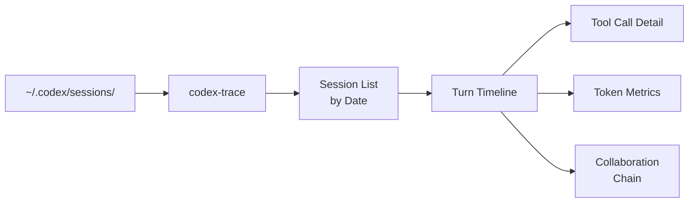
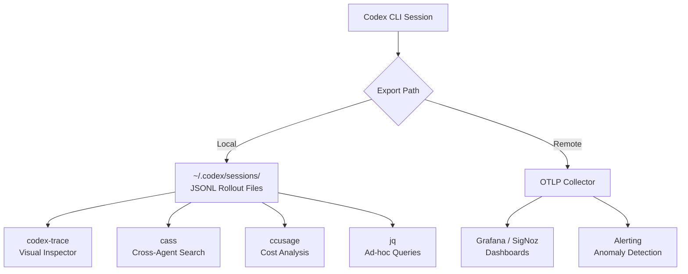

# Codex CLI Session Forensics: JSONL Post-Mortems, codex-trace, cass, and ccusage


---

Your agent ran for forty minutes, burned through 180,000 tokens, and the diff it produced is wrong. What happened? The answer is sitting in `~/.codex/sessions/` — but only if you know how to read it.

Codex CLI records every session as a newline-delimited JSON (JSONL) rollout file.[^1] Combined with OpenTelemetry traces and a growing ecosystem of community analysis tools, these files give you full post-mortem capability over every agent run. This article covers the session file format, the tools that make it navigable, and the forensic workflows that turn raw logs into actionable answers.

---

## The Rollout File Format

Every Codex CLI session writes a JSONL file to `~/.codex/sessions/YYYY/MM/DD/rollout-{ISO_TIMESTAMP}-{UUID}.jsonl`.[^1] Each line is a self-contained JSON object with three top-level fields:

```json
{"timestamp":"2026-06-05T09:14:22.331Z","type":"session_meta","payload":{"model_provider":"openai","cli_version":"0.137.0"}}
```

The `type` field determines the event category. The six core event types you will encounter are:[^2]

| Type | Purpose |
|---|---|
| `session_meta` | Model provider, CLI version, session identity |
| `turn_context` | Active model for the upcoming turn |
| `response_item` | Messages, tool calls, and tool outputs |
| `event_msg` | Token counts, task lifecycle, agent reasoning |
| `input_item` | User prompts and attachments |
| `config_snapshot` | Permission profile and sandbox settings at session start |

### Tool Call Pairing

Tool invocations and their results are linked by a flat `call_id` — not nested begin/end markers:[^2]

```json
{"timestamp":"...","type":"response_item","payload":{"type":"function_call","name":"exec_command","arguments":"{\"command\":\"cargo test\"}","call_id":"call_abc123"}}
{"timestamp":"...","type":"response_item","payload":{"type":"function_call_output","call_id":"call_abc123","output":"test result: ok. 42 passed; 0 failed"}}
```

This flat structure means causality must be inferred from event ordering rather than explicit parent references.[^2] When an agent loops — calling a tool, reading the output, deciding to call another — you reconstruct the decision chain by walking the file line by line.

### Token Count Events

Token consumption is recorded as cumulative `event_msg` entries with `payload.type === "token_count"`.[^3] These appear interspersed throughout the event stream without predictable cadence, so per-turn usage requires subtracting the previous cumulative total from the current one.[^3]

---

## Forensic Tool #1: jq Recipes

Before reaching for a GUI, `jq` gives you answers in seconds. These recipes work directly against any rollout file.

**Extract the full tool call timeline:**

```bash
jq -r 'select(.type == "response_item" and .payload.type == "function_call") |
  "\(.timestamp) \(.payload.name) \(.payload.call_id)"' \
  ~/.codex/sessions/2026/06/05/rollout-*.jsonl
```

**Find every user prompt in a session:**

```bash
jq -r 'select(.type == "input_item") | .payload.content' \
  ~/.codex/sessions/2026/06/05/rollout-*.jsonl
```

**Calculate per-turn token deltas:**

```bash
jq -s '[.[] | select(.type == "event_msg" and .payload.type == "token_count")]
  | [range(1; length)] as $i
  | [$i[] | {turn: ., delta: (.[$i[.]] .payload.total - .[$i[.]-1].payload.total)}]' \
  rollout-session.jsonl
```

**Identify the most expensive tool call by wall-clock time:**

```bash
jq -s '
  [.[] | select(.type == "response_item")] |
  group_by(.payload.call_id) |
  map(select(length == 2)) |
  map({
    call_id: .[0].payload.call_id,
    tool: .[0].payload.name,
    duration_s: ((.[1].timestamp | sub("Z$";"") | strptime("%Y-%m-%dT%H:%M:%S%.f") | mktime) -
                 (.[0].timestamp | sub("Z$";"") | strptime("%Y-%m-%dT%H:%M:%S%.f") | mktime))
  }) | sort_by(-.duration_s) | .[0:5]' rollout-session.jsonl
```

---

## Forensic Tool #2: codex-trace

[codex-trace](https://github.com/PixelPaw-Labs/codex-trace) is a Rust/React desktop and web application purpose-built for Codex session inspection.[^4] It reads directly from `~/.codex/sessions/` and presents a three-panel layout: sessions grouped by date, turns displayed chronologically, and detailed turn information including tool calls, MCP interactions, patch operations, and token metrics.

### Key Capabilities

- **Collaboration chain tracking** — links orchestrator sessions to spawned worker sessions, essential for debugging multi-agent v2 runs[^4]
- **Live session tailing** — uses server-sent events (SSE) to monitor in-progress sessions in real time[^4]
- **Multi-format support** — handles JSONL metadata from v0.44+ alongside legacy formats from 2025[^4]

### Deployment Options

```bash
# Desktop (Tauri v2)
cargo install codex-trace

# Headless web (Docker)
docker run -d -p 1422:1422 \
  -v ~/.codex/sessions:/data/sessions:ro \
  pixelpaw/codex-trace:latest
```

The Docker deployment is particularly useful for team environments where multiple developers push session files to a shared volume for collective analysis.[^4]



---

## Forensic Tool #3: cass (Coding Agent Session Search)

Where codex-trace focuses on visual inspection of individual sessions, [cass](https://github.com/Dicklesworthstone/coding_agent_session_search) solves the cross-session search problem.[^5] It normalises session data from Codex, Claude Code, Gemini CLI, Cursor, Aider, GitHub Copilot Chat, and over a dozen other providers into a unified SQLite index.[^5]

### Why Cross-Agent Search Matters

Most teams now run multiple coding agents — Codex for execution, Claude Code for architecture reasoning, Copilot for IDE completions.[^5] When a bug surfaces, the relevant context might span sessions across three different tools. cass makes "which agent introduced this pattern?" a searchable question rather than a manual archaeology project.

### Search Modes

cass offers three search strategies:[^5]

| Mode | Engine | Latency | Best For |
|---|---|---|---|
| Lexical | BM25 with edge n-gram tokenisation | <60ms | Exact term matching, function names, error messages |
| Semantic | Local MiniLM/Nomic-Embed vectors | ~200ms | Conceptual queries ("how did I handle auth?") |
| Hybrid (default) | Reciprocal Rank Fusion of both | ~250ms | General-purpose post-mortem queries |

```bash
# Install
pip install cass

# Index all local agent sessions
cass index

# Search across every agent you have used
cass search "database connection pooling timeout"

# One-shot triage — hand a problem to cass and get cited evidence
cass triage "Why is the checkout flow returning 500s?"

# Build a handoff pack with cited session evidence
cass pack "authentication refactoring" --format markdown
```

The `triage` command is particularly powerful for post-mortems: it searches across all indexed sessions, identifies relevant turns, and produces a cited summary linking each finding to the specific session, timestamp, and tool call that generated it.[^5]

---

## Forensic Tool #4: ccusage

[ccusage](https://github.com/ryoppippi/ccusage) answers the cost question: how much did each session, day, or model actually consume?[^6] It reads the `token_count` events from Codex JSONL files and cross-references them against LiteLLM's pricing dataset to produce accurate cost breakdowns.[^3]

```bash
# Daily cost report for Codex sessions
bunx ccusage daily --source codex

# Monthly breakdown by model
bunx ccusage monthly --source codex --json

# Session-level analysis with per-model detail
bunx ccusage session --source codex --compact
```

### Cost Calculation

ccusage recovers per-turn token usage by subtracting cumulative totals between consecutive `token_count` events.[^3] It distinguishes between cached and non-cached input tokens, applies the correct pricing tier, and accounts for speed-tier multipliers when `service_tier` is set to `"priority"` or `"fast"` (applying a 2x multiplier as a fallback when model-specific speed pricing data is unavailable).[^3]

Output includes input tokens, cached input tokens, output tokens, reasoning tokens, and estimated cost — grouped by model, day, and session.[^6]

---

## OpenTelemetry: Production-Grade Forensics

For teams running Codex in CI/CD or shared development environments, the JSONL files are a local-first solution. OpenTelemetry provides the distributed alternative.[^7]

### Configuration

```toml
# ~/.codex/config.toml
[otel]
trace_exporter = "otlp-http"
otlp_endpoint = "https://otel-collector.internal:4318"
service_name = "codex-cli"
```

### Key Metrics Captured

The `codex-otel` crate emits structured metrics that map directly to forensic questions:[^7]

| Metric | Type | Forensic Question |
|---|---|---|
| `codex.tool.call` | Counter | How many tools did the agent invoke? |
| `codex.tool.call.duration_ms` | Histogram | Which tool calls were suspiciously slow? |
| `codex.api_request` | Counter | How many LLM round-trips did the session take? |
| `codex.turn.e2e_duration_ms` | Histogram | Where did the agent spend wall-clock time? |
| `codex.turn.token_usage` | Counter | What was the per-turn token consumption? |
| `codex.hooks.run` | Counter | Did any hooks fire (and how often)? |

### Turn Metadata Propagation

Each LLM API request includes an `x-codex-turn-metadata` HTTP header containing the request kind (`Turn`, `Prewarm`, `Compaction`, `Memory`), session and thread IDs with forking relationships, and git repository metadata per workspace.[^7] This means your observability backend can correlate agent activity with specific repositories, branches, and even forked session lineages.



---

## Post-Mortem Workflow

When an agent session produces unexpected results, follow this sequence:

### 1. Identify the Session

```bash
# List today's sessions, most recent first
ls -lt ~/.codex/sessions/2026/06/05/rollout-*.jsonl | head -5

# Or use codex resume to browse recent sessions
codex resume
```

### 2. Get the Executive Summary

```bash
# Session duration and total tool calls
jq -s '{
  start: .[0].timestamp,
  end: .[-1].timestamp,
  tool_calls: [.[] | select(.type == "response_item" and .payload.type == "function_call")] | length,
  models_used: [.[] | select(.type == "turn_context") | .payload.model] | unique
}' rollout-session.jsonl
```

### 3. Find the Divergence Point

The critical question in most post-mortems is: *when did the agent's reasoning diverge from the correct path?* Look for:

- **Tool calls that returned errors** — the agent may have misinterpreted a failure and taken a compensating action that compounded the problem
- **Repeated tool calls** — looping behaviour where the agent retries the same operation, often indicating it cannot parse the output
- **Model switches in `turn_context`** — if a fallback model was used mid-session, the quality of reasoning may have shifted

```bash
# Find all tool calls that produced error output
jq -r 'select(.type == "response_item" and .payload.type == "function_call_output"
  and (.payload.output | test("error|Error|ERROR|failed|FAILED")))
  | "\(.timestamp) \(.payload.call_id): \(.payload.output[:200])"' \
  rollout-session.jsonl
```

### 4. Correlate with Cost

```bash
# Quick cost check for this specific session
bunx ccusage session --source codex --json | \
  jq '.[] | select(.session_id == "YOUR_SESSION_ID")'
```

### 5. Search for Precedent

```bash
# Has this failure pattern appeared before?
cass search "error: ENOENT package.json" --limit 5
```

---

## Team Forensics Patterns

### Shared Session Archive

For teams running Codex across multiple workstations or CI runners, centralise session files for collective analysis:

```bash
# Sync sessions to shared storage (cron job)
rsync -az ~/.codex/sessions/ \
  /mnt/shared/codex-sessions/$(hostname)/

# Point codex-trace at the shared archive
docker run -d -p 1422:1422 \
  -v /mnt/shared/codex-sessions:/data/sessions:ro \
  pixelpaw/codex-trace:latest
```

### CI Post-Mortem Integration

When `codex exec` runs in CI, capture the session for later analysis:

```bash
# CI script
CODEX_HOME=/tmp/codex-ci codex exec "fix the failing tests" \
  --output-schema ./fix-report.json

# Archive the session alongside CI artefacts
cp -r /tmp/codex-ci/sessions/ "$CI_ARTIFACTS_DIR/codex-sessions/"
```

### Cost Alerting

Use ccusage in a scheduled job to flag sessions that exceed a cost threshold:

```bash
#!/bin/bash
# Alert on sessions costing more than $5
bunx ccusage session --source codex --json | \
  jq '.[] | select(.total_cost > 5) |
    "ALERT: Session \(.session_id) cost $\(.total_cost | tostring)"' | \
  while read -r line; do
    echo "$line" | slack-notify "#codex-alerts"
  done
```

---

## Limitations and Gaps

- **No official schema documentation** — the JSONL format is reverse-engineered from source code and community observation; OpenAI has not published a formal specification[^2] ⚠️
- **`codex exec` and `codex mcp-server` do not emit OpenTelemetry metrics** — track [Issue #12913](https://github.com/openai/codex/issues/12913) for progress on this gap[^7] ⚠️
- **Token count events lack predictable cadence** — they appear at varying intervals, making real-time cost estimation imprecise until the session completes[^3]
- **No explicit causality in JSONL** — without parent-event references, complex multi-tool chains require temporal ordering to reconstruct, which can be ambiguous when tool calls execute in parallel[^2]
- **Session archival in v0.136+** complicates forensics — archived sessions (`codex archive`) are excluded from `codex resume` and some tools until unarchived[^8]

---

## Citations

[^1]: [PixelPaw-Labs/codex-trace — GitHub](https://github.com/PixelPaw-Labs/codex-trace) — Session file path structure and JSONL format documentation.

[^2]: [Reverse engineering Codex CLI rollout traces — DEV Community](https://dev.to/milkoor/reverse-engineering-codex-cli-rollout-traces-3b9b) — Detailed analysis of the rollout JSONL event types, tool call pairing, and format limitations.

[^3]: [ccusage Codex Guide — ccusage.com](https://ccusage.com/guide/codex/) — Token count extraction methodology, cost calculation, and speed-tier pricing.

[^4]: [codex-trace README — GitHub](https://github.com/PixelPaw-Labs/codex-trace) — Three-panel layout, collaboration chain tracking, live tailing, multi-format support, and deployment options.

[^5]: [Dicklesworthstone/coding_agent_session_search — GitHub](https://github.com/Dicklesworthstone/coding_agent_session_search) — Cross-agent session indexing, search modes, triage command, and provider support.

[^6]: [ryoppippi/ccusage — GitHub](https://github.com/ryoppippi/ccusage) — Multi-agent cost analysis, daily/monthly/session reporting, and JSON output mode.

[^7]: [Observability and Telemetry — DeepWiki/openai/codex](https://deepwiki.com/openai/codex/9.4-observability-and-telemetry) — OpenTelemetry metric names, trace context propagation, turn metadata, and analytics event types.

[^8]: [Codex CLI Changelog — OpenAI Developers](https://developers.openai.com/codex/changelog) — v0.136.0 session archival feature and v0.137.0 stable release notes.
