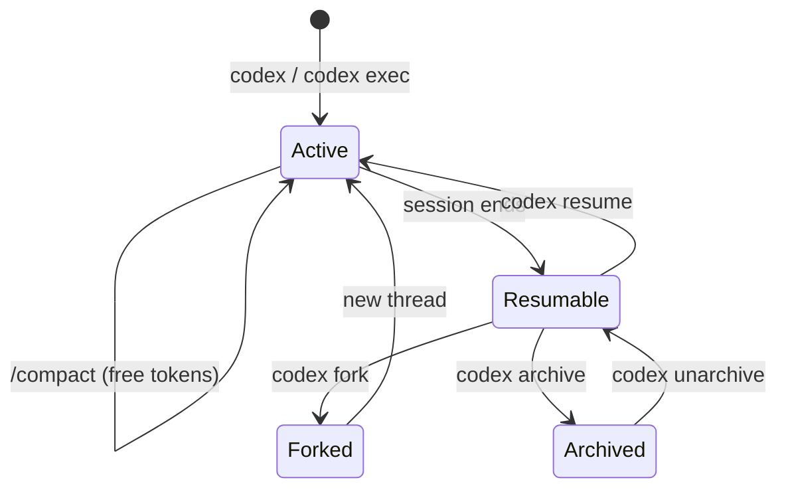
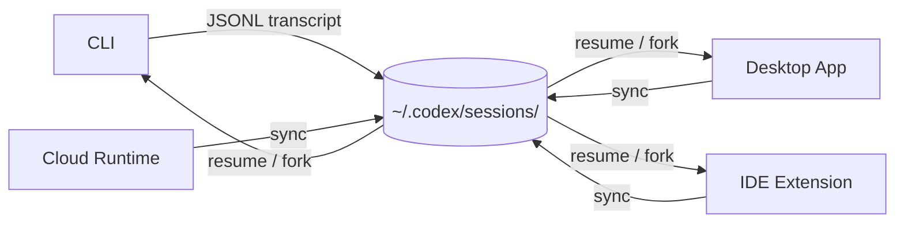

# Codex CLI Session Lifecycle: Archive, Resume, Fork, and Compact


Every Codex CLI session generates a JSONL transcript—user messages, assistant responses, tool calls, file changes, and command executions—persisted under `~/.codex/sessions/`[^1]. With v0.136 introducing session archiving[^2] and v0.137 refining multi-agent thread metadata[^3], the session lifecycle now has five distinct stages: **create → work → compact → archive → restore**. This article maps the full lifecycle, covers every command and slash command involved, and offers practical patterns for keeping session sprawl under control.

## Session Storage

Sessions are stored as JSONL rollout files at `~/.codex/sessions/YYYY/MM/DD/`, following the naming pattern `rollout-YYYY-MM-DDTHH-MM-SS-*.jsonl`[^1]. Each file records the complete conversation trace, including tool invocations and their outputs. This local-first storage model means sessions survive network outages and remain inspectable with standard Unix tools like `jq`[^4].

```bash
# List today's sessions
ls ~/.codex/sessions/2026/06/05/

# Inspect the last message in a session
tail -1 ~/.codex/sessions/2026/06/05/rollout-*.jsonl | jq '.type'
```

## The Five Lifecycle Stages



### 1. Create

A new session begins whenever you run `codex` interactively or `codex exec` non-interactively. The TUI slash command `/new` starts a fresh session without leaving the interface[^5].

```bash
# Interactive session
codex "Refactor the auth module"

# Non-interactive session
codex exec "Run the test suite and summarise failures" -o results.json

# Fresh session from TUI
/new
```

### 2. Work and Extend

During an active session, Codex accumulates context with each turn. The `/status` command displays the current session ID, token usage, and context utilisation[^5]—essential for gauging when compaction is needed.

```bash
# Check context utilisation mid-session
/status
```

For long-running tasks, Codex can operate continuously for up to seven hours by automatically compacting its state when hitting context limits[^6]. However, relying solely on automatic compaction means you lose control over what gets summarised. Manual compaction is almost always preferable at natural breakpoints.

### 3. Compact

The `/compact` slash command summarises conversation history, freeing token budget for continued work without losing essential context[^5]. Think of it as a checkpoint—the model retains a condensed summary of prior reasoning while discarding verbose intermediate output.

```bash
# Compact after completing a logical unit of work
/compact
```

**When to compact:**

- After a large refactoring pass that generated extensive diffs
- Before switching focus within the same session (e.g., from implementation to testing)
- When `/status` shows context utilisation above 70%

**When NOT to compact:**

- Mid-debugging, when the model needs the full error trace
- Immediately after providing complex multi-file instructions the model hasn't yet acted on

### 4. Resume and Fork

Once a session ends (you exit the TUI or the exec run completes), it becomes resumable. Codex provides two distinct continuation strategies[^7]:

**Resume** reopens the original thread, appending new turns to the existing transcript. The model retains prior context, plan history, and approvals[^1].

```bash
# Interactive picker showing recent sessions
codex resume

# Skip the picker, resume the latest session in this directory
codex resume --last

# Resume across all directories
codex resume --all

# Resume a specific session by ID
codex resume abc123-def4-5678-ghij-klmnopqrstuv

# Resume and immediately send a follow-up prompt
codex resume --last "Now add integration tests for the changes"
```

**Fork** creates a new thread branched from a previous session, leaving the original untouched[^7]. This is ideal for exploring alternative approaches without polluting a known-good transcript.

```bash
# Fork via interactive picker
codex fork

# Fork the most recent session
codex fork --last

# Fork a specific session
codex fork abc123-def4-5678-ghij-klmnopqrstuv
```

The TUI equivalents are `/resume` and `/fork` respectively[^5]. In the TUI, pressing Esc twice with an empty composer enters transcript editing mode, allowing you to walk back through the conversation before forking from an earlier point[^7].

**Non-interactive resumption** is equally important for CI/CD pipelines:

```bash
# Resume an exec session with a follow-up instruction
codex exec resume --last "Fix the race conditions you found"

# Resume with structured output
codex exec resume --last --output-schema ./schema.json "Summarise the fixes"
```

The `codex exec resume` command gained `--output-schema` support in v0.132[^8], enabling resumed automation runs to enforce structured JSON output whilst preserving session context.

#### Resume vs. Fork: Decision Guide

| Scenario | Use |
|---|---|
| Continuing the same task after a break | `resume` |
| The session diverged; you want to try a different approach | `fork` |
| Sharing a known-good session as a starting point for a colleague | `fork` |
| Adding tests for code written in an earlier session | `resume` |
| The original session hit an error loop you want to escape | `fork` |

### 5. Archive and Restore

Introduced in v0.136[^2], session archiving moves a session out of the active picker list. Archived sessions are **protected from resume and fork until explicitly restored**—a guard against accidentally extending a session you consider complete.

```bash
# Archive a finished session
codex archive <SESSION_ID>

# Archive from the TUI
/archive

# Restore an archived session
codex unarchive <SESSION_ID>
```

Restored sessions reappear in the `codex resume` picker and can be resumed or forked normally[^2].

**Archiving is not deletion.** The underlying JSONL file remains on disc. Archiving is a metadata flag that tells the session picker to hide the session and prevents accidental modification. For actual deletion, you would need to remove the JSONL file manually—though this is rarely advisable given the forensic value of session transcripts[^4].

## Cross-Surface Session Portability

Codex sessions are not limited to the CLI. The CLI, Desktop app, IDE extension, and Cloud runtime share a unified backend[^9], making sessions portable artefacts that can be started on one surface and continued on another. When you resume a session in the TUI, prompt history is seeded from the transcript[^2], preserving the conversational flow regardless of where the session originated.



## Session Hygiene Patterns

### One Task, One Session

Mixing unrelated work in a single session degrades context quality. Use `/new` when switching to unrelated work[^6]. If you realise mid-session that you've drifted, `/compact` and then `/fork` to create a clean branch.

### The Checkpoint-Compact-Archive Loop

For long development cycles, adopt a rhythm:

1. **Work** until a logical milestone (feature complete, tests passing)
2. **Checkpoint** with `/status` to note token usage
3. **Compact** with `/compact` to reclaim context budget
4. When the task is done, **archive** with `/archive` or `codex archive <ID>`
5. If you need to revisit, **restore** with `codex unarchive <ID>` and **resume**

### Naming Sessions

Codex v0.136 added the ability to rename sessions[^2], improving discoverability in the picker. Use descriptive names that capture the task scope:

```bash
# In the TUI, after starting work
/rename auth-module-refactor-june-2026
```

### Pruning Old Sessions

Over weeks, `~/.codex/sessions/` accumulates hundreds of JSONL files. A simple cron job keeps disc usage manageable:

```bash
# Archive sessions older than 30 days (adjust to taste)
find ~/.codex/sessions/ -name "rollout-*.jsonl" -mtime +30 -exec basename {} \; \
  | sed 's/rollout-//' | sed 's/\.jsonl//' \
  | xargs -I{} codex archive {}
```

⚠️ The above script assumes session IDs can be derived from filenames, which depends on your Codex version's naming convention. Test with a single file first.

## Configuration

Two `config.toml` keys influence session behaviour:

```toml
# Maximum sessions shown in the resume picker (default: 50)
session_picker_limit = 100

# Auto-compact threshold as a fraction of context window (default: 0.85)
auto_compact_threshold = 0.70
```

⚠️ The `auto_compact_threshold` key is documented in community guides but may not be present in all Codex versions. Verify with `codex doctor --json` to confirm supported configuration keys[^3].

## Summary

The session lifecycle in Codex CLI is no longer a simple "start and forget" affair. With archiving, cross-surface portability, and structured resumption, sessions are first-class artefacts that deserve the same care as your Git branches. The discipline of compacting at milestones, archiving completed work, and forking for exploratory branches keeps your session history navigable and your context budget under control.

## Citations

[^1]: [Codex CLI Features — Session Resumption](https://developers.openai.com/codex/cli/features) — OpenAI Developer Documentation, accessed June 2026
[^2]: [Codex CLI v0.136.0 Release Notes](https://github.com/openai/codex/releases/tag/rust-v0.136.0) — GitHub, June 2026
[^3]: [Codex CLI v0.137.0 Changelog](https://developers.openai.com/codex/changelog) — OpenAI Developer Documentation, June 2026
[^4]: [Codex CLI Session Forensics: JSONL Post-Mortems](https://codex.danielvaughan.com/2026/06/05/codex-cli-session-forensics-jsonl-post-mortems-codex-trace-cass-ccusage/) — Codex Knowledge Base, June 2026
[^5]: [Codex CLI Resume, Continue, and Save Chat Explained](https://www.verdent.ai/guides/codex-cli-resume-continue-save-chat) — Verdent Guides, 2026
[^6]: [How to Resume a Codex CLI Session](https://inventivehq.com/knowledge-base/openai/how-to-resume-sessions) — Inventive HQ, 2026
[^7]: [Codex CLI Command Reference](https://developers.openai.com/codex/cli/reference) — OpenAI Developer Documentation, accessed June 2026
[^8]: [Codex CLI v0.132.0 Release — exec resume --output-schema](https://developers.openai.com/codex/changelog) — OpenAI Developer Documentation, May 2026
[^9]: [Cross-Surface Session Sync: Resuming Codex Sessions Across CLI, Desktop and Cloud](https://codex.danielvaughan.com/2026/04/08/cross-surface-session-sync/) — Codex Knowledge Base, April 2026
